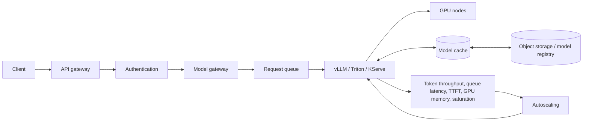

# AI Inference Platform

## Design Goal

This view names the real handoffs, state boundaries, and failure domains used by ai inference platform; each arrow represents a concrete API call, watch, dataplane hop, or operator decision.

## Architecture Diagram

## Request or Control Flow

The API gateway terminates the public protocol and authentication; a model gateway applies tenant quotas, model/version routing, and admission. A bounded queue absorbs small bursts but rejects before deadlines become impossible. KServe can own the serving resource while vLLM handles LLM batching or Triton serves optimized model ensembles on GPU nodes.

## Production Mechanics

Model weights are verified in object storage or a registry, staged into a node/local cache, then loaded before readiness. Scale on queue latency, requests or tokens in flight, and GPU saturation—not CPU. Track token throughput, queue latency, time-to-first-token, GPU memory, saturation, error rate, and end-to-end latency by model revision.

## Failure Modes and Operations

* **Boundary:** Cold model loads violate latency objectives during scale-out.
* **Boundary:** Unbounded queues convert overload into timeouts and wasted GPU work.
* **Boundary:** GPU memory fragmentation or incompatible drivers leaves apparent capacity unusable.

For AI Inference Platform, instrument every named handoff, preserve its native revision or resource identifiers, and give the pager to a team able to mitigate that component. Capacity and recovery tests must exercise the specific boundaries shown above rather than only process liveness.

## Security and Trade-offs

The AI Inference Platform trust model authenticates boundary crossings, authorizes its narrowest mutation, encrypts transport and state, and retains the initiating principal. Stronger isolation and validation reduce blast radius but add latency and operational cost; bypasses trade short-term speed for untraceable production state. Prefer a degraded mode that preserves an already healthy serving path when its control plane is unavailable.

## Interview Walkthrough

Trace the AI Inference Platform diagram from its initiating actor to the user-visible result, name its durable-state change, then walk one failure backward from its symptom. Explain the rollback unit, the owner, and the metric that proves recovery.
