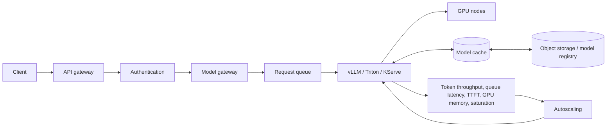

# AI Inference Platform

## Design Goal

Serve tenant-isolated model revisions within latency and GPU budgets while degrading predictably during scarcity.

## Architecture Diagram

## Request or Control Flow

API gateway authenticates; model gateway applies tenant quota and admission before a bounded queue. vLLM, Triton or KServe batches on GPU nodes. A registry and object store supply revisions; node cache reduces cold starts; GitOps/controller rolls revisions.

## Component Responsibilities

API gateway authenticates; model gateway applies tenant quota and admission before a bounded queue. vLLM, Triton or KServe batches on GPU nodes. A registry and object store supply revisions; node cache reduces cold starts; GitOps/controller rolls revisions.

## State and Ownership Boundaries

Registry owns model metadata, object storage owns weights, gateway owns admission, serving runtime owns batches, scheduler owns placement. Data governance defines prompt/response retention and residency.

## Security Boundaries

Use workload identity, encryption and per-tenant authorization. Classify prompts/outputs, redact telemetry, verify model provenance and prevent untrusted model code execution.

## Scaling Behaviour

Autoscale on queue/latency plus GPU metrics, not CPU alone. Bin-pack memory-compatible models but preserve headroom; GPU fragmentation and cloud quota limit useful capacity.

## Failure Modes

Queue saturation rejects requests; cold load violates latency; OOM kills server; fragmented memory strands GPU; bad revision corrupts quality; quota prevents node launch.

## Recovery and Rollback

Reject early with retry guidance, route to a smaller/fallback model where approved, or shed low-priority tenants. Abort revision rollout and pin prior model digest; warm caches before traffic.

## Operational Metrics

Measure time to first token; token throughput; queue latency and rejection rate; batch size; GPU utilization/memory; model load time; p95/p99 latency; quality and safety indicators. Correlate every signal with the relevant revision and failure domain.

## Trade-offs

The design deliberately exchanges simplicity for control at the boundaries described above. Adopt only the mechanisms whose failure modes the team can test and operate; preserve an already healthy data plane when a control plane is unavailable.

## Interview Walkthrough

Start with **Serve tenant-isolated model revisions within latency and GPU budgets while degrading predictably during scarcity.** Follow one real state change in the diagram, distinguish desired state from observed health, then explain the most dangerous failure, a reversible mitigation, and the evidence that proves recovery.

## Further Reading

* [Kubernetes documentation](https://kubernetes.io/docs/)
* [AWS documentation](https://docs.aws.amazon.com/)
* [CNCF projects](https://www.cncf.io/projects/)
