# Code to Production

## Design Goal

This view names the real handoffs, state boundaries, and failure domains used by code to production; each arrow represents a concrete API call, watch, dataplane hop, or operator decision.

## Architecture Diagram

```mermaid
flowchart LR
  Dev[Developer] --> PR[Git pull request] --> Tests[CI tests] --> Scan[Security scanning]
  Scan --> Build[Container build] --> Sign[SBOM and signing] --> ECR[(Amazon ECR)]
  ECR --> Update[GitOps repository update] --> Argo[Argo CD] --> Rollout[Kubernetes rollout]
  Rollout --> Ready[Readiness] --> Traffic[Progressive traffic] --> Telemetry[Telemetry]
```

## Request or Control Flow

A developer proposes a pull request. CI tests source, scans dependencies and the resulting container, emits an SBOM, signs the digest, and pushes that exact digest to ECR. CI then proposes a GitOps change; Argo CD, not the build runner, reconciles it into Kubernetes. Readiness gates precede canary traffic, and telemetry decides whether exposure advances.

## Production Mechanics

Promotion changes environment references to the same content digest; it never rebuilds source for production. This preserves provenance and makes the tested bytes equal the deployed bytes. CI must not directly mutate production: a short-lived build job should not hold production credentials, bypass review, or create state that Git cannot explain. Argo provides continuous drift correction and an auditable rollback by reverting Git.

## Failure Modes and Operations

* **Boundary:** A failed signature or policy check prevents registry promotion.
* **Boundary:** A false-positive readiness probe sends traffic to an unusable revision.
* **Boundary:** A mutable tag makes rollback non-deterministic.

For Code to Production, instrument every named handoff, preserve its native revision or resource identifiers, and give the pager to a team able to mitigate that component. Capacity and recovery tests must exercise the specific boundaries shown above rather than only process liveness.

## Security and Trade-offs

The Code to Production trust model authenticates boundary crossings, authorizes its narrowest mutation, encrypts transport and state, and retains the initiating principal. Stronger isolation and validation reduce blast radius but add latency and operational cost; bypasses trade short-term speed for untraceable production state. Prefer a degraded mode that preserves an already healthy serving path when its control plane is unavailable.

## Interview Walkthrough

Trace the Code to Production diagram from its initiating actor to the user-visible result, name its durable-state change, then walk one failure backward from its symptom. Explain the rollback unit, the owner, and the metric that proves recovery.
