# Code to Production

## Design Goal

Deliver one verified byte sequence from review to production without giving CI production access.

## Architecture Diagram

```mermaid
flowchart LR
  Dev[Developer] --> PR[Git pull request] --> Tests[CI tests] --> Scan[Security scanning]
  Scan --> Build[Container build] --> Sign[SBOM and signing] --> ECR[(Amazon ECR)]
  ECR --> Update[GitOps repository update] --> Argo[Argo CD] --> Rollout[Kubernetes rollout]
  Rollout --> Ready[Readiness] --> Traffic[Progressive traffic] --> Telemetry[Telemetry]
```

## Request or Control Flow

PR checks test code and contracts; dependency and container scanners gate the build. The builder creates one OCI digest, SBOM and provenance, signs it, and pushes to immutable ECR. Promotion changes the GitOps digest; Argo CD reconciles it and Argo Rollouts can progressively expose it.

## Component Responsibilities

PR checks test code and contracts; dependency and container scanners gate the build. The builder creates one OCI digest, SBOM and provenance, signs it, and pushes to immutable ECR. Promotion changes the GitOps digest; Argo CD reconciles it and Argo Rollouts can progressively expose it.

## State and Ownership Boundaries

Source and GitOps repositories hold intent; ECR holds immutable artifacts; Kubernetes holds live state. Application teams own code and rollout policy, the platform team owns CI, registry and Argo.

## Security Boundaries

Use OIDC short-lived CI credentials scoped to ECR and GitOps PRs. Production credentials belong only to Argo. Verify signatures at admission and restrict ECR tag mutation.

## Scaling Behaviour

Parallelize tests and cache dependencies without weakening verification. Scale runners separately from Argo controllers; rollout capacity is bounded by surge, quota and cluster headroom.

## Failure Modes

Scanner outage blocks release; a mutable tag destroys provenance; unhealthy canary or bad readiness leaks failure; Git/live drift blocks convergence.

## Recovery and Rollback

Revert the GitOps commit to a previously healthy digest. Pause/abort progressive delivery first. Never rebuild a rollback artifact; investigate CI and registry evidence after service recovery.

## Operational Metrics

Measure pipeline duration and failure rate; deployment lead time; rollout health; change failure rate; rollback time; signature-policy rejection. Correlate every signal with the relevant revision and failure domain.

## Trade-offs

The design deliberately exchanges simplicity for control at the boundaries described above. Adopt only the mechanisms whose failure modes the team can test and operate; preserve an already healthy data plane when a control plane is unavailable.

## Interview Walkthrough

Start with **Deliver one verified byte sequence from review to production without giving CI production access.** Follow one real state change in the diagram, distinguish desired state from observed health, then explain the most dangerous failure, a reversible mitigation, and the evidence that proves recovery.

## Further Reading

* [Kubernetes documentation](https://kubernetes.io/docs/)
* [AWS documentation](https://docs.aws.amazon.com/)
* [CNCF projects](https://www.cncf.io/projects/)
