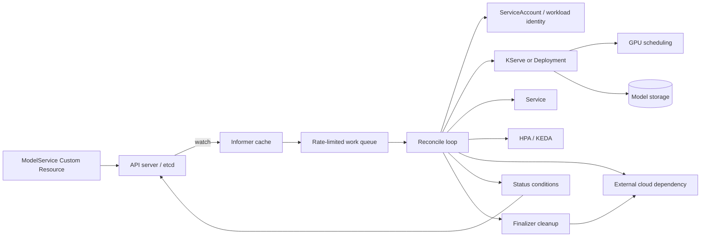

# Custom Controller

## Design Goal

Reconcile a ModelService API into safe serving resources while making progress and cleanup observable.

## Architecture Diagram

## Request or Control Flow

The CRD schema validates spec. An informer lists/watches into a cache; handlers enqueue namespace/name keys. Rate-limited workers run idempotent reconcile, using optimistic concurrency. The controller creates KServe or Deployment, Service and HPA/KEDA with owner references, and manages external model storage with a finalizer.

## Component Responsibilities

The CRD schema validates spec. An informer lists/watches into a cache; handlers enqueue namespace/name keys. Rate-limited workers run idempotent reconcile, using optimistic concurrency. The controller creates KServe or Deployment, Service and HPA/KEDA with owner references, and manages external model storage with a finalizer.

## State and Ownership Boundaries

The API server stores spec/status. Controller owns derived resources and conditions; external object storage remains outside garbage collection. observedGeneration tells whether status describes current spec.

## Security Boundaries

Leader election avoids duplicate active workers; workload identity scopes model-store access. Admission validates tenant/GPU policy; controller RBAC is limited to watched/owned resources.

## Scaling Behaviour

Increase worker concurrency only within API/provider quotas. GPU scheduling and model downloads dominate convergence; cache models and use bounded retries.

## Failure Modes

Poisoned key retries forever; status conflict loses update; finalizer blocks deletion when storage cleanup fails; missing GPU leaves Pending; owner-reference error leaks resources.

## Recovery and Rollback

Make reconcile safe to repeat, surface terminal conditions, and use a documented force-finalizer procedure only after external cleanup/accounting. Roll back controller and CRD changes with conversion compatibility.

## Operational Metrics

Measure workqueue depth/age/retries; reconcile latency/errors; observedGeneration lag; condition reasons; finalizer age; model load time; ready replicas and GPU pending. Correlate every signal with the relevant revision and failure domain.

## Trade-offs

The design deliberately exchanges simplicity for control at the boundaries described above. Adopt only the mechanisms whose failure modes the team can test and operate; preserve an already healthy data plane when a control plane is unavailable.

## Interview Walkthrough

Start with **Reconcile a ModelService API into safe serving resources while making progress and cleanup observable.** Follow one real state change in the diagram, distinguish desired state from observed health, then explain the most dangerous failure, a reversible mitigation, and the evidence that proves recovery.

## Further Reading

* [Kubernetes documentation](https://kubernetes.io/docs/)
* [AWS documentation](https://docs.aws.amazon.com/)
* [CNCF projects](https://www.cncf.io/projects/)
