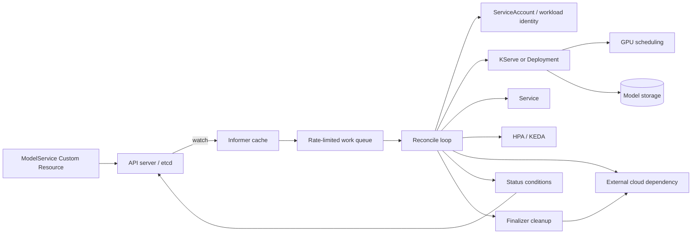

# Custom Controller

## Design Goal

This view names the real handoffs, state boundaries, and failure domains used by custom controller; each arrow represents a concrete API call, watch, dataplane hop, or operator decision.

## Architecture Diagram

## Request or Control Flow

A `ModelService` spec names a model URI, serving runtime, resources, scaling policy, and identity. Its informer watch updates a local cache and enqueues a key. The reconcile loop reads current state, creates or patches a ServiceAccount, KServe resource or Deployment, Service, GPU scheduling constraints, and HPA/KEDA, then records observedGeneration and status conditions.

## Production Mechanics

Reconciliation must be level-based and idempotent: recompute the desired children rather than relying on event order. Model storage access uses workload identity, never embedded cloud keys. A finalizer blocks deletion only while external cloud resources are being removed; cleanup is retried and must expose a terminal condition and operator escape procedure.

## Failure Modes and Operations

* **Boundary:** A hot key repeatedly fails and starves the queue without rate limiting.
* **Boundary:** Stale informer reads cause conflict; optimistic concurrency and requeue converge.
* **Boundary:** A broken finalizer leaves deletion stuck and cloud assets orphaned.

For Custom Controller, instrument every named handoff, preserve its native revision or resource identifiers, and give the pager to a team able to mitigate that component. Capacity and recovery tests must exercise the specific boundaries shown above rather than only process liveness.

## Security and Trade-offs

The Custom Controller trust model authenticates boundary crossings, authorizes its narrowest mutation, encrypts transport and state, and retains the initiating principal. Stronger isolation and validation reduce blast radius but add latency and operational cost; bypasses trade short-term speed for untraceable production state. Prefer a degraded mode that preserves an already healthy serving path when its control plane is unavailable.

## Interview Walkthrough

Trace the Custom Controller diagram from its initiating actor to the user-visible result, name its durable-state change, then walk one failure backward from its symptom. Explain the rollback unit, the owner, and the metric that proves recovery.
