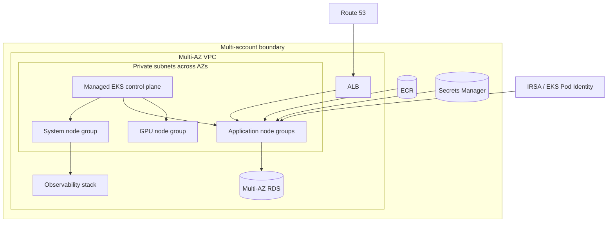

# EKS Production Platform

## Design Goal

Provide isolated, upgradeable Kubernetes capacity across availability zones with AWS identities and dependencies designed as explicit failure domains.

## Architecture Diagram

## Request or Control Flow

Route 53 reaches ALB/NLB in public subnets; nodes and RDS/Redis remain private across AZs. Separate system, application and GPU groups; Karpenter or Cluster Autoscaler adds nodes. ECR, Secrets Manager, Pod Identity/IRSA and telemetry integrate through scoped roles.

## Component Responsibilities

Route 53 reaches ALB/NLB in public subnets; nodes and RDS/Redis remain private across AZs. Separate system, application and GPU groups; Karpenter or Cluster Autoscaler adds nodes. ECR, Secrets Manager, Pod Identity/IRSA and telemetry integrate through scoped roles.

## State and Ownership Boundaries

AWS accounts isolate environments; AWS owns managed control plane while the platform team owns VPC, add-ons, nodes, access and upgrades. Workload teams own requests, PDBs and application SLOs.

## Security Boundaries

Prefer private API access with controlled operator path, scoped public CIDRs if needed, Pod Identity/IRSA instead of node roles, encrypted secrets and restricted security groups.

## Scaling Behaviour

Autoscalers need subnet IPs, EC2/GPU quota and schedulable instance types. Reserve system headroom; use Spot only with disruption-tolerant workloads; enforce ResourceQuota.

## Failure Modes

Subnet IP exhaustion blocks Pods/nodes; PDB prevents drain; incompatible add-on breaks networking; quota stops scale-out; cross-AZ database traffic adds latency/cost.

## Recovery and Rollback

Canary new node groups, upgrade control plane/add-ons in supported order, drain respecting PDBs, and retain old group until validation. Restore dependencies independently; EKS control-plane downgrade is not available.

## Operational Metrics

Measure node launch and pending Pods; free subnet IPs; control-plane/API errors; PDB-blocked evictions; add-on health; ALB targets; cost by node pool, NAT and transfer. Correlate every signal with the relevant revision and failure domain.

## Trade-offs

The design deliberately exchanges simplicity for control at the boundaries described above. Adopt only the mechanisms whose failure modes the team can test and operate; preserve an already healthy data plane when a control plane is unavailable.

## Interview Walkthrough

Start with **Provide isolated, upgradeable Kubernetes capacity across availability zones with AWS identities and dependencies designed as explicit failure domains.** Follow one real state change in the diagram, distinguish desired state from observed health, then explain the most dangerous failure, a reversible mitigation, and the evidence that proves recovery.

## Further Reading

* [Kubernetes documentation](https://kubernetes.io/docs/)
* [AWS documentation](https://docs.aws.amazon.com/)
* [CNCF projects](https://www.cncf.io/projects/)
