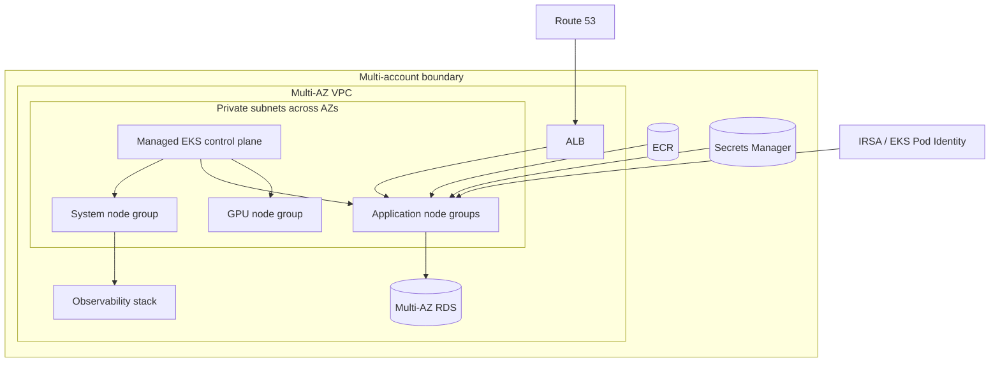

# EKS Production Platform

## Design Goal

This view names the real handoffs, state boundaries, and failure domains used by eks production platform; each arrow represents a concrete API call, watch, dataplane hop, or operator decision.

## Architecture Diagram

## Request or Control Flow

Route 53 directs traffic to an ALB whose controller targets ready workloads in private subnets. AWS operates the regional EKS control plane; separate system, general application, and tainted GPU node groups isolate capacity. Pods pull digest-pinned images from ECR and use IRSA or EKS Pod Identity for narrowly scoped access to Secrets Manager and RDS.

## Production Mechanics

Use multiple accounts for production, security, and shared services and spread subnets and node groups across AZs. Keep system add-ons schedulable during application saturation, reserve GPU nodes with taints, centralize metrics/logs/traces without making telemetry a serving dependency, and test upgrades one node group at a time.

## Failure Modes and Operations

* **Boundary:** Subnet IP exhaustion blocks nodes or Pods despite available CPU.
* **Boundary:** Mis-scoped workload identity exposes secrets cross-namespace.
* **Boundary:** A zonal dependency defeats otherwise multi-AZ worker placement.

For EKS Production Platform, instrument every named handoff, preserve its native revision or resource identifiers, and give the pager to a team able to mitigate that component. Capacity and recovery tests must exercise the specific boundaries shown above rather than only process liveness.

## Security and Trade-offs

The EKS Production Platform trust model authenticates boundary crossings, authorizes its narrowest mutation, encrypts transport and state, and retains the initiating principal. Stronger isolation and validation reduce blast radius but add latency and operational cost; bypasses trade short-term speed for untraceable production state. Prefer a degraded mode that preserves an already healthy serving path when its control plane is unavailable.

## Interview Walkthrough

Trace the EKS Production Platform diagram from its initiating actor to the user-visible result, name its durable-state change, then walk one failure backward from its symptom. Explain the rollback unit, the owner, and the metric that proves recovery.
