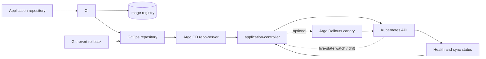

# GitOps with Argo CD

## Design Goal

This view names the real handoffs, state boundaries, and failure domains used by gitops with argo cd; each arrow represents a concrete API call, watch, dataplane hop, or operator decision.

## Architecture Diagram

## Request or Control Flow

CI produces an immutable image and updates the desired digest in a separate environment repository. Repo-server renders Helm, Kustomize, or plain YAML; application-controller compares rendered desired state with watched live state and applies the difference through the Kubernetes API. Resource health and sync status return to Argo CD.

## Production Mechanics

Drift detection is continuous, not a one-time deploy. With auto-sync, Argo reverses unauthorized live edits; with manual sync it reports them. Rollback is a Git revert to a known digest, retaining review history. Argo Rollouts can optionally manage analysis and progressive traffic while Argo CD remains owner of declarative resources.

## Failure Modes and Operations

* **Boundary:** Invalid rendering prevents comparison or sync.
* **Boundary:** A broad Application scope amplifies a bad commit.
* **Boundary:** Prune or sync-wave mistakes delete dependencies in the wrong order.

For GitOps with Argo CD, instrument every named handoff, preserve its native revision or resource identifiers, and give the pager to a team able to mitigate that component. Capacity and recovery tests must exercise the specific boundaries shown above rather than only process liveness.

## Security and Trade-offs

The GitOps with Argo CD trust model authenticates boundary crossings, authorizes its narrowest mutation, encrypts transport and state, and retains the initiating principal. Stronger isolation and validation reduce blast radius but add latency and operational cost; bypasses trade short-term speed for untraceable production state. Prefer a degraded mode that preserves an already healthy serving path when its control plane is unavailable.

## Interview Walkthrough

Trace the GitOps with Argo CD diagram from its initiating actor to the user-visible result, name its durable-state change, then walk one failure backward from its symptom. Explain the rollback unit, the owner, and the metric that proves recovery.
