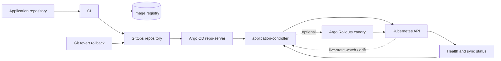

# GitOps with Argo CD

## Design Goal

Turn reviewed Git intent into continuously reconciled Kubernetes state while keeping artifacts and configuration separate.

## Architecture Diagram

## Request or Control Flow

CI publishes an artifact, then updates the GitOps repository. repo-server clones and renders Helm/Kustomize; application-controller compares desired and live objects and reports sync separately from health. Automated sync may prune; waves and hooks order dependencies.

## Component Responsibilities

CI publishes an artifact, then updates the GitOps repository. repo-server clones and renders Helm/Kustomize; application-controller compares desired and live objects and reports sync separately from health. Automated sync may prune; waves and hooks order dependencies.

## State and Ownership Boundaries

Source Git owns code, registry owns digest, GitOps Git owns desired deployment, Kubernetes owns live state. ApplicationSet generates Applications; projects and destination rules partition tenants.

## Security Boundaries

Repo and cluster credentials are separate and least privilege. Protect branches, verify artifacts, isolate AppProjects, audit break-glass kubectl and suspend auto-sync before emergency mutation.

## Scaling Behaviour

Shard controllers/repo-server for applications and render cost; avoid huge monorepo invalidations. Reconciliation frequency trades detection latency for API/Git load.

## Failure Modes

Bad render prevents diff; invalid manifest fails sync; prune deletes unintended resource; health remains degraded after sync; HPA/manual ownership creates perpetual diff.

## Recovery and Rollback

Pause progression, revert Git to a known digest, and sync. Argo CD does not infer application rollback. Argo Rollouts may abort traffic by analysis. Record and reconcile break-glass changes afterward.

## Operational Metrics

Measure reconciliation and render duration; OutOfSync count; degraded health; sync failures; Git/cluster API errors; queue depth; rollout analysis success. Correlate every signal with the relevant revision and failure domain.

## Trade-offs

The design deliberately exchanges simplicity for control at the boundaries described above. Adopt only the mechanisms whose failure modes the team can test and operate; preserve an already healthy data plane when a control plane is unavailable.

## Interview Walkthrough

Start with **Turn reviewed Git intent into continuously reconciled Kubernetes state while keeping artifacts and configuration separate.** Follow one real state change in the diagram, distinguish desired state from observed health, then explain the most dangerous failure, a reversible mitigation, and the evidence that proves recovery.

## Further Reading

* [Kubernetes documentation](https://kubernetes.io/docs/)
* [AWS documentation](https://docs.aws.amazon.com/)
* [CNCF projects](https://www.cncf.io/projects/)
