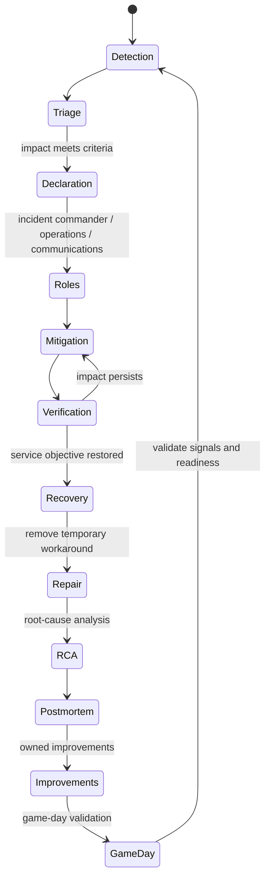

# Incident Response Loop

## Design Goal

This view names the real handoffs, state boundaries, and failure domains used by incident response loop; each arrow represents a concrete API call, watch, dataplane hop, or operator decision.

## Architecture Diagram

## Request or Control Flow

Detection identifies an SLO or customer symptom; triage bounds scope and severity. Declaration creates a shared incident record and explicit commander, operations, and communications roles. The team applies the smallest safe mitigation, verifies user impact, restores normal service, and only then performs deeper root-cause analysis.

## Production Mechanics

Mitigation stops or reduces current harm, such as shifting traffic. Repair removes the defect and temporary workaround, such as deploying corrected code. Prevention changes the system so recurrence is less likely or less damaging, such as a tested policy guardrail. A blameless postmortem assigns each improvement an owner and due date; a game day validates the control rather than merely closing a ticket.

## Failure Modes and Operations

* **Boundary:** Late declaration causes parallel, conflicting actions.
* **Boundary:** Changing many variables destroys evidence and increases impact.
* **Boundary:** Unowned postmortem actions allow the same failure mode to return.

For Incident Response Loop, instrument every named handoff, preserve its native revision or resource identifiers, and give the pager to a team able to mitigate that component. Capacity and recovery tests must exercise the specific boundaries shown above rather than only process liveness.

## Security and Trade-offs

The Incident Response Loop trust model authenticates boundary crossings, authorizes its narrowest mutation, encrypts transport and state, and retains the initiating principal. Stronger isolation and validation reduce blast radius but add latency and operational cost; bypasses trade short-term speed for untraceable production state. Prefer a degraded mode that preserves an already healthy serving path when its control plane is unavailable.

## Interview Walkthrough

Trace the Incident Response Loop diagram from its initiating actor to the user-visible result, name its durable-state change, then walk one failure backward from its symptom. Explain the rollback unit, the owner, and the metric that proves recovery.
