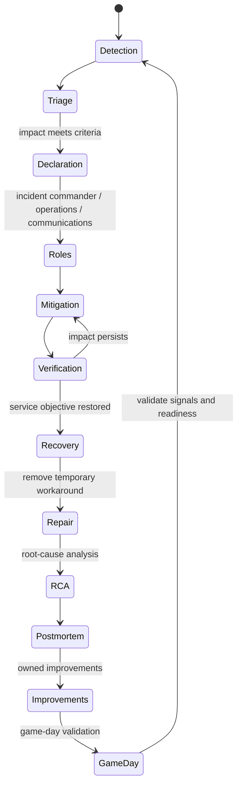

# Incident Response Loop

## Design Goal

Restore service quickly under clear command while separating mitigation, durable repair and prevention.

## Architecture Diagram

## Request or Control Flow

Detection triggers triage; impact criteria trigger declaration. An incident commander coordinates operations, communications and decisions. Mitigation reduces impact, service recovery verifies SLOs, and later analysis identifies root cause and contributing factors. Remediation repairs defects; prevention reduces recurrence.

## Component Responsibilities

Detection triggers triage; impact criteria trigger declaration. An incident commander coordinates operations, communications and decisions. Mitigation reduces impact, service recovery verifies SLOs, and later analysis identifies root cause and contributing factors. Remediation repairs defects; prevention reduces recurrence.

## State and Ownership Boundaries

IC owns coordination, operations lead owns changes, communications lead owns updates; service owner accepts recovery. Follow-up actions have named owners and due dates.

## Security Boundaries

Restrict emergency access, time-bound elevation, record commands and preserve evidence. Communications must avoid exposing customer data while meeting notification duties.

## Scaling Behaviour

Add responders by role, not an unstructured crowd. Automate evidence capture and status updates; incident command must remain a human accountability boundary.

## Failure Modes

No declaration delays coordination; simultaneous changes obscure causality; stale status erodes trust; mitigation is mistaken for repair; action items lack ownership.

## Recovery and Rollback

Prefer reversible mitigation, confirm user recovery, then repair under normal review. Roll back harmful emergency changes. Validate prevention through game days, not closure labels.

## Operational Metrics

Measure detection and declaration time; time to mitigate and recover; update cadence; SLO burn; recurrence; remediation age; game-day validation rate. Correlate every signal with the relevant revision and failure domain.

## Trade-offs

The design deliberately exchanges simplicity for control at the boundaries described above. Adopt only the mechanisms whose failure modes the team can test and operate; preserve an already healthy data plane when a control plane is unavailable.

## Interview Walkthrough

Start with **Restore service quickly under clear command while separating mitigation, durable repair and prevention.** Follow one real state change in the diagram, distinguish desired state from observed health, then explain the most dangerous failure, a reversible mitigation, and the evidence that proves recovery.

## Further Reading

* [Kubernetes documentation](https://kubernetes.io/docs/)
* [AWS documentation](https://docs.aws.amazon.com/)
* [CNCF projects](https://www.cncf.io/projects/)
