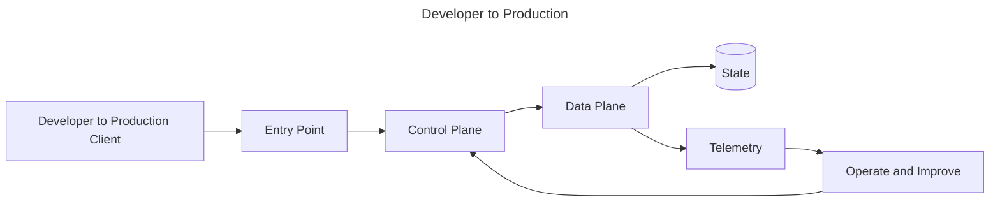
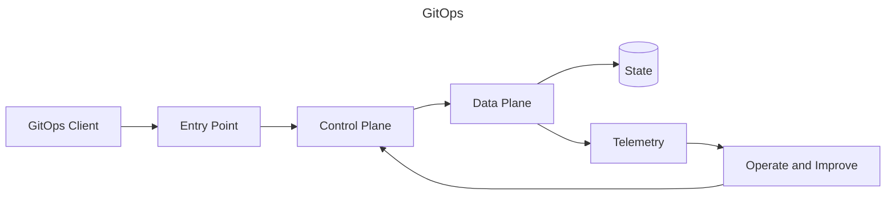
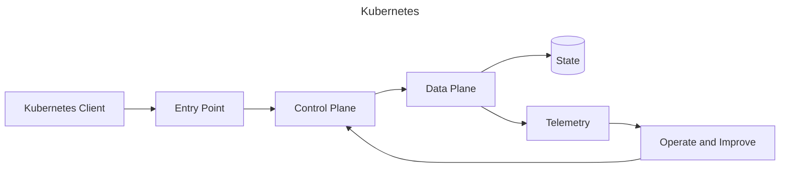
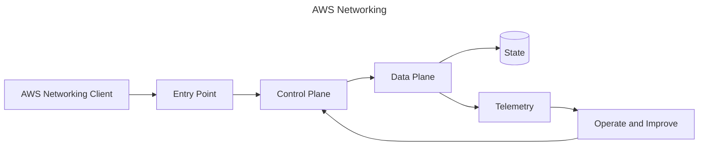
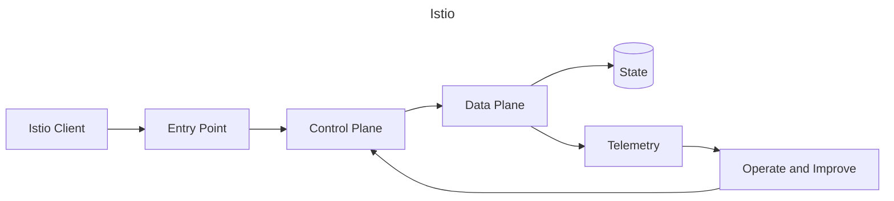
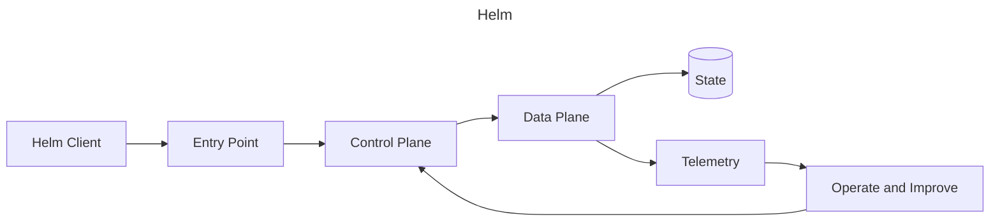
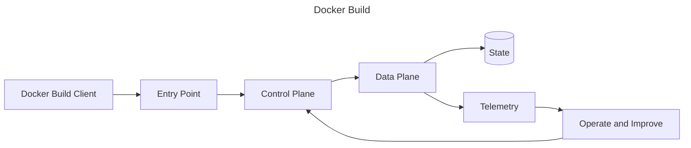
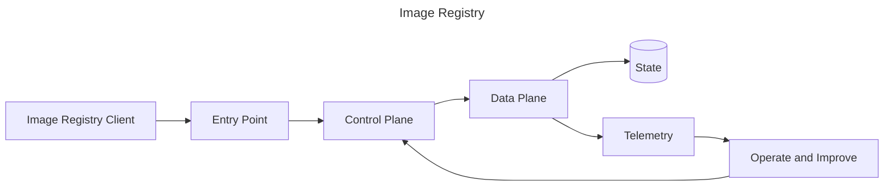
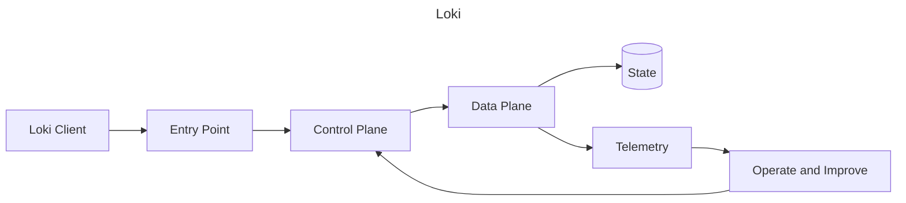

# Architecture Library

Reusable Mermaid-first references for common platform designs.

## Developer to Production

### Problem
Provide a repeatable design for developer to production that engineers can reason about under normal and failure conditions.



### Component Explanation

| Component | Responsibility | Ownership |
|---|---|---|
| Entry Point | Receives requests or desired state | Platform |
| Control Plane | Validates and coordinates | Platform |
| Data Plane | Executes workload | Service team |
| Telemetry | Shows health and behavior | Shared |

### Failure Points
Control-plane outage, bad configuration, data-plane saturation, identity failure, and unbounded retries.

### Scaling
Scale independent planes, shard state, add backpressure, and test quota behavior.

### Security
Use least privilege, signed artifacts, encrypted transport, auditable changes, and policy gates.

### Production Example
A regulated SaaS team deploys through this pattern with change review, automated rollback, and ownership metadata.

### Tradeoffs
| Choice | Benefit | Cost |
|---|---|---|
| Centralize | Consistency | Bottleneck risk |
| Delegate | Team speed | Governance burden |

### Interview Notes
Explain failure domains, ownership, observability, and rollback before naming tools.

## CI Pipeline

### Problem
Provide a repeatable design for ci pipeline that engineers can reason about under normal and failure conditions.


### Component Explanation

| Component | Responsibility | Ownership |
|---|---|---|
| Entry Point | Receives requests or desired state | Platform |
| Control Plane | Validates and coordinates | Platform |
| Data Plane | Executes workload | Service team |
| Telemetry | Shows health and behavior | Shared |

### Failure Points
Control-plane outage, bad configuration, data-plane saturation, identity failure, and unbounded retries.

### Scaling
Scale independent planes, shard state, add backpressure, and test quota behavior.

### Security
Use least privilege, signed artifacts, encrypted transport, auditable changes, and policy gates.

### Production Example
A regulated SaaS team deploys through this pattern with change review, automated rollback, and ownership metadata.

### Tradeoffs
| Choice | Benefit | Cost |
|---|---|---|
| Centralize | Consistency | Bottleneck risk |
| Delegate | Team speed | Governance burden |

### Interview Notes
Explain failure domains, ownership, observability, and rollback before naming tools.

## CD Pipeline

### Problem
Provide a repeatable design for cd pipeline that engineers can reason about under normal and failure conditions.


### Component Explanation

| Component | Responsibility | Ownership |
|---|---|---|
| Entry Point | Receives requests or desired state | Platform |
| Control Plane | Validates and coordinates | Platform |
| Data Plane | Executes workload | Service team |
| Telemetry | Shows health and behavior | Shared |

### Failure Points
Control-plane outage, bad configuration, data-plane saturation, identity failure, and unbounded retries.

### Scaling
Scale independent planes, shard state, add backpressure, and test quota behavior.

### Security
Use least privilege, signed artifacts, encrypted transport, auditable changes, and policy gates.

### Production Example
A regulated SaaS team deploys through this pattern with change review, automated rollback, and ownership metadata.

### Tradeoffs
| Choice | Benefit | Cost |
|---|---|---|
| Centralize | Consistency | Bottleneck risk |
| Delegate | Team speed | Governance burden |

### Interview Notes
Explain failure domains, ownership, observability, and rollback before naming tools.

## GitOps

### Problem
Provide a repeatable design for gitops that engineers can reason about under normal and failure conditions.



### Component Explanation

| Component | Responsibility | Ownership |
|---|---|---|
| Entry Point | Receives requests or desired state | Platform |
| Control Plane | Validates and coordinates | Platform |
| Data Plane | Executes workload | Service team |
| Telemetry | Shows health and behavior | Shared |

### Failure Points
Control-plane outage, bad configuration, data-plane saturation, identity failure, and unbounded retries.

### Scaling
Scale independent planes, shard state, add backpressure, and test quota behavior.

### Security
Use least privilege, signed artifacts, encrypted transport, auditable changes, and policy gates.

### Production Example
A regulated SaaS team deploys through this pattern with change review, automated rollback, and ownership metadata.

### Tradeoffs
| Choice | Benefit | Cost |
|---|---|---|
| Centralize | Consistency | Bottleneck risk |
| Delegate | Team speed | Governance burden |

### Interview Notes
Explain failure domains, ownership, observability, and rollback before naming tools.

## Kubernetes

### Problem
Provide a repeatable design for kubernetes that engineers can reason about under normal and failure conditions.



### Component Explanation

| Component | Responsibility | Ownership |
|---|---|---|
| Entry Point | Receives requests or desired state | Platform |
| Control Plane | Validates and coordinates | Platform |
| Data Plane | Executes workload | Service team |
| Telemetry | Shows health and behavior | Shared |

### Failure Points
Control-plane outage, bad configuration, data-plane saturation, identity failure, and unbounded retries.

### Scaling
Scale independent planes, shard state, add backpressure, and test quota behavior.

### Security
Use least privilege, signed artifacts, encrypted transport, auditable changes, and policy gates.

### Production Example
A regulated SaaS team deploys through this pattern with change review, automated rollback, and ownership metadata.

### Tradeoffs
| Choice | Benefit | Cost |
|---|---|---|
| Centralize | Consistency | Bottleneck risk |
| Delegate | Team speed | Governance burden |

### Interview Notes
Explain failure domains, ownership, observability, and rollback before naming tools.

## AWS Networking

### Problem
Provide a repeatable design for aws networking that engineers can reason about under normal and failure conditions.



### Component Explanation

| Component | Responsibility | Ownership |
|---|---|---|
| Entry Point | Receives requests or desired state | Platform |
| Control Plane | Validates and coordinates | Platform |
| Data Plane | Executes workload | Service team |
| Telemetry | Shows health and behavior | Shared |

### Failure Points
Control-plane outage, bad configuration, data-plane saturation, identity failure, and unbounded retries.

### Scaling
Scale independent planes, shard state, add backpressure, and test quota behavior.

### Security
Use least privilege, signed artifacts, encrypted transport, auditable changes, and policy gates.

### Production Example
A regulated SaaS team deploys through this pattern with change review, automated rollback, and ownership metadata.

### Tradeoffs
| Choice | Benefit | Cost |
|---|---|---|
| Centralize | Consistency | Bottleneck risk |
| Delegate | Team speed | Governance burden |

### Interview Notes
Explain failure domains, ownership, observability, and rollback before naming tools.

## EKS

### Problem
Provide a repeatable design for eks that engineers can reason about under normal and failure conditions.


### Component Explanation

| Component | Responsibility | Ownership |
|---|---|---|
| Entry Point | Receives requests or desired state | Platform |
| Control Plane | Validates and coordinates | Platform |
| Data Plane | Executes workload | Service team |
| Telemetry | Shows health and behavior | Shared |

### Failure Points
Control-plane outage, bad configuration, data-plane saturation, identity failure, and unbounded retries.

### Scaling
Scale independent planes, shard state, add backpressure, and test quota behavior.

### Security
Use least privilege, signed artifacts, encrypted transport, auditable changes, and policy gates.

### Production Example
A regulated SaaS team deploys through this pattern with change review, automated rollback, and ownership metadata.

### Tradeoffs
| Choice | Benefit | Cost |
|---|---|---|
| Centralize | Consistency | Bottleneck risk |
| Delegate | Team speed | Governance burden |

### Interview Notes
Explain failure domains, ownership, observability, and rollback before naming tools.

## Ingress

### Problem
Provide a repeatable design for ingress that engineers can reason about under normal and failure conditions.


### Component Explanation

| Component | Responsibility | Ownership |
|---|---|---|
| Entry Point | Receives requests or desired state | Platform |
| Control Plane | Validates and coordinates | Platform |
| Data Plane | Executes workload | Service team |
| Telemetry | Shows health and behavior | Shared |

### Failure Points
Control-plane outage, bad configuration, data-plane saturation, identity failure, and unbounded retries.

### Scaling
Scale independent planes, shard state, add backpressure, and test quota behavior.

### Security
Use least privilege, signed artifacts, encrypted transport, auditable changes, and policy gates.

### Production Example
A regulated SaaS team deploys through this pattern with change review, automated rollback, and ownership metadata.

### Tradeoffs
| Choice | Benefit | Cost |
|---|---|---|
| Centralize | Consistency | Bottleneck risk |
| Delegate | Team speed | Governance burden |

### Interview Notes
Explain failure domains, ownership, observability, and rollback before naming tools.

## Service Mesh

### Problem
Provide a repeatable design for service mesh that engineers can reason about under normal and failure conditions.


### Component Explanation

| Component | Responsibility | Ownership |
|---|---|---|
| Entry Point | Receives requests or desired state | Platform |
| Control Plane | Validates and coordinates | Platform |
| Data Plane | Executes workload | Service team |
| Telemetry | Shows health and behavior | Shared |

### Failure Points
Control-plane outage, bad configuration, data-plane saturation, identity failure, and unbounded retries.

### Scaling
Scale independent planes, shard state, add backpressure, and test quota behavior.

### Security
Use least privilege, signed artifacts, encrypted transport, auditable changes, and policy gates.

### Production Example
A regulated SaaS team deploys through this pattern with change review, automated rollback, and ownership metadata.

### Tradeoffs
| Choice | Benefit | Cost |
|---|---|---|
| Centralize | Consistency | Bottleneck risk |
| Delegate | Team speed | Governance burden |

### Interview Notes
Explain failure domains, ownership, observability, and rollback before naming tools.

## Istio

### Problem
Provide a repeatable design for istio that engineers can reason about under normal and failure conditions.



### Component Explanation

| Component | Responsibility | Ownership |
|---|---|---|
| Entry Point | Receives requests or desired state | Platform |
| Control Plane | Validates and coordinates | Platform |
| Data Plane | Executes workload | Service team |
| Telemetry | Shows health and behavior | Shared |

### Failure Points
Control-plane outage, bad configuration, data-plane saturation, identity failure, and unbounded retries.

### Scaling
Scale independent planes, shard state, add backpressure, and test quota behavior.

### Security
Use least privilege, signed artifacts, encrypted transport, auditable changes, and policy gates.

### Production Example
A regulated SaaS team deploys through this pattern with change review, automated rollback, and ownership metadata.

### Tradeoffs
| Choice | Benefit | Cost |
|---|---|---|
| Centralize | Consistency | Bottleneck risk |
| Delegate | Team speed | Governance burden |

### Interview Notes
Explain failure domains, ownership, observability, and rollback before naming tools.

## Linkerd

### Problem
Provide a repeatable design for linkerd that engineers can reason about under normal and failure conditions.


### Component Explanation

| Component | Responsibility | Ownership |
|---|---|---|
| Entry Point | Receives requests or desired state | Platform |
| Control Plane | Validates and coordinates | Platform |
| Data Plane | Executes workload | Service team |
| Telemetry | Shows health and behavior | Shared |

### Failure Points
Control-plane outage, bad configuration, data-plane saturation, identity failure, and unbounded retries.

### Scaling
Scale independent planes, shard state, add backpressure, and test quota behavior.

### Security
Use least privilege, signed artifacts, encrypted transport, auditable changes, and policy gates.

### Production Example
A regulated SaaS team deploys through this pattern with change review, automated rollback, and ownership metadata.

### Tradeoffs
| Choice | Benefit | Cost |
|---|---|---|
| Centralize | Consistency | Bottleneck risk |
| Delegate | Team speed | Governance burden |

### Interview Notes
Explain failure domains, ownership, observability, and rollback before naming tools.

## Cilium

### Problem
Provide a repeatable design for cilium that engineers can reason about under normal and failure conditions.


### Component Explanation

| Component | Responsibility | Ownership |
|---|---|---|
| Entry Point | Receives requests or desired state | Platform |
| Control Plane | Validates and coordinates | Platform |
| Data Plane | Executes workload | Service team |
| Telemetry | Shows health and behavior | Shared |

### Failure Points
Control-plane outage, bad configuration, data-plane saturation, identity failure, and unbounded retries.

### Scaling
Scale independent planes, shard state, add backpressure, and test quota behavior.

### Security
Use least privilege, signed artifacts, encrypted transport, auditable changes, and policy gates.

### Production Example
A regulated SaaS team deploys through this pattern with change review, automated rollback, and ownership metadata.

### Tradeoffs
| Choice | Benefit | Cost |
|---|---|---|
| Centralize | Consistency | Bottleneck risk |
| Delegate | Team speed | Governance burden |

### Interview Notes
Explain failure domains, ownership, observability, and rollback before naming tools.

## Crossplane

### Problem
Provide a repeatable design for crossplane that engineers can reason about under normal and failure conditions.


### Component Explanation

| Component | Responsibility | Ownership |
|---|---|---|
| Entry Point | Receives requests or desired state | Platform |
| Control Plane | Validates and coordinates | Platform |
| Data Plane | Executes workload | Service team |
| Telemetry | Shows health and behavior | Shared |

### Failure Points
Control-plane outage, bad configuration, data-plane saturation, identity failure, and unbounded retries.

### Scaling
Scale independent planes, shard state, add backpressure, and test quota behavior.

### Security
Use least privilege, signed artifacts, encrypted transport, auditable changes, and policy gates.

### Production Example
A regulated SaaS team deploys through this pattern with change review, automated rollback, and ownership metadata.

### Tradeoffs
| Choice | Benefit | Cost |
|---|---|---|
| Centralize | Consistency | Bottleneck risk |
| Delegate | Team speed | Governance burden |

### Interview Notes
Explain failure domains, ownership, observability, and rollback before naming tools.

## Terraform

### Problem
Provide a repeatable design for terraform that engineers can reason about under normal and failure conditions.


### Component Explanation

| Component | Responsibility | Ownership |
|---|---|---|
| Entry Point | Receives requests or desired state | Platform |
| Control Plane | Validates and coordinates | Platform |
| Data Plane | Executes workload | Service team |
| Telemetry | Shows health and behavior | Shared |

### Failure Points
Control-plane outage, bad configuration, data-plane saturation, identity failure, and unbounded retries.

### Scaling
Scale independent planes, shard state, add backpressure, and test quota behavior.

### Security
Use least privilege, signed artifacts, encrypted transport, auditable changes, and policy gates.

### Production Example
A regulated SaaS team deploys through this pattern with change review, automated rollback, and ownership metadata.

### Tradeoffs
| Choice | Benefit | Cost |
|---|---|---|
| Centralize | Consistency | Bottleneck risk |
| Delegate | Team speed | Governance burden |

### Interview Notes
Explain failure domains, ownership, observability, and rollback before naming tools.

## Helm

### Problem
Provide a repeatable design for helm that engineers can reason about under normal and failure conditions.



### Component Explanation

| Component | Responsibility | Ownership |
|---|---|---|
| Entry Point | Receives requests or desired state | Platform |
| Control Plane | Validates and coordinates | Platform |
| Data Plane | Executes workload | Service team |
| Telemetry | Shows health and behavior | Shared |

### Failure Points
Control-plane outage, bad configuration, data-plane saturation, identity failure, and unbounded retries.

### Scaling
Scale independent planes, shard state, add backpressure, and test quota behavior.

### Security
Use least privilege, signed artifacts, encrypted transport, auditable changes, and policy gates.

### Production Example
A regulated SaaS team deploys through this pattern with change review, automated rollback, and ownership metadata.

### Tradeoffs
| Choice | Benefit | Cost |
|---|---|---|
| Centralize | Consistency | Bottleneck risk |
| Delegate | Team speed | Governance burden |

### Interview Notes
Explain failure domains, ownership, observability, and rollback before naming tools.

## Docker Build

### Problem
Provide a repeatable design for docker build that engineers can reason about under normal and failure conditions.



### Component Explanation

| Component | Responsibility | Ownership |
|---|---|---|
| Entry Point | Receives requests or desired state | Platform |
| Control Plane | Validates and coordinates | Platform |
| Data Plane | Executes workload | Service team |
| Telemetry | Shows health and behavior | Shared |

### Failure Points
Control-plane outage, bad configuration, data-plane saturation, identity failure, and unbounded retries.

### Scaling
Scale independent planes, shard state, add backpressure, and test quota behavior.

### Security
Use least privilege, signed artifacts, encrypted transport, auditable changes, and policy gates.

### Production Example
A regulated SaaS team deploys through this pattern with change review, automated rollback, and ownership metadata.

### Tradeoffs
| Choice | Benefit | Cost |
|---|---|---|
| Centralize | Consistency | Bottleneck risk |
| Delegate | Team speed | Governance burden |

### Interview Notes
Explain failure domains, ownership, observability, and rollback before naming tools.

## Image Registry

### Problem
Provide a repeatable design for image registry that engineers can reason about under normal and failure conditions.



### Component Explanation

| Component | Responsibility | Ownership |
|---|---|---|
| Entry Point | Receives requests or desired state | Platform |
| Control Plane | Validates and coordinates | Platform |
| Data Plane | Executes workload | Service team |
| Telemetry | Shows health and behavior | Shared |

### Failure Points
Control-plane outage, bad configuration, data-plane saturation, identity failure, and unbounded retries.

### Scaling
Scale independent planes, shard state, add backpressure, and test quota behavior.

### Security
Use least privilege, signed artifacts, encrypted transport, auditable changes, and policy gates.

### Production Example
A regulated SaaS team deploys through this pattern with change review, automated rollback, and ownership metadata.

### Tradeoffs
| Choice | Benefit | Cost |
|---|---|---|
| Centralize | Consistency | Bottleneck risk |
| Delegate | Team speed | Governance burden |

### Interview Notes
Explain failure domains, ownership, observability, and rollback before naming tools.

## Prometheus

### Problem
Provide a repeatable design for prometheus that engineers can reason about under normal and failure conditions.


### Component Explanation

| Component | Responsibility | Ownership |
|---|---|---|
| Entry Point | Receives requests or desired state | Platform |
| Control Plane | Validates and coordinates | Platform |
| Data Plane | Executes workload | Service team |
| Telemetry | Shows health and behavior | Shared |

### Failure Points
Control-plane outage, bad configuration, data-plane saturation, identity failure, and unbounded retries.

### Scaling
Scale independent planes, shard state, add backpressure, and test quota behavior.

### Security
Use least privilege, signed artifacts, encrypted transport, auditable changes, and policy gates.

### Production Example
A regulated SaaS team deploys through this pattern with change review, automated rollback, and ownership metadata.

### Tradeoffs
| Choice | Benefit | Cost |
|---|---|---|
| Centralize | Consistency | Bottleneck risk |
| Delegate | Team speed | Governance burden |

### Interview Notes
Explain failure domains, ownership, observability, and rollback before naming tools.

## Grafana

### Problem
Provide a repeatable design for grafana that engineers can reason about under normal and failure conditions.


### Component Explanation

| Component | Responsibility | Ownership |
|---|---|---|
| Entry Point | Receives requests or desired state | Platform |
| Control Plane | Validates and coordinates | Platform |
| Data Plane | Executes workload | Service team |
| Telemetry | Shows health and behavior | Shared |

### Failure Points
Control-plane outage, bad configuration, data-plane saturation, identity failure, and unbounded retries.

### Scaling
Scale independent planes, shard state, add backpressure, and test quota behavior.

### Security
Use least privilege, signed artifacts, encrypted transport, auditable changes, and policy gates.

### Production Example
A regulated SaaS team deploys through this pattern with change review, automated rollback, and ownership metadata.

### Tradeoffs
| Choice | Benefit | Cost |
|---|---|---|
| Centralize | Consistency | Bottleneck risk |
| Delegate | Team speed | Governance burden |

### Interview Notes
Explain failure domains, ownership, observability, and rollback before naming tools.

## Loki

### Problem
Provide a repeatable design for loki that engineers can reason about under normal and failure conditions.



### Component Explanation

| Component | Responsibility | Ownership |
|---|---|---|
| Entry Point | Receives requests or desired state | Platform |
| Control Plane | Validates and coordinates | Platform |
| Data Plane | Executes workload | Service team |
| Telemetry | Shows health and behavior | Shared |

### Failure Points
Control-plane outage, bad configuration, data-plane saturation, identity failure, and unbounded retries.

### Scaling
Scale independent planes, shard state, add backpressure, and test quota behavior.

### Security
Use least privilege, signed artifacts, encrypted transport, auditable changes, and policy gates.

### Production Example
A regulated SaaS team deploys through this pattern with change review, automated rollback, and ownership metadata.

### Tradeoffs
| Choice | Benefit | Cost |
|---|---|---|
| Centralize | Consistency | Bottleneck risk |
| Delegate | Team speed | Governance burden |

### Interview Notes
Explain failure domains, ownership, observability, and rollback before naming tools.

## Tempo

### Problem
Provide a repeatable design for tempo that engineers can reason about under normal and failure conditions.

```mermaid
---
title: Tempo
---
flowchart LR
  Client[Tempo Client] --> Entry[Entry Point]
  Entry --> Control[Control Plane]
  Control --> Worker[Data Plane]
  Worker --> Store[(State)]
  Worker --> Observe[Telemetry]
  Observe --> Decision[Operate and Improve]
  Decision --> Control
```

### Component Explanation

| Component | Responsibility | Ownership |
|---|---|---|
| Entry Point | Receives requests or desired state | Platform |
| Control Plane | Validates and coordinates | Platform |
| Data Plane | Executes workload | Service team |
| Telemetry | Shows health and behavior | Shared |

### Failure Points
Control-plane outage, bad configuration, data-plane saturation, identity failure, and unbounded retries.

### Scaling
Scale independent planes, shard state, add backpressure, and test quota behavior.

### Security
Use least privilege, signed artifacts, encrypted transport, auditable changes, and policy gates.

### Production Example
A regulated SaaS team deploys through this pattern with change review, automated rollback, and ownership metadata.

### Tradeoffs
| Choice | Benefit | Cost |
|---|---|---|
| Centralize | Consistency | Bottleneck risk |
| Delegate | Team speed | Governance burden |

### Interview Notes
Explain failure domains, ownership, observability, and rollback before naming tools.

## OpenTelemetry

### Problem
Provide a repeatable design for opentelemetry that engineers can reason about under normal and failure conditions.

```mermaid
---
title: OpenTelemetry
---
flowchart LR
  Client[OpenTelemetry Client] --> Entry[Entry Point]
  Entry --> Control[Control Plane]
  Control --> Worker[Data Plane]
  Worker --> Store[(State)]
  Worker --> Observe[Telemetry]
  Observe --> Decision[Operate and Improve]
  Decision --> Control
```

### Component Explanation

| Component | Responsibility | Ownership |
|---|---|---|
| Entry Point | Receives requests or desired state | Platform |
| Control Plane | Validates and coordinates | Platform |
| Data Plane | Executes workload | Service team |
| Telemetry | Shows health and behavior | Shared |

### Failure Points
Control-plane outage, bad configuration, data-plane saturation, identity failure, and unbounded retries.

### Scaling
Scale independent planes, shard state, add backpressure, and test quota behavior.

### Security
Use least privilege, signed artifacts, encrypted transport, auditable changes, and policy gates.

### Production Example
A regulated SaaS team deploys through this pattern with change review, automated rollback, and ownership metadata.

### Tradeoffs
| Choice | Benefit | Cost |
|---|---|---|
| Centralize | Consistency | Bottleneck risk |
| Delegate | Team speed | Governance burden |

### Interview Notes
Explain failure domains, ownership, observability, and rollback before naming tools.

## External Secrets

### Problem
Provide a repeatable design for external secrets that engineers can reason about under normal and failure conditions.

```mermaid
---
title: External Secrets
---
flowchart LR
  Client[External Secrets Client] --> Entry[Entry Point]
  Entry --> Control[Control Plane]
  Control --> Worker[Data Plane]
  Worker --> Store[(State)]
  Worker --> Observe[Telemetry]
  Observe --> Decision[Operate and Improve]
  Decision --> Control
```

### Component Explanation

| Component | Responsibility | Ownership |
|---|---|---|
| Entry Point | Receives requests or desired state | Platform |
| Control Plane | Validates and coordinates | Platform |
| Data Plane | Executes workload | Service team |
| Telemetry | Shows health and behavior | Shared |

### Failure Points
Control-plane outage, bad configuration, data-plane saturation, identity failure, and unbounded retries.

### Scaling
Scale independent planes, shard state, add backpressure, and test quota behavior.

### Security
Use least privilege, signed artifacts, encrypted transport, auditable changes, and policy gates.

### Production Example
A regulated SaaS team deploys through this pattern with change review, automated rollback, and ownership metadata.

### Tradeoffs
| Choice | Benefit | Cost |
|---|---|---|
| Centralize | Consistency | Bottleneck risk |
| Delegate | Team speed | Governance burden |

### Interview Notes
Explain failure domains, ownership, observability, and rollback before naming tools.

## Vault

### Problem
Provide a repeatable design for vault that engineers can reason about under normal and failure conditions.

```mermaid
---
title: Vault
---
flowchart LR
  Client[Vault Client] --> Entry[Entry Point]
  Entry --> Control[Control Plane]
  Control --> Worker[Data Plane]
  Worker --> Store[(State)]
  Worker --> Observe[Telemetry]
  Observe --> Decision[Operate and Improve]
  Decision --> Control
```

### Component Explanation

| Component | Responsibility | Ownership |
|---|---|---|
| Entry Point | Receives requests or desired state | Platform |
| Control Plane | Validates and coordinates | Platform |
| Data Plane | Executes workload | Service team |
| Telemetry | Shows health and behavior | Shared |

### Failure Points
Control-plane outage, bad configuration, data-plane saturation, identity failure, and unbounded retries.

### Scaling
Scale independent planes, shard state, add backpressure, and test quota behavior.

### Security
Use least privilege, signed artifacts, encrypted transport, auditable changes, and policy gates.

### Production Example
A regulated SaaS team deploys through this pattern with change review, automated rollback, and ownership metadata.

### Tradeoffs
| Choice | Benefit | Cost |
|---|---|---|
| Centralize | Consistency | Bottleneck risk |
| Delegate | Team speed | Governance burden |

### Interview Notes
Explain failure domains, ownership, observability, and rollback before naming tools.

## cert-manager

### Problem
Provide a repeatable design for cert-manager that engineers can reason about under normal and failure conditions.

```mermaid
---
title: cert-manager
---
flowchart LR
  Client[cert-manager Client] --> Entry[Entry Point]
  Entry --> Control[Control Plane]
  Control --> Worker[Data Plane]
  Worker --> Store[(State)]
  Worker --> Observe[Telemetry]
  Observe --> Decision[Operate and Improve]
  Decision --> Control
```

### Component Explanation

| Component | Responsibility | Ownership |
|---|---|---|
| Entry Point | Receives requests or desired state | Platform |
| Control Plane | Validates and coordinates | Platform |
| Data Plane | Executes workload | Service team |
| Telemetry | Shows health and behavior | Shared |

### Failure Points
Control-plane outage, bad configuration, data-plane saturation, identity failure, and unbounded retries.

### Scaling
Scale independent planes, shard state, add backpressure, and test quota behavior.

### Security
Use least privilege, signed artifacts, encrypted transport, auditable changes, and policy gates.

### Production Example
A regulated SaaS team deploys through this pattern with change review, automated rollback, and ownership metadata.

### Tradeoffs
| Choice | Benefit | Cost |
|---|---|---|
| Centralize | Consistency | Bottleneck risk |
| Delegate | Team speed | Governance burden |

### Interview Notes
Explain failure domains, ownership, observability, and rollback before naming tools.

## AI Platform

### Problem
Provide a repeatable design for ai platform that engineers can reason about under normal and failure conditions.

```mermaid
---
title: AI Platform
---
flowchart LR
  Client[AI Platform Client] --> Entry[Entry Point]
  Entry --> Control[Control Plane]
  Control --> Worker[Data Plane]
  Worker --> Store[(State)]
  Worker --> Observe[Telemetry]
  Observe --> Decision[Operate and Improve]
  Decision --> Control
```

### Component Explanation

| Component | Responsibility | Ownership |
|---|---|---|
| Entry Point | Receives requests or desired state | Platform |
| Control Plane | Validates and coordinates | Platform |
| Data Plane | Executes workload | Service team |
| Telemetry | Shows health and behavior | Shared |

### Failure Points
Control-plane outage, bad configuration, data-plane saturation, identity failure, and unbounded retries.

### Scaling
Scale independent planes, shard state, add backpressure, and test quota behavior.

### Security
Use least privilege, signed artifacts, encrypted transport, auditable changes, and policy gates.

### Production Example
A regulated SaaS team deploys through this pattern with change review, automated rollback, and ownership metadata.

### Tradeoffs
| Choice | Benefit | Cost |
|---|---|---|
| Centralize | Consistency | Bottleneck risk |
| Delegate | Team speed | Governance burden |

### Interview Notes
Explain failure domains, ownership, observability, and rollback before naming tools.

## LLM Serving

### Problem
Provide a repeatable design for llm serving that engineers can reason about under normal and failure conditions.

```mermaid
---
title: LLM Serving
---
flowchart LR
  Client[LLM Serving Client] --> Entry[Entry Point]
  Entry --> Control[Control Plane]
  Control --> Worker[Data Plane]
  Worker --> Store[(State)]
  Worker --> Observe[Telemetry]
  Observe --> Decision[Operate and Improve]
  Decision --> Control
```

### Component Explanation

| Component | Responsibility | Ownership |
|---|---|---|
| Entry Point | Receives requests or desired state | Platform |
| Control Plane | Validates and coordinates | Platform |
| Data Plane | Executes workload | Service team |
| Telemetry | Shows health and behavior | Shared |

### Failure Points
Control-plane outage, bad configuration, data-plane saturation, identity failure, and unbounded retries.

### Scaling
Scale independent planes, shard state, add backpressure, and test quota behavior.

### Security
Use least privilege, signed artifacts, encrypted transport, auditable changes, and policy gates.

### Production Example
A regulated SaaS team deploys through this pattern with change review, automated rollback, and ownership metadata.

### Tradeoffs
| Choice | Benefit | Cost |
|---|---|---|
| Centralize | Consistency | Bottleneck risk |
| Delegate | Team speed | Governance burden |

### Interview Notes
Explain failure domains, ownership, observability, and rollback before naming tools.

## GPU Scheduling

### Problem
Provide a repeatable design for gpu scheduling that engineers can reason about under normal and failure conditions.

```mermaid
---
title: GPU Scheduling
---
flowchart LR
  Client[GPU Scheduling Client] --> Entry[Entry Point]
  Entry --> Control[Control Plane]
  Control --> Worker[Data Plane]
  Worker --> Store[(State)]
  Worker --> Observe[Telemetry]
  Observe --> Decision[Operate and Improve]
  Decision --> Control
```

### Component Explanation

| Component | Responsibility | Ownership |
|---|---|---|
| Entry Point | Receives requests or desired state | Platform |
| Control Plane | Validates and coordinates | Platform |
| Data Plane | Executes workload | Service team |
| Telemetry | Shows health and behavior | Shared |

### Failure Points
Control-plane outage, bad configuration, data-plane saturation, identity failure, and unbounded retries.

### Scaling
Scale independent planes, shard state, add backpressure, and test quota behavior.

### Security
Use least privilege, signed artifacts, encrypted transport, auditable changes, and policy gates.

### Production Example
A regulated SaaS team deploys through this pattern with change review, automated rollback, and ownership metadata.

### Tradeoffs
| Choice | Benefit | Cost |
|---|---|---|
| Centralize | Consistency | Bottleneck risk |
| Delegate | Team speed | Governance burden |

### Interview Notes
Explain failure domains, ownership, observability, and rollback before naming tools.

## RAG

### Problem
Provide a repeatable design for rag that engineers can reason about under normal and failure conditions.

```mermaid
---
title: RAG
---
flowchart LR
  Client[RAG Client] --> Entry[Entry Point]
  Entry --> Control[Control Plane]
  Control --> Worker[Data Plane]
  Worker --> Store[(State)]
  Worker --> Observe[Telemetry]
  Observe --> Decision[Operate and Improve]
  Decision --> Control
```

### Component Explanation

| Component | Responsibility | Ownership |
|---|---|---|
| Entry Point | Receives requests or desired state | Platform |
| Control Plane | Validates and coordinates | Platform |
| Data Plane | Executes workload | Service team |
| Telemetry | Shows health and behavior | Shared |

### Failure Points
Control-plane outage, bad configuration, data-plane saturation, identity failure, and unbounded retries.

### Scaling
Scale independent planes, shard state, add backpressure, and test quota behavior.

### Security
Use least privilege, signed artifacts, encrypted transport, auditable changes, and policy gates.

### Production Example
A regulated SaaS team deploys through this pattern with change review, automated rollback, and ownership metadata.

### Tradeoffs
| Choice | Benefit | Cost |
|---|---|---|
| Centralize | Consistency | Bottleneck risk |
| Delegate | Team speed | Governance burden |

### Interview Notes
Explain failure domains, ownership, observability, and rollback before naming tools.

## Kafka

### Problem
Provide a repeatable design for kafka that engineers can reason about under normal and failure conditions.

```mermaid
---
title: Kafka
---
flowchart LR
  Client[Kafka Client] --> Entry[Entry Point]
  Entry --> Control[Control Plane]
  Control --> Worker[Data Plane]
  Worker --> Store[(State)]
  Worker --> Observe[Telemetry]
  Observe --> Decision[Operate and Improve]
  Decision --> Control
```

### Component Explanation

| Component | Responsibility | Ownership |
|---|---|---|
| Entry Point | Receives requests or desired state | Platform |
| Control Plane | Validates and coordinates | Platform |
| Data Plane | Executes workload | Service team |
| Telemetry | Shows health and behavior | Shared |

### Failure Points
Control-plane outage, bad configuration, data-plane saturation, identity failure, and unbounded retries.

### Scaling
Scale independent planes, shard state, add backpressure, and test quota behavior.

### Security
Use least privilege, signed artifacts, encrypted transport, auditable changes, and policy gates.

### Production Example
A regulated SaaS team deploys through this pattern with change review, automated rollback, and ownership metadata.

### Tradeoffs
| Choice | Benefit | Cost |
|---|---|---|
| Centralize | Consistency | Bottleneck risk |
| Delegate | Team speed | Governance burden |

### Interview Notes
Explain failure domains, ownership, observability, and rollback before naming tools.

## Event Driven

### Problem
Provide a repeatable design for event driven that engineers can reason about under normal and failure conditions.

```mermaid
---
title: Event Driven
---
flowchart LR
  Client[Event Driven Client] --> Entry[Entry Point]
  Entry --> Control[Control Plane]
  Control --> Worker[Data Plane]
  Worker --> Store[(State)]
  Worker --> Observe[Telemetry]
  Observe --> Decision[Operate and Improve]
  Decision --> Control
```

### Component Explanation

| Component | Responsibility | Ownership |
|---|---|---|
| Entry Point | Receives requests or desired state | Platform |
| Control Plane | Validates and coordinates | Platform |
| Data Plane | Executes workload | Service team |
| Telemetry | Shows health and behavior | Shared |

### Failure Points
Control-plane outage, bad configuration, data-plane saturation, identity failure, and unbounded retries.

### Scaling
Scale independent planes, shard state, add backpressure, and test quota behavior.

### Security
Use least privilege, signed artifacts, encrypted transport, auditable changes, and policy gates.

### Production Example
A regulated SaaS team deploys through this pattern with change review, automated rollback, and ownership metadata.

### Tradeoffs
| Choice | Benefit | Cost |
|---|---|---|
| Centralize | Consistency | Bottleneck risk |
| Delegate | Team speed | Governance burden |

### Interview Notes
Explain failure domains, ownership, observability, and rollback before naming tools.

## Microservices

### Problem
Provide a repeatable design for microservices that engineers can reason about under normal and failure conditions.

```mermaid
---
title: Microservices
---
flowchart LR
  Client[Microservices Client] --> Entry[Entry Point]
  Entry --> Control[Control Plane]
  Control --> Worker[Data Plane]
  Worker --> Store[(State)]
  Worker --> Observe[Telemetry]
  Observe --> Decision[Operate and Improve]
  Decision --> Control
```

### Component Explanation

| Component | Responsibility | Ownership |
|---|---|---|
| Entry Point | Receives requests or desired state | Platform |
| Control Plane | Validates and coordinates | Platform |
| Data Plane | Executes workload | Service team |
| Telemetry | Shows health and behavior | Shared |

### Failure Points
Control-plane outage, bad configuration, data-plane saturation, identity failure, and unbounded retries.

### Scaling
Scale independent planes, shard state, add backpressure, and test quota behavior.

### Security
Use least privilege, signed artifacts, encrypted transport, auditable changes, and policy gates.

### Production Example
A regulated SaaS team deploys through this pattern with change review, automated rollback, and ownership metadata.

### Tradeoffs
| Choice | Benefit | Cost |
|---|---|---|
| Centralize | Consistency | Bottleneck risk |
| Delegate | Team speed | Governance burden |

### Interview Notes
Explain failure domains, ownership, observability, and rollback before naming tools.

## API Gateway

### Problem
Provide a repeatable design for api gateway that engineers can reason about under normal and failure conditions.

```mermaid
---
title: API Gateway
---
flowchart LR
  Client[API Gateway Client] --> Entry[Entry Point]
  Entry --> Control[Control Plane]
  Control --> Worker[Data Plane]
  Worker --> Store[(State)]
  Worker --> Observe[Telemetry]
  Observe --> Decision[Operate and Improve]
  Decision --> Control
```

### Component Explanation

| Component | Responsibility | Ownership |
|---|---|---|
| Entry Point | Receives requests or desired state | Platform |
| Control Plane | Validates and coordinates | Platform |
| Data Plane | Executes workload | Service team |
| Telemetry | Shows health and behavior | Shared |

### Failure Points
Control-plane outage, bad configuration, data-plane saturation, identity failure, and unbounded retries.

### Scaling
Scale independent planes, shard state, add backpressure, and test quota behavior.

### Security
Use least privilege, signed artifacts, encrypted transport, auditable changes, and policy gates.

### Production Example
A regulated SaaS team deploys through this pattern with change review, automated rollback, and ownership metadata.

### Tradeoffs
| Choice | Benefit | Cost |
|---|---|---|
| Centralize | Consistency | Bottleneck risk |
| Delegate | Team speed | Governance burden |

### Interview Notes
Explain failure domains, ownership, observability, and rollback before naming tools.

## Rate Limiting

### Problem
Provide a repeatable design for rate limiting that engineers can reason about under normal and failure conditions.

```mermaid
---
title: Rate Limiting
---
flowchart LR
  Client[Rate Limiting Client] --> Entry[Entry Point]
  Entry --> Control[Control Plane]
  Control --> Worker[Data Plane]
  Worker --> Store[(State)]
  Worker --> Observe[Telemetry]
  Observe --> Decision[Operate and Improve]
  Decision --> Control
```

### Component Explanation

| Component | Responsibility | Ownership |
|---|---|---|
| Entry Point | Receives requests or desired state | Platform |
| Control Plane | Validates and coordinates | Platform |
| Data Plane | Executes workload | Service team |
| Telemetry | Shows health and behavior | Shared |

### Failure Points
Control-plane outage, bad configuration, data-plane saturation, identity failure, and unbounded retries.

### Scaling
Scale independent planes, shard state, add backpressure, and test quota behavior.

### Security
Use least privilege, signed artifacts, encrypted transport, auditable changes, and policy gates.

### Production Example
A regulated SaaS team deploys through this pattern with change review, automated rollback, and ownership metadata.

### Tradeoffs
| Choice | Benefit | Cost |
|---|---|---|
| Centralize | Consistency | Bottleneck risk |
| Delegate | Team speed | Governance burden |

### Interview Notes
Explain failure domains, ownership, observability, and rollback before naming tools.

## Blue Green

### Problem
Provide a repeatable design for blue green that engineers can reason about under normal and failure conditions.

```mermaid
---
title: Blue Green
---
flowchart LR
  Client[Blue Green Client] --> Entry[Entry Point]
  Entry --> Control[Control Plane]
  Control --> Worker[Data Plane]
  Worker --> Store[(State)]
  Worker --> Observe[Telemetry]
  Observe --> Decision[Operate and Improve]
  Decision --> Control
```

### Component Explanation

| Component | Responsibility | Ownership |
|---|---|---|
| Entry Point | Receives requests or desired state | Platform |
| Control Plane | Validates and coordinates | Platform |
| Data Plane | Executes workload | Service team |
| Telemetry | Shows health and behavior | Shared |

### Failure Points
Control-plane outage, bad configuration, data-plane saturation, identity failure, and unbounded retries.

### Scaling
Scale independent planes, shard state, add backpressure, and test quota behavior.

### Security
Use least privilege, signed artifacts, encrypted transport, auditable changes, and policy gates.

### Production Example
A regulated SaaS team deploys through this pattern with change review, automated rollback, and ownership metadata.

### Tradeoffs
| Choice | Benefit | Cost |
|---|---|---|
| Centralize | Consistency | Bottleneck risk |
| Delegate | Team speed | Governance burden |

### Interview Notes
Explain failure domains, ownership, observability, and rollback before naming tools.

## Canary

### Problem
Provide a repeatable design for canary that engineers can reason about under normal and failure conditions.

```mermaid
---
title: Canary
---
flowchart LR
  Client[Canary Client] --> Entry[Entry Point]
  Entry --> Control[Control Plane]
  Control --> Worker[Data Plane]
  Worker --> Store[(State)]
  Worker --> Observe[Telemetry]
  Observe --> Decision[Operate and Improve]
  Decision --> Control
```

### Component Explanation

| Component | Responsibility | Ownership |
|---|---|---|
| Entry Point | Receives requests or desired state | Platform |
| Control Plane | Validates and coordinates | Platform |
| Data Plane | Executes workload | Service team |
| Telemetry | Shows health and behavior | Shared |

### Failure Points
Control-plane outage, bad configuration, data-plane saturation, identity failure, and unbounded retries.

### Scaling
Scale independent planes, shard state, add backpressure, and test quota behavior.

### Security
Use least privilege, signed artifacts, encrypted transport, auditable changes, and policy gates.

### Production Example
A regulated SaaS team deploys through this pattern with change review, automated rollback, and ownership metadata.

### Tradeoffs
| Choice | Benefit | Cost |
|---|---|---|
| Centralize | Consistency | Bottleneck risk |
| Delegate | Team speed | Governance burden |

### Interview Notes
Explain failure domains, ownership, observability, and rollback before naming tools.

## Multi Region

### Problem
Provide a repeatable design for multi region that engineers can reason about under normal and failure conditions.

```mermaid
---
title: Multi Region
---
flowchart LR
  Client[Multi Region Client] --> Entry[Entry Point]
  Entry --> Control[Control Plane]
  Control --> Worker[Data Plane]
  Worker --> Store[(State)]
  Worker --> Observe[Telemetry]
  Observe --> Decision[Operate and Improve]
  Decision --> Control
```

### Component Explanation

| Component | Responsibility | Ownership |
|---|---|---|
| Entry Point | Receives requests or desired state | Platform |
| Control Plane | Validates and coordinates | Platform |
| Data Plane | Executes workload | Service team |
| Telemetry | Shows health and behavior | Shared |

### Failure Points
Control-plane outage, bad configuration, data-plane saturation, identity failure, and unbounded retries.

### Scaling
Scale independent planes, shard state, add backpressure, and test quota behavior.

### Security
Use least privilege, signed artifacts, encrypted transport, auditable changes, and policy gates.

### Production Example
A regulated SaaS team deploys through this pattern with change review, automated rollback, and ownership metadata.

### Tradeoffs
| Choice | Benefit | Cost |
|---|---|---|
| Centralize | Consistency | Bottleneck risk |
| Delegate | Team speed | Governance burden |

### Interview Notes
Explain failure domains, ownership, observability, and rollback before naming tools.

## Disaster Recovery

### Problem
Provide a repeatable design for disaster recovery that engineers can reason about under normal and failure conditions.

```mermaid
---
title: Disaster Recovery
---
flowchart LR
  Client[Disaster Recovery Client] --> Entry[Entry Point]
  Entry --> Control[Control Plane]
  Control --> Worker[Data Plane]
  Worker --> Store[(State)]
  Worker --> Observe[Telemetry]
  Observe --> Decision[Operate and Improve]
  Decision --> Control
```

### Component Explanation

| Component | Responsibility | Ownership |
|---|---|---|
| Entry Point | Receives requests or desired state | Platform |
| Control Plane | Validates and coordinates | Platform |
| Data Plane | Executes workload | Service team |
| Telemetry | Shows health and behavior | Shared |

### Failure Points
Control-plane outage, bad configuration, data-plane saturation, identity failure, and unbounded retries.

### Scaling
Scale independent planes, shard state, add backpressure, and test quota behavior.

### Security
Use least privilege, signed artifacts, encrypted transport, auditable changes, and policy gates.

### Production Example
A regulated SaaS team deploys through this pattern with change review, automated rollback, and ownership metadata.

### Tradeoffs
| Choice | Benefit | Cost |
|---|---|---|
| Centralize | Consistency | Bottleneck risk |
| Delegate | Team speed | Governance burden |

### Interview Notes
Explain failure domains, ownership, observability, and rollback before naming tools.

