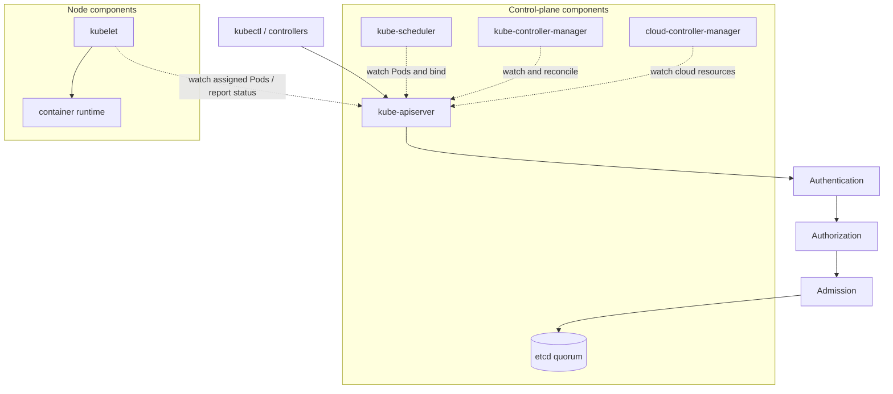

# Kubernetes Control Plane

## Design Goal

This view names the real handoffs, state boundaries, and failure domains used by kubernetes control plane; each arrow represents a concrete API call, watch, dataplane hop, or operator decision.

## Architecture Diagram

## Request or Control Flow

Every client and controller uses the API server. A write passes authentication, authorization, and admission before durable storage in an etcd quorum. Scheduler, controller manager, and cloud controller manager watch API objects and write decisions back through the API; they do not edit etcd directly. Kubelets watch Pods bound to their node, invoke the runtime, and publish status.

## Production Mechanics

Run multiple API-server replicas and an odd etcd quorum across failure domains. Scheduler and controller-manager replicas use leader election, while API servers are active-active. Protect API latency, admission webhook availability, and etcd disk latency because each can stop new changes even while existing Pods continue serving.

## Failure Modes and Operations

* **Boundary:** Loss of etcd quorum rejects consistent writes.
* **Boundary:** A fail-closed admission webhook outage blocks matching requests.
* **Boundary:** Slow list/watch clients or API Priority and Fairness starvation increases reconciliation lag.

For Kubernetes Control Plane, instrument every named handoff, preserve its native revision or resource identifiers, and give the pager to a team able to mitigate that component. Capacity and recovery tests must exercise the specific boundaries shown above rather than only process liveness.

## Security and Trade-offs

The Kubernetes Control Plane trust model authenticates boundary crossings, authorizes its narrowest mutation, encrypts transport and state, and retains the initiating principal. Stronger isolation and validation reduce blast radius but add latency and operational cost; bypasses trade short-term speed for untraceable production state. Prefer a degraded mode that preserves an already healthy serving path when its control plane is unavailable.

## Interview Walkthrough

Trace the Kubernetes Control Plane diagram from its initiating actor to the user-visible result, name its durable-state change, then walk one failure backward from its symptom. Explain the rollback unit, the owner, and the metric that proves recovery.
