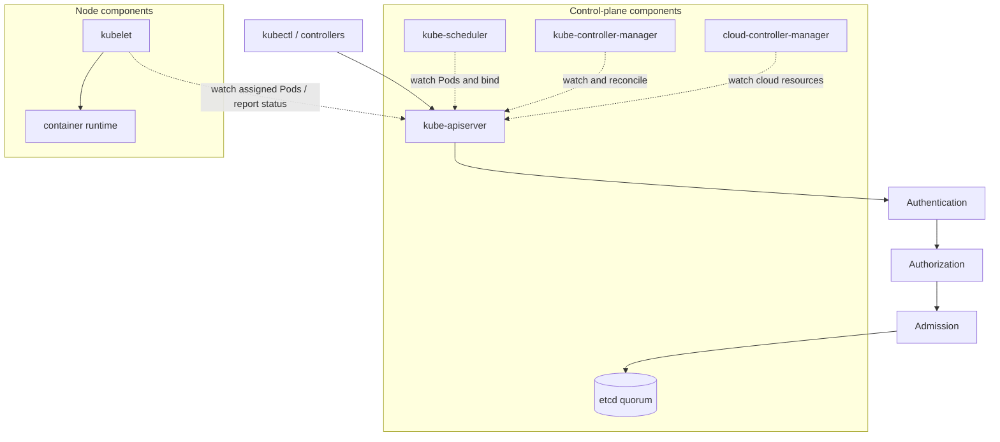

# Kubernetes Control Plane

## Design Goal

Keep declarative API writes available and asynchronous reconcilers making progress without treating them as a pipeline.

## Architecture Diagram

## Request or Control Flow

Clients authenticate, authorize and pass admission at replicated API servers before objects reach etcd. Scheduler, controller managers, cloud controller and kubelets independently list/watch and write through the API. API Priority and Fairness protects critical traffic.

## Component Responsibilities

Clients authenticate, authorize and pass admission at replicated API servers before objects reach etcd. Scheduler, controller managers, cloud controller and kubelets independently list/watch and write through the API. API Priority and Fairness protects critical traffic.

## State and Ownership Boundaries

etcd is authoritative desired/live API state. API servers are concurrent; scheduler and controller replicas use leader election. Managed providers own control-plane patching and etcd recovery; customers still own admission, RBAC, workloads and quotas.

## Security Boundaries

TLS authenticates components; RBAC authorizes verbs; admission validates policy. Bound webhook timeouts and decide fail-open versus fail-closed explicitly. Encrypt secrets at rest and audit privileged calls.

## Scaling Behaviour

Scale API servers for request rate and watch fan-out; reduce expensive LISTs and cardinality. etcd quorum needs low-latency disks, not arbitrary horizontal scaling.

## Failure Modes

etcd quorum loss blocks durable writes; slow webhook exhausts API concurrency; watch storms raise latency; expired leader lease pauses scheduling or reconciliation.

## Recovery and Rollback

During outage, existing Pods and kube-proxy/eBPF rules continue; new scheduling and API changes stop. Restore quorum from tested backup only under the documented procedure; remove or bypass a failed webhook under break-glass policy.

## Operational Metrics

Measure API p95/p99 and 429/5xx; APF queue wait; etcd fsync and commit latency, leader changes and database size; webhook latency; scheduler pending queue; watch terminations. Correlate every signal with the relevant revision and failure domain.

## Trade-offs

The design deliberately exchanges simplicity for control at the boundaries described above. Adopt only the mechanisms whose failure modes the team can test and operate; preserve an already healthy data plane when a control plane is unavailable.

## Interview Walkthrough

Start with **Keep declarative API writes available and asynchronous reconcilers making progress without treating them as a pipeline.** Follow one real state change in the diagram, distinguish desired state from observed health, then explain the most dangerous failure, a reversible mitigation, and the evidence that proves recovery.

## Further Reading

* [Kubernetes documentation](https://kubernetes.io/docs/)
* [AWS documentation](https://docs.aws.amazon.com/)
* [CNCF projects](https://www.cncf.io/projects/)
