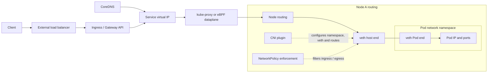

# Kubernetes Networking

## Design Goal

Make Pod addressing, Service load balancing, name resolution and north-south routing independently diagnosable.

## Architecture Diagram

## Request or Control Flow

CNI creates the Pod network namespace, veth and address, then programs node or cloud routing. CoreDNS resolves a Service name to ClusterIP. kube-proxy iptables/IPVS or an eBPF dataplane selects EndpointSlice backends. Gateway/Ingress and an external load balancer provide entry.

## Component Responsibilities

CNI creates the Pod network namespace, veth and address, then programs node or cloud routing. CoreDNS resolves a Service name to ClusterIP. kube-proxy iptables/IPVS or an eBPF dataplane selects EndpointSlice backends. Gateway/Ingress and an external load balancer provide entry.

## State and Ownership Boundaries

CNI/IPAM owns Pod addresses and routes; EndpointSlice controller owns backend records; Service is stable intent; CoreDNS owns cluster names; cloud/controller integrations own external targets.

## Security Boundaries

NetworkPolicy is allow-list enforcement only when the CNI supports it. Secure Gateway TLS and restrict control APIs. Understand SNAT, externalTrafficPolicy and proxy protocol before relying on source IP.

## Scaling Behaviour

Scale CoreDNS and dataplane programming for query/service churn. Subnet IPs can exhaust before CPU. EndpointSlice avoids one huge endpoints object; eBPF changes operational tooling, not Service semantics.

## Failure Modes

IPAM exhaustion blocks sandboxes; selector/readiness mismatch yields no endpoints; stale rules black-hole traffic; ndots/search causes DNS amplification; MTU or asymmetric routing breaks larger flows.

## Recovery and Rollback

Compare DNS, Service, EndpointSlice and direct Pod tests. Restore CNI/IPAM or routes before restarting workloads; revert policy or Gateway config through Git and validate source-IP behavior.

## Operational Metrics

Measure CNI allocation errors and free IPs; DNS latency/NXDOMAIN/SERVFAIL; EndpointSlice readiness; conntrack usage; drops/retransmits; Gateway and target health. Correlate every signal with the relevant revision and failure domain.

## Trade-offs

The design deliberately exchanges simplicity for control at the boundaries described above. Adopt only the mechanisms whose failure modes the team can test and operate; preserve an already healthy data plane when a control plane is unavailable.

## Interview Walkthrough

Start with **Make Pod addressing, Service load balancing, name resolution and north-south routing independently diagnosable.** Follow one real state change in the diagram, distinguish desired state from observed health, then explain the most dangerous failure, a reversible mitigation, and the evidence that proves recovery.

## Further Reading

* [Kubernetes documentation](https://kubernetes.io/docs/)
* [AWS documentation](https://docs.aws.amazon.com/)
* [CNCF projects](https://www.cncf.io/projects/)
