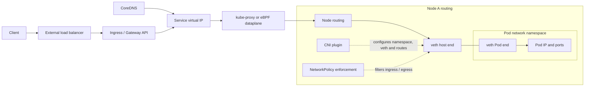

# Kubernetes Networking

## Design Goal

This view names the real handoffs, state boundaries, and failure domains used by kubernetes networking; each arrow represents a concrete API call, watch, dataplane hop, or operator decision.

## Architecture Diagram

## Request or Control Flow

CNI allocates a Pod IP, builds its network namespace and veth pair, and installs node or VPC routes. CoreDNS resolves a Service name to its virtual IP; kube-proxy rules or an eBPF dataplane select a ready EndpointSlice address. External traffic first traverses a cloud load balancer and an Ingress controller or Gateway implementation.

## Production Mechanics

The Kubernetes model requires Pod-to-Pod reachability without NAT; the implementation may use VPC routes, overlays, or eBPF. NetworkPolicy only works when the chosen CNI enforces it. Trace DNS, VIP translation, selected endpoint, node routing, veth, and policy independently.

## Failure Modes and Operations

* **Boundary:** CNI IPAM exhaustion prevents Pod sandbox creation.
* **Boundary:** Stale EndpointSlices or dataplane rules black-hole a subset of connections.
* **Boundary:** DNS overload looks like application connection failure.

For Kubernetes Networking, instrument every named handoff, preserve its native revision or resource identifiers, and give the pager to a team able to mitigate that component. Capacity and recovery tests must exercise the specific boundaries shown above rather than only process liveness.

## Security and Trade-offs

The Kubernetes Networking trust model authenticates boundary crossings, authorizes its narrowest mutation, encrypts transport and state, and retains the initiating principal. Stronger isolation and validation reduce blast radius but add latency and operational cost; bypasses trade short-term speed for untraceable production state. Prefer a degraded mode that preserves an already healthy serving path when its control plane is unavailable.

## Interview Walkthrough

Trace the Kubernetes Networking diagram from its initiating actor to the user-visible result, name its durable-state change, then walk one failure backward from its symptom. Explain the rollback unit, the owner, and the metric that proves recovery.
