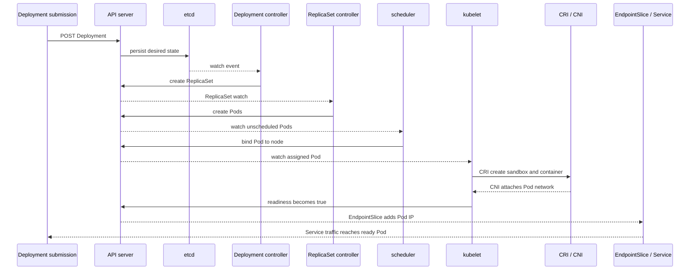

# Kubernetes Request Lifecycle

## Design Goal

This view names the real handoffs, state boundaries, and failure domains used by kubernetes request lifecycle; each arrow represents a concrete API call, watch, dataplane hop, or operator decision.

## Architecture Diagram

## Request or Control Flow

Submission returns after the API server validates and persists the Deployment, not after a Pod serves. The Deployment controller creates a ReplicaSet; its controller creates Pods. The scheduler binds each feasible Pod, the node kubelet asks CRI to start it and CNI to network its sandbox, then reports probe status. EndpointSlice controllers publish ready addresses consumed by the Service dataplane.

## Production Mechanics

Use generation, observedGeneration, revision, Pod UID, and Kubernetes events to identify the stalled handoff. Each stage is asynchronous and watch-driven, so diagnosis follows the first missing object or status transition rather than assuming a single transaction.

## Failure Modes and Operations

* **Boundary:** Quota or admission rejects creation before persistence.
* **Boundary:** No feasible node leaves Pods Pending with scheduler events.
* **Boundary:** A failing readiness probe keeps a Running Pod out of ready EndpointSlices.

For Kubernetes Request Lifecycle, instrument every named handoff, preserve its native revision or resource identifiers, and give the pager to a team able to mitigate that component. Capacity and recovery tests must exercise the specific boundaries shown above rather than only process liveness.

## Security and Trade-offs

The Kubernetes Request Lifecycle trust model authenticates boundary crossings, authorizes its narrowest mutation, encrypts transport and state, and retains the initiating principal. Stronger isolation and validation reduce blast radius but add latency and operational cost; bypasses trade short-term speed for untraceable production state. Prefer a degraded mode that preserves an already healthy serving path when its control plane is unavailable.

## Interview Walkthrough

Trace the Kubernetes Request Lifecycle diagram from its initiating actor to the user-visible result, name its durable-state change, then walk one failure backward from its symptom. Explain the rollback unit, the owner, and the metric that proves recovery.
