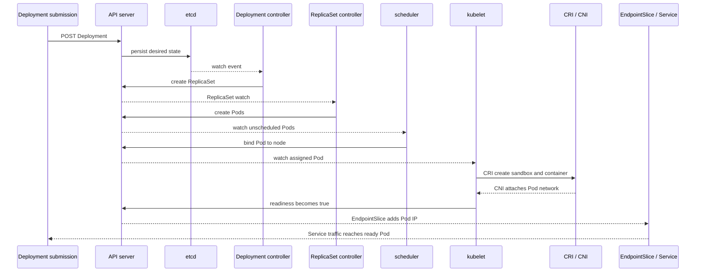

# Kubernetes Request Lifecycle

## Design Goal

Explain a Deployment as persisted intent followed by multiple independent reconciliation loops and eventual serving readiness.

## Architecture Diagram

## Request or Control Flow

The client writes through API authentication, authorization and admission into etcd. Deployment and ReplicaSet controllers create Pods asynchronously. Scheduler writes a binding; kubelet invokes CRI and CNI, reports status, and readiness eventually causes EndpointSlice membership and Service traffic.

## Component Responsibilities

The client writes through API authentication, authorization and admission into etcd. Deployment and ReplicaSet controllers create Pods asynchronously. Scheduler writes a binding; kubelet invokes CRI and CNI, reports status, and readiness eventually causes EndpointSlice membership and Service traffic.

## State and Ownership Boundaries

etcd stores objects; each controller owns only its reconciliation decision and status writes. Kubelet owns node-local runtime status; EndpointSlice controller derives ready backends; applications own meaningful readiness.

## Security Boundaries

Every write is authenticated and authorized; admission can mutate or reject. Service accounts and workload identity constrain runtime access; NetworkPolicy constrains data-plane reachability.

## Scaling Behaviour

Controllers consume queues with rate limits and can lag independently. Scheduler throughput, image pulls, CNI IP capacity and readiness dominate at scale.

## Failure Modes

Admission rejection creates no object; controller lag leaves stale desired state; unschedulable Pod remains Pending; CNI or image error blocks start; false readiness admits broken traffic.

## Recovery and Rollback

Fix the failed boundary and let reconciliation resume. Roll back Deployment template by reviewed Git change; verify observedGeneration, rollout status and EndpointSlices rather than Pod phase alone.

## Operational Metrics

Measure API write latency; controller workqueue depth/retries; scheduling latency; image pull and sandbox creation; readiness duration; ready endpoint count; rollout availability. Correlate every signal with the relevant revision and failure domain.

## Trade-offs

The design deliberately exchanges simplicity for control at the boundaries described above. Adopt only the mechanisms whose failure modes the team can test and operate; preserve an already healthy data plane when a control plane is unavailable.

## Interview Walkthrough

Start with **Explain a Deployment as persisted intent followed by multiple independent reconciliation loops and eventual serving readiness.** Follow one real state change in the diagram, distinguish desired state from observed health, then explain the most dangerous failure, a reversible mitigation, and the evidence that proves recovery.

## Further Reading

* [Kubernetes documentation](https://kubernetes.io/docs/)
* [AWS documentation](https://docs.aws.amazon.com/)
* [CNCF projects](https://www.cncf.io/projects/)
