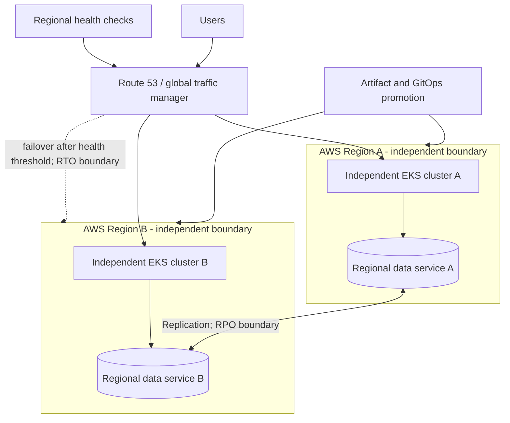

# Multi-Region Platform

## Design Goal

This view names the real handoffs, state boundaries, and failure domains used by multi-region platform; each arrow represents a concrete API call, watch, dataplane hop, or operator decision.

## Architecture Diagram

## Request or Control Flow

A global traffic manager evaluates regional health and routes to two independently operable EKS clusters. Each region owns its ingress, compute, secrets, telemetry buffer, and regional data endpoint. Identical artifact digests and separately promoted GitOps state avoid a deployment pipeline becoming a hidden runtime control plane.

## Production Mechanics

Replication determines the RPO: asynchronous copies can lose acknowledged writes, while synchronous cross-region writes increase latency and coupling. Detection, DNS/traffic convergence, capacity warm-up, and data promotion determine RTO. Failover must prevent split brain and be rehearsed; a single shared control plane, database writer, or identity dependency defeats regional independence.

## Failure Modes and Operations

* **Boundary:** A bad global promotion fails both regions simultaneously.
* **Boundary:** Health checks pass while a critical regional dependency is broken.
* **Boundary:** Failback overwrites newer data unless writer fencing is explicit.

For Multi-Region Platform, instrument every named handoff, preserve its native revision or resource identifiers, and give the pager to a team able to mitigate that component. Capacity and recovery tests must exercise the specific boundaries shown above rather than only process liveness.

## Security and Trade-offs

The Multi-Region Platform trust model authenticates boundary crossings, authorizes its narrowest mutation, encrypts transport and state, and retains the initiating principal. Stronger isolation and validation reduce blast radius but add latency and operational cost; bypasses trade short-term speed for untraceable production state. Prefer a degraded mode that preserves an already healthy serving path when its control plane is unavailable.

## Interview Walkthrough

Trace the Multi-Region Platform diagram from its initiating actor to the user-visible result, name its durable-state change, then walk one failure backward from its symptom. Explain the rollback unit, the owner, and the metric that proves recovery.
