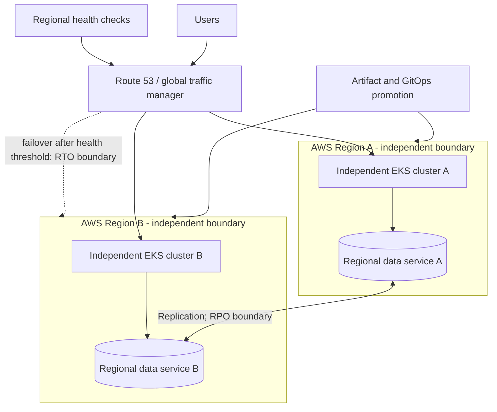

# Multi-Region Platform

## Design Goal

Meet explicit RPO/RTO by keeping regional serving independent and making data consistency and failback deliberate.

## Architecture Diagram

## Request or Control Flow

Global DNS/traffic manager uses health checks to select independent regional clusters and dependencies. Artifacts are promoted by digest and GitOps deploys per-region. Databases replicate according to a documented single-writer or conflict-resolution model.

## Component Responsibilities

Global DNS/traffic manager uses health checks to select independent regional clusters and dependencies. Artifacts are promoted by digest and GitOps deploys per-region. Databases replicate according to a documented single-writer or conflict-resolution model.

## State and Ownership Boundaries

Each region owns serving and regional data. Global traffic and artifact promotion are shared risks; ownership for declaring failover and data authority must be explicit.

## Security Boundaries

Use separate regional identities and keys; protect replication links; enforce data residency. Break-glass failover needs approval and audit without depending on the failed region.

## Scaling Behaviour

Hold enough standby capacity to meet RTO; DNS TTL and client caching bound traffic shift. Cost ranges from pilot light to active-active and must match the capacity promise.

## Failure Modes

False health check causes oscillation; shared GitOps/identity outage hits all regions; replication lag exceeds RPO; split brain accepts conflicting writes; cold region lacks quota.

## Recovery and Rollback

Declare data authority, stop or fence the old writer, shift traffic, validate SLO/data, then restore replication. Failback is a planned migration after reconciliation, never an automatic DNS flip.

## Operational Metrics

Measure regional availability/latency; health-check state; replication lag/data loss window; regional capacity/quota; failover and failback duration; DR test success. Correlate every signal with the relevant revision and failure domain.

## Trade-offs

The design deliberately exchanges simplicity for control at the boundaries described above. Adopt only the mechanisms whose failure modes the team can test and operate; preserve an already healthy data plane when a control plane is unavailable.

## Interview Walkthrough

Start with **Meet explicit RPO/RTO by keeping regional serving independent and making data consistency and failback deliberate.** Follow one real state change in the diagram, distinguish desired state from observed health, then explain the most dangerous failure, a reversible mitigation, and the evidence that proves recovery.

## Further Reading

* [Kubernetes documentation](https://kubernetes.io/docs/)
* [AWS documentation](https://docs.aws.amazon.com/)
* [CNCF projects](https://www.cncf.io/projects/)
