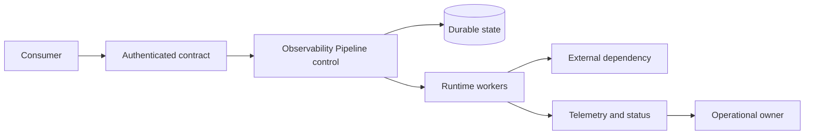

# Observability Pipeline

## Problem

Collect, transform, store, and query telemetry without making applications depend on the backend. The boundary must remain diagnosable when a dependency is slow, unavailable, unauthorized, or returning stale state.

## Diagram

## Request or Control Flow

1. A consumer submits versioned intent with an identity and idempotency key or resource version.
2. The edge authenticates, authorizes, validates, and persists before acknowledging asynchronous work.
3. Workers read from a bounded queue, compare desired and observed state, and make retry-safe changes.
4. Runtime readiness proves the serving path, while status reports the processed generation.
5. Telemetry and audit events retain stable revision identifiers for diagnosis and rollback.

## Component Responsibilities

| Component | Owns | Must expose |
|---|---|---|
| Contract edge | Identity, policy, validation, compatibility | latency, rejection reason, audit principal |
| Durable state | Source of intended state and concurrency | freshness, backup, restore evidence |
| Controller/worker | Ordering, retry, idempotency, status | queue depth, reconcile errors, last success |
| Runtime | User work and dependency calls | RED metrics, saturation, revision |
| Service owner | SLO, rollout, incident response | runbook, dashboard, escalation |

## Failure Boundaries

Separate tenants, production accounts, regions or zones, and controller credentials. A control-plane outage should stop change without stopping an already healthy serving path. Bound retry amplification and preserve a manual, audited mitigation path. Test loss of state, queue backlog, expired identity, exhausted capacity, and partial dependency success.

## Security

Use workload identity and short-lived credentials; scope reads and mutations independently. Encrypt transport and durable state, log administrative and automated principals, verify artifact provenance where risk warrants it, and prevent tenants from selecting privileged service accounts or untrusted sources.

## Scaling

Scale workers from queue latency rather than CPU alone, shard only with a clear ownership key, and protect dependencies with concurrency limits. Runtime autoscaling needs a leading workload signal plus maximum safe demand. Capacity plans include cloud quotas, IPs, storage attachment, and failover headroom—not just compute.

## Operational Ownership

The platform team owns the contract, shared controllers, upgrades, and migration guidance. Workload teams own configuration, application SLOs, and safe use. Security defines testable controls. One named team owns each pager; shared ownership without an escalation boundary is unowned.

## Trade-offs

A centralized control plane simplifies policy and inventory but widens blast radius. Per-tenant instances improve isolation but multiply upgrades. Asynchronous reconciliation survives transient faults but is eventually consistent and harder to reason about than a synchronous call. Select the simplest boundary that meets recovery and compliance objectives.

## Interview Explanation

Begin with the user outcome and state boundaries. Walk one request forward, one failure backward, then explain identity, scaling, rollback, and ownership. State which facts are assumptions. The staff-level signal is not the number of tools; it is a design whose failure behavior and migration path are credible.

## Further Reading

* [AWS Builders' Library](https://aws.amazon.com/builders-library/)
* [Kubernetes architecture](https://kubernetes.io/docs/concepts/architecture/)
* [Google SRE books](https://sre.google/books/)
