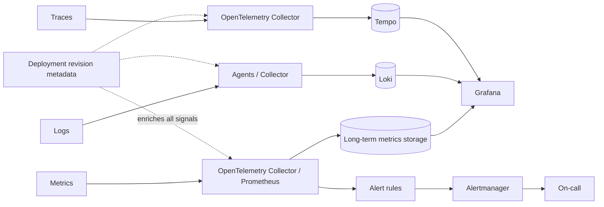

# Observability Pipeline

## Design Goal

This view names the real handoffs, state boundaries, and failure domains used by observability pipeline; each arrow represents a concrete API call, watch, dataplane hop, or operator decision.

## Architecture Diagram

## Request or Control Flow

Metrics, logs, and traces have separate ingestion and storage paths so one high-volume signal cannot silently consume every other signal's budget. Prometheus or an OpenTelemetry Collector scrapes/receives metrics and remote-writes long-term storage. Agents ship logs to Loki; collectors export traces to Tempo. Grafana queries each backend, while actionable rules route through Alertmanager to on-call.

## Production Mechanics

Propagate trace ID into structured logs and exemplars. Attach deployment revision, pod, node, cluster, and region as controlled attributes so an operator can move from an SLO burn to a trace, its logs, and the exact rollout. Limit label cardinality; trace IDs belong in logs/exemplars, not as metric labels.

## Failure Modes and Operations

* **Boundary:** Collector backpressure drops data unless queues and memory limits are explicit.
* **Boundary:** High-cardinality labels overload metrics storage.
* **Boundary:** An alert on symptoms without ownership or runbook creates noise.

For Observability Pipeline, instrument every named handoff, preserve its native revision or resource identifiers, and give the pager to a team able to mitigate that component. Capacity and recovery tests must exercise the specific boundaries shown above rather than only process liveness.

## Security and Trade-offs

The Observability Pipeline trust model authenticates boundary crossings, authorizes its narrowest mutation, encrypts transport and state, and retains the initiating principal. Stronger isolation and validation reduce blast radius but add latency and operational cost; bypasses trade short-term speed for untraceable production state. Prefer a degraded mode that preserves an already healthy serving path when its control plane is unavailable.

## Interview Walkthrough

Trace the Observability Pipeline diagram from its initiating actor to the user-visible result, name its durable-state change, then walk one failure backward from its symptom. Explain the rollback unit, the owner, and the metric that proves recovery.
