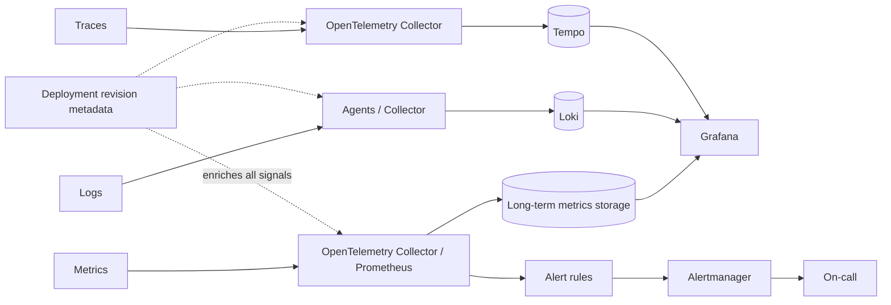

# Observability Pipeline

## Design Goal

Preserve distinct telemetry signals while making them correlatable and ensuring the monitoring path is itself observable.

## Architecture Diagram

## Request or Control Flow

Prometheus scrapes metrics and remote-writes; agents/Collectors transport logs to Loki, traces to Tempo and events to an event store. Collectors receive, batch, sample and export. Grafana queries stores; alert rules evaluate SLO symptoms. Profiles are optional and stored separately.

## Component Responsibilities

Prometheus scrapes metrics and remote-writes; agents/Collectors transport logs to Loki, traces to Tempo and events to an event store. Collectors receive, batch, sample and export. Grafana queries stores; alert rules evaluate SLO symptoms. Profiles are optional and stored separately.

## State and Ownership Boundaries

Applications own instrumentation; collectors own buffering/processing, backends own durable retention, and alerting owns notification state. Telemetry is evidence, not the source of business truth.

## Security Boundaries

Redact sensitive attributes, authenticate exporters, encrypt transit/storage and restrict queries. Tenant boundaries must apply to every backend. Do not place user IDs or secrets in labels.

## Scaling Behaviour

Control metric series and Loki label cardinality; sample traces intentionally; batch/export with bounded memory. Remote write queues absorb brief loss but are not unlimited.

## Failure Modes

Collector backpressure drops data; remote write queue fills; cardinality overloads index; clock skew breaks trace order; alert path fails silently; sampling hides rare failures.

## Recovery and Rollback

Keep local buffers bounded, route critical alerts redundantly, and test synthetic telemetry. Reduce cardinality or ingestion before scaling storage blindly; replay only where queues support it.

## Operational Metrics

Measure scrape success and remote-write lag; Collector refused/dropped spans; Loki active streams; Tempo ingestion/query errors; alert delivery; exemplar links; correlation coverage for trace ID, revision, pod, node, cluster, account, region. Correlate every signal with the relevant revision and failure domain.

## Trade-offs

The design deliberately exchanges simplicity for control at the boundaries described above. Adopt only the mechanisms whose failure modes the team can test and operate; preserve an already healthy data plane when a control plane is unavailable.

## Interview Walkthrough

Start with **Preserve distinct telemetry signals while making them correlatable and ensuring the monitoring path is itself observable.** Follow one real state change in the diagram, distinguish desired state from observed health, then explain the most dangerous failure, a reversible mitigation, and the evidence that proves recovery.

## Further Reading

* [Kubernetes documentation](https://kubernetes.io/docs/)
* [AWS documentation](https://docs.aws.amazon.com/)
* [CNCF projects](https://www.cncf.io/projects/)
