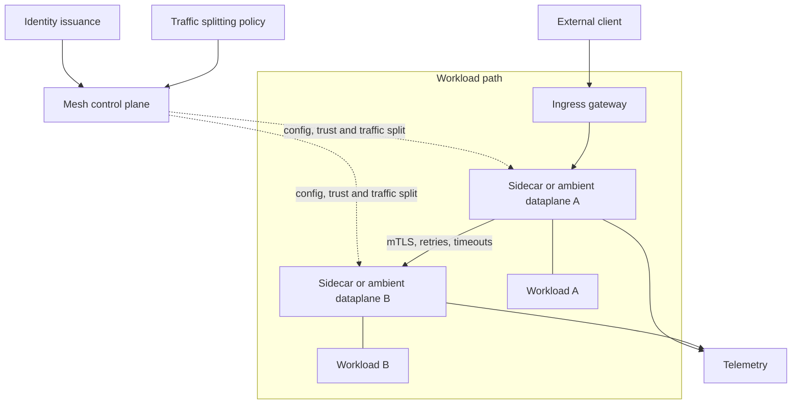
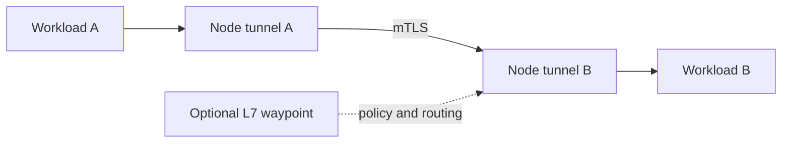

# Service Mesh

## Design Goal

This view names the real handoffs, state boundaries, and failure domains used by service mesh; each arrow represents a concrete API call, watch, dataplane hop, or operator decision.

## Architecture Diagram

## Request or Control Flow

The control plane distributes identities, trust roots, routing policy, and configuration; dataplanes enforce mTLS and observe requests. Retries require budgets and per-try timeouts because multiplying retries across callers causes storms. Traffic splitting should select workload revisions and emit comparable telemetry.

## Production Mechanics

### Sidecar model

Each Pod owns a proxy, giving a clear interception boundary but consuming per-Pod resources and complicating startup.

### Ambient model

Node-level tunnels provide L4 identity with fewer sidecars; optional waypoints add L7 policy, changing isolation and debugging boundaries.

## Failure Modes and Operations

* **Boundary:** Expired workload certificates break east-west calls.
* **Boundary:** Unbounded retries amplify an overloaded downstream.
* **Boundary:** Control-plane loss should freeze config, not terminate established serving paths.

For Service Mesh, instrument every named handoff, preserve its native revision or resource identifiers, and give the pager to a team able to mitigate that component. Capacity and recovery tests must exercise the specific boundaries shown above rather than only process liveness.

## Security and Trade-offs

The Service Mesh trust model authenticates boundary crossings, authorizes its narrowest mutation, encrypts transport and state, and retains the initiating principal. Stronger isolation and validation reduce blast radius but add latency and operational cost; bypasses trade short-term speed for untraceable production state. Prefer a degraded mode that preserves an already healthy serving path when its control plane is unavailable.

## Interview Walkthrough

Trace the Service Mesh diagram from its initiating actor to the user-visible result, name its durable-state change, then walk one failure backward from its symptom. Explain the rollback unit, the owner, and the metric that proves recovery.
