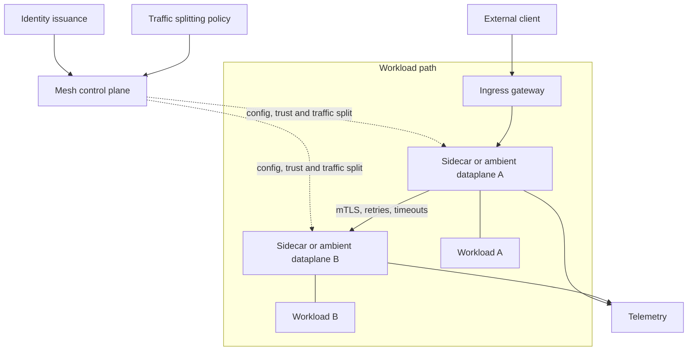

# Service Mesh

## Design Goal

Centralize workload identity and selected traffic controls only where their operational value exceeds dataplane complexity.

## Architecture Diagram

## Request or Control Flow

In sidecar mode each Pod proxy intercepts traffic; ambient mode uses node-level secure overlay and optional waypoint proxies. A control plane distributes identity, trust roots, routes and policy. Gateways cross cluster boundaries; mTLS authenticates workload identities.

## Component Responsibilities

In sidecar mode each Pod proxy intercepts traffic; ambient mode uses node-level secure overlay and optional waypoint proxies. A control plane distributes identity, trust roots, routes and policy. Gateways cross cluster boundaries; mTLS authenticates workload identities.

## State and Ownership Boundaries

Mesh control plane owns configuration and certificate distribution; proxies enforce data-plane policy. Application teams still own application timeouts and semantics; security owns trust-root rotation.

## Security Boundaries

Short-lived certificates chain to managed trust roots. Authorize service identities, protect gateways and plan root rotation. Encryption does not fix compromised endpoints.

## Scaling Behaviour

Sidecars consume per-Pod resources; ambient reduces sidecars but introduces shared node/waypoint domains. Traffic splitting and telemetry add config and cardinality load.

## Failure Modes

Control-plane loss leaves last config but blocks updates/cert renewal; certificate expiry rejects traffic; retries amplify overload; conflicting app/mesh timeouts create storms.

## Recovery and Rollback

Freeze config, stop retry amplification and route around a bad revision. Restore identity issuance before certificates expire; roll back traffic policy declaratively and validate both directions.

## Operational Metrics

Measure mTLS handshake/cert expiry; proxy errors and retries; request latency by hop; control-plane push time/rejections; gateway saturation; traffic-split outcome. Correlate every signal with the relevant revision and failure domain.

## Trade-offs

The design deliberately exchanges simplicity for control at the boundaries described above. Adopt only the mechanisms whose failure modes the team can test and operate; preserve an already healthy data plane when a control plane is unavailable.

## Interview Walkthrough

Start with **Centralize workload identity and selected traffic controls only where their operational value exceeds dataplane complexity.** Follow one real state change in the diagram, distinguish desired state from observed health, then explain the most dangerous failure, a reversible mitigation, and the evidence that proves recovery.

## Further Reading

* [Kubernetes documentation](https://kubernetes.io/docs/)
* [AWS documentation](https://docs.aws.amazon.com/)
* [CNCF projects](https://www.cncf.io/projects/)
