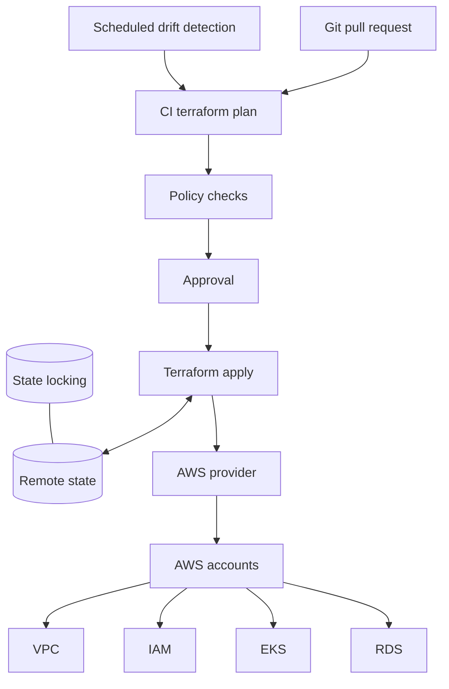

# Terraform AWS Platform

## Design Goal

Apply reviewed AWS changes with a trustworthy resource mapping and recover safely from interrupted execution.

## Architecture Diagram

## Request or Control Flow

CI produces a plan with read-only credentials and policy checks; an approved apply uses stronger short-lived credentials. The backend stores encrypted, versioned state and coordinates locking. Providers call account roles; state is partitioned by lifecycle and blast radius.

## Component Responsibilities

CI produces a plan with read-only credentials and policy checks; an approved apply uses stronger short-lived credentials. The backend stores encrypted, versioned state and coordinates locking. Providers call account roles; state is partitioned by lifecycle and blast radius.

## State and Ownership Boundaries

Configuration is intent; state maps Terraform addresses to provider object IDs and contains sensitive values; AWS is real infrastructure. Platform teams own modules/backends, service teams own declared inputs.

## Security Boundaries

Use OIDC and role assumption across accounts, KMS encryption, least backend access and protected approvals. Treat state as secret material and log who planned/applied.

## Scaling Behaviour

Partition state rather than creating one lock bottleneck. Provider/API quotas and graph dependencies bound apply concurrency; excessive parallelism worsens throttling.

## Failure Modes

Stale lock blocks writers; partial apply changes AWS before state completion; drift makes plan surprising; provider/schema upgrade breaks decode; moved address without moved block proposes replacement.

## Recovery and Rollback

Confirm no writer before force-unlock. Run refresh-only plan, inspect AWS and state versions, import or state mv under review. Restore a state version only to restore mapping—state restoration does not undo AWS changes.

## Operational Metrics

Measure plan/apply duration and failure; lock wait; drift count; policy denial; API throttle; state age/version; partial-change incident rate. Correlate every signal with the relevant revision and failure domain.

## Trade-offs

The design deliberately exchanges simplicity for control at the boundaries described above. Adopt only the mechanisms whose failure modes the team can test and operate; preserve an already healthy data plane when a control plane is unavailable.

## Interview Walkthrough

Start with **Apply reviewed AWS changes with a trustworthy resource mapping and recover safely from interrupted execution.** Follow one real state change in the diagram, distinguish desired state from observed health, then explain the most dangerous failure, a reversible mitigation, and the evidence that proves recovery.

## Further Reading

* [Kubernetes documentation](https://kubernetes.io/docs/)
* [AWS documentation](https://docs.aws.amazon.com/)
* [CNCF projects](https://www.cncf.io/projects/)
