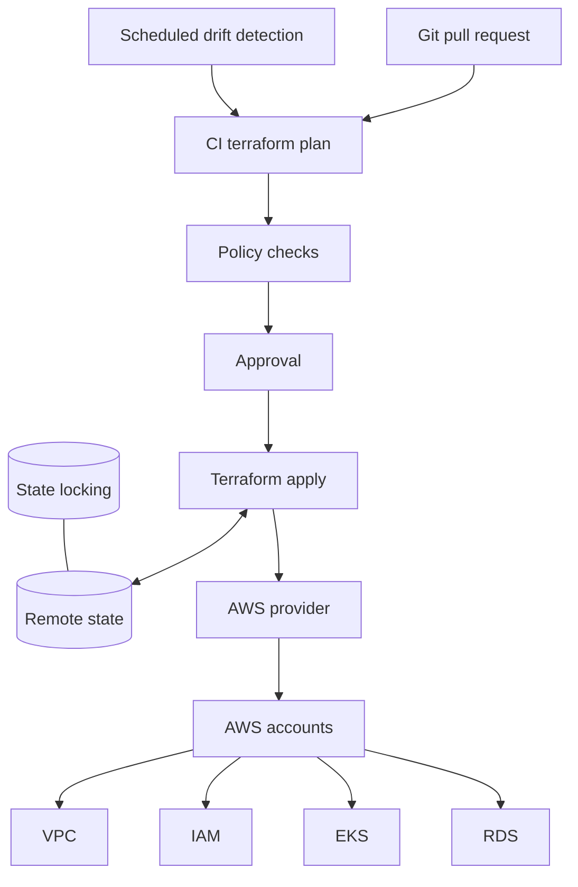

# Terraform AWS Platform

## Design Goal

This view names the real handoffs, state boundaries, and failure domains used by terraform aws platform; each arrow represents a concrete API call, watch, dataplane hop, or operator decision.

## Architecture Diagram

## Request or Control Flow

A pull request runs a read-only plan against the correct remote-state workspace. Policy checks reject unsafe IAM, public networking, or missing controls; a human approves the reviewed plan before a constrained runner applies it. The AWS provider translates the graph into account-scoped API calls for VPC, IAM, EKS, and RDS.

## Production Mechanics

Remote state records resource identity and dependency output; encryption, versioning, restricted access, and state locking prevent concurrent writers. Scheduled plans detect drift, but importing, removing, or replacing resources must be reviewed. Separate state by account and blast radius rather than placing the estate behind one lock.

## Failure Modes and Operations

* **Boundary:** A stale plan applies after inputs or state change.
* **Boundary:** Lost locking permits competing writers and inconsistent state.
* **Boundary:** Provider throttling or partial apply requires a fresh plan, not blind replay.

For Terraform AWS Platform, instrument every named handoff, preserve its native revision or resource identifiers, and give the pager to a team able to mitigate that component. Capacity and recovery tests must exercise the specific boundaries shown above rather than only process liveness.

## Security and Trade-offs

The Terraform AWS Platform trust model authenticates boundary crossings, authorizes its narrowest mutation, encrypts transport and state, and retains the initiating principal. Stronger isolation and validation reduce blast radius but add latency and operational cost; bypasses trade short-term speed for untraceable production state. Prefer a degraded mode that preserves an already healthy serving path when its control plane is unavailable.

## Interview Walkthrough

Trace the Terraform AWS Platform diagram from its initiating actor to the user-visible result, name its durable-state change, then walk one failure backward from its symptom. Explain the rollback unit, the owner, and the metric that proves recovery.
