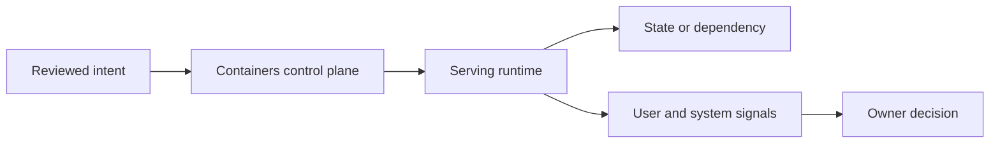
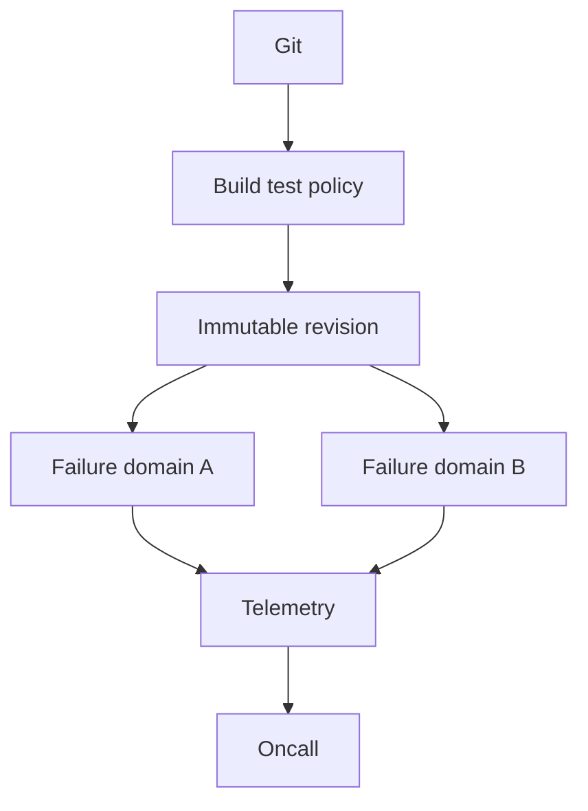

# Containers

## Senior summary

An image is content-addressed filesystem/config data. A runtime creates a process isolated by namespaces and constrained through cgroups; it is not a virtual machine. A production design states ownership, capacity, security, failure behavior, and a reversible change path instead of treating tooling as the outcome.

## Control and request flow

Trace the real chain as **OCI image, registry, runtime, namespace, cgroup**. At every transition ask: what identity is used, where durable state lives, whether the operation is idempotent, which timeout bounds it, and how status distinguishes accepted from completed work.

## Internal mechanics

The control plane validates and persists intent before asynchronous workers act. Workers use bounded concurrency and retries with backoff, correlate work to a stable revision, and publish status. Runtime health is necessary but not sufficient: readiness must represent the serving path and SLOs must measure user outcomes.

| State | Evidence | Typical false conclusion |
|---|---|---|
| Source | reviewed commit/configuration | “Merged means deployed” |
| Accepted | API response and audit event | “Accepted means serving” |
| Observed | controller status and conditions | “Reconciled means correct” |
| Serving | SLI by revision and dependency | “No errors means no impact” |

## Production design

Use separate production authorization and failure boundaries, short-lived workload identity, immutable artifacts, progressive exposure, and centralized but non-blocking telemetry. Keep control-plane availability independent from an already healthy data path where possible. Backups require restore tests; Git does not back up external data.

## Failure modes and troubleshooting

| Failure | Evidence | First safe action |
|---|---|---|
| Rejected intent | validation reason/audit event | correct source rather than bypass policy |
| Reconciliation lag | queue depth, stale generation | restore controller/dependency capacity |
| Runtime saturation | queue latency, resource pressure | shed load or add known-good capacity |
| Dependency regression | trace span and comparative SLI | route/rollback the smallest boundary |
| Drift | source-to-live diff and actor | preserve evidence, restore declared ownership |

During an incident define impact, preserve evidence, compare healthy dimensions, and test a falsifiable hypothesis. Prefer a reviewed rollback or traffic shift over broad restarts. After mitigation, address the hidden coupling and validate prevention through a test or signal.

## Trade-offs

Centralization improves consistent controls but increases shared blast radius. Tenant isolation improves autonomy and recovery boundaries but multiplies upgrades. Abstractions reduce routine cognitive load but must expose underlying status and supported escape paths. Do not adopt a new control plane unless repeated demand and risk justify an owned service.

## Interview prompts

* Walk one request forward and one failure backward.
* Which state is durable, and how is recovery tested?
* What is the leading saturation signal?
* Who owns the contract, runtime SLO, and pager?
* When is a simpler managed or application-level mechanism preferable?

## Further reading

* [AWS Builders' Library](https://aws.amazon.com/builders-library/)
* [Kubernetes documentation](https://kubernetes.io/docs/)
* [Google SRE books](https://sre.google/books/)

## Study links

Return to the [Study Vault](../study/index.md) or use the [Interview Dashboard](../study/00-interview-dashboard.md).
