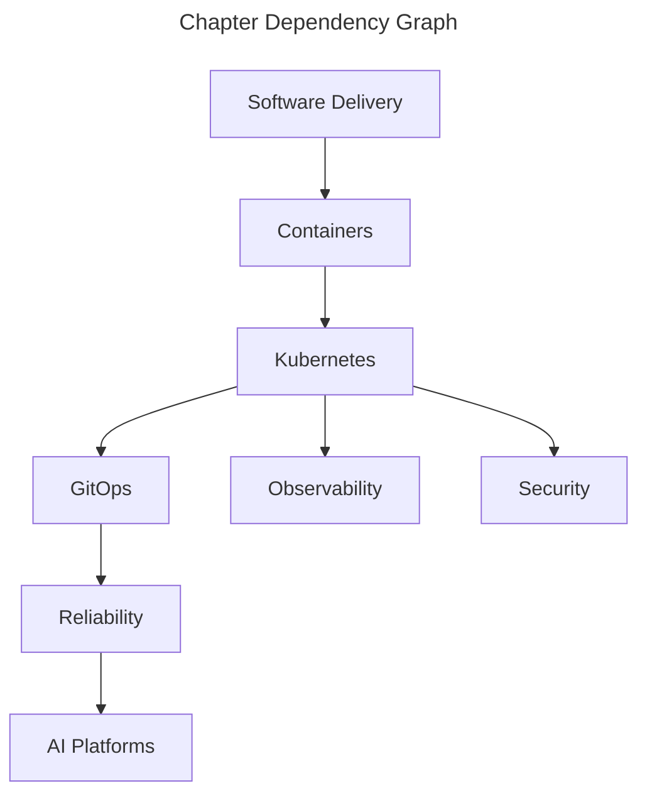

# Handbook Overview

The handbook is designed as a graph rather than a reading queue. Start with a
[role-based learning path](../knowledge-graph/index.md#learning-paths), explore the
[concept map](../knowledge-graph/index.md#platform-concept-map), or enter through
any chapter and follow its prerequisites and next topics.

## Choose a route

| If you want to… | Start here | Then follow |
|---|---|---|
| Build and ship a workload | [Software Delivery](software-delivery.md) | Containers → Kubernetes → GitOps |
| Operate a production service | [Kubernetes](kubernetes.md) | Observability → Reliability → Security |
| Build a cloud platform | [AWS Foundations](aws-foundations.md) | Security → Kubernetes → GitOps |
| Run ML workloads responsibly | [AI Platforms](ai-platforms.md) | Observability → Reliability → Security |

See the [Knowledge Graph](../knowledge-graph/index.md) for relationship types,
technology comparisons, and complete learning paths.
