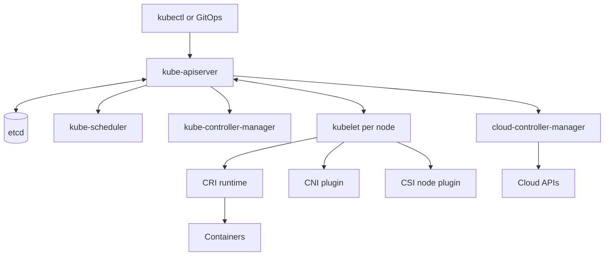
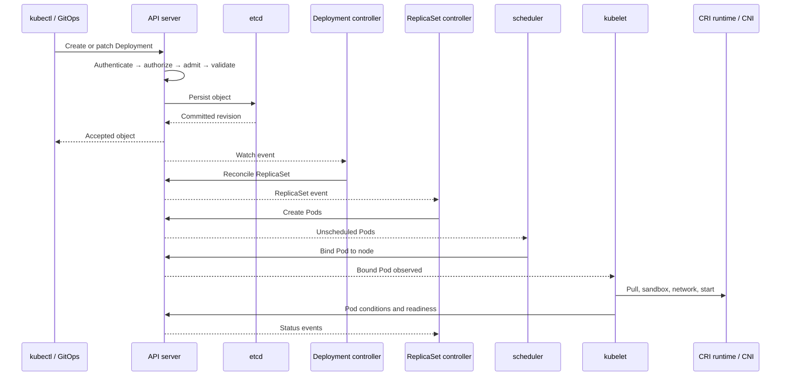
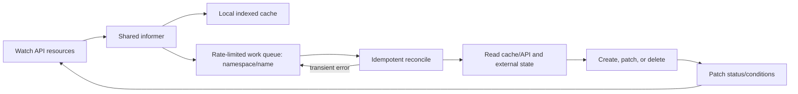
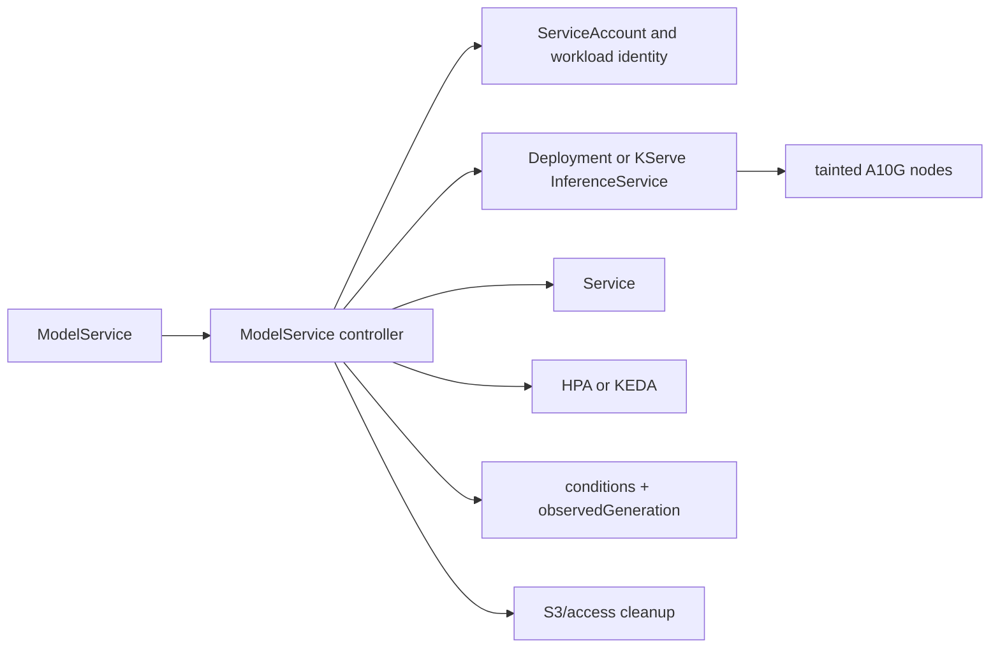
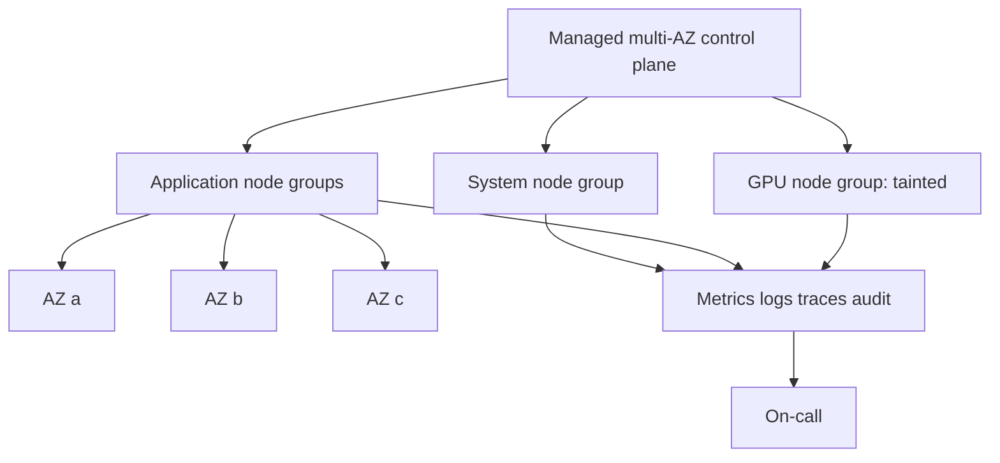

# Kubernetes Internals and Production Operation

Kubernetes is a set of declarative APIs and cooperating control loops. It does not make an application reliable by itself: operators must supply resource sizing, disruption policy, rollout safety, security, telemetry, and tested recovery.

## Core architecture



| Component | Responsibility | Important non-responsibility |
|---|---|---|
| API server | REST entry point; authentication, authorization, admission, validation, optimistic concurrency, API discovery | It does not run containers |
| etcd | Strongly consistent persistent store for API objects | It is not an application database |
| Scheduler | Selects a node for an unscheduled Pod, then records a binding | It does not start the Pod |
| Controller manager | Runs core controllers such as Deployment, ReplicaSet, node, job, and namespace controllers | A controller converges; it is not a synchronous workflow engine |
| Kubelet | Watches Pods bound to its node, drives sandbox/container and volume lifecycle, runs probes, reports status | It does not choose the node |
| CRI runtime | Through CRI, pulls images and manages pod sandboxes and containers; commonly containerd or CRI-O | Kubernetes does not call OCI runtimes directly for normal lifecycle operations |
| Cloud controller manager | Reconciles cloud-specific nodes, routes where applicable, Services of type LoadBalancer, and related integration | It should not contain core portable controllers |
| CNI / CSI | CNI configures Pod networking; CSI separates storage provisioning/attachment/mount operations | A Service is not implemented by CNI alone; storage scheduling still involves Kubernetes objects |

The scheduler's scheduling cycle filters infeasible nodes (resources, selectors, affinity, taints, topology, volume constraints), scores feasible nodes, selects one, and assumes/reserves state before binding. Plugins can participate at queueing, pre-filter, filter, score, reserve, permit, pre-bind, bind, and post-bind extension points. A separate binding cycle can overlap later scheduling cycles.

## Deployment request path



The complete causal chain is:

`kubectl or GitOps controller → API server → authentication → authorization → admission → etcd → Deployment controller → ReplicaSet controller → scheduler → kubelet → container runtime → CNI → readiness → Service endpoints`.

Authentication establishes identity; authorization (often RBAC) permits the verb on the resource; mutating admission may default or inject; validating admission and built-in validation reject unsafe or malformed intent. Persistence precedes asynchronous reconciliation. The EndpointSlice controller includes ready serving backends based on Pod readiness and Service selection; traffic routing then depends on kube-proxy or an alternative dataplane.

## Reconciliation internals

A controller repeatedly compares **desired state** in `spec` with **actual state** learned from API objects and external systems, performs an idempotent step, and writes observations to `status`. It must tolerate duplicates, stale caches, lost leaders, partial external success, and process restarts.



* A **list/watch** provides initial objects and later changes from a resource version. Watches may close or become too old, so clients relist.
* An **informer** maintains a local cache and invokes event handlers. Event handlers enqueue keys rather than doing slow work.
* A **work queue** deduplicates keys and supports retries. Exponential rate limiting prevents a broken dependency or poison object from hot-looping.
* Caches are intentionally stale: reconciliation is **eventually consistent**. Re-read before destructive decisions and use resource versions/preconditions where races matter.
* The operation must be **idempotent**. If an external create succeeded but the process died before status was written, retry must discover or safely adopt the resource.

`metadata.generation` increments when desired fields change. A controller reports the generation it has processed in `status.observedGeneration`; conditions without a current observed generation can be stale. Conditions should identify states such as `Ready`, `Progressing`, or `Degraded`, with machine-readable reason and useful message.

**Owner references** establish ownership for garbage collection. Foreground deletion waits for dependents; background deletion removes the owner while collectors delete dependents. A **finalizer** is a key that prevents physical deletion after `deletionTimestamp` is set, allowing cleanup of external resources. Controllers must remove only their finalizer and provide a recovery procedure for stuck cleanup—blindly removing it may leak cloud resources.

High-availability controllers use **leader election**, commonly a `Lease`. Only the leader performs mutations, while replicas remain ready to acquire leadership. Election reduces duplicate active controllers but does not remove the need for idempotency: leases expire and overlap or retries remain possible.

## Extensibility

A **CRD** adds a served, persisted API type with an OpenAPI schema; it does not add behavior. A **custom controller** supplies reconciliation. The **operator pattern** packages domain-specific operational knowledge—backup, rollout, repair, upgrade—behind those APIs. Prefer a normal service when work is request/response, lacks declarative lifecycle, or does not need Kubernetes ownership semantics.

**Mutating admission webhooks** may modify requests, so mutations should be deterministic and idempotent. **Validating admission webhooks** accept or reject. Set tight timeouts, scope selectors carefully, run replicas across failure domains, monitor latency/rejections, and choose `failurePolicy` according to risk: fail-closed protects policy but can stop cluster writes; fail-open preserves availability but needs audit and detection. ValidatingAdmissionPolicy can avoid a webhook for suitable CEL policies.

**API aggregation** serves additional API groups from an extension API server behind the main API endpoint. It suits APIs needing custom storage or behavior that CRDs cannot provide, at the cost of another highly available server and trust path.

### `ModelService` operator example

```yaml
apiVersion: platform.example.io/v1alpha1
kind: ModelService
metadata:
  name: fraud-v12
spec:
  modelURI: s3://models/fraud-v12
  runtime: vllm
  gpuClass: a10g
  minReplicas: 2
  maxReplicas: 20
```



The controller validates the immutable model URI/runtime combination and resolves storage access through least-privilege workload identity rather than static AWS keys. It adds GPU resource requests, a node selector or node affinity for `gpuClass`, and the matching toleration. It owns either a Deployment or KServe resource, a Service, and an HPA/KEDA scaling object. Server-side apply or deliberate patch ownership prevents fighting other controllers.

Readiness should mean the model is loaded and can serve a bounded check, not merely that the process accepts TCP. The controller reports rollout revision, available replicas, endpoint, `Ready/Progressing/Degraded` conditions, and current `observedGeneration`. A finalizer removes controller-created external access grants or registrations; ordinary Kubernetes dependents use owner references and garbage collection. Rollouts must preserve capacity and expose failure rather than silently changing model versions.

## Ecosystem decisions

### Argo CD versus Flux

Both continuously reconcile declared Git state and report drift; neither is universally better and neither implies automatic application rollback.

| Concern | Argo CD | Flux |
|---|---|---|
| Architecture | Application-oriented controllers, API/server, repo server; optional ApplicationSet | Composable source, Kustomize, Helm, notification, and image controllers |
| UI | Built-in web UI and API are major workflows | CLI/API-first; ecosystem UIs are separate |
| Bootstrap | CLI/manifest install; app-of-apps or ApplicationSet patterns | `flux bootstrap` commits controller and sync configuration |
| Multi-tenancy | Projects, destinations, source restrictions, RBAC; consider control-plane trust | Namespace-scoped reconciliation and service accounts; lockdown configuration is essential |
| Helm/Kustomize | Renders both as application sources | Dedicated HelmRelease and Kustomization reconciliation APIs |
| Image automation | Usually Argo CD Image Updater or CI, separately operated | Image reflector/automation controllers can commit policy-selected updates |
| Secrets | Integrate SOPS/plugin/external secret controller; avoid plaintext | Native SOPS decryption integration plus external controllers |
| Progressive delivery | Pair with Argo Rollouts | Pair commonly with Flagger |
| Operational fit | Strong visualization and application inventory | Git-native, composable controller toolkit and bootstrap workflow |

Use Argo CD when application visualization, centralized inventory, and its project model fit the operating model. Use Flux when composable controllers, namespace-oriented APIs, and Git bootstrap/image workflows fit. Evaluate repository credential scope, tenant ability to reference sources or service accounts, controller blast radius, upgrade burden, and how emergency Git changes are reviewed.

### Helm versus Kustomize

Helm is a **package manager and template renderer**: charts define parameterized packages, dependencies, values, and releases. It is effective for distributing a reusable application but complex templating can become a programming language that is hard to test. Kustomize performs **template-free overlay customization** of YAML bases with patches and generators. It retains recognizable manifests but is not a package registry or lifecycle manager. Teams often consume an upstream Helm chart and apply environment policy through another layer; avoid stacking renderers until ownership is unclear.

### Istio versus Linkerd versus Cilium service mesh

| Dimension | Istio | Linkerd | Cilium service mesh |
|---|---|---|---|
| Data plane | Envoy sidecars; ambient uses ztunnel and optional waypoint proxies | Purpose-built lightweight Rust proxy sidecars | eBPF networking with optional Envoy for L7 |
| Strength | Broad traffic policy, telemetry, extensibility; ambient reduces sidecars | Focused Kubernetes mTLS, traffic and operational simplicity | Network policy/observability integration and sidecar-reduced datapath |
| Cost | Largest API and operational surface; ambient has different feature placement | Smaller feature surface and resource footprint | Requires kernel/eBPF expertise; L7 still adds proxy cost |
| Traffic | Retries, timeouts, splits, gateways; ensure retry budgets | mTLS, metrics, retries and service profiles; policy scope differs | L4 eBPF, L7 Envoy capabilities, Gateway API integration |

mTLS identity and traffic splitting require correct trust, protocol detection, and failure semantics. Retries can multiply overload and are unsafe for non-idempotent operations without application support. A mesh is unnecessary when a few services can use libraries or gateways, compliance does not require workload mTLS, and the team cannot operate the added dataplane during incidents.

### Common platform operators

| Operator | Reconciled intent |
|---|---|
| cert-manager | Certificate/Issuer objects into signed certificates and Kubernetes Secrets, with renewal |
| External Secrets Operator | External secret references into synchronized Kubernetes Secrets |
| Prometheus Operator | Prometheus, Alertmanager, ServiceMonitor, and rule resources into monitoring workloads/config |
| Crossplane | Composite resource claims into managed cloud resources through providers |
| Argo Rollouts | Rollout strategy into ReplicaSets, analysis runs, and traffic-provider changes |
| KEDA | Event-source triggers into scaled-object activity and HPA inputs |
| NVIDIA GPU Operator | Drivers, device plugin, toolkit, feature discovery, and validation for GPU nodes |

Each is another control loop with credentials, rate limits, status semantics, upgrade compatibility, and a failure domain. Install only with an owner and SLO.

## Production operation



* **Placement:** Use multiple AZs, topology spread, and anti-affinity for replicas; understand that zonal volumes constrain rescheduling. Taints reserve specialized/system nodes; tolerations permit but do not force placement. Affinity/selectors choose eligible locations.
* **Disruption:** PodDisruptionBudgets limit voluntary concurrent disruption, not involuntary node loss, and can block drains if impossible. Pair them with enough replicas and correct readiness.
* **Capacity:** Requests drive scheduling and CPU/memory-based HPA utilization math; limits enforce cgroup ceilings and can cause CPU throttling or OOM kills. HPA changes replicas, KEDA activates/scales from external event signals, and node provisioners add nodes only after Pods are unschedulable.
* **Node scaling:** Cluster Autoscaler adjusts predefined node groups. Karpenter selects/provisions instances from constraints and consolidates capacity. Karpenter improves flexibility but its disruption, instance diversity, quotas, subnet capacity, and consolidation policy need guardrails.
* **Upgrades:** Read version-skew/deprecation guidance, scan APIs, test add-ons and webhooks, upgrade control plane before nodes as supported, canary a node pool, drain within PDBs, and verify workloads/SLOs before expanding. Keep rollback/replacement boundaries explicit because control-plane downgrades are generally not the plan.
* **Recovery:** Back up application data according to its own consistency method. For self-managed control planes, protect and regularly restore-test etcd snapshots and PKI. For managed Kubernetes, know the provider's control-plane recovery boundary; Git can recreate declarative resources but not database contents, Secrets outside Git, or external side effects.
* **Policy/security:** Enforce least-privilege RBAC and workload identity, Pod Security Standards, image verification where justified, network policy with a supporting CNI, encryption and key rotation, audit logging, secret rotation, and restricted node metadata access.
* **Observability:** Monitor API latency/errors, etcd health where owned, scheduler attempts/latency, controller queue/reconcile errors, admission latency, node pressure, pending Pods, restarts/OOMs, CNI/CSI errors, DNS, and workload SLOs. Correlate changes and resource identities.

## Troubleshooting order

1. State user impact, scope, and recent changes.
2. Inspect the workload object's `spec`, `status`, conditions, generation, and events.
3. Follow ownership: Deployment → ReplicaSet → Pod; do not debug only the top object.
4. For Pending Pods, read scheduler events, then check requests, taints, affinity/topology, PVC binding, quotas, and eligible node-group/cloud limits.
5. For non-serving Pods, distinguish image/runtime, CNI, DNS, readiness, EndpointSlice, Service selection, policy, and ingress/gateway layers.
6. Mitigate reversibly—traffic shift, Git revert, scale known capacity—while preserving evidence.
7. Convert the root cause into validation, failure-domain reduction, and a tested runbook.

## Further reading

* [Kubernetes components](https://kubernetes.io/docs/concepts/overview/components/)
* [Scheduler scheduling framework](https://kubernetes.io/docs/concepts/scheduling-eviction/scheduling-framework/)
* [Controllers](https://kubernetes.io/docs/concepts/architecture/controller/)
* [Extend the Kubernetes API](https://kubernetes.io/docs/concepts/extend-kubernetes/api-extension/)
* [Kubernetes API conventions](https://github.com/kubernetes/community/blob/master/contributors/devel/sig-architecture/api-conventions.md)
