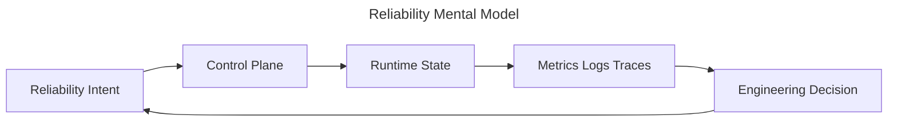
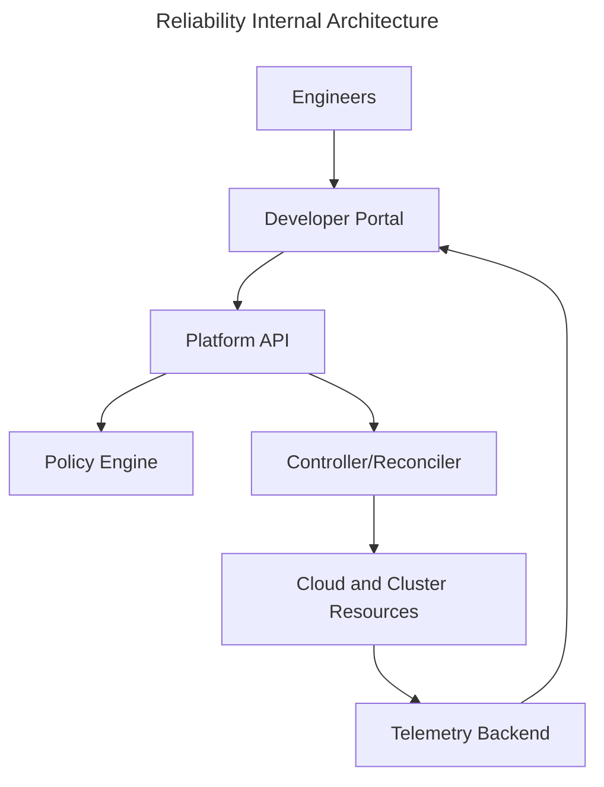

# Reliability

## Executive Summary

Reliability is a core platform engineering capability because it turns individual engineering work into repeatable, observable, and secure production outcomes. Staff engineers treat it as a system of feedback loops rather than a checklist.

!!! tip "Mental model"
    Ask what state exists, who owns it, how it changes, and how operators know when reality diverges from intent.

## Why this exists

Teams need a shared abstraction that reduces cognitive load while preserving escape hatches for production incidents. Without reliability, organizations rely on tribal knowledge, manual runbooks, and heroics.

## Historical evolution

| Era | Practice | Limitation | Modern replacement |
|---|---|---|---|
| Manual | Tickets and shell access | Slow and inconsistent | Self-service workflows |
| Scripted | Bash automation | Hidden state | Declarative APIs |
| Platform | Productized capability | Requires governance | Golden paths |

## Deep technical explanation

The implementation combines APIs, controllers, policy, telemetry, and documentation. The goal is not to hide complexity; it is to put complexity behind stable contracts that can be tested, reviewed, and evolved.

## Internal architecture

??? note "Collapsible operator detail"
    Controllers should be idempotent, observable, and safe to retry. Every mutation should have an owner, audit trail, and rollback plan.

## Production example

A product team ships a customer-facing change through a golden path. The platform validates policy, builds artifacts, deploys with progressive delivery, and exposes dashboards before broad rollout.

## Failure scenarios

| Failure | Symptom | First check | Mitigation |
|---|---|---|---|
| Drift | Desired and live state differ | Reconciler status | Pause, diff, reconcile |
| Capacity | Queues grow | Saturation metrics | Scale or shed load |
| Policy | Deployment blocked | Admission logs | Fix ownership metadata |

## Troubleshooting

1. Confirm user impact and blast radius.
2. Compare desired state, control-plane state, and runtime state.
3. Read recent changes before restarting components.
4. Prefer rollback over speculative fixes.

## Platform Engineer perspective

Design the paved road, defaults, documentation, and telemetry so product teams can move quickly without bypassing controls.

## Staff Engineer perspective

Focus on boundaries, failure domains, organizational ownership, migration paths, and long-term operability.

## Common interview questions

- How do you detect drift?
- Which SLO proves this capability is healthy?
- What should be centralized versus delegated?

## Key takeaways

!!! success "Remember"
    Mature platforms convert repeated operational judgment into productized, observable workflows.

## References

- Kubernetes documentation
- CNCF landscape
- AWS Well-Architected Framework

---

## Knowledge graph

### Prerequisites

- Observability and distributed-systems fundamentals
- [Handbook dependency map](../knowledge-graph/index.md#capability-dependency-graph)

### Related chapters

[Observability](observability.md) · [Kubernetes](kubernetes.md) · [GitOps](gitops.md)

### Next topics

SLIs, SLOs, and error budgets · Capacity planning · Incident learning

### Common confusions

!!! warning "Do not conflate these concepts"
    High availability is an architectural property; reliability is the observed probability of correct service.

### Industry example

A team pauses feature releases when error-budget burn shows that user-facing reliability is at risk.

### Interview questions

- How do you choose an SLI?
- What action should an error budget trigger?

### Further reading

- [sre.google](https://sre.google/sre-book/service-level-objectives/)
- [sre.google](https://sre.google/workbook/error-budget-policy/)
- [Technology relationships and comparisons](../knowledge-graph/index.md#technology-relationships)
