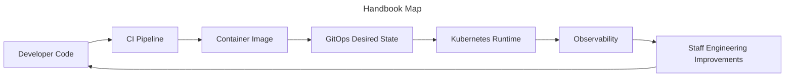

# Platform Engineer Handbook

## Mission

> Build a permanent mental model for shipping, operating, securing, and scaling modern platforms.

## How to use this site

### Read

Follow the Handbook and Engineering Journey from first principles to multi-region operations.

### Practice

Use the Interview Companion and Production Simulator to rehearse realistic staff-level decisions.

### Design

Reuse the Architecture Library diagrams when explaining tradeoffs, failure domains, and scaling paths.
