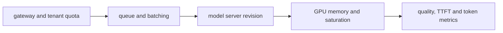
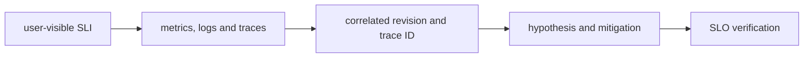

# AI Platforms

## Question

**Design an LLM inference platform on EKS.**

## 30-Second Answer

**Question focus: Design an LLM inference platform on EKS.** Start with availability, latency, security, tenancy, RPO/RTO, and ownership. Build explicit boundaries from **gateway and tenant quota** to **queue and batching**, keep authoritative state at **model server revision**, isolate **GPU memory and saturation** by failure domain, and make **quality, TTFT and token metrics** the promotion and recovery gate. Test dependency loss and rollback before onboarding tenants.

## Strong Senior Answer

**Question focus: Design an LLM inference platform on EKS.** Trace the mechanisms named in this question: gateway and tenant quota → queue and batching → model server revision → GPU memory and saturation → quality, TTFT and token metrics. For each, name its API or state, identity, timeout, retry owner, capacity limit, and evidence. Separate acceptance from convergence and readiness from a correct user result. Preserve the exact revision and audit principal before mitigation; rollback or failover is safe only when state compatibility and traffic ownership are explicit.

**Question-specific test:** Design an LLM inference platform on EKS.

## Staff-Level Expansion

**Question focus: Design an LLM inference platform on EKS.** Name the exact state boundary and accountable owner **model server revision**. Add a pre-production check for the failure you described, an SLO based on **quality, TTFT and token metrics**, and a recovery exercise that removes **queue and batching** or **GPU memory and saturation**. Discuss migration and cost: isolation changes the correlated-failure risk but creates more instances to patch, observe, and support.

**Question-specific test:** Design an LLM inference platform on EKS.

## Diagram or Decision Flow

**Question-specific test:** Design an LLM inference platform on EKS.

## Commands or Evidence

Use the commands and records named in the answer to establish timestamps, revisions, ownership, and the first failed boundary; retain the output with the incident or change record.

**Question-specific test:** Design an LLM inference platform on EKS.

## Likely Follow-ups

* Which observation at **model server revision** would falsify your first hypothesis?
* What remains available when **queue and batching** fails?
* What exact metric at **quality, TTFT and token metrics** proves recovery?

**Question-specific test:** Design an LLM inference platform on EKS.

## Common Weak Answer

Jumping to a restart or product name without tracing gateway and tenant quota to quality, ttft and token metrics, distinguishing state owners, or defining a safe rollback.

**Question-specific test:** Design an LLM inference platform on EKS.

## Experience Prompt

Use an incident or design decision involving the named mechanism: state the constraint, your decision, one timestamped signal, the measurable result, and the guardrail added.

**Question-specific test:** Design an LLM inference platform on EKS.
## Question

**How do you diagnose GPU memory exhaustion with low GPU utilization?**

## 30-Second Answer

**Question focus: How do you diagnose GPU memory exhaustion with low GPU utilization?** Bound impact and compare the last healthy revision, zone, tenant, or node with the failing cohort. Follow evidence in order from **gateway and tenant quota** through **queue and batching**, **model server revision**, and **GPU memory and saturation**; stop at the first divergent handoff. Apply the smallest reversible mitigation, preserve events and timestamps, and confirm recovery with **quality, TTFT and token metrics**.

## Strong Senior Answer

**Question focus: How do you diagnose GPU memory exhaustion with low GPU utilization?** Trace the mechanisms named in this question: gateway and tenant quota → queue and batching → model server revision → GPU memory and saturation → quality, TTFT and token metrics. For each, name its API or state, identity, timeout, retry owner, capacity limit, and evidence. Separate acceptance from convergence and readiness from a correct user result. Preserve the exact revision and audit principal before mitigation; rollback or failover is safe only when state compatibility and traffic ownership are explicit.

**Question-specific test:** How do you diagnose GPU memory exhaustion with low GPU utilization?

## Staff-Level Expansion

**Question focus: How do you diagnose GPU memory exhaustion with low GPU utilization?** Name the exact state boundary and accountable owner **model server revision**. Add a pre-production check for the failure you described, an SLO based on **quality, TTFT and token metrics**, and a recovery exercise that removes **queue and batching** or **GPU memory and saturation**. Discuss migration and cost: isolation changes the correlated-failure risk but creates more instances to patch, observe, and support.

**Question-specific test:** How do you diagnose GPU memory exhaustion with low GPU utilization?

## Diagram or Decision Flow

**Question-specific test:** How do you diagnose GPU memory exhaustion with low GPU utilization?

## Commands or Evidence

Use the commands and records named in the answer to establish timestamps, revisions, ownership, and the first failed boundary; retain the output with the incident or change record.

**Question-specific test:** How do you diagnose GPU memory exhaustion with low GPU utilization?

## Likely Follow-ups

* Which observation at **model server revision** would falsify your first hypothesis?
* What remains available when **queue and batching** fails?
* What exact metric at **quality, TTFT and token metrics** proves recovery?

**Question-specific test:** How do you diagnose GPU memory exhaustion with low GPU utilization?

## Common Weak Answer

Jumping to a restart or product name without tracing gateway and tenant quota to quality, ttft and token metrics, distinguishing state owners, or defining a safe rollback.

**Question-specific test:** How do you diagnose GPU memory exhaustion with low GPU utilization?

## Experience Prompt

Use an incident or design decision involving the named mechanism: state the constraint, your decision, one timestamped signal, the measurable result, and the guardrail added.

**Question-specific test:** How do you diagnose GPU memory exhaustion with low GPU utilization?
## Question

**How do batching and concurrency affect token latency?**

## 30-Second Answer

**Question focus: How do batching and concurrency affect token latency?** Trace the exact mechanism from **user-visible SLI** through **metrics, logs and traces** and **correlated revision and trace ID** to **hypothesis and mitigation**. The important distinction is which component owns desired state versus runtime state. Verify the claimed behavior with **SLO verification**, and state the capacity, security, and availability trade-off rather than treating the mechanism as automatic.

## Strong Senior Answer

**Question focus: How do batching and concurrency affect token latency?** Trace the mechanisms named in this question: user-visible SLI → metrics, logs and traces → correlated revision and trace ID → hypothesis and mitigation → SLO verification. For each, name its API or state, identity, timeout, retry owner, capacity limit, and evidence. Separate acceptance from convergence and readiness from a correct user result. Preserve the exact revision and audit principal before mitigation; rollback or failover is safe only when state compatibility and traffic ownership are explicit.

**Question-specific test:** How do batching and concurrency affect token latency?

## Staff-Level Expansion

**Question focus: How do batching and concurrency affect token latency?** Name the exact state boundary and accountable owner **correlated revision and trace ID**. Add a pre-production check for the failure you described, an SLO based on **SLO verification**, and a recovery exercise that removes **metrics, logs and traces** or **hypothesis and mitigation**. Discuss migration and cost: isolation changes the correlated-failure risk but creates more instances to patch, observe, and support.

**Question-specific test:** How do batching and concurrency affect token latency?

## Diagram or Decision Flow

**Question-specific test:** How do batching and concurrency affect token latency?

## Commands or Evidence

Use the commands and records named in the answer to establish timestamps, revisions, ownership, and the first failed boundary; retain the output with the incident or change record.

**Question-specific test:** How do batching and concurrency affect token latency?

## Likely Follow-ups

* Which observation at **correlated revision and trace ID** would falsify your first hypothesis?
* What remains available when **metrics, logs and traces** fails?
* What exact metric at **SLO verification** proves recovery?

**Question-specific test:** How do batching and concurrency affect token latency?

## Common Weak Answer

Jumping to a restart or product name without tracing user-visible sli to slo verification, distinguishing state owners, or defining a safe rollback.

**Question-specific test:** How do batching and concurrency affect token latency?

## Experience Prompt

Use an incident or design decision involving the named mechanism: state the constraint, your decision, one timestamped signal, the measurable result, and the guardrail added.

**Question-specific test:** How do batching and concurrency affect token latency?
