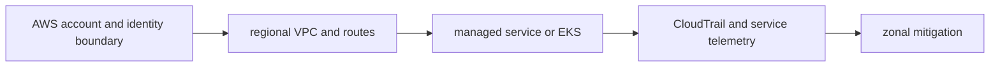
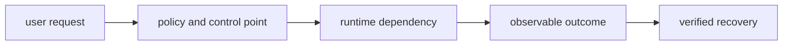

# AWS

## Question

**How would you upgrade EKS without creating a major outage?**

## 30-Second Answer

**Question focus: How would you upgrade EKS without creating a major outage?** Trace the exact mechanism from **AWS account and identity boundary** through **regional VPC and routes** and **managed service or EKS** to **CloudTrail and service telemetry**. The important distinction is which component owns desired state versus runtime state. Verify the claimed behavior with **zonal mitigation**, and state the capacity, security, and availability trade-off rather than treating the mechanism as automatic.

## Strong Senior Answer

**Question focus: How would you upgrade EKS without creating a major outage?** Trace the mechanisms named in this question: AWS account and identity boundary → regional VPC and routes → managed service or EKS → CloudTrail and service telemetry → zonal mitigation. For each, name its API or state, identity, timeout, retry owner, capacity limit, and evidence. Separate acceptance from convergence and readiness from a correct user result. Preserve the exact revision and audit principal before mitigation; rollback or failover is safe only when state compatibility and traffic ownership are explicit.

**Question-specific test:** How would you upgrade EKS without creating a major outage?

## Staff-Level Expansion

**Question focus: How would you upgrade EKS without creating a major outage?** Name the exact state boundary and accountable owner **managed service or EKS**. Add a pre-production check for the failure you described, an SLO based on **zonal mitigation**, and a recovery exercise that removes **regional VPC and routes** or **CloudTrail and service telemetry**. Discuss migration and cost: isolation changes the correlated-failure risk but creates more instances to patch, observe, and support.

**Question-specific test:** How would you upgrade EKS without creating a major outage?

## Diagram or Decision Flow

**Question-specific test:** How would you upgrade EKS without creating a major outage?

## Commands or Evidence

Use the commands and records named in the answer to establish timestamps, revisions, ownership, and the first failed boundary; retain the output with the incident or change record.

**Question-specific test:** How would you upgrade EKS without creating a major outage?

## Likely Follow-ups

* Which observation at **managed service or EKS** would falsify your first hypothesis?
* What remains available when **regional VPC and routes** fails?
* What exact metric at **zonal mitigation** proves recovery?

**Question-specific test:** How would you upgrade EKS without creating a major outage?

## Common Weak Answer

Jumping to a restart or product name without tracing aws account and identity boundary to zonal mitigation, distinguishing state owners, or defining a safe rollback.

**Question-specific test:** How would you upgrade EKS without creating a major outage?

## Experience Prompt

Use an incident or design decision involving the named mechanism: state the constraint, your decision, one timestamped signal, the measurable result, and the guardrail added.

**Question-specific test:** How would you upgrade EKS without creating a major outage?
## Question

**Design a multi-account landing zone for regulated workloads.**

## 30-Second Answer

**Question focus: Design a multi-account landing zone for regulated workloads.** Start with availability, latency, security, tenancy, RPO/RTO, and ownership. Build explicit boundaries from **user request** to **policy and control point**, keep authoritative state at **runtime dependency**, isolate **observable outcome** by failure domain, and make **verified recovery** the promotion and recovery gate. Test dependency loss and rollback before onboarding tenants.

## Strong Senior Answer

**Question focus: Design a multi-account landing zone for regulated workloads.** Trace the mechanisms named in this question: user request → policy and control point → runtime dependency → observable outcome → verified recovery. For each, name its API or state, identity, timeout, retry owner, capacity limit, and evidence. Separate acceptance from convergence and readiness from a correct user result. Preserve the exact revision and audit principal before mitigation; rollback or failover is safe only when state compatibility and traffic ownership are explicit.

**Question-specific test:** Design a multi-account landing zone for regulated workloads.

## Staff-Level Expansion

**Question focus: Design a multi-account landing zone for regulated workloads.** Name the exact state boundary and accountable owner **runtime dependency**. Add a pre-production check for the failure you described, an SLO based on **verified recovery**, and a recovery exercise that removes **policy and control point** or **observable outcome**. Discuss migration and cost: isolation changes the correlated-failure risk but creates more instances to patch, observe, and support.

**Question-specific test:** Design a multi-account landing zone for regulated workloads.

## Diagram or Decision Flow

**Question-specific test:** Design a multi-account landing zone for regulated workloads.

## Commands or Evidence

Use the commands and records named in the answer to establish timestamps, revisions, ownership, and the first failed boundary; retain the output with the incident or change record.

**Question-specific test:** Design a multi-account landing zone for regulated workloads.

## Likely Follow-ups

* Which observation at **runtime dependency** would falsify your first hypothesis?
* What remains available when **policy and control point** fails?
* What exact metric at **verified recovery** proves recovery?

**Question-specific test:** Design a multi-account landing zone for regulated workloads.

## Common Weak Answer

Jumping to a restart or product name without tracing user request to verified recovery, distinguishing state owners, or defining a safe rollback.

**Question-specific test:** Design a multi-account landing zone for regulated workloads.

## Experience Prompt

Use an incident or design decision involving the named mechanism: state the constraint, your decision, one timestamped signal, the measurable result, and the guardrail added.

**Question-specific test:** Design a multi-account landing zone for regulated workloads.
## Question

**How does a packet travel from an ALB to an EKS Pod?**

## 30-Second Answer

**Question focus: How does a packet travel from an ALB to an EKS Pod?** Trace the exact mechanism from **AWS account and identity boundary** through **regional VPC and routes** and **managed service or EKS** to **CloudTrail and service telemetry**. The important distinction is which component owns desired state versus runtime state. Verify the claimed behavior with **zonal mitigation**, and state the capacity, security, and availability trade-off rather than treating the mechanism as automatic.

## Strong Senior Answer

**Question focus: How does a packet travel from an ALB to an EKS Pod?** Trace the mechanisms named in this question: AWS account and identity boundary → regional VPC and routes → managed service or EKS → CloudTrail and service telemetry → zonal mitigation. For each, name its API or state, identity, timeout, retry owner, capacity limit, and evidence. Separate acceptance from convergence and readiness from a correct user result. Preserve the exact revision and audit principal before mitigation; rollback or failover is safe only when state compatibility and traffic ownership are explicit.

**Question-specific test:** How does a packet travel from an ALB to an EKS Pod?

## Staff-Level Expansion

**Question focus: How does a packet travel from an ALB to an EKS Pod?** Name the exact state boundary and accountable owner **managed service or EKS**. Add a pre-production check for the failure you described, an SLO based on **zonal mitigation**, and a recovery exercise that removes **regional VPC and routes** or **CloudTrail and service telemetry**. Discuss migration and cost: isolation changes the correlated-failure risk but creates more instances to patch, observe, and support.

**Question-specific test:** How does a packet travel from an ALB to an EKS Pod?

## Diagram or Decision Flow

**Question-specific test:** How does a packet travel from an ALB to an EKS Pod?

## Commands or Evidence

Use the commands and records named in the answer to establish timestamps, revisions, ownership, and the first failed boundary; retain the output with the incident or change record.

**Question-specific test:** How does a packet travel from an ALB to an EKS Pod?

## Likely Follow-ups

* Which observation at **managed service or EKS** would falsify your first hypothesis?
* What remains available when **regional VPC and routes** fails?
* What exact metric at **zonal mitigation** proves recovery?

**Question-specific test:** How does a packet travel from an ALB to an EKS Pod?

## Common Weak Answer

Jumping to a restart or product name without tracing aws account and identity boundary to zonal mitigation, distinguishing state owners, or defining a safe rollback.

**Question-specific test:** How does a packet travel from an ALB to an EKS Pod?

## Experience Prompt

Use an incident or design decision involving the named mechanism: state the constraint, your decision, one timestamped signal, the measurable result, and the guardrail added.

**Question-specific test:** How does a packet travel from an ALB to an EKS Pod?
