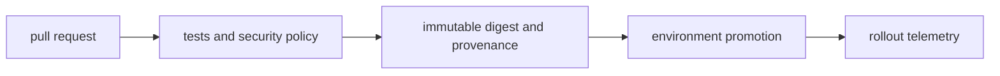
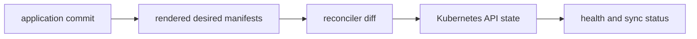

# CI/CD and GitOps

## Question

**How do you promote one immutable artifact across environments?**

## 30-Second Answer

**Question focus: How do you promote one immutable artifact across environments?** Trace the exact mechanism from **pull request** through **tests and security policy** and **immutable digest and provenance** to **environment promotion**. The important distinction is which component owns desired state versus runtime state. Verify the claimed behavior with **rollout telemetry**, and state the capacity, security, and availability trade-off rather than treating the mechanism as automatic.

## Strong Senior Answer

**Question focus: How do you promote one immutable artifact across environments?** Trace the mechanisms named in this question: pull request → tests and security policy → immutable digest and provenance → environment promotion → rollout telemetry. For each, name its API or state, identity, timeout, retry owner, capacity limit, and evidence. Separate acceptance from convergence and readiness from a correct user result. Preserve the exact revision and audit principal before mitigation; rollback or failover is safe only when state compatibility and traffic ownership are explicit.

**Question-specific test:** How do you promote one immutable artifact across environments?

## Staff-Level Expansion

**Question focus: How do you promote one immutable artifact across environments?** Name the exact state boundary and accountable owner **immutable digest and provenance**. Add a pre-production check for the failure you described, an SLO based on **rollout telemetry**, and a recovery exercise that removes **tests and security policy** or **environment promotion**. Discuss migration and cost: isolation changes the correlated-failure risk but creates more instances to patch, observe, and support.

**Question-specific test:** How do you promote one immutable artifact across environments?

## Diagram or Decision Flow

**Question-specific test:** How do you promote one immutable artifact across environments?

## Commands or Evidence

Use the commands and records named in the answer to establish timestamps, revisions, ownership, and the first failed boundary; retain the output with the incident or change record.

**Question-specific test:** How do you promote one immutable artifact across environments?

## Likely Follow-ups

* Which observation at **immutable digest and provenance** would falsify your first hypothesis?
* What remains available when **tests and security policy** fails?
* What exact metric at **rollout telemetry** proves recovery?

**Question-specific test:** How do you promote one immutable artifact across environments?

## Common Weak Answer

Jumping to a restart or product name without tracing pull request to rollout telemetry, distinguishing state owners, or defining a safe rollback.

**Question-specific test:** How do you promote one immutable artifact across environments?

## Experience Prompt

Use an incident or design decision involving the named mechanism: state the constraint, your decision, one timestamped signal, the measurable result, and the guardrail added.

**Question-specific test:** How do you promote one immutable artifact across environments?
## Question

**Argo CD is OutOfSync but the application works; what do you inspect?**

## 30-Second Answer

**Question focus: Argo CD is OutOfSync but the application works; what do you inspect?** Bound impact and compare the last healthy revision, zone, tenant, or node with the failing cohort. Follow evidence in order from **application commit** through **rendered desired manifests**, **reconciler diff**, and **Kubernetes API state**; stop at the first divergent handoff. Apply the smallest reversible mitigation, preserve events and timestamps, and confirm recovery with **health and sync status**.

## Strong Senior Answer

**Question focus: Argo CD is OutOfSync but the application works; what do you inspect?** Trace the mechanisms named in this question: application commit → rendered desired manifests → reconciler diff → Kubernetes API state → health and sync status. For each, name its API or state, identity, timeout, retry owner, capacity limit, and evidence. Separate acceptance from convergence and readiness from a correct user result. Preserve the exact revision and audit principal before mitigation; rollback or failover is safe only when state compatibility and traffic ownership are explicit.

**Question-specific test:** Argo CD is OutOfSync but the application works; what do you inspect?

## Staff-Level Expansion

**Question focus: Argo CD is OutOfSync but the application works; what do you inspect?** Name the exact state boundary and accountable owner **reconciler diff**. Add a pre-production check for the failure you described, an SLO based on **health and sync status**, and a recovery exercise that removes **rendered desired manifests** or **Kubernetes API state**. Discuss migration and cost: isolation changes the correlated-failure risk but creates more instances to patch, observe, and support.

**Question-specific test:** Argo CD is OutOfSync but the application works; what do you inspect?

## Diagram or Decision Flow

**Question-specific test:** Argo CD is OutOfSync but the application works; what do you inspect?

## Commands or Evidence

Use the commands and records named in the answer to establish timestamps, revisions, ownership, and the first failed boundary; retain the output with the incident or change record.

**Question-specific test:** Argo CD is OutOfSync but the application works; what do you inspect?

## Likely Follow-ups

* Which observation at **reconciler diff** would falsify your first hypothesis?
* What remains available when **rendered desired manifests** fails?
* What exact metric at **health and sync status** proves recovery?

**Question-specific test:** Argo CD is OutOfSync but the application works; what do you inspect?

## Common Weak Answer

Jumping to a restart or product name without tracing application commit to health and sync status, distinguishing state owners, or defining a safe rollback.

**Question-specific test:** Argo CD is OutOfSync but the application works; what do you inspect?

## Experience Prompt

Use an incident or design decision involving the named mechanism: state the constraint, your decision, one timestamped signal, the measurable result, and the guardrail added.

**Question-specific test:** Argo CD is OutOfSync but the application works; what do you inspect?
## Question

**How would you prevent an untrusted pull request from stealing CI credentials?**

## 30-Second Answer

**Question focus: How would you prevent an untrusted pull request from stealing CI credentials?** Trace the exact mechanism from **pull request** through **tests and security policy** and **immutable digest and provenance** to **environment promotion**. The important distinction is which component owns desired state versus runtime state. Verify the claimed behavior with **rollout telemetry**, and state the capacity, security, and availability trade-off rather than treating the mechanism as automatic.

## Strong Senior Answer

**Question focus: How would you prevent an untrusted pull request from stealing CI credentials?** Trace the mechanisms named in this question: pull request → tests and security policy → immutable digest and provenance → environment promotion → rollout telemetry. For each, name its API or state, identity, timeout, retry owner, capacity limit, and evidence. Separate acceptance from convergence and readiness from a correct user result. Preserve the exact revision and audit principal before mitigation; rollback or failover is safe only when state compatibility and traffic ownership are explicit.

**Question-specific test:** How would you prevent an untrusted pull request from stealing CI credentials?

## Staff-Level Expansion

**Question focus: How would you prevent an untrusted pull request from stealing CI credentials?** Name the exact state boundary and accountable owner **immutable digest and provenance**. Add a pre-production check for the failure you described, an SLO based on **rollout telemetry**, and a recovery exercise that removes **tests and security policy** or **environment promotion**. Discuss migration and cost: isolation changes the correlated-failure risk but creates more instances to patch, observe, and support.

**Question-specific test:** How would you prevent an untrusted pull request from stealing CI credentials?

## Diagram or Decision Flow

**Question-specific test:** How would you prevent an untrusted pull request from stealing CI credentials?

## Commands or Evidence

Use the commands and records named in the answer to establish timestamps, revisions, ownership, and the first failed boundary; retain the output with the incident or change record.

**Question-specific test:** How would you prevent an untrusted pull request from stealing CI credentials?

## Likely Follow-ups

* Which observation at **immutable digest and provenance** would falsify your first hypothesis?
* What remains available when **tests and security policy** fails?
* What exact metric at **rollout telemetry** proves recovery?

**Question-specific test:** How would you prevent an untrusted pull request from stealing CI credentials?

## Common Weak Answer

Jumping to a restart or product name without tracing pull request to rollout telemetry, distinguishing state owners, or defining a safe rollback.

**Question-specific test:** How would you prevent an untrusted pull request from stealing CI credentials?

## Experience Prompt

Use an incident or design decision involving the named mechanism: state the constraint, your decision, one timestamped signal, the measurable result, and the guardrail added.

**Question-specific test:** How would you prevent an untrusted pull request from stealing CI credentials?
