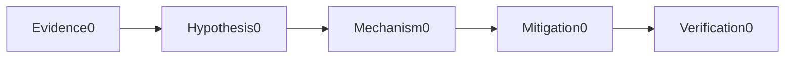
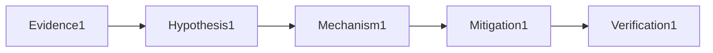

# Databases

## Question

**How do you respond to PostgreSQL connection exhaustion?**

## 30-Second Answer

Stop new connection amplification, inspect pool and pg_stat_activity, distinguish idle leakage from slow queries or locks, and cancel only identified work.

## Strong Senior Answer

Start with a timestamped failing example and compare the mechanism named in the question against a healthy peer. Stop new connection amplification, inspect pool and pg_stat_activity, distinguish idle leakage from slow queries or locks, and cancel only identified work. Preserve evidence before mitigation and verify the user-visible outcome afterward.

**Question-specific test:** How do you respond to PostgreSQL connection exhaustion?

## Staff-Level Expansion

Define ownership, a measurable failure threshold and a reversible response for this mechanism. Prevent recurrence by testing the exact failure rather than adding an unrelated capacity control.

**Question-specific test:** How do you respond to PostgreSQL connection exhaustion?

## Diagram or Decision Flow

**Question-specific test:** How do you respond to PostgreSQL connection exhaustion?

## Commands or Evidence

Capture native status, timestamps, configuration revision, saturation and the user-visible probe appropriate to **How do you respond to PostgreSQL connection exhaustion?**

**Question-specific test:** How do you respond to PostgreSQL connection exhaustion?

## Likely Follow-ups

* What evidence would falsify your first hypothesis?
* When would you stop and roll back?

**Question-specific test:** How do you respond to PostgreSQL connection exhaustion?

## Common Weak Answer

Naming a tool without explaining the relevant state, failure boundary, safety constraint or proof of recovery.

**Question-specific test:** How do you respond to PostgreSQL connection exhaustion?

## Experience Prompt

Give one example involving how do you respond to postgresql connection exhaustion? Include impact, evidence, decision and lasting improvement.

**Question-specific test:** How do you respond to PostgreSQL connection exhaustion?
## Question

**How do you prove PostgreSQL backups meet RPO and RTO?**

## 30-Second Answer

Restore a base backup plus archived WAL to an isolated environment, validate application data and record recoverable time and total duration.

## Strong Senior Answer

Start with a timestamped failing example and compare the mechanism named in the question against a healthy peer. Restore a base backup plus archived WAL to an isolated environment, validate application data and record recoverable time and total duration. Preserve evidence before mitigation and verify the user-visible outcome afterward.

**Question-specific test:** How do you prove PostgreSQL backups meet RPO and RTO?

## Staff-Level Expansion

Define ownership, a measurable failure threshold and a reversible response for this mechanism. Prevent recurrence by testing the exact failure rather than adding an unrelated capacity control.

**Question-specific test:** How do you prove PostgreSQL backups meet RPO and RTO?

## Diagram or Decision Flow

**Question-specific test:** How do you prove PostgreSQL backups meet RPO and RTO?

## Commands or Evidence

Capture native status, timestamps, configuration revision, saturation and the user-visible probe appropriate to **How do you prove PostgreSQL backups meet RPO and RTO?**

**Question-specific test:** How do you prove PostgreSQL backups meet RPO and RTO?

## Likely Follow-ups

* What evidence would falsify your first hypothesis?
* When would you stop and roll back?

**Question-specific test:** How do you prove PostgreSQL backups meet RPO and RTO?

## Common Weak Answer

Naming a tool without explaining the relevant state, failure boundary, safety constraint or proof of recovery.

**Question-specific test:** How do you prove PostgreSQL backups meet RPO and RTO?

## Experience Prompt

Give one example involving how do you prove postgresql backups meet rpo and rto? Include impact, evidence, decision and lasting improvement.

**Question-specific test:** How do you prove PostgreSQL backups meet RPO and RTO?
## Question

**What Redis persistence and HA trade-offs matter?**

## 30-Second Answer

RDB and AOF choose recovery time/write-loss trade-offs; asynchronous replication, Sentinel and Cluster improve availability but can still lose acknowledged data.

## Strong Senior Answer

Start with a timestamped failing example and compare the mechanism named in the question against a healthy peer. RDB and AOF choose recovery time/write-loss trade-offs; asynchronous replication, Sentinel and Cluster improve availability but can still lose acknowledged data. Preserve evidence before mitigation and verify the user-visible outcome afterward.

**Question-specific test:** What Redis persistence and HA trade-offs matter?

## Staff-Level Expansion

Define ownership, a measurable failure threshold and a reversible response for this mechanism. Prevent recurrence by testing the exact failure rather than adding an unrelated capacity control.

**Question-specific test:** What Redis persistence and HA trade-offs matter?

## Diagram or Decision Flow

**Question-specific test:** What Redis persistence and HA trade-offs matter?

## Commands or Evidence

Capture native status, timestamps, configuration revision, saturation and the user-visible probe appropriate to **What Redis persistence and HA trade-offs matter?**

**Question-specific test:** What Redis persistence and HA trade-offs matter?

## Likely Follow-ups

* What evidence would falsify your first hypothesis?
* When would you stop and roll back?

**Question-specific test:** What Redis persistence and HA trade-offs matter?

## Common Weak Answer

Naming a tool without explaining the relevant state, failure boundary, safety constraint or proof of recovery.

**Question-specific test:** What Redis persistence and HA trade-offs matter?

## Experience Prompt

Give one example involving what redis persistence and ha trade-offs matter? Include impact, evidence, decision and lasting improvement.

**Question-specific test:** What Redis persistence and HA trade-offs matter?
