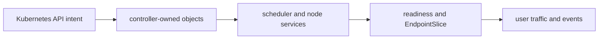
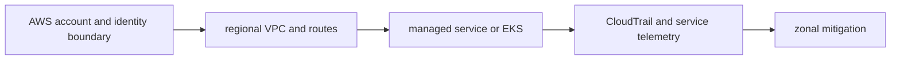
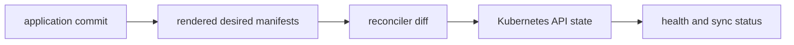
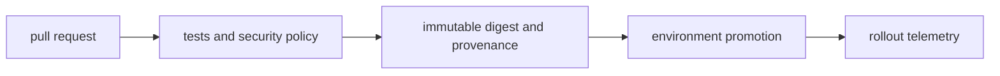

# Staff Platform Engineer Interview Companion

These 97 prompts have direct, mechanism-specific answers. Use the diagrams to rehearse component handoffs; adapt assumptions to the interviewer’s constraints.

# Kubernetes

## Question

**Walk me through what happens after a Deployment is submitted.**

## 30-Second Answer

**Question focus: Walk me through what happens after a Deployment is submitted.** The API server authenticates, authorizes, admits, and persists the Deployment in etcd. The Deployment controller creates a ReplicaSet; the ReplicaSet controller creates Pods. The scheduler filters and scores nodes and writes each binding. The selected kubelet asks CRI to create the sandbox and container and CNI to attach networking. Only after readiness succeeds does the EndpointSlice controller publish the Pod address for Service traffic.

## Strong Senior Answer

**Question focus: Walk me through what happens after a Deployment is submitted.** Walk the concrete handoffs: Kubernetes API intent → controller-owned objects → scheduler and node services → readiness and EndpointSlice → user traffic and events. For each, name its API or state, identity, timeout, retry owner, capacity limit, and evidence. Separate acceptance from convergence and readiness from a correct user result. Preserve the exact revision and audit principal before mitigation; rollback or failover is safe only when state compatibility and traffic ownership are explicit.

## Staff-Level Expansion

**Question focus: Walk me through what happens after a Deployment is submitted.** Define the failure domain and the team that owns **scheduler and node services**. Add a pre-production check for the failure you described, an SLO based on **user traffic and events**, and a recovery exercise that removes **controller-owned objects** or **readiness and EndpointSlice**. Discuss migration and cost: stronger isolation reduces correlated failure but creates more instances to patch, observe, and support.

## Architecture Diagram



## Likely Follow-ups

* Which observation at **scheduler and node services** would falsify your first hypothesis?
* What remains available when **controller-owned objects** fails?
* What exact metric at **user traffic and events** proves recovery?

## Common Weak Answer

Jumping to a restart or product name without tracing kubernetes api intent to user traffic and events, distinguishing state owners, or defining a safe rollback.

## Experience Prompt

Give a real example with this mechanism: state the constraint, your decision, one timestamped signal, the measurable result, and the guardrail added.

## Question

**How would you troubleshoot Pods stuck in Pending?**

## 30-Second Answer

**Question focus: How would you troubleshoot Pods stuck in Pending?** Start with `kubectl describe pod` and scheduler events: they state which filter rejected every node. Compare Pod requests with allocatable CPU, memory, ephemeral storage, and GPU; then check taints/tolerations, node or Pod affinity, topology spread, and unbound PVC topology. Check ResourceQuota and LimitRange admission, node-group maximum and launch failures, cloud vCPU/GPU quotas, and subnet IP availability. Add capacity only after identifying the unsatisfied constraint.

## Strong Senior Answer

**Question focus: How would you troubleshoot Pods stuck in Pending?** Walk the concrete handoffs: Kubernetes API intent → controller-owned objects → scheduler and node services → readiness and EndpointSlice → user traffic and events. For each, name its API or state, identity, timeout, retry owner, capacity limit, and evidence. Separate acceptance from convergence and readiness from a correct user result. Preserve the exact revision and audit principal before mitigation; rollback or failover is safe only when state compatibility and traffic ownership are explicit.

## Staff-Level Expansion

**Question focus: How would you troubleshoot Pods stuck in Pending?** Define the failure domain and the team that owns **scheduler and node services**. Add a pre-production check for the failure you described, an SLO based on **user traffic and events**, and a recovery exercise that removes **controller-owned objects** or **readiness and EndpointSlice**. Discuss migration and cost: stronger isolation reduces correlated failure but creates more instances to patch, observe, and support.

## Architecture Diagram


## Likely Follow-ups

* Which observation at **scheduler and node services** would falsify your first hypothesis?
* What remains available when **controller-owned objects** fails?
* What exact metric at **user traffic and events** proves recovery?

## Common Weak Answer

Jumping to a restart or product name without tracing kubernetes api intent to user traffic and events, distinguishing state owners, or defining a safe rollback.

## Experience Prompt

Give a real example with this mechanism: state the constraint, your decision, one timestamped signal, the measurable result, and the guardrail added.

## Question

**Why can a Pod be Running but absent from Service endpoints?**

## 30-Second Answer

**Question focus: Why can a Pod be Running but absent from Service endpoints?** Running describes container process state, not traffic eligibility. Verify the Pod Ready condition, readiness gates, and whether it is terminating. Compare Service selectors with Pod labels and inspect EndpointSlices. Confirm the Service port and named `targetPort` resolve to a declared container port. A failed readiness probe, selector mismatch, false readiness gate, terminating endpoint, or misspelled named port correctly keeps or makes the address unusable.

## Strong Senior Answer

**Question focus: Why can a Pod be Running but absent from Service endpoints?** Walk the concrete handoffs: Kubernetes API intent → controller-owned objects → scheduler and node services → readiness and EndpointSlice → user traffic and events. For each, name its API or state, identity, timeout, retry owner, capacity limit, and evidence. Separate acceptance from convergence and readiness from a correct user result. Preserve the exact revision and audit principal before mitigation; rollback or failover is safe only when state compatibility and traffic ownership are explicit.

## Staff-Level Expansion

**Question focus: Why can a Pod be Running but absent from Service endpoints?** Define the failure domain and the team that owns **scheduler and node services**. Add a pre-production check for the failure you described, an SLO based on **user traffic and events**, and a recovery exercise that removes **controller-owned objects** or **readiness and EndpointSlice**. Discuss migration and cost: stronger isolation reduces correlated failure but creates more instances to patch, observe, and support.

## Architecture Diagram


## Likely Follow-ups

* Which observation at **scheduler and node services** would falsify your first hypothesis?
* What remains available when **controller-owned objects** fails?
* What exact metric at **user traffic and events** proves recovery?

## Common Weak Answer

Jumping to a restart or product name without tracing kubernetes api intent to user traffic and events, distinguishing state owners, or defining a safe rollback.

## Experience Prompt

Give a real example with this mechanism: state the constraint, your decision, one timestamped signal, the measurable result, and the guardrail added.

## Question

**How do informers and work queues make controllers scalable?**

## 30-Second Answer

**Question focus: How do informers and work queues make controllers scalable?** Trace the exact mechanism from **Kubernetes API intent** through **controller-owned objects** and **scheduler and node services** to **readiness and EndpointSlice**. The important distinction is which component owns desired state versus runtime state. Verify the claimed behavior with **user traffic and events**, and state the capacity, security, and availability trade-off rather than treating the mechanism as automatic.

## Strong Senior Answer

**Question focus: How do informers and work queues make controllers scalable?** Walk the concrete handoffs: Kubernetes API intent → controller-owned objects → scheduler and node services → readiness and EndpointSlice → user traffic and events. For each, name its API or state, identity, timeout, retry owner, capacity limit, and evidence. Separate acceptance from convergence and readiness from a correct user result. Preserve the exact revision and audit principal before mitigation; rollback or failover is safe only when state compatibility and traffic ownership are explicit.

## Staff-Level Expansion

**Question focus: How do informers and work queues make controllers scalable?** Define the failure domain and the team that owns **scheduler and node services**. Add a pre-production check for the failure you described, an SLO based on **user traffic and events**, and a recovery exercise that removes **controller-owned objects** or **readiness and EndpointSlice**. Discuss migration and cost: stronger isolation reduces correlated failure but creates more instances to patch, observe, and support.

## Architecture Diagram


## Likely Follow-ups

* Which observation at **scheduler and node services** would falsify your first hypothesis?
* What remains available when **controller-owned objects** fails?
* What exact metric at **user traffic and events** proves recovery?

## Common Weak Answer

Jumping to a restart or product name without tracing kubernetes api intent to user traffic and events, distinguishing state owners, or defining a safe rollback.

## Experience Prompt

Give a real example with this mechanism: state the constraint, your decision, one timestamped signal, the measurable result, and the guardrail added.

## Question

**How would you design a safe EKS control-plane and node upgrade?**

## 30-Second Answer

**Question focus: How would you design a safe EKS control-plane and node upgrade?** Start with availability, latency, security, tenancy, RPO/RTO, and ownership. Build explicit boundaries from **AWS account and identity boundary** to **regional VPC and routes**, keep authoritative state at **managed service or EKS**, isolate **CloudTrail and service telemetry** by failure domain, and make **zonal mitigation** the promotion and recovery gate. Test dependency loss and rollback before onboarding tenants.

## Strong Senior Answer

**Question focus: How would you design a safe EKS control-plane and node upgrade?** Walk the concrete handoffs: AWS account and identity boundary → regional VPC and routes → managed service or EKS → CloudTrail and service telemetry → zonal mitigation. For each, name its API or state, identity, timeout, retry owner, capacity limit, and evidence. Separate acceptance from convergence and readiness from a correct user result. Preserve the exact revision and audit principal before mitigation; rollback or failover is safe only when state compatibility and traffic ownership are explicit.

## Staff-Level Expansion

**Question focus: How would you design a safe EKS control-plane and node upgrade?** Define the failure domain and the team that owns **managed service or EKS**. Add a pre-production check for the failure you described, an SLO based on **zonal mitigation**, and a recovery exercise that removes **regional VPC and routes** or **CloudTrail and service telemetry**. Discuss migration and cost: stronger isolation reduces correlated failure but creates more instances to patch, observe, and support.

## Architecture Diagram



## Likely Follow-ups

* Which observation at **managed service or EKS** would falsify your first hypothesis?
* What remains available when **regional VPC and routes** fails?
* What exact metric at **zonal mitigation** proves recovery?

## Common Weak Answer

Jumping to a restart or product name without tracing aws account and identity boundary to zonal mitigation, distinguishing state owners, or defining a safe rollback.

## Experience Prompt

Give a real example with this mechanism: state the constraint, your decision, one timestamped signal, the measurable result, and the guardrail added.

## Question

**When do taints, affinity, and topology spread solve different problems?**

## 30-Second Answer

**Question focus: When do taints, affinity, and topology spread solve different problems?** Use the mechanism only when the constraint at **Kubernetes API intent** cannot be met more simply. Evaluate operational ownership of **scheduler and node services**, its blast radius and recovery behavior, then prove the decision using **user traffic and events**. Avoid it when its extra control surface is harder to operate than the risk it removes.

## Strong Senior Answer

**Question focus: When do taints, affinity, and topology spread solve different problems?** Walk the concrete handoffs: Kubernetes API intent → controller-owned objects → scheduler and node services → readiness and EndpointSlice → user traffic and events. For each, name its API or state, identity, timeout, retry owner, capacity limit, and evidence. Separate acceptance from convergence and readiness from a correct user result. Preserve the exact revision and audit principal before mitigation; rollback or failover is safe only when state compatibility and traffic ownership are explicit.

## Staff-Level Expansion

**Question focus: When do taints, affinity, and topology spread solve different problems?** Define the failure domain and the team that owns **scheduler and node services**. Add a pre-production check for the failure you described, an SLO based on **user traffic and events**, and a recovery exercise that removes **controller-owned objects** or **readiness and EndpointSlice**. Discuss migration and cost: stronger isolation reduces correlated failure but creates more instances to patch, observe, and support.

## Architecture Diagram


## Likely Follow-ups

* Which observation at **scheduler and node services** would falsify your first hypothesis?
* What remains available when **controller-owned objects** fails?
* What exact metric at **user traffic and events** proves recovery?

## Common Weak Answer

Jumping to a restart or product name without tracing kubernetes api intent to user traffic and events, distinguishing state owners, or defining a safe rollback.

## Experience Prompt

Give a real example with this mechanism: state the constraint, your decision, one timestamped signal, the measurable result, and the guardrail added.

## Question

**How do requests, limits, HPA, and node autoscaling interact?**

## 30-Second Answer

**Question focus: How do requests, limits, HPA, and node autoscaling interact?** Trace the exact mechanism from **Kubernetes API intent** through **controller-owned objects** and **scheduler and node services** to **readiness and EndpointSlice**. The important distinction is which component owns desired state versus runtime state. Verify the claimed behavior with **user traffic and events**, and state the capacity, security, and availability trade-off rather than treating the mechanism as automatic.

## Strong Senior Answer

**Question focus: How do requests, limits, HPA, and node autoscaling interact?** Walk the concrete handoffs: Kubernetes API intent → controller-owned objects → scheduler and node services → readiness and EndpointSlice → user traffic and events. For each, name its API or state, identity, timeout, retry owner, capacity limit, and evidence. Separate acceptance from convergence and readiness from a correct user result. Preserve the exact revision and audit principal before mitigation; rollback or failover is safe only when state compatibility and traffic ownership are explicit.

## Staff-Level Expansion

**Question focus: How do requests, limits, HPA, and node autoscaling interact?** Define the failure domain and the team that owns **scheduler and node services**. Add a pre-production check for the failure you described, an SLO based on **user traffic and events**, and a recovery exercise that removes **controller-owned objects** or **readiness and EndpointSlice**. Discuss migration and cost: stronger isolation reduces correlated failure but creates more instances to patch, observe, and support.

## Architecture Diagram


## Likely Follow-ups

* Which observation at **scheduler and node services** would falsify your first hypothesis?
* What remains available when **controller-owned objects** fails?
* What exact metric at **user traffic and events** proves recovery?

## Common Weak Answer

Jumping to a restart or product name without tracing kubernetes api intent to user traffic and events, distinguishing state owners, or defining a safe rollback.

## Experience Prompt

Give a real example with this mechanism: state the constraint, your decision, one timestamped signal, the measurable result, and the guardrail added.

## Question

**What happens from a Service virtual IP to a Pod?**

## 30-Second Answer

**Question focus: What happens from a Service virtual IP to a Pod?** Trace the exact mechanism from **Kubernetes API intent** through **controller-owned objects** and **scheduler and node services** to **readiness and EndpointSlice**. The important distinction is which component owns desired state versus runtime state. Verify the claimed behavior with **user traffic and events**, and state the capacity, security, and availability trade-off rather than treating the mechanism as automatic.

## Strong Senior Answer

**Question focus: What happens from a Service virtual IP to a Pod?** Walk the concrete handoffs: Kubernetes API intent → controller-owned objects → scheduler and node services → readiness and EndpointSlice → user traffic and events. For each, name its API or state, identity, timeout, retry owner, capacity limit, and evidence. Separate acceptance from convergence and readiness from a correct user result. Preserve the exact revision and audit principal before mitigation; rollback or failover is safe only when state compatibility and traffic ownership are explicit.

## Staff-Level Expansion

**Question focus: What happens from a Service virtual IP to a Pod?** Define the failure domain and the team that owns **scheduler and node services**. Add a pre-production check for the failure you described, an SLO based on **user traffic and events**, and a recovery exercise that removes **controller-owned objects** or **readiness and EndpointSlice**. Discuss migration and cost: stronger isolation reduces correlated failure but creates more instances to patch, observe, and support.

## Architecture Diagram


## Likely Follow-ups

* Which observation at **scheduler and node services** would falsify your first hypothesis?
* What remains available when **controller-owned objects** fails?
* What exact metric at **user traffic and events** proves recovery?

## Common Weak Answer

Jumping to a restart or product name without tracing kubernetes api intent to user traffic and events, distinguishing state owners, or defining a safe rollback.

## Experience Prompt

Give a real example with this mechanism: state the constraint, your decision, one timestamped signal, the measurable result, and the guardrail added.

## Question

**How would you diagnose intermittent cluster DNS failures?**

## 30-Second Answer

**Question focus: How would you diagnose intermittent cluster DNS failures?** Bound impact and compare the last healthy revision, zone, tenant, or node with the failing cohort. Follow evidence in order from **Kubernetes API intent** through **controller-owned objects**, **scheduler and node services**, and **readiness and EndpointSlice**; stop at the first divergent handoff. Apply the smallest reversible mitigation, preserve events and timestamps, and confirm recovery with **user traffic and events**.

## Strong Senior Answer

**Question focus: How would you diagnose intermittent cluster DNS failures?** Walk the concrete handoffs: Kubernetes API intent → controller-owned objects → scheduler and node services → readiness and EndpointSlice → user traffic and events. For each, name its API or state, identity, timeout, retry owner, capacity limit, and evidence. Separate acceptance from convergence and readiness from a correct user result. Preserve the exact revision and audit principal before mitigation; rollback or failover is safe only when state compatibility and traffic ownership are explicit.

## Staff-Level Expansion

**Question focus: How would you diagnose intermittent cluster DNS failures?** Define the failure domain and the team that owns **scheduler and node services**. Add a pre-production check for the failure you described, an SLO based on **user traffic and events**, and a recovery exercise that removes **controller-owned objects** or **readiness and EndpointSlice**. Discuss migration and cost: stronger isolation reduces correlated failure but creates more instances to patch, observe, and support.

## Architecture Diagram


## Likely Follow-ups

* Which observation at **scheduler and node services** would falsify your first hypothesis?
* What remains available when **controller-owned objects** fails?
* What exact metric at **user traffic and events** proves recovery?

## Common Weak Answer

Jumping to a restart or product name without tracing kubernetes api intent to user traffic and events, distinguishing state owners, or defining a safe rollback.

## Experience Prompt

Give a real example with this mechanism: state the constraint, your decision, one timestamped signal, the measurable result, and the guardrail added.

## Question

**How do CSI provisioning and volume attachment fail?**

## 30-Second Answer

**Question focus: How do CSI provisioning and volume attachment fail?** Trace the exact mechanism from **Kubernetes API intent** through **controller-owned objects** and **scheduler and node services** to **readiness and EndpointSlice**. The important distinction is which component owns desired state versus runtime state. Verify the claimed behavior with **user traffic and events**, and state the capacity, security, and availability trade-off rather than treating the mechanism as automatic.

## Strong Senior Answer

**Question focus: How do CSI provisioning and volume attachment fail?** Walk the concrete handoffs: Kubernetes API intent → controller-owned objects → scheduler and node services → readiness and EndpointSlice → user traffic and events. For each, name its API or state, identity, timeout, retry owner, capacity limit, and evidence. Separate acceptance from convergence and readiness from a correct user result. Preserve the exact revision and audit principal before mitigation; rollback or failover is safe only when state compatibility and traffic ownership are explicit.

## Staff-Level Expansion

**Question focus: How do CSI provisioning and volume attachment fail?** Define the failure domain and the team that owns **scheduler and node services**. Add a pre-production check for the failure you described, an SLO based on **user traffic and events**, and a recovery exercise that removes **controller-owned objects** or **readiness and EndpointSlice**. Discuss migration and cost: stronger isolation reduces correlated failure but creates more instances to patch, observe, and support.

## Architecture Diagram


## Likely Follow-ups

* Which observation at **scheduler and node services** would falsify your first hypothesis?
* What remains available when **controller-owned objects** fails?
* What exact metric at **user traffic and events** proves recovery?

## Common Weak Answer

Jumping to a restart or product name without tracing kubernetes api intent to user traffic and events, distinguishing state owners, or defining a safe rollback.

## Experience Prompt

Give a real example with this mechanism: state the constraint, your decision, one timestamped signal, the measurable result, and the guardrail added.

## Question

**How do finalizers and owner references affect deletion?**

## 30-Second Answer

**Question focus: How do finalizers and owner references affect deletion?** Trace the exact mechanism from **Kubernetes API intent** through **controller-owned objects** and **scheduler and node services** to **readiness and EndpointSlice**. The important distinction is which component owns desired state versus runtime state. Verify the claimed behavior with **user traffic and events**, and state the capacity, security, and availability trade-off rather than treating the mechanism as automatic.

## Strong Senior Answer

**Question focus: How do finalizers and owner references affect deletion?** Walk the concrete handoffs: Kubernetes API intent → controller-owned objects → scheduler and node services → readiness and EndpointSlice → user traffic and events. For each, name its API or state, identity, timeout, retry owner, capacity limit, and evidence. Separate acceptance from convergence and readiness from a correct user result. Preserve the exact revision and audit principal before mitigation; rollback or failover is safe only when state compatibility and traffic ownership are explicit.

## Staff-Level Expansion

**Question focus: How do finalizers and owner references affect deletion?** Define the failure domain and the team that owns **scheduler and node services**. Add a pre-production check for the failure you described, an SLO based on **user traffic and events**, and a recovery exercise that removes **controller-owned objects** or **readiness and EndpointSlice**. Discuss migration and cost: stronger isolation reduces correlated failure but creates more instances to patch, observe, and support.

## Architecture Diagram


## Likely Follow-ups

* Which observation at **scheduler and node services** would falsify your first hypothesis?
* What remains available when **controller-owned objects** fails?
* What exact metric at **user traffic and events** proves recovery?

## Common Weak Answer

Jumping to a restart or product name without tracing kubernetes api intent to user traffic and events, distinguishing state owners, or defining a safe rollback.

## Experience Prompt

Give a real example with this mechanism: state the constraint, your decision, one timestamped signal, the measurable result, and the guardrail added.

## Question

**When should you build a CRD and controller instead of a service?**

## 30-Second Answer

**Question focus: When should you build a CRD and controller instead of a service?** Use the mechanism only when the constraint at **Kubernetes API intent** cannot be met more simply. Evaluate operational ownership of **scheduler and node services**, its blast radius and recovery behavior, then prove the decision using **user traffic and events**. Avoid it when its extra control surface is harder to operate than the risk it removes.

## Strong Senior Answer

**Question focus: When should you build a CRD and controller instead of a service?** Walk the concrete handoffs: Kubernetes API intent → controller-owned objects → scheduler and node services → readiness and EndpointSlice → user traffic and events. For each, name its API or state, identity, timeout, retry owner, capacity limit, and evidence. Separate acceptance from convergence and readiness from a correct user result. Preserve the exact revision and audit principal before mitigation; rollback or failover is safe only when state compatibility and traffic ownership are explicit.

## Staff-Level Expansion

**Question focus: When should you build a CRD and controller instead of a service?** Define the failure domain and the team that owns **scheduler and node services**. Add a pre-production check for the failure you described, an SLO based on **user traffic and events**, and a recovery exercise that removes **controller-owned objects** or **readiness and EndpointSlice**. Discuss migration and cost: stronger isolation reduces correlated failure but creates more instances to patch, observe, and support.

## Architecture Diagram


## Likely Follow-ups

* Which observation at **scheduler and node services** would falsify your first hypothesis?
* What remains available when **controller-owned objects** fails?
* What exact metric at **user traffic and events** proves recovery?

## Common Weak Answer

Jumping to a restart or product name without tracing kubernetes api intent to user traffic and events, distinguishing state owners, or defining a safe rollback.

## Experience Prompt

Give a real example with this mechanism: state the constraint, your decision, one timestamped signal, the measurable result, and the guardrail added.

## Question

**How would you secure admission webhooks against an outage?**

## 30-Second Answer

**Question focus: How would you secure admission webhooks against an outage?** Trace the exact mechanism from **Kubernetes API intent** through **controller-owned objects** and **scheduler and node services** to **readiness and EndpointSlice**. The important distinction is which component owns desired state versus runtime state. Verify the claimed behavior with **user traffic and events**, and state the capacity, security, and availability trade-off rather than treating the mechanism as automatic.

## Strong Senior Answer

**Question focus: How would you secure admission webhooks against an outage?** Walk the concrete handoffs: Kubernetes API intent → controller-owned objects → scheduler and node services → readiness and EndpointSlice → user traffic and events. For each, name its API or state, identity, timeout, retry owner, capacity limit, and evidence. Separate acceptance from convergence and readiness from a correct user result. Preserve the exact revision and audit principal before mitigation; rollback or failover is safe only when state compatibility and traffic ownership are explicit.

## Staff-Level Expansion

**Question focus: How would you secure admission webhooks against an outage?** Define the failure domain and the team that owns **scheduler and node services**. Add a pre-production check for the failure you described, an SLO based on **user traffic and events**, and a recovery exercise that removes **controller-owned objects** or **readiness and EndpointSlice**. Discuss migration and cost: stronger isolation reduces correlated failure but creates more instances to patch, observe, and support.

## Architecture Diagram


## Likely Follow-ups

* Which observation at **scheduler and node services** would falsify your first hypothesis?
* What remains available when **controller-owned objects** fails?
* What exact metric at **user traffic and events** proves recovery?

## Common Weak Answer

Jumping to a restart or product name without tracing kubernetes api intent to user traffic and events, distinguishing state owners, or defining a safe rollback.

## Experience Prompt

Give a real example with this mechanism: state the constraint, your decision, one timestamped signal, the measurable result, and the guardrail added.

## Question

**Compare Helm packaging with Kustomize overlays.**

## 30-Second Answer

**Question focus: Compare Helm packaging with Kustomize overlays.** Compare ownership boundaries rather than feature lists: **rendered desired manifests** controls desired behavior, **reconciler diff** owns state or reconciliation, and **Kubernetes API state** exposes runtime consequences. Choose the option whose failure mode, upgrade path, team expertise, and portability match the workload; validate the choice with health and sync status.

## Strong Senior Answer

**Question focus: Compare Helm packaging with Kustomize overlays.** Walk the concrete handoffs: application commit → rendered desired manifests → reconciler diff → Kubernetes API state → health and sync status. For each, name its API or state, identity, timeout, retry owner, capacity limit, and evidence. Separate acceptance from convergence and readiness from a correct user result. Preserve the exact revision and audit principal before mitigation; rollback or failover is safe only when state compatibility and traffic ownership are explicit.

## Staff-Level Expansion

**Question focus: Compare Helm packaging with Kustomize overlays.** Define the failure domain and the team that owns **reconciler diff**. Add a pre-production check for the failure you described, an SLO based on **health and sync status**, and a recovery exercise that removes **rendered desired manifests** or **Kubernetes API state**. Discuss migration and cost: stronger isolation reduces correlated failure but creates more instances to patch, observe, and support.

## Architecture Diagram



## Likely Follow-ups

* Which observation at **reconciler diff** would falsify your first hypothesis?
* What remains available when **rendered desired manifests** fails?
* What exact metric at **health and sync status** proves recovery?

## Common Weak Answer

Jumping to a restart or product name without tracing application commit to health and sync status, distinguishing state owners, or defining a safe rollback.

## Experience Prompt

Give a real example with this mechanism: state the constraint, your decision, one timestamped signal, the measurable result, and the guardrail added.

## Question

**When would you avoid a service mesh?**

## 30-Second Answer

**Question focus: When would you avoid a service mesh?** Use the mechanism only when the constraint at **Kubernetes API intent** cannot be met more simply. Evaluate operational ownership of **scheduler and node services**, its blast radius and recovery behavior, then prove the decision using **user traffic and events**. Avoid it when its extra control surface is harder to operate than the risk it removes.

## Strong Senior Answer

**Question focus: When would you avoid a service mesh?** Walk the concrete handoffs: Kubernetes API intent → controller-owned objects → scheduler and node services → readiness and EndpointSlice → user traffic and events. For each, name its API or state, identity, timeout, retry owner, capacity limit, and evidence. Separate acceptance from convergence and readiness from a correct user result. Preserve the exact revision and audit principal before mitigation; rollback or failover is safe only when state compatibility and traffic ownership are explicit.

## Staff-Level Expansion

**Question focus: When would you avoid a service mesh?** Define the failure domain and the team that owns **scheduler and node services**. Add a pre-production check for the failure you described, an SLO based on **user traffic and events**, and a recovery exercise that removes **controller-owned objects** or **readiness and EndpointSlice**. Discuss migration and cost: stronger isolation reduces correlated failure but creates more instances to patch, observe, and support.

## Architecture Diagram


## Likely Follow-ups

* Which observation at **scheduler and node services** would falsify your first hypothesis?
* What remains available when **controller-owned objects** fails?
* What exact metric at **user traffic and events** proves recovery?

## Common Weak Answer

Jumping to a restart or product name without tracing kubernetes api intent to user traffic and events, distinguishing state owners, or defining a safe rollback.

## Experience Prompt

Give a real example with this mechanism: state the constraint, your decision, one timestamped signal, the measurable result, and the guardrail added.

# CI/CD and GitOps

## Question

**How do you promote one immutable artifact across environments?**

## 30-Second Answer

**Question focus: How do you promote one immutable artifact across environments?** Trace the exact mechanism from **pull request** through **tests and security policy** and **immutable digest and provenance** to **environment promotion**. The important distinction is which component owns desired state versus runtime state. Verify the claimed behavior with **rollout telemetry**, and state the capacity, security, and availability trade-off rather than treating the mechanism as automatic.

## Strong Senior Answer

**Question focus: How do you promote one immutable artifact across environments?** Walk the concrete handoffs: pull request → tests and security policy → immutable digest and provenance → environment promotion → rollout telemetry. For each, name its API or state, identity, timeout, retry owner, capacity limit, and evidence. Separate acceptance from convergence and readiness from a correct user result. Preserve the exact revision and audit principal before mitigation; rollback or failover is safe only when state compatibility and traffic ownership are explicit.

## Staff-Level Expansion

**Question focus: How do you promote one immutable artifact across environments?** Define the failure domain and the team that owns **immutable digest and provenance**. Add a pre-production check for the failure you described, an SLO based on **rollout telemetry**, and a recovery exercise that removes **tests and security policy** or **environment promotion**. Discuss migration and cost: stronger isolation reduces correlated failure but creates more instances to patch, observe, and support.

## Architecture Diagram



## Likely Follow-ups

* Which observation at **immutable digest and provenance** would falsify your first hypothesis?
* What remains available when **tests and security policy** fails?
* What exact metric at **rollout telemetry** proves recovery?

## Common Weak Answer

Jumping to a restart or product name without tracing pull request to rollout telemetry, distinguishing state owners, or defining a safe rollback.

## Experience Prompt

Give a real example with this mechanism: state the constraint, your decision, one timestamped signal, the measurable result, and the guardrail added.

## Question

**Argo CD is OutOfSync but the application works; what do you inspect?**

## 30-Second Answer

**Question focus: Argo CD is OutOfSync but the application works; what do you inspect?** Bound impact and compare the last healthy revision, zone, tenant, or node with the failing cohort. Follow evidence in order from **application commit** through **rendered desired manifests**, **reconciler diff**, and **Kubernetes API state**; stop at the first divergent handoff. Apply the smallest reversible mitigation, preserve events and timestamps, and confirm recovery with **health and sync status**.

## Strong Senior Answer

**Question focus: Argo CD is OutOfSync but the application works; what do you inspect?** Walk the concrete handoffs: application commit → rendered desired manifests → reconciler diff → Kubernetes API state → health and sync status. For each, name its API or state, identity, timeout, retry owner, capacity limit, and evidence. Separate acceptance from convergence and readiness from a correct user result. Preserve the exact revision and audit principal before mitigation; rollback or failover is safe only when state compatibility and traffic ownership are explicit.

## Staff-Level Expansion

**Question focus: Argo CD is OutOfSync but the application works; what do you inspect?** Define the failure domain and the team that owns **reconciler diff**. Add a pre-production check for the failure you described, an SLO based on **health and sync status**, and a recovery exercise that removes **rendered desired manifests** or **Kubernetes API state**. Discuss migration and cost: stronger isolation reduces correlated failure but creates more instances to patch, observe, and support.

## Architecture Diagram


## Likely Follow-ups

* Which observation at **reconciler diff** would falsify your first hypothesis?
* What remains available when **rendered desired manifests** fails?
* What exact metric at **health and sync status** proves recovery?

## Common Weak Answer

Jumping to a restart or product name without tracing application commit to health and sync status, distinguishing state owners, or defining a safe rollback.

## Experience Prompt

Give a real example with this mechanism: state the constraint, your decision, one timestamped signal, the measurable result, and the guardrail added.

## Question

**How would you prevent an untrusted pull request from stealing CI credentials?**

## 30-Second Answer

**Question focus: How would you prevent an untrusted pull request from stealing CI credentials?** Trace the exact mechanism from **pull request** through **tests and security policy** and **immutable digest and provenance** to **environment promotion**. The important distinction is which component owns desired state versus runtime state. Verify the claimed behavior with **rollout telemetry**, and state the capacity, security, and availability trade-off rather than treating the mechanism as automatic.

## Strong Senior Answer

**Question focus: How would you prevent an untrusted pull request from stealing CI credentials?** Walk the concrete handoffs: pull request → tests and security policy → immutable digest and provenance → environment promotion → rollout telemetry. For each, name its API or state, identity, timeout, retry owner, capacity limit, and evidence. Separate acceptance from convergence and readiness from a correct user result. Preserve the exact revision and audit principal before mitigation; rollback or failover is safe only when state compatibility and traffic ownership are explicit.

## Staff-Level Expansion

**Question focus: How would you prevent an untrusted pull request from stealing CI credentials?** Define the failure domain and the team that owns **immutable digest and provenance**. Add a pre-production check for the failure you described, an SLO based on **rollout telemetry**, and a recovery exercise that removes **tests and security policy** or **environment promotion**. Discuss migration and cost: stronger isolation reduces correlated failure but creates more instances to patch, observe, and support.

## Architecture Diagram


## Likely Follow-ups

* Which observation at **immutable digest and provenance** would falsify your first hypothesis?
* What remains available when **tests and security policy** fails?
* What exact metric at **rollout telemetry** proves recovery?

## Common Weak Answer

Jumping to a restart or product name without tracing pull request to rollout telemetry, distinguishing state owners, or defining a safe rollback.

## Experience Prompt

Give a real example with this mechanism: state the constraint, your decision, one timestamped signal, the measurable result, and the guardrail added.

## Question

**Design a pipeline that provides useful evidence in under ten minutes.**

## 30-Second Answer

**Question focus: Design a pipeline that provides useful evidence in under ten minutes.** Start with availability, latency, security, tenancy, RPO/RTO, and ownership. Build explicit boundaries from **pull request** to **tests and security policy**, keep authoritative state at **immutable digest and provenance**, isolate **environment promotion** by failure domain, and make **rollout telemetry** the promotion and recovery gate. Test dependency loss and rollback before onboarding tenants.

## Strong Senior Answer

**Question focus: Design a pipeline that provides useful evidence in under ten minutes.** Walk the concrete handoffs: pull request → tests and security policy → immutable digest and provenance → environment promotion → rollout telemetry. For each, name its API or state, identity, timeout, retry owner, capacity limit, and evidence. Separate acceptance from convergence and readiness from a correct user result. Preserve the exact revision and audit principal before mitigation; rollback or failover is safe only when state compatibility and traffic ownership are explicit.

## Staff-Level Expansion

**Question focus: Design a pipeline that provides useful evidence in under ten minutes.** Define the failure domain and the team that owns **immutable digest and provenance**. Add a pre-production check for the failure you described, an SLO based on **rollout telemetry**, and a recovery exercise that removes **tests and security policy** or **environment promotion**. Discuss migration and cost: stronger isolation reduces correlated failure but creates more instances to patch, observe, and support.

## Architecture Diagram


## Likely Follow-ups

* Which observation at **immutable digest and provenance** would falsify your first hypothesis?
* What remains available when **tests and security policy** fails?
* What exact metric at **rollout telemetry** proves recovery?

## Common Weak Answer

Jumping to a restart or product name without tracing pull request to rollout telemetry, distinguishing state owners, or defining a safe rollback.

## Experience Prompt

Give a real example with this mechanism: state the constraint, your decision, one timestamped signal, the measurable result, and the guardrail added.

## Question

**How do you make container builds reproducible?**

## 30-Second Answer

**Question focus: How do you make container builds reproducible?** Trace the exact mechanism from **pull request** through **tests and security policy** and **immutable digest and provenance** to **environment promotion**. The important distinction is which component owns desired state versus runtime state. Verify the claimed behavior with **rollout telemetry**, and state the capacity, security, and availability trade-off rather than treating the mechanism as automatic.

## Strong Senior Answer

**Question focus: How do you make container builds reproducible?** Walk the concrete handoffs: pull request → tests and security policy → immutable digest and provenance → environment promotion → rollout telemetry. For each, name its API or state, identity, timeout, retry owner, capacity limit, and evidence. Separate acceptance from convergence and readiness from a correct user result. Preserve the exact revision and audit principal before mitigation; rollback or failover is safe only when state compatibility and traffic ownership are explicit.

## Staff-Level Expansion

**Question focus: How do you make container builds reproducible?** Define the failure domain and the team that owns **immutable digest and provenance**. Add a pre-production check for the failure you described, an SLO based on **rollout telemetry**, and a recovery exercise that removes **tests and security policy** or **environment promotion**. Discuss migration and cost: stronger isolation reduces correlated failure but creates more instances to patch, observe, and support.

## Architecture Diagram


## Likely Follow-ups

* Which observation at **immutable digest and provenance** would falsify your first hypothesis?
* What remains available when **tests and security policy** fails?
* What exact metric at **rollout telemetry** proves recovery?

## Common Weak Answer

Jumping to a restart or product name without tracing pull request to rollout telemetry, distinguishing state owners, or defining a safe rollback.

## Experience Prompt

Give a real example with this mechanism: state the constraint, your decision, one timestamped signal, the measurable result, and the guardrail added.

## Question

**What should an artifact provenance attestation prove?**

## 30-Second Answer

**Question focus: What should an artifact provenance attestation prove?** Trace the exact mechanism from **pull request** through **tests and security policy** and **immutable digest and provenance** to **environment promotion**. The important distinction is which component owns desired state versus runtime state. Verify the claimed behavior with **rollout telemetry**, and state the capacity, security, and availability trade-off rather than treating the mechanism as automatic.

## Strong Senior Answer

**Question focus: What should an artifact provenance attestation prove?** Walk the concrete handoffs: pull request → tests and security policy → immutable digest and provenance → environment promotion → rollout telemetry. For each, name its API or state, identity, timeout, retry owner, capacity limit, and evidence. Separate acceptance from convergence and readiness from a correct user result. Preserve the exact revision and audit principal before mitigation; rollback or failover is safe only when state compatibility and traffic ownership are explicit.

## Staff-Level Expansion

**Question focus: What should an artifact provenance attestation prove?** Define the failure domain and the team that owns **immutable digest and provenance**. Add a pre-production check for the failure you described, an SLO based on **rollout telemetry**, and a recovery exercise that removes **tests and security policy** or **environment promotion**. Discuss migration and cost: stronger isolation reduces correlated failure but creates more instances to patch, observe, and support.

## Architecture Diagram

```mermaid
flowchart LR
  Q21N0[pull request] --> Q21N1[tests and security policy] --> Q21N2[immutable digest and provenance] --> Q21N3[environment promotion] --> Q21N4[rollout telemetry]
```

## Likely Follow-ups

* Which observation at **immutable digest and provenance** would falsify your first hypothesis?
* What remains available when **tests and security policy** fails?
* What exact metric at **rollout telemetry** proves recovery?

## Common Weak Answer

Jumping to a restart or product name without tracing pull request to rollout telemetry, distinguishing state owners, or defining a safe rollback.

## Experience Prompt

Give a real example with this mechanism: state the constraint, your decision, one timestamped signal, the measurable result, and the guardrail added.

## Question

**How do you roll back a GitOps deployment safely?**

## 30-Second Answer

**Question focus: How do you roll back a GitOps deployment safely?** Trace the exact mechanism from **application commit** through **rendered desired manifests** and **reconciler diff** to **Kubernetes API state**. The important distinction is which component owns desired state versus runtime state. Verify the claimed behavior with **health and sync status**, and state the capacity, security, and availability trade-off rather than treating the mechanism as automatic.

## Strong Senior Answer

**Question focus: How do you roll back a GitOps deployment safely?** Walk the concrete handoffs: application commit → rendered desired manifests → reconciler diff → Kubernetes API state → health and sync status. For each, name its API or state, identity, timeout, retry owner, capacity limit, and evidence. Separate acceptance from convergence and readiness from a correct user result. Preserve the exact revision and audit principal before mitigation; rollback or failover is safe only when state compatibility and traffic ownership are explicit.

## Staff-Level Expansion

**Question focus: How do you roll back a GitOps deployment safely?** Define the failure domain and the team that owns **reconciler diff**. Add a pre-production check for the failure you described, an SLO based on **health and sync status**, and a recovery exercise that removes **rendered desired manifests** or **Kubernetes API state**. Discuss migration and cost: stronger isolation reduces correlated failure but creates more instances to patch, observe, and support.

## Architecture Diagram

```mermaid
flowchart LR
  Q22N0[application commit] --> Q22N1[rendered desired manifests] --> Q22N2[reconciler diff] --> Q22N3[Kubernetes API state] --> Q22N4[health and sync status]
```

## Likely Follow-ups

* Which observation at **reconciler diff** would falsify your first hypothesis?
* What remains available when **rendered desired manifests** fails?
* What exact metric at **health and sync status** proves recovery?

## Common Weak Answer

Jumping to a restart or product name without tracing application commit to health and sync status, distinguishing state owners, or defining a safe rollback.

## Experience Prompt

Give a real example with this mechanism: state the constraint, your decision, one timestamped signal, the measurable result, and the guardrail added.

## Question

**Compare Argo CD and Flux for a multi-tenant platform.**

## 30-Second Answer

**Question focus: Compare Argo CD and Flux for a multi-tenant platform.** Compare ownership boundaries rather than feature lists: **rendered desired manifests** controls desired behavior, **reconciler diff** owns state or reconciliation, and **Kubernetes API state** exposes runtime consequences. Choose the option whose failure mode, upgrade path, team expertise, and portability match the workload; validate the choice with health and sync status.

## Strong Senior Answer

**Question focus: Compare Argo CD and Flux for a multi-tenant platform.** Walk the concrete handoffs: application commit → rendered desired manifests → reconciler diff → Kubernetes API state → health and sync status. For each, name its API or state, identity, timeout, retry owner, capacity limit, and evidence. Separate acceptance from convergence and readiness from a correct user result. Preserve the exact revision and audit principal before mitigation; rollback or failover is safe only when state compatibility and traffic ownership are explicit.

## Staff-Level Expansion

**Question focus: Compare Argo CD and Flux for a multi-tenant platform.** Define the failure domain and the team that owns **reconciler diff**. Add a pre-production check for the failure you described, an SLO based on **health and sync status**, and a recovery exercise that removes **rendered desired manifests** or **Kubernetes API state**. Discuss migration and cost: stronger isolation reduces correlated failure but creates more instances to patch, observe, and support.

## Architecture Diagram

```mermaid
flowchart LR
  Q23N0[application commit] --> Q23N1[rendered desired manifests] --> Q23N2[reconciler diff] --> Q23N3[Kubernetes API state] --> Q23N4[health and sync status]
```

## Likely Follow-ups

* Which observation at **reconciler diff** would falsify your first hypothesis?
* What remains available when **rendered desired manifests** fails?
* What exact metric at **health and sync status** proves recovery?

## Common Weak Answer

Jumping to a restart or product name without tracing application commit to health and sync status, distinguishing state owners, or defining a safe rollback.

## Experience Prompt

Give a real example with this mechanism: state the constraint, your decision, one timestamped signal, the measurable result, and the guardrail added.

## Question

**How do you separate deployment from release?**

## 30-Second Answer

**Question focus: How do you separate deployment from release?** Trace the exact mechanism from **pull request** through **tests and security policy** and **immutable digest and provenance** to **environment promotion**. The important distinction is which component owns desired state versus runtime state. Verify the claimed behavior with **rollout telemetry**, and state the capacity, security, and availability trade-off rather than treating the mechanism as automatic.

## Strong Senior Answer

**Question focus: How do you separate deployment from release?** Walk the concrete handoffs: pull request → tests and security policy → immutable digest and provenance → environment promotion → rollout telemetry. For each, name its API or state, identity, timeout, retry owner, capacity limit, and evidence. Separate acceptance from convergence and readiness from a correct user result. Preserve the exact revision and audit principal before mitigation; rollback or failover is safe only when state compatibility and traffic ownership are explicit.

## Staff-Level Expansion

**Question focus: How do you separate deployment from release?** Define the failure domain and the team that owns **immutable digest and provenance**. Add a pre-production check for the failure you described, an SLO based on **rollout telemetry**, and a recovery exercise that removes **tests and security policy** or **environment promotion**. Discuss migration and cost: stronger isolation reduces correlated failure but creates more instances to patch, observe, and support.

## Architecture Diagram

```mermaid
flowchart LR
  Q24N0[pull request] --> Q24N1[tests and security policy] --> Q24N2[immutable digest and provenance] --> Q24N3[environment promotion] --> Q24N4[rollout telemetry]
```

## Likely Follow-ups

* Which observation at **immutable digest and provenance** would falsify your first hypothesis?
* What remains available when **tests and security policy** fails?
* What exact metric at **rollout telemetry** proves recovery?

## Common Weak Answer

Jumping to a restart or product name without tracing pull request to rollout telemetry, distinguishing state owners, or defining a safe rollback.

## Experience Prompt

Give a real example with this mechanism: state the constraint, your decision, one timestamped signal, the measurable result, and the guardrail added.

## Question

**When is blue-green safer than a canary?**

## 30-Second Answer

**Question focus: When is blue-green safer than a canary?** Use the mechanism only when the constraint at **pull request** cannot be met more simply. Evaluate operational ownership of **immutable digest and provenance**, its blast radius and recovery behavior, then prove the decision using **rollout telemetry**. Avoid it when its extra control surface is harder to operate than the risk it removes.

## Strong Senior Answer

**Question focus: When is blue-green safer than a canary?** Walk the concrete handoffs: pull request → tests and security policy → immutable digest and provenance → environment promotion → rollout telemetry. For each, name its API or state, identity, timeout, retry owner, capacity limit, and evidence. Separate acceptance from convergence and readiness from a correct user result. Preserve the exact revision and audit principal before mitigation; rollback or failover is safe only when state compatibility and traffic ownership are explicit.

## Staff-Level Expansion

**Question focus: When is blue-green safer than a canary?** Define the failure domain and the team that owns **immutable digest and provenance**. Add a pre-production check for the failure you described, an SLO based on **rollout telemetry**, and a recovery exercise that removes **tests and security policy** or **environment promotion**. Discuss migration and cost: stronger isolation reduces correlated failure but creates more instances to patch, observe, and support.

## Architecture Diagram

```mermaid
flowchart LR
  Q25N0[pull request] --> Q25N1[tests and security policy] --> Q25N2[immutable digest and provenance] --> Q25N3[environment promotion] --> Q25N4[rollout telemetry]
```

## Likely Follow-ups

* Which observation at **immutable digest and provenance** would falsify your first hypothesis?
* What remains available when **tests and security policy** fails?
* What exact metric at **rollout telemetry** proves recovery?

## Common Weak Answer

Jumping to a restart or product name without tracing pull request to rollout telemetry, distinguishing state owners, or defining a safe rollback.

## Experience Prompt

Give a real example with this mechanism: state the constraint, your decision, one timestamped signal, the measurable result, and the guardrail added.

## Question

**How would you detect and control configuration drift?**

## 30-Second Answer

**Question focus: How would you detect and control configuration drift?** Trace the exact mechanism from **user request** through **policy and control point** and **runtime dependency** to **observable outcome**. The important distinction is which component owns desired state versus runtime state. Verify the claimed behavior with **verified recovery**, and state the capacity, security, and availability trade-off rather than treating the mechanism as automatic.

## Strong Senior Answer

**Question focus: How would you detect and control configuration drift?** Walk the concrete handoffs: user request → policy and control point → runtime dependency → observable outcome → verified recovery. For each, name its API or state, identity, timeout, retry owner, capacity limit, and evidence. Separate acceptance from convergence and readiness from a correct user result. Preserve the exact revision and audit principal before mitigation; rollback or failover is safe only when state compatibility and traffic ownership are explicit.

## Staff-Level Expansion

**Question focus: How would you detect and control configuration drift?** Define the failure domain and the team that owns **runtime dependency**. Add a pre-production check for the failure you described, an SLO based on **verified recovery**, and a recovery exercise that removes **policy and control point** or **observable outcome**. Discuss migration and cost: stronger isolation reduces correlated failure but creates more instances to patch, observe, and support.

## Architecture Diagram

```mermaid
flowchart LR
  Q26N0[user request] --> Q26N1[policy and control point] --> Q26N2[runtime dependency] --> Q26N3[observable outcome] --> Q26N4[verified recovery]
```

## Likely Follow-ups

* Which observation at **runtime dependency** would falsify your first hypothesis?
* What remains available when **policy and control point** fails?
* What exact metric at **verified recovery** proves recovery?

## Common Weak Answer

Jumping to a restart or product name without tracing user request to verified recovery, distinguishing state owners, or defining a safe rollback.

## Experience Prompt

Give a real example with this mechanism: state the constraint, your decision, one timestamped signal, the measurable result, and the guardrail added.

## Question

**How do you rotate a signing key without stopping delivery?**

## 30-Second Answer

**Question focus: How do you rotate a signing key without stopping delivery?** Trace the exact mechanism from **pull request** through **tests and security policy** and **immutable digest and provenance** to **environment promotion**. The important distinction is which component owns desired state versus runtime state. Verify the claimed behavior with **rollout telemetry**, and state the capacity, security, and availability trade-off rather than treating the mechanism as automatic.

## Strong Senior Answer

**Question focus: How do you rotate a signing key without stopping delivery?** Walk the concrete handoffs: pull request → tests and security policy → immutable digest and provenance → environment promotion → rollout telemetry. For each, name its API or state, identity, timeout, retry owner, capacity limit, and evidence. Separate acceptance from convergence and readiness from a correct user result. Preserve the exact revision and audit principal before mitigation; rollback or failover is safe only when state compatibility and traffic ownership are explicit.

## Staff-Level Expansion

**Question focus: How do you rotate a signing key without stopping delivery?** Define the failure domain and the team that owns **immutable digest and provenance**. Add a pre-production check for the failure you described, an SLO based on **rollout telemetry**, and a recovery exercise that removes **tests and security policy** or **environment promotion**. Discuss migration and cost: stronger isolation reduces correlated failure but creates more instances to patch, observe, and support.

## Architecture Diagram

```mermaid
flowchart LR
  Q27N0[pull request] --> Q27N1[tests and security policy] --> Q27N2[immutable digest and provenance] --> Q27N3[environment promotion] --> Q27N4[rollout telemetry]
```

## Likely Follow-ups

* Which observation at **immutable digest and provenance** would falsify your first hypothesis?
* What remains available when **tests and security policy** fails?
* What exact metric at **rollout telemetry** proves recovery?

## Common Weak Answer

Jumping to a restart or product name without tracing pull request to rollout telemetry, distinguishing state owners, or defining a safe rollback.

## Experience Prompt

Give a real example with this mechanism: state the constraint, your decision, one timestamped signal, the measurable result, and the guardrail added.

# Infrastructure as Code

## Question

**How would you design Terraform state for multiple teams and AWS accounts?**

## 30-Second Answer

**Question focus: How would you design Terraform state for multiple teams and AWS accounts?** Start with availability, latency, security, tenancy, RPO/RTO, and ownership. Build explicit boundaries from **reviewed configuration** to **refresh and plan**, keep authoritative state at **remote state and lock**, isolate **provider API calls** by failure domain, and make **drift and outputs** the promotion and recovery gate. Test dependency loss and rollback before onboarding tenants.

## Strong Senior Answer

**Question focus: How would you design Terraform state for multiple teams and AWS accounts?** Walk the concrete handoffs: reviewed configuration → refresh and plan → remote state and lock → provider API calls → drift and outputs. For each, name its API or state, identity, timeout, retry owner, capacity limit, and evidence. Separate acceptance from convergence and readiness from a correct user result. Preserve the exact revision and audit principal before mitigation; rollback or failover is safe only when state compatibility and traffic ownership are explicit.

## Staff-Level Expansion

**Question focus: How would you design Terraform state for multiple teams and AWS accounts?** Define the failure domain and the team that owns **remote state and lock**. Add a pre-production check for the failure you described, an SLO based on **drift and outputs**, and a recovery exercise that removes **refresh and plan** or **provider API calls**. Discuss migration and cost: stronger isolation reduces correlated failure but creates more instances to patch, observe, and support.

## Architecture Diagram

```mermaid
flowchart LR
  Q28N0[reviewed configuration] --> Q28N1[refresh and plan] --> Q28N2[remote state and lock] --> Q28N3[provider API calls] --> Q28N4[drift and outputs]
```

## Likely Follow-ups

* Which observation at **remote state and lock** would falsify your first hypothesis?
* What remains available when **refresh and plan** fails?
* What exact metric at **drift and outputs** proves recovery?

## Common Weak Answer

Jumping to a restart or product name without tracing reviewed configuration to drift and outputs, distinguishing state owners, or defining a safe rollback.

## Experience Prompt

Give a real example with this mechanism: state the constraint, your decision, one timestamped signal, the measurable result, and the guardrail added.

## Question

**A Terraform state lock is stale during an incident; what do you do?**

## 30-Second Answer

**Question focus: A Terraform state lock is stale during an incident; what do you do?** Bound impact and compare the last healthy revision, zone, tenant, or node with the failing cohort. Follow evidence in order from **reviewed configuration** through **refresh and plan**, **remote state and lock**, and **provider API calls**; stop at the first divergent handoff. Apply the smallest reversible mitigation, preserve events and timestamps, and confirm recovery with **drift and outputs**.

## Strong Senior Answer

**Question focus: A Terraform state lock is stale during an incident; what do you do?** Walk the concrete handoffs: reviewed configuration → refresh and plan → remote state and lock → provider API calls → drift and outputs. For each, name its API or state, identity, timeout, retry owner, capacity limit, and evidence. Separate acceptance from convergence and readiness from a correct user result. Preserve the exact revision and audit principal before mitigation; rollback or failover is safe only when state compatibility and traffic ownership are explicit.

## Staff-Level Expansion

**Question focus: A Terraform state lock is stale during an incident; what do you do?** Define the failure domain and the team that owns **remote state and lock**. Add a pre-production check for the failure you described, an SLO based on **drift and outputs**, and a recovery exercise that removes **refresh and plan** or **provider API calls**. Discuss migration and cost: stronger isolation reduces correlated failure but creates more instances to patch, observe, and support.

## Architecture Diagram

```mermaid
flowchart LR
  Q29N0[reviewed configuration] --> Q29N1[refresh and plan] --> Q29N2[remote state and lock] --> Q29N3[provider API calls] --> Q29N4[drift and outputs]
```

## Likely Follow-ups

* Which observation at **remote state and lock** would falsify your first hypothesis?
* What remains available when **refresh and plan** fails?
* What exact metric at **drift and outputs** proves recovery?

## Common Weak Answer

Jumping to a restart or product name without tracing reviewed configuration to drift and outputs, distinguishing state owners, or defining a safe rollback.

## Experience Prompt

Give a real example with this mechanism: state the constraint, your decision, one timestamped signal, the measurable result, and the guardrail added.

## Question

**How do plan, refresh, and apply relate to remote reality?**

## 30-Second Answer

**Question focus: How do plan, refresh, and apply relate to remote reality?** Trace the exact mechanism from **user request** through **policy and control point** and **runtime dependency** to **observable outcome**. The important distinction is which component owns desired state versus runtime state. Verify the claimed behavior with **verified recovery**, and state the capacity, security, and availability trade-off rather than treating the mechanism as automatic.

## Strong Senior Answer

**Question focus: How do plan, refresh, and apply relate to remote reality?** Walk the concrete handoffs: user request → policy and control point → runtime dependency → observable outcome → verified recovery. For each, name its API or state, identity, timeout, retry owner, capacity limit, and evidence. Separate acceptance from convergence and readiness from a correct user result. Preserve the exact revision and audit principal before mitigation; rollback or failover is safe only when state compatibility and traffic ownership are explicit.

## Staff-Level Expansion

**Question focus: How do plan, refresh, and apply relate to remote reality?** Define the failure domain and the team that owns **runtime dependency**. Add a pre-production check for the failure you described, an SLO based on **verified recovery**, and a recovery exercise that removes **policy and control point** or **observable outcome**. Discuss migration and cost: stronger isolation reduces correlated failure but creates more instances to patch, observe, and support.

## Architecture Diagram

```mermaid
flowchart LR
  Q30N0[user request] --> Q30N1[policy and control point] --> Q30N2[runtime dependency] --> Q30N3[observable outcome] --> Q30N4[verified recovery]
```

## Likely Follow-ups

* Which observation at **runtime dependency** would falsify your first hypothesis?
* What remains available when **policy and control point** fails?
* What exact metric at **verified recovery** proves recovery?

## Common Weak Answer

Jumping to a restart or product name without tracing user request to verified recovery, distinguishing state owners, or defining a safe rollback.

## Experience Prompt

Give a real example with this mechanism: state the constraint, your decision, one timestamped signal, the measurable result, and the guardrail added.

## Question

**How would you recover a resource accidentally removed from state?**

## 30-Second Answer

**Question focus: How would you recover a resource accidentally removed from state?** Trace the exact mechanism from **reviewed configuration** through **refresh and plan** and **remote state and lock** to **provider API calls**. The important distinction is which component owns desired state versus runtime state. Verify the claimed behavior with **drift and outputs**, and state the capacity, security, and availability trade-off rather than treating the mechanism as automatic.

## Strong Senior Answer

**Question focus: How would you recover a resource accidentally removed from state?** Walk the concrete handoffs: reviewed configuration → refresh and plan → remote state and lock → provider API calls → drift and outputs. For each, name its API or state, identity, timeout, retry owner, capacity limit, and evidence. Separate acceptance from convergence and readiness from a correct user result. Preserve the exact revision and audit principal before mitigation; rollback or failover is safe only when state compatibility and traffic ownership are explicit.

## Staff-Level Expansion

**Question focus: How would you recover a resource accidentally removed from state?** Define the failure domain and the team that owns **remote state and lock**. Add a pre-production check for the failure you described, an SLO based on **drift and outputs**, and a recovery exercise that removes **refresh and plan** or **provider API calls**. Discuss migration and cost: stronger isolation reduces correlated failure but creates more instances to patch, observe, and support.

## Architecture Diagram

```mermaid
flowchart LR
  Q31N0[reviewed configuration] --> Q31N1[refresh and plan] --> Q31N2[remote state and lock] --> Q31N3[provider API calls] --> Q31N4[drift and outputs]
```

## Likely Follow-ups

* Which observation at **remote state and lock** would falsify your first hypothesis?
* What remains available when **refresh and plan** fails?
* What exact metric at **drift and outputs** proves recovery?

## Common Weak Answer

Jumping to a restart or product name without tracing reviewed configuration to drift and outputs, distinguishing state owners, or defining a safe rollback.

## Experience Prompt

Give a real example with this mechanism: state the constraint, your decision, one timestamped signal, the measurable result, and the guardrail added.

## Question

**What belongs in a reusable Terraform module?**

## 30-Second Answer

**Question focus: What belongs in a reusable Terraform module?** Trace the exact mechanism from **reviewed configuration** through **refresh and plan** and **remote state and lock** to **provider API calls**. The important distinction is which component owns desired state versus runtime state. Verify the claimed behavior with **drift and outputs**, and state the capacity, security, and availability trade-off rather than treating the mechanism as automatic.

## Strong Senior Answer

**Question focus: What belongs in a reusable Terraform module?** Walk the concrete handoffs: reviewed configuration → refresh and plan → remote state and lock → provider API calls → drift and outputs. For each, name its API or state, identity, timeout, retry owner, capacity limit, and evidence. Separate acceptance from convergence and readiness from a correct user result. Preserve the exact revision and audit principal before mitigation; rollback or failover is safe only when state compatibility and traffic ownership are explicit.

## Staff-Level Expansion

**Question focus: What belongs in a reusable Terraform module?** Define the failure domain and the team that owns **remote state and lock**. Add a pre-production check for the failure you described, an SLO based on **drift and outputs**, and a recovery exercise that removes **refresh and plan** or **provider API calls**. Discuss migration and cost: stronger isolation reduces correlated failure but creates more instances to patch, observe, and support.

## Architecture Diagram

```mermaid
flowchart LR
  Q32N0[reviewed configuration] --> Q32N1[refresh and plan] --> Q32N2[remote state and lock] --> Q32N3[provider API calls] --> Q32N4[drift and outputs]
```

## Likely Follow-ups

* Which observation at **remote state and lock** would falsify your first hypothesis?
* What remains available when **refresh and plan** fails?
* What exact metric at **drift and outputs** proves recovery?

## Common Weak Answer

Jumping to a restart or product name without tracing reviewed configuration to drift and outputs, distinguishing state owners, or defining a safe rollback.

## Experience Prompt

Give a real example with this mechanism: state the constraint, your decision, one timestamped signal, the measurable result, and the guardrail added.

## Question

**How do provider aliases support multi-account deployments?**

## 30-Second Answer

**Question focus: How do provider aliases support multi-account deployments?** Trace the exact mechanism from **reviewed configuration** through **refresh and plan** and **remote state and lock** to **provider API calls**. The important distinction is which component owns desired state versus runtime state. Verify the claimed behavior with **drift and outputs**, and state the capacity, security, and availability trade-off rather than treating the mechanism as automatic.

## Strong Senior Answer

**Question focus: How do provider aliases support multi-account deployments?** Walk the concrete handoffs: reviewed configuration → refresh and plan → remote state and lock → provider API calls → drift and outputs. For each, name its API or state, identity, timeout, retry owner, capacity limit, and evidence. Separate acceptance from convergence and readiness from a correct user result. Preserve the exact revision and audit principal before mitigation; rollback or failover is safe only when state compatibility and traffic ownership are explicit.

## Staff-Level Expansion

**Question focus: How do provider aliases support multi-account deployments?** Define the failure domain and the team that owns **remote state and lock**. Add a pre-production check for the failure you described, an SLO based on **drift and outputs**, and a recovery exercise that removes **refresh and plan** or **provider API calls**. Discuss migration and cost: stronger isolation reduces correlated failure but creates more instances to patch, observe, and support.

## Architecture Diagram

```mermaid
flowchart LR
  Q33N0[reviewed configuration] --> Q33N1[refresh and plan] --> Q33N2[remote state and lock] --> Q33N3[provider API calls] --> Q33N4[drift and outputs]
```

## Likely Follow-ups

* Which observation at **remote state and lock** would falsify your first hypothesis?
* What remains available when **refresh and plan** fails?
* What exact metric at **drift and outputs** proves recovery?

## Common Weak Answer

Jumping to a restart or product name without tracing reviewed configuration to drift and outputs, distinguishing state owners, or defining a safe rollback.

## Experience Prompt

Give a real example with this mechanism: state the constraint, your decision, one timestamped signal, the measurable result, and the guardrail added.

## Question

**How do you introduce moved blocks during a refactor?**

## 30-Second Answer

**Question focus: How do you introduce moved blocks during a refactor?** Trace the exact mechanism from **user request** through **policy and control point** and **runtime dependency** to **observable outcome**. The important distinction is which component owns desired state versus runtime state. Verify the claimed behavior with **verified recovery**, and state the capacity, security, and availability trade-off rather than treating the mechanism as automatic.

## Strong Senior Answer

**Question focus: How do you introduce moved blocks during a refactor?** Walk the concrete handoffs: user request → policy and control point → runtime dependency → observable outcome → verified recovery. For each, name its API or state, identity, timeout, retry owner, capacity limit, and evidence. Separate acceptance from convergence and readiness from a correct user result. Preserve the exact revision and audit principal before mitigation; rollback or failover is safe only when state compatibility and traffic ownership are explicit.

## Staff-Level Expansion

**Question focus: How do you introduce moved blocks during a refactor?** Define the failure domain and the team that owns **runtime dependency**. Add a pre-production check for the failure you described, an SLO based on **verified recovery**, and a recovery exercise that removes **policy and control point** or **observable outcome**. Discuss migration and cost: stronger isolation reduces correlated failure but creates more instances to patch, observe, and support.

## Architecture Diagram

```mermaid
flowchart LR
  Q34N0[user request] --> Q34N1[policy and control point] --> Q34N2[runtime dependency] --> Q34N3[observable outcome] --> Q34N4[verified recovery]
```

## Likely Follow-ups

* Which observation at **runtime dependency** would falsify your first hypothesis?
* What remains available when **policy and control point** fails?
* What exact metric at **verified recovery** proves recovery?

## Common Weak Answer

Jumping to a restart or product name without tracing user request to verified recovery, distinguishing state owners, or defining a safe rollback.

## Experience Prompt

Give a real example with this mechanism: state the constraint, your decision, one timestamped signal, the measurable result, and the guardrail added.

## Question

**When is create_before_destroy unsafe?**

## 30-Second Answer

**Question focus: When is create_before_destroy unsafe?** Use the mechanism only when the constraint at **user request** cannot be met more simply. Evaluate operational ownership of **runtime dependency**, its blast radius and recovery behavior, then prove the decision using **verified recovery**. Avoid it when its extra control surface is harder to operate than the risk it removes.

## Strong Senior Answer

**Question focus: When is create_before_destroy unsafe?** Walk the concrete handoffs: user request → policy and control point → runtime dependency → observable outcome → verified recovery. For each, name its API or state, identity, timeout, retry owner, capacity limit, and evidence. Separate acceptance from convergence and readiness from a correct user result. Preserve the exact revision and audit principal before mitigation; rollback or failover is safe only when state compatibility and traffic ownership are explicit.

## Staff-Level Expansion

**Question focus: When is create_before_destroy unsafe?** Define the failure domain and the team that owns **runtime dependency**. Add a pre-production check for the failure you described, an SLO based on **verified recovery**, and a recovery exercise that removes **policy and control point** or **observable outcome**. Discuss migration and cost: stronger isolation reduces correlated failure but creates more instances to patch, observe, and support.

## Architecture Diagram

```mermaid
flowchart LR
  Q35N0[user request] --> Q35N1[policy and control point] --> Q35N2[runtime dependency] --> Q35N3[observable outcome] --> Q35N4[verified recovery]
```

## Likely Follow-ups

* Which observation at **runtime dependency** would falsify your first hypothesis?
* What remains available when **policy and control point** fails?
* What exact metric at **verified recovery** proves recovery?

## Common Weak Answer

Jumping to a restart or product name without tracing user request to verified recovery, distinguishing state owners, or defining a safe rollback.

## Experience Prompt

Give a real example with this mechanism: state the constraint, your decision, one timestamped signal, the measurable result, and the guardrail added.

## Question

**How do you detect drift without blindly applying it?**

## 30-Second Answer

**Question focus: How do you detect drift without blindly applying it?** Trace the exact mechanism from **user request** through **policy and control point** and **runtime dependency** to **observable outcome**. The important distinction is which component owns desired state versus runtime state. Verify the claimed behavior with **verified recovery**, and state the capacity, security, and availability trade-off rather than treating the mechanism as automatic.

## Strong Senior Answer

**Question focus: How do you detect drift without blindly applying it?** Walk the concrete handoffs: user request → policy and control point → runtime dependency → observable outcome → verified recovery. For each, name its API or state, identity, timeout, retry owner, capacity limit, and evidence. Separate acceptance from convergence and readiness from a correct user result. Preserve the exact revision and audit principal before mitigation; rollback or failover is safe only when state compatibility and traffic ownership are explicit.

## Staff-Level Expansion

**Question focus: How do you detect drift without blindly applying it?** Define the failure domain and the team that owns **runtime dependency**. Add a pre-production check for the failure you described, an SLO based on **verified recovery**, and a recovery exercise that removes **policy and control point** or **observable outcome**. Discuss migration and cost: stronger isolation reduces correlated failure but creates more instances to patch, observe, and support.

## Architecture Diagram

```mermaid
flowchart LR
  Q36N0[user request] --> Q36N1[policy and control point] --> Q36N2[runtime dependency] --> Q36N3[observable outcome] --> Q36N4[verified recovery]
```

## Likely Follow-ups

* Which observation at **runtime dependency** would falsify your first hypothesis?
* What remains available when **policy and control point** fails?
* What exact metric at **verified recovery** proves recovery?

## Common Weak Answer

Jumping to a restart or product name without tracing user request to verified recovery, distinguishing state owners, or defining a safe rollback.

## Experience Prompt

Give a real example with this mechanism: state the constraint, your decision, one timestamped signal, the measurable result, and the guardrail added.

## Question

**Compare Terraform, CloudFormation, and Crossplane boundaries.**

## 30-Second Answer

**Question focus: Compare Terraform, CloudFormation, and Crossplane boundaries.** Compare ownership boundaries rather than feature lists: **refresh and plan** controls desired behavior, **remote state and lock** owns state or reconciliation, and **provider API calls** exposes runtime consequences. Choose the option whose failure mode, upgrade path, team expertise, and portability match the workload; validate the choice with drift and outputs.

## Strong Senior Answer

**Question focus: Compare Terraform, CloudFormation, and Crossplane boundaries.** Walk the concrete handoffs: reviewed configuration → refresh and plan → remote state and lock → provider API calls → drift and outputs. For each, name its API or state, identity, timeout, retry owner, capacity limit, and evidence. Separate acceptance from convergence and readiness from a correct user result. Preserve the exact revision and audit principal before mitigation; rollback or failover is safe only when state compatibility and traffic ownership are explicit.

## Staff-Level Expansion

**Question focus: Compare Terraform, CloudFormation, and Crossplane boundaries.** Define the failure domain and the team that owns **remote state and lock**. Add a pre-production check for the failure you described, an SLO based on **drift and outputs**, and a recovery exercise that removes **refresh and plan** or **provider API calls**. Discuss migration and cost: stronger isolation reduces correlated failure but creates more instances to patch, observe, and support.

## Architecture Diagram

```mermaid
flowchart LR
  Q37N0[reviewed configuration] --> Q37N1[refresh and plan] --> Q37N2[remote state and lock] --> Q37N3[provider API calls] --> Q37N4[drift and outputs]
```

## Likely Follow-ups

* Which observation at **remote state and lock** would falsify your first hypothesis?
* What remains available when **refresh and plan** fails?
* What exact metric at **drift and outputs** proves recovery?

## Common Weak Answer

Jumping to a restart or product name without tracing reviewed configuration to drift and outputs, distinguishing state owners, or defining a safe rollback.

## Experience Prompt

Give a real example with this mechanism: state the constraint, your decision, one timestamped signal, the measurable result, and the guardrail added.

## Question

**When is Ansible preferable to image baking or cloud-init?**

## 30-Second Answer

**Question focus: When is Ansible preferable to image baking or cloud-init?** Use the mechanism only when the constraint at **reviewed configuration** cannot be met more simply. Evaluate operational ownership of **remote state and lock**, its blast radius and recovery behavior, then prove the decision using **drift and outputs**. Avoid it when its extra control surface is harder to operate than the risk it removes.

## Strong Senior Answer

**Question focus: When is Ansible preferable to image baking or cloud-init?** Walk the concrete handoffs: reviewed configuration → refresh and plan → remote state and lock → provider API calls → drift and outputs. For each, name its API or state, identity, timeout, retry owner, capacity limit, and evidence. Separate acceptance from convergence and readiness from a correct user result. Preserve the exact revision and audit principal before mitigation; rollback or failover is safe only when state compatibility and traffic ownership are explicit.

## Staff-Level Expansion

**Question focus: When is Ansible preferable to image baking or cloud-init?** Define the failure domain and the team that owns **remote state and lock**. Add a pre-production check for the failure you described, an SLO based on **drift and outputs**, and a recovery exercise that removes **refresh and plan** or **provider API calls**. Discuss migration and cost: stronger isolation reduces correlated failure but creates more instances to patch, observe, and support.

## Architecture Diagram

```mermaid
flowchart LR
  Q38N0[reviewed configuration] --> Q38N1[refresh and plan] --> Q38N2[remote state and lock] --> Q38N3[provider API calls] --> Q38N4[drift and outputs]
```

## Likely Follow-ups

* Which observation at **remote state and lock** would falsify your first hypothesis?
* What remains available when **refresh and plan** fails?
* What exact metric at **drift and outputs** proves recovery?

## Common Weak Answer

Jumping to a restart or product name without tracing reviewed configuration to drift and outputs, distinguishing state owners, or defining a safe rollback.

## Experience Prompt

Give a real example with this mechanism: state the constraint, your decision, one timestamped signal, the measurable result, and the guardrail added.

## Question

**How do you test a breaking provider upgrade?**

## 30-Second Answer

**Question focus: How do you test a breaking provider upgrade?** Trace the exact mechanism from **reviewed configuration** through **refresh and plan** and **remote state and lock** to **provider API calls**. The important distinction is which component owns desired state versus runtime state. Verify the claimed behavior with **drift and outputs**, and state the capacity, security, and availability trade-off rather than treating the mechanism as automatic.

## Strong Senior Answer

**Question focus: How do you test a breaking provider upgrade?** Walk the concrete handoffs: reviewed configuration → refresh and plan → remote state and lock → provider API calls → drift and outputs. For each, name its API or state, identity, timeout, retry owner, capacity limit, and evidence. Separate acceptance from convergence and readiness from a correct user result. Preserve the exact revision and audit principal before mitigation; rollback or failover is safe only when state compatibility and traffic ownership are explicit.

## Staff-Level Expansion

**Question focus: How do you test a breaking provider upgrade?** Define the failure domain and the team that owns **remote state and lock**. Add a pre-production check for the failure you described, an SLO based on **drift and outputs**, and a recovery exercise that removes **refresh and plan** or **provider API calls**. Discuss migration and cost: stronger isolation reduces correlated failure but creates more instances to patch, observe, and support.

## Architecture Diagram

```mermaid
flowchart LR
  Q39N0[reviewed configuration] --> Q39N1[refresh and plan] --> Q39N2[remote state and lock] --> Q39N3[provider API calls] --> Q39N4[drift and outputs]
```

## Likely Follow-ups

* Which observation at **remote state and lock** would falsify your first hypothesis?
* What remains available when **refresh and plan** fails?
* What exact metric at **drift and outputs** proves recovery?

## Common Weak Answer

Jumping to a restart or product name without tracing reviewed configuration to drift and outputs, distinguishing state owners, or defining a safe rollback.

## Experience Prompt

Give a real example with this mechanism: state the constraint, your decision, one timestamped signal, the measurable result, and the guardrail added.

# AWS

## Question

**How would you upgrade EKS without creating a major outage?**

## 30-Second Answer

**Question focus: How would you upgrade EKS without creating a major outage?** Trace the exact mechanism from **AWS account and identity boundary** through **regional VPC and routes** and **managed service or EKS** to **CloudTrail and service telemetry**. The important distinction is which component owns desired state versus runtime state. Verify the claimed behavior with **zonal mitigation**, and state the capacity, security, and availability trade-off rather than treating the mechanism as automatic.

## Strong Senior Answer

**Question focus: How would you upgrade EKS without creating a major outage?** Walk the concrete handoffs: AWS account and identity boundary → regional VPC and routes → managed service or EKS → CloudTrail and service telemetry → zonal mitigation. For each, name its API or state, identity, timeout, retry owner, capacity limit, and evidence. Separate acceptance from convergence and readiness from a correct user result. Preserve the exact revision and audit principal before mitigation; rollback or failover is safe only when state compatibility and traffic ownership are explicit.

## Staff-Level Expansion

**Question focus: How would you upgrade EKS without creating a major outage?** Define the failure domain and the team that owns **managed service or EKS**. Add a pre-production check for the failure you described, an SLO based on **zonal mitigation**, and a recovery exercise that removes **regional VPC and routes** or **CloudTrail and service telemetry**. Discuss migration and cost: stronger isolation reduces correlated failure but creates more instances to patch, observe, and support.

## Architecture Diagram

```mermaid
flowchart LR
  Q40N0[AWS account and identity boundary] --> Q40N1[regional VPC and routes] --> Q40N2[managed service or EKS] --> Q40N3[CloudTrail and service telemetry] --> Q40N4[zonal mitigation]
```

## Likely Follow-ups

* Which observation at **managed service or EKS** would falsify your first hypothesis?
* What remains available when **regional VPC and routes** fails?
* What exact metric at **zonal mitigation** proves recovery?

## Common Weak Answer

Jumping to a restart or product name without tracing aws account and identity boundary to zonal mitigation, distinguishing state owners, or defining a safe rollback.

## Experience Prompt

Give a real example with this mechanism: state the constraint, your decision, one timestamped signal, the measurable result, and the guardrail added.

## Question

**Design a multi-account landing zone for regulated workloads.**

## 30-Second Answer

**Question focus: Design a multi-account landing zone for regulated workloads.** Start with availability, latency, security, tenancy, RPO/RTO, and ownership. Build explicit boundaries from **user request** to **policy and control point**, keep authoritative state at **runtime dependency**, isolate **observable outcome** by failure domain, and make **verified recovery** the promotion and recovery gate. Test dependency loss and rollback before onboarding tenants.

## Strong Senior Answer

**Question focus: Design a multi-account landing zone for regulated workloads.** Walk the concrete handoffs: user request → policy and control point → runtime dependency → observable outcome → verified recovery. For each, name its API or state, identity, timeout, retry owner, capacity limit, and evidence. Separate acceptance from convergence and readiness from a correct user result. Preserve the exact revision and audit principal before mitigation; rollback or failover is safe only when state compatibility and traffic ownership are explicit.

## Staff-Level Expansion

**Question focus: Design a multi-account landing zone for regulated workloads.** Define the failure domain and the team that owns **runtime dependency**. Add a pre-production check for the failure you described, an SLO based on **verified recovery**, and a recovery exercise that removes **policy and control point** or **observable outcome**. Discuss migration and cost: stronger isolation reduces correlated failure but creates more instances to patch, observe, and support.

## Architecture Diagram

```mermaid
flowchart LR
  Q41N0[user request] --> Q41N1[policy and control point] --> Q41N2[runtime dependency] --> Q41N3[observable outcome] --> Q41N4[verified recovery]
```

## Likely Follow-ups

* Which observation at **runtime dependency** would falsify your first hypothesis?
* What remains available when **policy and control point** fails?
* What exact metric at **verified recovery** proves recovery?

## Common Weak Answer

Jumping to a restart or product name without tracing user request to verified recovery, distinguishing state owners, or defining a safe rollback.

## Experience Prompt

Give a real example with this mechanism: state the constraint, your decision, one timestamped signal, the measurable result, and the guardrail added.

## Question

**How does a packet travel from an ALB to an EKS Pod?**

## 30-Second Answer

**Question focus: How does a packet travel from an ALB to an EKS Pod?** Trace the exact mechanism from **AWS account and identity boundary** through **regional VPC and routes** and **managed service or EKS** to **CloudTrail and service telemetry**. The important distinction is which component owns desired state versus runtime state. Verify the claimed behavior with **zonal mitigation**, and state the capacity, security, and availability trade-off rather than treating the mechanism as automatic.

## Strong Senior Answer

**Question focus: How does a packet travel from an ALB to an EKS Pod?** Walk the concrete handoffs: AWS account and identity boundary → regional VPC and routes → managed service or EKS → CloudTrail and service telemetry → zonal mitigation. For each, name its API or state, identity, timeout, retry owner, capacity limit, and evidence. Separate acceptance from convergence and readiness from a correct user result. Preserve the exact revision and audit principal before mitigation; rollback or failover is safe only when state compatibility and traffic ownership are explicit.

## Staff-Level Expansion

**Question focus: How does a packet travel from an ALB to an EKS Pod?** Define the failure domain and the team that owns **managed service or EKS**. Add a pre-production check for the failure you described, an SLO based on **zonal mitigation**, and a recovery exercise that removes **regional VPC and routes** or **CloudTrail and service telemetry**. Discuss migration and cost: stronger isolation reduces correlated failure but creates more instances to patch, observe, and support.

## Architecture Diagram

```mermaid
flowchart LR
  Q42N0[AWS account and identity boundary] --> Q42N1[regional VPC and routes] --> Q42N2[managed service or EKS] --> Q42N3[CloudTrail and service telemetry] --> Q42N4[zonal mitigation]
```

## Likely Follow-ups

* Which observation at **managed service or EKS** would falsify your first hypothesis?
* What remains available when **regional VPC and routes** fails?
* What exact metric at **zonal mitigation** proves recovery?

## Common Weak Answer

Jumping to a restart or product name without tracing aws account and identity boundary to zonal mitigation, distinguishing state owners, or defining a safe rollback.

## Experience Prompt

Give a real example with this mechanism: state the constraint, your decision, one timestamped signal, the measurable result, and the guardrail added.

## Question

**How would you connect overlapping VPC address spaces?**

## 30-Second Answer

**Question focus: How would you connect overlapping VPC address spaces?** Trace the exact mechanism from **AWS account and identity boundary** through **regional VPC and routes** and **managed service or EKS** to **CloudTrail and service telemetry**. The important distinction is which component owns desired state versus runtime state. Verify the claimed behavior with **zonal mitigation**, and state the capacity, security, and availability trade-off rather than treating the mechanism as automatic.

## Strong Senior Answer

**Question focus: How would you connect overlapping VPC address spaces?** Walk the concrete handoffs: AWS account and identity boundary → regional VPC and routes → managed service or EKS → CloudTrail and service telemetry → zonal mitigation. For each, name its API or state, identity, timeout, retry owner, capacity limit, and evidence. Separate acceptance from convergence and readiness from a correct user result. Preserve the exact revision and audit principal before mitigation; rollback or failover is safe only when state compatibility and traffic ownership are explicit.

## Staff-Level Expansion

**Question focus: How would you connect overlapping VPC address spaces?** Define the failure domain and the team that owns **managed service or EKS**. Add a pre-production check for the failure you described, an SLO based on **zonal mitigation**, and a recovery exercise that removes **regional VPC and routes** or **CloudTrail and service telemetry**. Discuss migration and cost: stronger isolation reduces correlated failure but creates more instances to patch, observe, and support.

## Architecture Diagram

```mermaid
flowchart LR
  Q43N0[AWS account and identity boundary] --> Q43N1[regional VPC and routes] --> Q43N2[managed service or EKS] --> Q43N3[CloudTrail and service telemetry] --> Q43N4[zonal mitigation]
```

## Likely Follow-ups

* Which observation at **managed service or EKS** would falsify your first hypothesis?
* What remains available when **regional VPC and routes** fails?
* What exact metric at **zonal mitigation** proves recovery?

## Common Weak Answer

Jumping to a restart or product name without tracing aws account and identity boundary to zonal mitigation, distinguishing state owners, or defining a safe rollback.

## Experience Prompt

Give a real example with this mechanism: state the constraint, your decision, one timestamped signal, the measurable result, and the guardrail added.

## Question

**How do IRSA or EKS Pod Identity reduce credential risk?**

## 30-Second Answer

**Question focus: How do IRSA or EKS Pod Identity reduce credential risk?** Trace the exact mechanism from **AWS account and identity boundary** through **regional VPC and routes** and **managed service or EKS** to **CloudTrail and service telemetry**. The important distinction is which component owns desired state versus runtime state. Verify the claimed behavior with **zonal mitigation**, and state the capacity, security, and availability trade-off rather than treating the mechanism as automatic.

## Strong Senior Answer

**Question focus: How do IRSA or EKS Pod Identity reduce credential risk?** Walk the concrete handoffs: AWS account and identity boundary → regional VPC and routes → managed service or EKS → CloudTrail and service telemetry → zonal mitigation. For each, name its API or state, identity, timeout, retry owner, capacity limit, and evidence. Separate acceptance from convergence and readiness from a correct user result. Preserve the exact revision and audit principal before mitigation; rollback or failover is safe only when state compatibility and traffic ownership are explicit.

## Staff-Level Expansion

**Question focus: How do IRSA or EKS Pod Identity reduce credential risk?** Define the failure domain and the team that owns **managed service or EKS**. Add a pre-production check for the failure you described, an SLO based on **zonal mitigation**, and a recovery exercise that removes **regional VPC and routes** or **CloudTrail and service telemetry**. Discuss migration and cost: stronger isolation reduces correlated failure but creates more instances to patch, observe, and support.

## Architecture Diagram

```mermaid
flowchart LR
  Q44N0[AWS account and identity boundary] --> Q44N1[regional VPC and routes] --> Q44N2[managed service or EKS] --> Q44N3[CloudTrail and service telemetry] --> Q44N4[zonal mitigation]
```

## Likely Follow-ups

* Which observation at **managed service or EKS** would falsify your first hypothesis?
* What remains available when **regional VPC and routes** fails?
* What exact metric at **zonal mitigation** proves recovery?

## Common Weak Answer

Jumping to a restart or product name without tracing aws account and identity boundary to zonal mitigation, distinguishing state owners, or defining a safe rollback.

## Experience Prompt

Give a real example with this mechanism: state the constraint, your decision, one timestamped signal, the measurable result, and the guardrail added.

## Question

**How do you debug an IAM AccessDenied result?**

## 30-Second Answer

**Question focus: How do you debug an IAM AccessDenied result?** Bound impact and compare the last healthy revision, zone, tenant, or node with the failing cohort. Follow evidence in order from **AWS account and identity boundary** through **regional VPC and routes**, **managed service or EKS**, and **CloudTrail and service telemetry**; stop at the first divergent handoff. Apply the smallest reversible mitigation, preserve events and timestamps, and confirm recovery with **zonal mitigation**.

## Strong Senior Answer

**Question focus: How do you debug an IAM AccessDenied result?** Walk the concrete handoffs: AWS account and identity boundary → regional VPC and routes → managed service or EKS → CloudTrail and service telemetry → zonal mitigation. For each, name its API or state, identity, timeout, retry owner, capacity limit, and evidence. Separate acceptance from convergence and readiness from a correct user result. Preserve the exact revision and audit principal before mitigation; rollback or failover is safe only when state compatibility and traffic ownership are explicit.

## Staff-Level Expansion

**Question focus: How do you debug an IAM AccessDenied result?** Define the failure domain and the team that owns **managed service or EKS**. Add a pre-production check for the failure you described, an SLO based on **zonal mitigation**, and a recovery exercise that removes **regional VPC and routes** or **CloudTrail and service telemetry**. Discuss migration and cost: stronger isolation reduces correlated failure but creates more instances to patch, observe, and support.

## Architecture Diagram

```mermaid
flowchart LR
  Q45N0[AWS account and identity boundary] --> Q45N1[regional VPC and routes] --> Q45N2[managed service or EKS] --> Q45N3[CloudTrail and service telemetry] --> Q45N4[zonal mitigation]
```

## Likely Follow-ups

* Which observation at **managed service or EKS** would falsify your first hypothesis?
* What remains available when **regional VPC and routes** fails?
* What exact metric at **zonal mitigation** proves recovery?

## Common Weak Answer

Jumping to a restart or product name without tracing aws account and identity boundary to zonal mitigation, distinguishing state owners, or defining a safe rollback.

## Experience Prompt

Give a real example with this mechanism: state the constraint, your decision, one timestamped signal, the measurable result, and the guardrail added.

## Question

**When do you choose NAT Gateway, VPC endpoints, or an egress proxy?**

## 30-Second Answer

**Question focus: When do you choose NAT Gateway, VPC endpoints, or an egress proxy?** Use the mechanism only when the constraint at **AWS account and identity boundary** cannot be met more simply. Evaluate operational ownership of **managed service or EKS**, its blast radius and recovery behavior, then prove the decision using **zonal mitigation**. Avoid it when its extra control surface is harder to operate than the risk it removes.

## Strong Senior Answer

**Question focus: When do you choose NAT Gateway, VPC endpoints, or an egress proxy?** Walk the concrete handoffs: AWS account and identity boundary → regional VPC and routes → managed service or EKS → CloudTrail and service telemetry → zonal mitigation. For each, name its API or state, identity, timeout, retry owner, capacity limit, and evidence. Separate acceptance from convergence and readiness from a correct user result. Preserve the exact revision and audit principal before mitigation; rollback or failover is safe only when state compatibility and traffic ownership are explicit.

## Staff-Level Expansion

**Question focus: When do you choose NAT Gateway, VPC endpoints, or an egress proxy?** Define the failure domain and the team that owns **managed service or EKS**. Add a pre-production check for the failure you described, an SLO based on **zonal mitigation**, and a recovery exercise that removes **regional VPC and routes** or **CloudTrail and service telemetry**. Discuss migration and cost: stronger isolation reduces correlated failure but creates more instances to patch, observe, and support.

## Architecture Diagram

```mermaid
flowchart LR
  Q46N0[AWS account and identity boundary] --> Q46N1[regional VPC and routes] --> Q46N2[managed service or EKS] --> Q46N3[CloudTrail and service telemetry] --> Q46N4[zonal mitigation]
```

## Likely Follow-ups

* Which observation at **managed service or EKS** would falsify your first hypothesis?
* What remains available when **regional VPC and routes** fails?
* What exact metric at **zonal mitigation** proves recovery?

## Common Weak Answer

Jumping to a restart or product name without tracing aws account and identity boundary to zonal mitigation, distinguishing state owners, or defining a safe rollback.

## Experience Prompt

Give a real example with this mechanism: state the constraint, your decision, one timestamped signal, the measurable result, and the guardrail added.

## Question

**How would you design Route 53 failover without creating split brain?**

## 30-Second Answer

**Question focus: How would you design Route 53 failover without creating split brain?** Start with availability, latency, security, tenancy, RPO/RTO, and ownership. Build explicit boundaries from **AWS account and identity boundary** to **regional VPC and routes**, keep authoritative state at **managed service or EKS**, isolate **CloudTrail and service telemetry** by failure domain, and make **zonal mitigation** the promotion and recovery gate. Test dependency loss and rollback before onboarding tenants.

## Strong Senior Answer

**Question focus: How would you design Route 53 failover without creating split brain?** Walk the concrete handoffs: AWS account and identity boundary → regional VPC and routes → managed service or EKS → CloudTrail and service telemetry → zonal mitigation. For each, name its API or state, identity, timeout, retry owner, capacity limit, and evidence. Separate acceptance from convergence and readiness from a correct user result. Preserve the exact revision and audit principal before mitigation; rollback or failover is safe only when state compatibility and traffic ownership are explicit.

## Staff-Level Expansion

**Question focus: How would you design Route 53 failover without creating split brain?** Define the failure domain and the team that owns **managed service or EKS**. Add a pre-production check for the failure you described, an SLO based on **zonal mitigation**, and a recovery exercise that removes **regional VPC and routes** or **CloudTrail and service telemetry**. Discuss migration and cost: stronger isolation reduces correlated failure but creates more instances to patch, observe, and support.

## Architecture Diagram

```mermaid
flowchart LR
  Q47N0[AWS account and identity boundary] --> Q47N1[regional VPC and routes] --> Q47N2[managed service or EKS] --> Q47N3[CloudTrail and service telemetry] --> Q47N4[zonal mitigation]
```

## Likely Follow-ups

* Which observation at **managed service or EKS** would falsify your first hypothesis?
* What remains available when **regional VPC and routes** fails?
* What exact metric at **zonal mitigation** proves recovery?

## Common Weak Answer

Jumping to a restart or product name without tracing aws account and identity boundary to zonal mitigation, distinguishing state owners, or defining a safe rollback.

## Experience Prompt

Give a real example with this mechanism: state the constraint, your decision, one timestamped signal, the measurable result, and the guardrail added.

## Question

**What failure boundaries should an RDS design address?**

## 30-Second Answer

**Question focus: What failure boundaries should an RDS design address?** Trace the exact mechanism from **AWS account and identity boundary** through **regional VPC and routes** and **managed service or EKS** to **CloudTrail and service telemetry**. The important distinction is which component owns desired state versus runtime state. Verify the claimed behavior with **zonal mitigation**, and state the capacity, security, and availability trade-off rather than treating the mechanism as automatic.

## Strong Senior Answer

**Question focus: What failure boundaries should an RDS design address?** Walk the concrete handoffs: AWS account and identity boundary → regional VPC and routes → managed service or EKS → CloudTrail and service telemetry → zonal mitigation. For each, name its API or state, identity, timeout, retry owner, capacity limit, and evidence. Separate acceptance from convergence and readiness from a correct user result. Preserve the exact revision and audit principal before mitigation; rollback or failover is safe only when state compatibility and traffic ownership are explicit.

## Staff-Level Expansion

**Question focus: What failure boundaries should an RDS design address?** Define the failure domain and the team that owns **managed service or EKS**. Add a pre-production check for the failure you described, an SLO based on **zonal mitigation**, and a recovery exercise that removes **regional VPC and routes** or **CloudTrail and service telemetry**. Discuss migration and cost: stronger isolation reduces correlated failure but creates more instances to patch, observe, and support.

## Architecture Diagram

```mermaid
flowchart LR
  Q48N0[AWS account and identity boundary] --> Q48N1[regional VPC and routes] --> Q48N2[managed service or EKS] --> Q48N3[CloudTrail and service telemetry] --> Q48N4[zonal mitigation]
```

## Likely Follow-ups

* Which observation at **managed service or EKS** would falsify your first hypothesis?
* What remains available when **regional VPC and routes** fails?
* What exact metric at **zonal mitigation** proves recovery?

## Common Weak Answer

Jumping to a restart or product name without tracing aws account and identity boundary to zonal mitigation, distinguishing state owners, or defining a safe rollback.

## Experience Prompt

Give a real example with this mechanism: state the constraint, your decision, one timestamped signal, the measurable result, and the guardrail added.

## Question

**How do CloudTrail, Config, and GuardDuty serve different purposes?**

## 30-Second Answer

**Question focus: How do CloudTrail, Config, and GuardDuty serve different purposes?** Trace the exact mechanism from **AWS account and identity boundary** through **regional VPC and routes** and **managed service or EKS** to **CloudTrail and service telemetry**. The important distinction is which component owns desired state versus runtime state. Verify the claimed behavior with **zonal mitigation**, and state the capacity, security, and availability trade-off rather than treating the mechanism as automatic.

## Strong Senior Answer

**Question focus: How do CloudTrail, Config, and GuardDuty serve different purposes?** Walk the concrete handoffs: AWS account and identity boundary → regional VPC and routes → managed service or EKS → CloudTrail and service telemetry → zonal mitigation. For each, name its API or state, identity, timeout, retry owner, capacity limit, and evidence. Separate acceptance from convergence and readiness from a correct user result. Preserve the exact revision and audit principal before mitigation; rollback or failover is safe only when state compatibility and traffic ownership are explicit.

## Staff-Level Expansion

**Question focus: How do CloudTrail, Config, and GuardDuty serve different purposes?** Define the failure domain and the team that owns **managed service or EKS**. Add a pre-production check for the failure you described, an SLO based on **zonal mitigation**, and a recovery exercise that removes **regional VPC and routes** or **CloudTrail and service telemetry**. Discuss migration and cost: stronger isolation reduces correlated failure but creates more instances to patch, observe, and support.

## Architecture Diagram

```mermaid
flowchart LR
  Q49N0[AWS account and identity boundary] --> Q49N1[regional VPC and routes] --> Q49N2[managed service or EKS] --> Q49N3[CloudTrail and service telemetry] --> Q49N4[zonal mitigation]
```

## Likely Follow-ups

* Which observation at **managed service or EKS** would falsify your first hypothesis?
* What remains available when **regional VPC and routes** fails?
* What exact metric at **zonal mitigation** proves recovery?

## Common Weak Answer

Jumping to a restart or product name without tracing aws account and identity boundary to zonal mitigation, distinguishing state owners, or defining a safe rollback.

## Experience Prompt

Give a real example with this mechanism: state the constraint, your decision, one timestamped signal, the measurable result, and the guardrail added.

## Question

**How would you control ECR access and image lifecycle?**

## 30-Second Answer

**Question focus: How would you control ECR access and image lifecycle?** Trace the exact mechanism from **AWS account and identity boundary** through **regional VPC and routes** and **managed service or EKS** to **CloudTrail and service telemetry**. The important distinction is which component owns desired state versus runtime state. Verify the claimed behavior with **zonal mitigation**, and state the capacity, security, and availability trade-off rather than treating the mechanism as automatic.

## Strong Senior Answer

**Question focus: How would you control ECR access and image lifecycle?** Walk the concrete handoffs: AWS account and identity boundary → regional VPC and routes → managed service or EKS → CloudTrail and service telemetry → zonal mitigation. For each, name its API or state, identity, timeout, retry owner, capacity limit, and evidence. Separate acceptance from convergence and readiness from a correct user result. Preserve the exact revision and audit principal before mitigation; rollback or failover is safe only when state compatibility and traffic ownership are explicit.

## Staff-Level Expansion

**Question focus: How would you control ECR access and image lifecycle?** Define the failure domain and the team that owns **managed service or EKS**. Add a pre-production check for the failure you described, an SLO based on **zonal mitigation**, and a recovery exercise that removes **regional VPC and routes** or **CloudTrail and service telemetry**. Discuss migration and cost: stronger isolation reduces correlated failure but creates more instances to patch, observe, and support.

## Architecture Diagram

```mermaid
flowchart LR
  Q50N0[AWS account and identity boundary] --> Q50N1[regional VPC and routes] --> Q50N2[managed service or EKS] --> Q50N3[CloudTrail and service telemetry] --> Q50N4[zonal mitigation]
```

## Likely Follow-ups

* Which observation at **managed service or EKS** would falsify your first hypothesis?
* What remains available when **regional VPC and routes** fails?
* What exact metric at **zonal mitigation** proves recovery?

## Common Weak Answer

Jumping to a restart or product name without tracing aws account and identity boundary to zonal mitigation, distinguishing state owners, or defining a safe rollback.

## Experience Prompt

Give a real example with this mechanism: state the constraint, your decision, one timestamped signal, the measurable result, and the guardrail added.

## Question

**How do you constrain blast radius during an AWS organization change?**

## 30-Second Answer

**Question focus: How do you constrain blast radius during an AWS organization change?** Trace the exact mechanism from **AWS account and identity boundary** through **regional VPC and routes** and **managed service or EKS** to **CloudTrail and service telemetry**. The important distinction is which component owns desired state versus runtime state. Verify the claimed behavior with **zonal mitigation**, and state the capacity, security, and availability trade-off rather than treating the mechanism as automatic.

## Strong Senior Answer

**Question focus: How do you constrain blast radius during an AWS organization change?** Walk the concrete handoffs: AWS account and identity boundary → regional VPC and routes → managed service or EKS → CloudTrail and service telemetry → zonal mitigation. For each, name its API or state, identity, timeout, retry owner, capacity limit, and evidence. Separate acceptance from convergence and readiness from a correct user result. Preserve the exact revision and audit principal before mitigation; rollback or failover is safe only when state compatibility and traffic ownership are explicit.

## Staff-Level Expansion

**Question focus: How do you constrain blast radius during an AWS organization change?** Define the failure domain and the team that owns **managed service or EKS**. Add a pre-production check for the failure you described, an SLO based on **zonal mitigation**, and a recovery exercise that removes **regional VPC and routes** or **CloudTrail and service telemetry**. Discuss migration and cost: stronger isolation reduces correlated failure but creates more instances to patch, observe, and support.

## Architecture Diagram

```mermaid
flowchart LR
  Q51N0[AWS account and identity boundary] --> Q51N1[regional VPC and routes] --> Q51N2[managed service or EKS] --> Q51N3[CloudTrail and service telemetry] --> Q51N4[zonal mitigation]
```

## Likely Follow-ups

* Which observation at **managed service or EKS** would falsify your first hypothesis?
* What remains available when **regional VPC and routes** fails?
* What exact metric at **zonal mitigation** proves recovery?

## Common Weak Answer

Jumping to a restart or product name without tracing aws account and identity boundary to zonal mitigation, distinguishing state owners, or defining a safe rollback.

## Experience Prompt

Give a real example with this mechanism: state the constraint, your decision, one timestamped signal, the measurable result, and the guardrail added.

# Observability and SRE

## Question

**A deployment increased latency but produced no errors; how do you investigate?**

## 30-Second Answer

**Question focus: A deployment increased latency but produced no errors; how do you investigate?** Bound impact and compare the last healthy revision, zone, tenant, or node with the failing cohort. Follow evidence in order from **user-visible SLI** through **metrics, logs and traces**, **correlated revision and trace ID**, and **hypothesis and mitigation**; stop at the first divergent handoff. Apply the smallest reversible mitigation, preserve events and timestamps, and confirm recovery with **SLO verification**.

## Strong Senior Answer

**Question focus: A deployment increased latency but produced no errors; how do you investigate?** Walk the concrete handoffs: user-visible SLI → metrics, logs and traces → correlated revision and trace ID → hypothesis and mitigation → SLO verification. For each, name its API or state, identity, timeout, retry owner, capacity limit, and evidence. Separate acceptance from convergence and readiness from a correct user result. Preserve the exact revision and audit principal before mitigation; rollback or failover is safe only when state compatibility and traffic ownership are explicit.

## Staff-Level Expansion

**Question focus: A deployment increased latency but produced no errors; how do you investigate?** Define the failure domain and the team that owns **correlated revision and trace ID**. Add a pre-production check for the failure you described, an SLO based on **SLO verification**, and a recovery exercise that removes **metrics, logs and traces** or **hypothesis and mitigation**. Discuss migration and cost: stronger isolation reduces correlated failure but creates more instances to patch, observe, and support.

## Architecture Diagram

```mermaid
flowchart LR
  Q52N0[user-visible SLI] --> Q52N1[metrics, logs and traces] --> Q52N2[correlated revision and trace ID] --> Q52N3[hypothesis and mitigation] --> Q52N4[SLO verification]
```

## Likely Follow-ups

* Which observation at **correlated revision and trace ID** would falsify your first hypothesis?
* What remains available when **metrics, logs and traces** fails?
* What exact metric at **SLO verification** proves recovery?

## Common Weak Answer

Jumping to a restart or product name without tracing user-visible sli to slo verification, distinguishing state owners, or defining a safe rollback.

## Experience Prompt

Give a real example with this mechanism: state the constraint, your decision, one timestamped signal, the measurable result, and the guardrail added.

## Question

**How do you select an SLI for an asynchronous fraud decision?**

## 30-Second Answer

**Question focus: How do you select an SLI for an asynchronous fraud decision?** Trace the exact mechanism from **user-visible SLI** through **metrics, logs and traces** and **correlated revision and trace ID** to **hypothesis and mitigation**. The important distinction is which component owns desired state versus runtime state. Verify the claimed behavior with **SLO verification**, and state the capacity, security, and availability trade-off rather than treating the mechanism as automatic.

## Strong Senior Answer

**Question focus: How do you select an SLI for an asynchronous fraud decision?** Walk the concrete handoffs: user-visible SLI → metrics, logs and traces → correlated revision and trace ID → hypothesis and mitigation → SLO verification. For each, name its API or state, identity, timeout, retry owner, capacity limit, and evidence. Separate acceptance from convergence and readiness from a correct user result. Preserve the exact revision and audit principal before mitigation; rollback or failover is safe only when state compatibility and traffic ownership are explicit.

## Staff-Level Expansion

**Question focus: How do you select an SLI for an asynchronous fraud decision?** Define the failure domain and the team that owns **correlated revision and trace ID**. Add a pre-production check for the failure you described, an SLO based on **SLO verification**, and a recovery exercise that removes **metrics, logs and traces** or **hypothesis and mitigation**. Discuss migration and cost: stronger isolation reduces correlated failure but creates more instances to patch, observe, and support.

## Architecture Diagram

```mermaid
flowchart LR
  Q53N0[user-visible SLI] --> Q53N1[metrics, logs and traces] --> Q53N2[correlated revision and trace ID] --> Q53N3[hypothesis and mitigation] --> Q53N4[SLO verification]
```

## Likely Follow-ups

* Which observation at **correlated revision and trace ID** would falsify your first hypothesis?
* What remains available when **metrics, logs and traces** fails?
* What exact metric at **SLO verification** proves recovery?

## Common Weak Answer

Jumping to a restart or product name without tracing user-visible sli to slo verification, distinguishing state owners, or defining a safe rollback.

## Experience Prompt

Give a real example with this mechanism: state the constraint, your decision, one timestamped signal, the measurable result, and the guardrail added.

## Question

**What makes an alert actionable rather than merely accurate?**

## 30-Second Answer

**Question focus: What makes an alert actionable rather than merely accurate?** Trace the exact mechanism from **user-visible SLI** through **metrics, logs and traces** and **correlated revision and trace ID** to **hypothesis and mitigation**. The important distinction is which component owns desired state versus runtime state. Verify the claimed behavior with **SLO verification**, and state the capacity, security, and availability trade-off rather than treating the mechanism as automatic.

## Strong Senior Answer

**Question focus: What makes an alert actionable rather than merely accurate?** Walk the concrete handoffs: user-visible SLI → metrics, logs and traces → correlated revision and trace ID → hypothesis and mitigation → SLO verification. For each, name its API or state, identity, timeout, retry owner, capacity limit, and evidence. Separate acceptance from convergence and readiness from a correct user result. Preserve the exact revision and audit principal before mitigation; rollback or failover is safe only when state compatibility and traffic ownership are explicit.

## Staff-Level Expansion

**Question focus: What makes an alert actionable rather than merely accurate?** Define the failure domain and the team that owns **correlated revision and trace ID**. Add a pre-production check for the failure you described, an SLO based on **SLO verification**, and a recovery exercise that removes **metrics, logs and traces** or **hypothesis and mitigation**. Discuss migration and cost: stronger isolation reduces correlated failure but creates more instances to patch, observe, and support.

## Architecture Diagram

```mermaid
flowchart LR
  Q54N0[user-visible SLI] --> Q54N1[metrics, logs and traces] --> Q54N2[correlated revision and trace ID] --> Q54N3[hypothesis and mitigation] --> Q54N4[SLO verification]
```

## Likely Follow-ups

* Which observation at **correlated revision and trace ID** would falsify your first hypothesis?
* What remains available when **metrics, logs and traces** fails?
* What exact metric at **SLO verification** proves recovery?

## Common Weak Answer

Jumping to a restart or product name without tracing user-visible sli to slo verification, distinguishing state owners, or defining a safe rollback.

## Experience Prompt

Give a real example with this mechanism: state the constraint, your decision, one timestamped signal, the measurable result, and the guardrail added.

## Question

**How do burn-rate alerts protect an error budget?**

## 30-Second Answer

**Question focus: How do burn-rate alerts protect an error budget?** Trace the exact mechanism from **user-visible SLI** through **metrics, logs and traces** and **correlated revision and trace ID** to **hypothesis and mitigation**. The important distinction is which component owns desired state versus runtime state. Verify the claimed behavior with **SLO verification**, and state the capacity, security, and availability trade-off rather than treating the mechanism as automatic.

## Strong Senior Answer

**Question focus: How do burn-rate alerts protect an error budget?** Walk the concrete handoffs: user-visible SLI → metrics, logs and traces → correlated revision and trace ID → hypothesis and mitigation → SLO verification. For each, name its API or state, identity, timeout, retry owner, capacity limit, and evidence. Separate acceptance from convergence and readiness from a correct user result. Preserve the exact revision and audit principal before mitigation; rollback or failover is safe only when state compatibility and traffic ownership are explicit.

## Staff-Level Expansion

**Question focus: How do burn-rate alerts protect an error budget?** Define the failure domain and the team that owns **correlated revision and trace ID**. Add a pre-production check for the failure you described, an SLO based on **SLO verification**, and a recovery exercise that removes **metrics, logs and traces** or **hypothesis and mitigation**. Discuss migration and cost: stronger isolation reduces correlated failure but creates more instances to patch, observe, and support.

## Architecture Diagram

```mermaid
flowchart LR
  Q55N0[user-visible SLI] --> Q55N1[metrics, logs and traces] --> Q55N2[correlated revision and trace ID] --> Q55N3[hypothesis and mitigation] --> Q55N4[SLO verification]
```

## Likely Follow-ups

* Which observation at **correlated revision and trace ID** would falsify your first hypothesis?
* What remains available when **metrics, logs and traces** fails?
* What exact metric at **SLO verification** proves recovery?

## Common Weak Answer

Jumping to a restart or product name without tracing user-visible sli to slo verification, distinguishing state owners, or defining a safe rollback.

## Experience Prompt

Give a real example with this mechanism: state the constraint, your decision, one timestamped signal, the measurable result, and the guardrail added.

## Question

**When should a metric label be rejected as high cardinality?**

## 30-Second Answer

**Question focus: When should a metric label be rejected as high cardinality?** Use the mechanism only when the constraint at **user-visible SLI** cannot be met more simply. Evaluate operational ownership of **correlated revision and trace ID**, its blast radius and recovery behavior, then prove the decision using **SLO verification**. Avoid it when its extra control surface is harder to operate than the risk it removes.

## Strong Senior Answer

**Question focus: When should a metric label be rejected as high cardinality?** Walk the concrete handoffs: user-visible SLI → metrics, logs and traces → correlated revision and trace ID → hypothesis and mitigation → SLO verification. For each, name its API or state, identity, timeout, retry owner, capacity limit, and evidence. Separate acceptance from convergence and readiness from a correct user result. Preserve the exact revision and audit principal before mitigation; rollback or failover is safe only when state compatibility and traffic ownership are explicit.

## Staff-Level Expansion

**Question focus: When should a metric label be rejected as high cardinality?** Define the failure domain and the team that owns **correlated revision and trace ID**. Add a pre-production check for the failure you described, an SLO based on **SLO verification**, and a recovery exercise that removes **metrics, logs and traces** or **hypothesis and mitigation**. Discuss migration and cost: stronger isolation reduces correlated failure but creates more instances to patch, observe, and support.

## Architecture Diagram

```mermaid
flowchart LR
  Q56N0[user-visible SLI] --> Q56N1[metrics, logs and traces] --> Q56N2[correlated revision and trace ID] --> Q56N3[hypothesis and mitigation] --> Q56N4[SLO verification]
```

## Likely Follow-ups

* Which observation at **correlated revision and trace ID** would falsify your first hypothesis?
* What remains available when **metrics, logs and traces** fails?
* What exact metric at **SLO verification** proves recovery?

## Common Weak Answer

Jumping to a restart or product name without tracing user-visible sli to slo verification, distinguishing state owners, or defining a safe rollback.

## Experience Prompt

Give a real example with this mechanism: state the constraint, your decision, one timestamped signal, the measurable result, and the guardrail added.

## Question

**How do logs and traces complement RED metrics?**

## 30-Second Answer

**Question focus: How do logs and traces complement RED metrics?** Trace the exact mechanism from **user-visible SLI** through **metrics, logs and traces** and **correlated revision and trace ID** to **hypothesis and mitigation**. The important distinction is which component owns desired state versus runtime state. Verify the claimed behavior with **SLO verification**, and state the capacity, security, and availability trade-off rather than treating the mechanism as automatic.

## Strong Senior Answer

**Question focus: How do logs and traces complement RED metrics?** Walk the concrete handoffs: user-visible SLI → metrics, logs and traces → correlated revision and trace ID → hypothesis and mitigation → SLO verification. For each, name its API or state, identity, timeout, retry owner, capacity limit, and evidence. Separate acceptance from convergence and readiness from a correct user result. Preserve the exact revision and audit principal before mitigation; rollback or failover is safe only when state compatibility and traffic ownership are explicit.

## Staff-Level Expansion

**Question focus: How do logs and traces complement RED metrics?** Define the failure domain and the team that owns **correlated revision and trace ID**. Add a pre-production check for the failure you described, an SLO based on **SLO verification**, and a recovery exercise that removes **metrics, logs and traces** or **hypothesis and mitigation**. Discuss migration and cost: stronger isolation reduces correlated failure but creates more instances to patch, observe, and support.

## Architecture Diagram

```mermaid
flowchart LR
  Q57N0[user-visible SLI] --> Q57N1[metrics, logs and traces] --> Q57N2[correlated revision and trace ID] --> Q57N3[hypothesis and mitigation] --> Q57N4[SLO verification]
```

## Likely Follow-ups

* Which observation at **correlated revision and trace ID** would falsify your first hypothesis?
* What remains available when **metrics, logs and traces** fails?
* What exact metric at **SLO verification** proves recovery?

## Common Weak Answer

Jumping to a restart or product name without tracing user-visible sli to slo verification, distinguishing state owners, or defining a safe rollback.

## Experience Prompt

Give a real example with this mechanism: state the constraint, your decision, one timestamped signal, the measurable result, and the guardrail added.

## Question

**How would you sample traces without losing rare failures?**

## 30-Second Answer

**Question focus: How would you sample traces without losing rare failures?** Trace the exact mechanism from **user-visible SLI** through **metrics, logs and traces** and **correlated revision and trace ID** to **hypothesis and mitigation**. The important distinction is which component owns desired state versus runtime state. Verify the claimed behavior with **SLO verification**, and state the capacity, security, and availability trade-off rather than treating the mechanism as automatic.

## Strong Senior Answer

**Question focus: How would you sample traces without losing rare failures?** Walk the concrete handoffs: user-visible SLI → metrics, logs and traces → correlated revision and trace ID → hypothesis and mitigation → SLO verification. For each, name its API or state, identity, timeout, retry owner, capacity limit, and evidence. Separate acceptance from convergence and readiness from a correct user result. Preserve the exact revision and audit principal before mitigation; rollback or failover is safe only when state compatibility and traffic ownership are explicit.

## Staff-Level Expansion

**Question focus: How would you sample traces without losing rare failures?** Define the failure domain and the team that owns **correlated revision and trace ID**. Add a pre-production check for the failure you described, an SLO based on **SLO verification**, and a recovery exercise that removes **metrics, logs and traces** or **hypothesis and mitigation**. Discuss migration and cost: stronger isolation reduces correlated failure but creates more instances to patch, observe, and support.

## Architecture Diagram

```mermaid
flowchart LR
  Q58N0[user-visible SLI] --> Q58N1[metrics, logs and traces] --> Q58N2[correlated revision and trace ID] --> Q58N3[hypothesis and mitigation] --> Q58N4[SLO verification]
```

## Likely Follow-ups

* Which observation at **correlated revision and trace ID** would falsify your first hypothesis?
* What remains available when **metrics, logs and traces** fails?
* What exact metric at **SLO verification** proves recovery?

## Common Weak Answer

Jumping to a restart or product name without tracing user-visible sli to slo verification, distinguishing state owners, or defining a safe rollback.

## Experience Prompt

Give a real example with this mechanism: state the constraint, your decision, one timestamped signal, the measurable result, and the guardrail added.

## Question

**What should happen when the telemetry backend is unavailable?**

## 30-Second Answer

**Question focus: What should happen when the telemetry backend is unavailable?** Trace the exact mechanism from **user-visible SLI** through **metrics, logs and traces** and **correlated revision and trace ID** to **hypothesis and mitigation**. The important distinction is which component owns desired state versus runtime state. Verify the claimed behavior with **SLO verification**, and state the capacity, security, and availability trade-off rather than treating the mechanism as automatic.

## Strong Senior Answer

**Question focus: What should happen when the telemetry backend is unavailable?** Walk the concrete handoffs: user-visible SLI → metrics, logs and traces → correlated revision and trace ID → hypothesis and mitigation → SLO verification. For each, name its API or state, identity, timeout, retry owner, capacity limit, and evidence. Separate acceptance from convergence and readiness from a correct user result. Preserve the exact revision and audit principal before mitigation; rollback or failover is safe only when state compatibility and traffic ownership are explicit.

## Staff-Level Expansion

**Question focus: What should happen when the telemetry backend is unavailable?** Define the failure domain and the team that owns **correlated revision and trace ID**. Add a pre-production check for the failure you described, an SLO based on **SLO verification**, and a recovery exercise that removes **metrics, logs and traces** or **hypothesis and mitigation**. Discuss migration and cost: stronger isolation reduces correlated failure but creates more instances to patch, observe, and support.

## Architecture Diagram

```mermaid
flowchart LR
  Q59N0[user-visible SLI] --> Q59N1[metrics, logs and traces] --> Q59N2[correlated revision and trace ID] --> Q59N3[hypothesis and mitigation] --> Q59N4[SLO verification]
```

## Likely Follow-ups

* Which observation at **correlated revision and trace ID** would falsify your first hypothesis?
* What remains available when **metrics, logs and traces** fails?
* What exact metric at **SLO verification** proves recovery?

## Common Weak Answer

Jumping to a restart or product name without tracing user-visible sli to slo verification, distinguishing state owners, or defining a safe rollback.

## Experience Prompt

Give a real example with this mechanism: state the constraint, your decision, one timestamped signal, the measurable result, and the guardrail added.

## Question

**How do you distinguish saturation from a downstream slowdown?**

## 30-Second Answer

**Question focus: How do you distinguish saturation from a downstream slowdown?** Trace the exact mechanism from **user-visible SLI** through **metrics, logs and traces** and **correlated revision and trace ID** to **hypothesis and mitigation**. The important distinction is which component owns desired state versus runtime state. Verify the claimed behavior with **SLO verification**, and state the capacity, security, and availability trade-off rather than treating the mechanism as automatic.

## Strong Senior Answer

**Question focus: How do you distinguish saturation from a downstream slowdown?** Walk the concrete handoffs: user-visible SLI → metrics, logs and traces → correlated revision and trace ID → hypothesis and mitigation → SLO verification. For each, name its API or state, identity, timeout, retry owner, capacity limit, and evidence. Separate acceptance from convergence and readiness from a correct user result. Preserve the exact revision and audit principal before mitigation; rollback or failover is safe only when state compatibility and traffic ownership are explicit.

## Staff-Level Expansion

**Question focus: How do you distinguish saturation from a downstream slowdown?** Define the failure domain and the team that owns **correlated revision and trace ID**. Add a pre-production check for the failure you described, an SLO based on **SLO verification**, and a recovery exercise that removes **metrics, logs and traces** or **hypothesis and mitigation**. Discuss migration and cost: stronger isolation reduces correlated failure but creates more instances to patch, observe, and support.

## Architecture Diagram

```mermaid
flowchart LR
  Q60N0[user-visible SLI] --> Q60N1[metrics, logs and traces] --> Q60N2[correlated revision and trace ID] --> Q60N3[hypothesis and mitigation] --> Q60N4[SLO verification]
```

## Likely Follow-ups

* Which observation at **correlated revision and trace ID** would falsify your first hypothesis?
* What remains available when **metrics, logs and traces** fails?
* What exact metric at **SLO verification** proves recovery?

## Common Weak Answer

Jumping to a restart or product name without tracing user-visible sli to slo verification, distinguishing state owners, or defining a safe rollback.

## Experience Prompt

Give a real example with this mechanism: state the constraint, your decision, one timestamped signal, the measurable result, and the guardrail added.

## Question

**How should an error budget change release decisions?**

## 30-Second Answer

**Question focus: How should an error budget change release decisions?** Trace the exact mechanism from **user-visible SLI** through **metrics, logs and traces** and **correlated revision and trace ID** to **hypothesis and mitigation**. The important distinction is which component owns desired state versus runtime state. Verify the claimed behavior with **SLO verification**, and state the capacity, security, and availability trade-off rather than treating the mechanism as automatic.

## Strong Senior Answer

**Question focus: How should an error budget change release decisions?** Walk the concrete handoffs: user-visible SLI → metrics, logs and traces → correlated revision and trace ID → hypothesis and mitigation → SLO verification. For each, name its API or state, identity, timeout, retry owner, capacity limit, and evidence. Separate acceptance from convergence and readiness from a correct user result. Preserve the exact revision and audit principal before mitigation; rollback or failover is safe only when state compatibility and traffic ownership are explicit.

## Staff-Level Expansion

**Question focus: How should an error budget change release decisions?** Define the failure domain and the team that owns **correlated revision and trace ID**. Add a pre-production check for the failure you described, an SLO based on **SLO verification**, and a recovery exercise that removes **metrics, logs and traces** or **hypothesis and mitigation**. Discuss migration and cost: stronger isolation reduces correlated failure but creates more instances to patch, observe, and support.

## Architecture Diagram

```mermaid
flowchart LR
  Q61N0[user-visible SLI] --> Q61N1[metrics, logs and traces] --> Q61N2[correlated revision and trace ID] --> Q61N3[hypothesis and mitigation] --> Q61N4[SLO verification]
```

## Likely Follow-ups

* Which observation at **correlated revision and trace ID** would falsify your first hypothesis?
* What remains available when **metrics, logs and traces** fails?
* What exact metric at **SLO verification** proves recovery?

## Common Weak Answer

Jumping to a restart or product name without tracing user-visible sli to slo verification, distinguishing state owners, or defining a safe rollback.

## Experience Prompt

Give a real example with this mechanism: state the constraint, your decision, one timestamped signal, the measurable result, and the guardrail added.

# Platform Engineering

## Question

**How do you decide what belongs on a golden path?**

## 30-Second Answer

**Question focus: How do you decide what belongs on a golden path?** Trace the exact mechanism from **developer need** through **versioned platform contract** and **automated golden path** to **support and escape hatch**. The important distinction is which component owns desired state versus runtime state. Verify the claimed behavior with **adoption and outcome metrics**, and state the capacity, security, and availability trade-off rather than treating the mechanism as automatic.

## Strong Senior Answer

**Question focus: How do you decide what belongs on a golden path?** Walk the concrete handoffs: developer need → versioned platform contract → automated golden path → support and escape hatch → adoption and outcome metrics. For each, name its API or state, identity, timeout, retry owner, capacity limit, and evidence. Separate acceptance from convergence and readiness from a correct user result. Preserve the exact revision and audit principal before mitigation; rollback or failover is safe only when state compatibility and traffic ownership are explicit.

## Staff-Level Expansion

**Question focus: How do you decide what belongs on a golden path?** Define the failure domain and the team that owns **automated golden path**. Add a pre-production check for the failure you described, an SLO based on **adoption and outcome metrics**, and a recovery exercise that removes **versioned platform contract** or **support and escape hatch**. Discuss migration and cost: stronger isolation reduces correlated failure but creates more instances to patch, observe, and support.

## Architecture Diagram

```mermaid
flowchart LR
  Q62N0[developer need] --> Q62N1[versioned platform contract] --> Q62N2[automated golden path] --> Q62N3[support and escape hatch] --> Q62N4[adoption and outcome metrics]
```

## Likely Follow-ups

* Which observation at **automated golden path** would falsify your first hypothesis?
* What remains available when **versioned platform contract** fails?
* What exact metric at **adoption and outcome metrics** proves recovery?

## Common Weak Answer

Jumping to a restart or product name without tracing developer need to adoption and outcome metrics, distinguishing state owners, or defining a safe rollback.

## Experience Prompt

Give a real example with this mechanism: state the constraint, your decision, one timestamped signal, the measurable result, and the guardrail added.

## Question

**How would you measure whether a platform reduces cognitive load?**

## 30-Second Answer

**Question focus: How would you measure whether a platform reduces cognitive load?** Trace the exact mechanism from **developer need** through **versioned platform contract** and **automated golden path** to **support and escape hatch**. The important distinction is which component owns desired state versus runtime state. Verify the claimed behavior with **adoption and outcome metrics**, and state the capacity, security, and availability trade-off rather than treating the mechanism as automatic.

## Strong Senior Answer

**Question focus: How would you measure whether a platform reduces cognitive load?** Walk the concrete handoffs: developer need → versioned platform contract → automated golden path → support and escape hatch → adoption and outcome metrics. For each, name its API or state, identity, timeout, retry owner, capacity limit, and evidence. Separate acceptance from convergence and readiness from a correct user result. Preserve the exact revision and audit principal before mitigation; rollback or failover is safe only when state compatibility and traffic ownership are explicit.

## Staff-Level Expansion

**Question focus: How would you measure whether a platform reduces cognitive load?** Define the failure domain and the team that owns **automated golden path**. Add a pre-production check for the failure you described, an SLO based on **adoption and outcome metrics**, and a recovery exercise that removes **versioned platform contract** or **support and escape hatch**. Discuss migration and cost: stronger isolation reduces correlated failure but creates more instances to patch, observe, and support.

## Architecture Diagram

```mermaid
flowchart LR
  Q63N0[developer need] --> Q63N1[versioned platform contract] --> Q63N2[automated golden path] --> Q63N3[support and escape hatch] --> Q63N4[adoption and outcome metrics]
```

## Likely Follow-ups

* Which observation at **automated golden path** would falsify your first hypothesis?
* What remains available when **versioned platform contract** fails?
* What exact metric at **adoption and outcome metrics** proves recovery?

## Common Weak Answer

Jumping to a restart or product name without tracing developer need to adoption and outcome metrics, distinguishing state owners, or defining a safe rollback.

## Experience Prompt

Give a real example with this mechanism: state the constraint, your decision, one timestamped signal, the measurable result, and the guardrail added.

## Question

**When should a platform API expose underlying cloud choices?**

## 30-Second Answer

**Question focus: When should a platform API expose underlying cloud choices?** Use the mechanism only when the constraint at **developer need** cannot be met more simply. Evaluate operational ownership of **automated golden path**, its blast radius and recovery behavior, then prove the decision using **adoption and outcome metrics**. Avoid it when its extra control surface is harder to operate than the risk it removes.

## Strong Senior Answer

**Question focus: When should a platform API expose underlying cloud choices?** Walk the concrete handoffs: developer need → versioned platform contract → automated golden path → support and escape hatch → adoption and outcome metrics. For each, name its API or state, identity, timeout, retry owner, capacity limit, and evidence. Separate acceptance from convergence and readiness from a correct user result. Preserve the exact revision and audit principal before mitigation; rollback or failover is safe only when state compatibility and traffic ownership are explicit.

## Staff-Level Expansion

**Question focus: When should a platform API expose underlying cloud choices?** Define the failure domain and the team that owns **automated golden path**. Add a pre-production check for the failure you described, an SLO based on **adoption and outcome metrics**, and a recovery exercise that removes **versioned platform contract** or **support and escape hatch**. Discuss migration and cost: stronger isolation reduces correlated failure but creates more instances to patch, observe, and support.

## Architecture Diagram

```mermaid
flowchart LR
  Q64N0[developer need] --> Q64N1[versioned platform contract] --> Q64N2[automated golden path] --> Q64N3[support and escape hatch] --> Q64N4[adoption and outcome metrics]
```

## Likely Follow-ups

* Which observation at **automated golden path** would falsify your first hypothesis?
* What remains available when **versioned platform contract** fails?
* What exact metric at **adoption and outcome metrics** proves recovery?

## Common Weak Answer

Jumping to a restart or product name without tracing developer need to adoption and outcome metrics, distinguishing state owners, or defining a safe rollback.

## Experience Prompt

Give a real example with this mechanism: state the constraint, your decision, one timestamped signal, the measurable result, and the guardrail added.

## Question

**How do you version a self-service contract used by hundreds of services?**

## 30-Second Answer

**Question focus: How do you version a self-service contract used by hundreds of services?** Trace the exact mechanism from **developer need** through **versioned platform contract** and **automated golden path** to **support and escape hatch**. The important distinction is which component owns desired state versus runtime state. Verify the claimed behavior with **adoption and outcome metrics**, and state the capacity, security, and availability trade-off rather than treating the mechanism as automatic.

## Strong Senior Answer

**Question focus: How do you version a self-service contract used by hundreds of services?** Walk the concrete handoffs: developer need → versioned platform contract → automated golden path → support and escape hatch → adoption and outcome metrics. For each, name its API or state, identity, timeout, retry owner, capacity limit, and evidence. Separate acceptance from convergence and readiness from a correct user result. Preserve the exact revision and audit principal before mitigation; rollback or failover is safe only when state compatibility and traffic ownership are explicit.

## Staff-Level Expansion

**Question focus: How do you version a self-service contract used by hundreds of services?** Define the failure domain and the team that owns **automated golden path**. Add a pre-production check for the failure you described, an SLO based on **adoption and outcome metrics**, and a recovery exercise that removes **versioned platform contract** or **support and escape hatch**. Discuss migration and cost: stronger isolation reduces correlated failure but creates more instances to patch, observe, and support.

## Architecture Diagram

```mermaid
flowchart LR
  Q65N0[developer need] --> Q65N1[versioned platform contract] --> Q65N2[automated golden path] --> Q65N3[support and escape hatch] --> Q65N4[adoption and outcome metrics]
```

## Likely Follow-ups

* Which observation at **automated golden path** would falsify your first hypothesis?
* What remains available when **versioned platform contract** fails?
* What exact metric at **adoption and outcome metrics** proves recovery?

## Common Weak Answer

Jumping to a restart or product name without tracing developer need to adoption and outcome metrics, distinguishing state owners, or defining a safe rollback.

## Experience Prompt

Give a real example with this mechanism: state the constraint, your decision, one timestamped signal, the measurable result, and the guardrail added.

## Question

**How do you balance centralized policy with team autonomy?**

## 30-Second Answer

**Question focus: How do you balance centralized policy with team autonomy?** Trace the exact mechanism from **developer need** through **versioned platform contract** and **automated golden path** to **support and escape hatch**. The important distinction is which component owns desired state versus runtime state. Verify the claimed behavior with **adoption and outcome metrics**, and state the capacity, security, and availability trade-off rather than treating the mechanism as automatic.

## Strong Senior Answer

**Question focus: How do you balance centralized policy with team autonomy?** Walk the concrete handoffs: developer need → versioned platform contract → automated golden path → support and escape hatch → adoption and outcome metrics. For each, name its API or state, identity, timeout, retry owner, capacity limit, and evidence. Separate acceptance from convergence and readiness from a correct user result. Preserve the exact revision and audit principal before mitigation; rollback or failover is safe only when state compatibility and traffic ownership are explicit.

## Staff-Level Expansion

**Question focus: How do you balance centralized policy with team autonomy?** Define the failure domain and the team that owns **automated golden path**. Add a pre-production check for the failure you described, an SLO based on **adoption and outcome metrics**, and a recovery exercise that removes **versioned platform contract** or **support and escape hatch**. Discuss migration and cost: stronger isolation reduces correlated failure but creates more instances to patch, observe, and support.

## Architecture Diagram

```mermaid
flowchart LR
  Q66N0[developer need] --> Q66N1[versioned platform contract] --> Q66N2[automated golden path] --> Q66N3[support and escape hatch] --> Q66N4[adoption and outcome metrics]
```

## Likely Follow-ups

* Which observation at **automated golden path** would falsify your first hypothesis?
* What remains available when **versioned platform contract** fails?
* What exact metric at **adoption and outcome metrics** proves recovery?

## Common Weak Answer

Jumping to a restart or product name without tracing developer need to adoption and outcome metrics, distinguishing state owners, or defining a safe rollback.

## Experience Prompt

Give a real example with this mechanism: state the constraint, your decision, one timestamped signal, the measurable result, and the guardrail added.

## Question

**When is Crossplane a good platform API implementation?**

## 30-Second Answer

**Question focus: When is Crossplane a good platform API implementation?** Use the mechanism only when the constraint at **reviewed configuration** cannot be met more simply. Evaluate operational ownership of **remote state and lock**, its blast radius and recovery behavior, then prove the decision using **drift and outputs**. Avoid it when its extra control surface is harder to operate than the risk it removes.

## Strong Senior Answer

**Question focus: When is Crossplane a good platform API implementation?** Walk the concrete handoffs: reviewed configuration → refresh and plan → remote state and lock → provider API calls → drift and outputs. For each, name its API or state, identity, timeout, retry owner, capacity limit, and evidence. Separate acceptance from convergence and readiness from a correct user result. Preserve the exact revision and audit principal before mitigation; rollback or failover is safe only when state compatibility and traffic ownership are explicit.

## Staff-Level Expansion

**Question focus: When is Crossplane a good platform API implementation?** Define the failure domain and the team that owns **remote state and lock**. Add a pre-production check for the failure you described, an SLO based on **drift and outputs**, and a recovery exercise that removes **refresh and plan** or **provider API calls**. Discuss migration and cost: stronger isolation reduces correlated failure but creates more instances to patch, observe, and support.

## Architecture Diagram

```mermaid
flowchart LR
  Q67N0[reviewed configuration] --> Q67N1[refresh and plan] --> Q67N2[remote state and lock] --> Q67N3[provider API calls] --> Q67N4[drift and outputs]
```

## Likely Follow-ups

* Which observation at **remote state and lock** would falsify your first hypothesis?
* What remains available when **refresh and plan** fails?
* What exact metric at **drift and outputs** proves recovery?

## Common Weak Answer

Jumping to a restart or product name without tracing reviewed configuration to drift and outputs, distinguishing state owners, or defining a safe rollback.

## Experience Prompt

Give a real example with this mechanism: state the constraint, your decision, one timestamped signal, the measurable result, and the guardrail added.

## Question

**How do you prioritize platform toil against feature requests?**

## 30-Second Answer

**Question focus: How do you prioritize platform toil against feature requests?** Trace the exact mechanism from **developer need** through **versioned platform contract** and **automated golden path** to **support and escape hatch**. The important distinction is which component owns desired state versus runtime state. Verify the claimed behavior with **adoption and outcome metrics**, and state the capacity, security, and availability trade-off rather than treating the mechanism as automatic.

## Strong Senior Answer

**Question focus: How do you prioritize platform toil against feature requests?** Walk the concrete handoffs: developer need → versioned platform contract → automated golden path → support and escape hatch → adoption and outcome metrics. For each, name its API or state, identity, timeout, retry owner, capacity limit, and evidence. Separate acceptance from convergence and readiness from a correct user result. Preserve the exact revision and audit principal before mitigation; rollback or failover is safe only when state compatibility and traffic ownership are explicit.

## Staff-Level Expansion

**Question focus: How do you prioritize platform toil against feature requests?** Define the failure domain and the team that owns **automated golden path**. Add a pre-production check for the failure you described, an SLO based on **adoption and outcome metrics**, and a recovery exercise that removes **versioned platform contract** or **support and escape hatch**. Discuss migration and cost: stronger isolation reduces correlated failure but creates more instances to patch, observe, and support.

## Architecture Diagram

```mermaid
flowchart LR
  Q68N0[developer need] --> Q68N1[versioned platform contract] --> Q68N2[automated golden path] --> Q68N3[support and escape hatch] --> Q68N4[adoption and outcome metrics]
```

## Likely Follow-ups

* Which observation at **automated golden path** would falsify your first hypothesis?
* What remains available when **versioned platform contract** fails?
* What exact metric at **adoption and outcome metrics** proves recovery?

## Common Weak Answer

Jumping to a restart or product name without tracing developer need to adoption and outcome metrics, distinguishing state owners, or defining a safe rollback.

## Experience Prompt

Give a real example with this mechanism: state the constraint, your decision, one timestamped signal, the measurable result, and the guardrail added.

## Question

**How would you migrate teams without a big-bang mandate?**

## 30-Second Answer

**Question focus: How would you migrate teams without a big-bang mandate?** Trace the exact mechanism from **developer need** through **versioned platform contract** and **automated golden path** to **support and escape hatch**. The important distinction is which component owns desired state versus runtime state. Verify the claimed behavior with **adoption and outcome metrics**, and state the capacity, security, and availability trade-off rather than treating the mechanism as automatic.

## Strong Senior Answer

**Question focus: How would you migrate teams without a big-bang mandate?** Walk the concrete handoffs: developer need → versioned platform contract → automated golden path → support and escape hatch → adoption and outcome metrics. For each, name its API or state, identity, timeout, retry owner, capacity limit, and evidence. Separate acceptance from convergence and readiness from a correct user result. Preserve the exact revision and audit principal before mitigation; rollback or failover is safe only when state compatibility and traffic ownership are explicit.

## Staff-Level Expansion

**Question focus: How would you migrate teams without a big-bang mandate?** Define the failure domain and the team that owns **automated golden path**. Add a pre-production check for the failure you described, an SLO based on **adoption and outcome metrics**, and a recovery exercise that removes **versioned platform contract** or **support and escape hatch**. Discuss migration and cost: stronger isolation reduces correlated failure but creates more instances to patch, observe, and support.

## Architecture Diagram

```mermaid
flowchart LR
  Q69N0[developer need] --> Q69N1[versioned platform contract] --> Q69N2[automated golden path] --> Q69N3[support and escape hatch] --> Q69N4[adoption and outcome metrics]
```

## Likely Follow-ups

* Which observation at **automated golden path** would falsify your first hypothesis?
* What remains available when **versioned platform contract** fails?
* What exact metric at **adoption and outcome metrics** proves recovery?

## Common Weak Answer

Jumping to a restart or product name without tracing developer need to adoption and outcome metrics, distinguishing state owners, or defining a safe rollback.

## Experience Prompt

Give a real example with this mechanism: state the constraint, your decision, one timestamped signal, the measurable result, and the guardrail added.

# AI Platforms

## Question

**Design an LLM inference platform on EKS.**

## 30-Second Answer

**Question focus: Design an LLM inference platform on EKS.** Start with availability, latency, security, tenancy, RPO/RTO, and ownership. Build explicit boundaries from **gateway and tenant quota** to **queue and batching**, keep authoritative state at **model server revision**, isolate **GPU memory and saturation** by failure domain, and make **quality, TTFT and token metrics** the promotion and recovery gate. Test dependency loss and rollback before onboarding tenants.

## Strong Senior Answer

**Question focus: Design an LLM inference platform on EKS.** Walk the concrete handoffs: gateway and tenant quota → queue and batching → model server revision → GPU memory and saturation → quality, TTFT and token metrics. For each, name its API or state, identity, timeout, retry owner, capacity limit, and evidence. Separate acceptance from convergence and readiness from a correct user result. Preserve the exact revision and audit principal before mitigation; rollback or failover is safe only when state compatibility and traffic ownership are explicit.

## Staff-Level Expansion

**Question focus: Design an LLM inference platform on EKS.** Define the failure domain and the team that owns **model server revision**. Add a pre-production check for the failure you described, an SLO based on **quality, TTFT and token metrics**, and a recovery exercise that removes **queue and batching** or **GPU memory and saturation**. Discuss migration and cost: stronger isolation reduces correlated failure but creates more instances to patch, observe, and support.

## Architecture Diagram

```mermaid
flowchart LR
  Q70N0[gateway and tenant quota] --> Q70N1[queue and batching] --> Q70N2[model server revision] --> Q70N3[GPU memory and saturation] --> Q70N4[quality, TTFT and token metrics]
```

## Likely Follow-ups

* Which observation at **model server revision** would falsify your first hypothesis?
* What remains available when **queue and batching** fails?
* What exact metric at **quality, TTFT and token metrics** proves recovery?

## Common Weak Answer

Jumping to a restart or product name without tracing gateway and tenant quota to quality, ttft and token metrics, distinguishing state owners, or defining a safe rollback.

## Experience Prompt

Give a real example with this mechanism: state the constraint, your decision, one timestamped signal, the measurable result, and the guardrail added.

## Question

**How do you diagnose GPU memory exhaustion with low GPU utilization?**

## 30-Second Answer

**Question focus: How do you diagnose GPU memory exhaustion with low GPU utilization?** Bound impact and compare the last healthy revision, zone, tenant, or node with the failing cohort. Follow evidence in order from **gateway and tenant quota** through **queue and batching**, **model server revision**, and **GPU memory and saturation**; stop at the first divergent handoff. Apply the smallest reversible mitigation, preserve events and timestamps, and confirm recovery with **quality, TTFT and token metrics**.

## Strong Senior Answer

**Question focus: How do you diagnose GPU memory exhaustion with low GPU utilization?** Walk the concrete handoffs: gateway and tenant quota → queue and batching → model server revision → GPU memory and saturation → quality, TTFT and token metrics. For each, name its API or state, identity, timeout, retry owner, capacity limit, and evidence. Separate acceptance from convergence and readiness from a correct user result. Preserve the exact revision and audit principal before mitigation; rollback or failover is safe only when state compatibility and traffic ownership are explicit.

## Staff-Level Expansion

**Question focus: How do you diagnose GPU memory exhaustion with low GPU utilization?** Define the failure domain and the team that owns **model server revision**. Add a pre-production check for the failure you described, an SLO based on **quality, TTFT and token metrics**, and a recovery exercise that removes **queue and batching** or **GPU memory and saturation**. Discuss migration and cost: stronger isolation reduces correlated failure but creates more instances to patch, observe, and support.

## Architecture Diagram

```mermaid
flowchart LR
  Q71N0[gateway and tenant quota] --> Q71N1[queue and batching] --> Q71N2[model server revision] --> Q71N3[GPU memory and saturation] --> Q71N4[quality, TTFT and token metrics]
```

## Likely Follow-ups

* Which observation at **model server revision** would falsify your first hypothesis?
* What remains available when **queue and batching** fails?
* What exact metric at **quality, TTFT and token metrics** proves recovery?

## Common Weak Answer

Jumping to a restart or product name without tracing gateway and tenant quota to quality, ttft and token metrics, distinguishing state owners, or defining a safe rollback.

## Experience Prompt

Give a real example with this mechanism: state the constraint, your decision, one timestamped signal, the measurable result, and the guardrail added.

## Question

**How do batching and concurrency affect token latency?**

## 30-Second Answer

**Question focus: How do batching and concurrency affect token latency?** Trace the exact mechanism from **user-visible SLI** through **metrics, logs and traces** and **correlated revision and trace ID** to **hypothesis and mitigation**. The important distinction is which component owns desired state versus runtime state. Verify the claimed behavior with **SLO verification**, and state the capacity, security, and availability trade-off rather than treating the mechanism as automatic.

## Strong Senior Answer

**Question focus: How do batching and concurrency affect token latency?** Walk the concrete handoffs: user-visible SLI → metrics, logs and traces → correlated revision and trace ID → hypothesis and mitigation → SLO verification. For each, name its API or state, identity, timeout, retry owner, capacity limit, and evidence. Separate acceptance from convergence and readiness from a correct user result. Preserve the exact revision and audit principal before mitigation; rollback or failover is safe only when state compatibility and traffic ownership are explicit.

## Staff-Level Expansion

**Question focus: How do batching and concurrency affect token latency?** Define the failure domain and the team that owns **correlated revision and trace ID**. Add a pre-production check for the failure you described, an SLO based on **SLO verification**, and a recovery exercise that removes **metrics, logs and traces** or **hypothesis and mitigation**. Discuss migration and cost: stronger isolation reduces correlated failure but creates more instances to patch, observe, and support.

## Architecture Diagram

```mermaid
flowchart LR
  Q72N0[user-visible SLI] --> Q72N1[metrics, logs and traces] --> Q72N2[correlated revision and trace ID] --> Q72N3[hypothesis and mitigation] --> Q72N4[SLO verification]
```

## Likely Follow-ups

* Which observation at **correlated revision and trace ID** would falsify your first hypothesis?
* What remains available when **metrics, logs and traces** fails?
* What exact metric at **SLO verification** proves recovery?

## Common Weak Answer

Jumping to a restart or product name without tracing user-visible sli to slo verification, distinguishing state owners, or defining a safe rollback.

## Experience Prompt

Give a real example with this mechanism: state the constraint, your decision, one timestamped signal, the measurable result, and the guardrail added.

## Question

**When would you select vLLM, Triton, or KServe?**

## 30-Second Answer

**Question focus: When would you select vLLM, Triton, or KServe?** Use the mechanism only when the constraint at **gateway and tenant quota** cannot be met more simply. Evaluate operational ownership of **model server revision**, its blast radius and recovery behavior, then prove the decision using **quality, TTFT and token metrics**. Avoid it when its extra control surface is harder to operate than the risk it removes.

## Strong Senior Answer

**Question focus: When would you select vLLM, Triton, or KServe?** Walk the concrete handoffs: gateway and tenant quota → queue and batching → model server revision → GPU memory and saturation → quality, TTFT and token metrics. For each, name its API or state, identity, timeout, retry owner, capacity limit, and evidence. Separate acceptance from convergence and readiness from a correct user result. Preserve the exact revision and audit principal before mitigation; rollback or failover is safe only when state compatibility and traffic ownership are explicit.

## Staff-Level Expansion

**Question focus: When would you select vLLM, Triton, or KServe?** Define the failure domain and the team that owns **model server revision**. Add a pre-production check for the failure you described, an SLO based on **quality, TTFT and token metrics**, and a recovery exercise that removes **queue and batching** or **GPU memory and saturation**. Discuss migration and cost: stronger isolation reduces correlated failure but creates more instances to patch, observe, and support.

## Architecture Diagram

```mermaid
flowchart LR
  Q73N0[gateway and tenant quota] --> Q73N1[queue and batching] --> Q73N2[model server revision] --> Q73N3[GPU memory and saturation] --> Q73N4[quality, TTFT and token metrics]
```

## Likely Follow-ups

* Which observation at **model server revision** would falsify your first hypothesis?
* What remains available when **queue and batching** fails?
* What exact metric at **quality, TTFT and token metrics** proves recovery?

## Common Weak Answer

Jumping to a restart or product name without tracing gateway and tenant quota to quality, ttft and token metrics, distinguishing state owners, or defining a safe rollback.

## Experience Prompt

Give a real example with this mechanism: state the constraint, your decision, one timestamped signal, the measurable result, and the guardrail added.

## Question

**How do you secure a RAG pipeline against data leakage?**

## 30-Second Answer

**Question focus: How do you secure a RAG pipeline against data leakage?** Trace the exact mechanism from **gateway and tenant quota** through **queue and batching** and **model server revision** to **GPU memory and saturation**. The important distinction is which component owns desired state versus runtime state. Verify the claimed behavior with **quality, TTFT and token metrics**, and state the capacity, security, and availability trade-off rather than treating the mechanism as automatic.

## Strong Senior Answer

**Question focus: How do you secure a RAG pipeline against data leakage?** Walk the concrete handoffs: gateway and tenant quota → queue and batching → model server revision → GPU memory and saturation → quality, TTFT and token metrics. For each, name its API or state, identity, timeout, retry owner, capacity limit, and evidence. Separate acceptance from convergence and readiness from a correct user result. Preserve the exact revision and audit principal before mitigation; rollback or failover is safe only when state compatibility and traffic ownership are explicit.

## Staff-Level Expansion

**Question focus: How do you secure a RAG pipeline against data leakage?** Define the failure domain and the team that owns **model server revision**. Add a pre-production check for the failure you described, an SLO based on **quality, TTFT and token metrics**, and a recovery exercise that removes **queue and batching** or **GPU memory and saturation**. Discuss migration and cost: stronger isolation reduces correlated failure but creates more instances to patch, observe, and support.

## Architecture Diagram

```mermaid
flowchart LR
  Q74N0[gateway and tenant quota] --> Q74N1[queue and batching] --> Q74N2[model server revision] --> Q74N3[GPU memory and saturation] --> Q74N4[quality, TTFT and token metrics]
```

## Likely Follow-ups

* Which observation at **model server revision** would falsify your first hypothesis?
* What remains available when **queue and batching** fails?
* What exact metric at **quality, TTFT and token metrics** proves recovery?

## Common Weak Answer

Jumping to a restart or product name without tracing gateway and tenant quota to quality, ttft and token metrics, distinguishing state owners, or defining a safe rollback.

## Experience Prompt

Give a real example with this mechanism: state the constraint, your decision, one timestamped signal, the measurable result, and the guardrail added.

## Question

**How should model artifacts be promoted and verified?**

## 30-Second Answer

**Question focus: How should model artifacts be promoted and verified?** Trace the exact mechanism from **gateway and tenant quota** through **queue and batching** and **model server revision** to **GPU memory and saturation**. The important distinction is which component owns desired state versus runtime state. Verify the claimed behavior with **quality, TTFT and token metrics**, and state the capacity, security, and availability trade-off rather than treating the mechanism as automatic.

## Strong Senior Answer

**Question focus: How should model artifacts be promoted and verified?** Walk the concrete handoffs: gateway and tenant quota → queue and batching → model server revision → GPU memory and saturation → quality, TTFT and token metrics. For each, name its API or state, identity, timeout, retry owner, capacity limit, and evidence. Separate acceptance from convergence and readiness from a correct user result. Preserve the exact revision and audit principal before mitigation; rollback or failover is safe only when state compatibility and traffic ownership are explicit.

## Staff-Level Expansion

**Question focus: How should model artifacts be promoted and verified?** Define the failure domain and the team that owns **model server revision**. Add a pre-production check for the failure you described, an SLO based on **quality, TTFT and token metrics**, and a recovery exercise that removes **queue and batching** or **GPU memory and saturation**. Discuss migration and cost: stronger isolation reduces correlated failure but creates more instances to patch, observe, and support.

## Architecture Diagram

```mermaid
flowchart LR
  Q75N0[gateway and tenant quota] --> Q75N1[queue and batching] --> Q75N2[model server revision] --> Q75N3[GPU memory and saturation] --> Q75N4[quality, TTFT and token metrics]
```

## Likely Follow-ups

* Which observation at **model server revision** would falsify your first hypothesis?
* What remains available when **queue and batching** fails?
* What exact metric at **quality, TTFT and token metrics** proves recovery?

## Common Weak Answer

Jumping to a restart or product name without tracing gateway and tenant quota to quality, ttft and token metrics, distinguishing state owners, or defining a safe rollback.

## Experience Prompt

Give a real example with this mechanism: state the constraint, your decision, one timestamped signal, the measurable result, and the guardrail added.

## Question

**How do you schedule heterogeneous GPU classes?**

## 30-Second Answer

**Question focus: How do you schedule heterogeneous GPU classes?** Trace the exact mechanism from **gateway and tenant quota** through **queue and batching** and **model server revision** to **GPU memory and saturation**. The important distinction is which component owns desired state versus runtime state. Verify the claimed behavior with **quality, TTFT and token metrics**, and state the capacity, security, and availability trade-off rather than treating the mechanism as automatic.

## Strong Senior Answer

**Question focus: How do you schedule heterogeneous GPU classes?** Walk the concrete handoffs: gateway and tenant quota → queue and batching → model server revision → GPU memory and saturation → quality, TTFT and token metrics. For each, name its API or state, identity, timeout, retry owner, capacity limit, and evidence. Separate acceptance from convergence and readiness from a correct user result. Preserve the exact revision and audit principal before mitigation; rollback or failover is safe only when state compatibility and traffic ownership are explicit.

## Staff-Level Expansion

**Question focus: How do you schedule heterogeneous GPU classes?** Define the failure domain and the team that owns **model server revision**. Add a pre-production check for the failure you described, an SLO based on **quality, TTFT and token metrics**, and a recovery exercise that removes **queue and batching** or **GPU memory and saturation**. Discuss migration and cost: stronger isolation reduces correlated failure but creates more instances to patch, observe, and support.

## Architecture Diagram

```mermaid
flowchart LR
  Q76N0[gateway and tenant quota] --> Q76N1[queue and batching] --> Q76N2[model server revision] --> Q76N3[GPU memory and saturation] --> Q76N4[quality, TTFT and token metrics]
```

## Likely Follow-ups

* Which observation at **model server revision** would falsify your first hypothesis?
* What remains available when **queue and batching** fails?
* What exact metric at **quality, TTFT and token metrics** proves recovery?

## Common Weak Answer

Jumping to a restart or product name without tracing gateway and tenant quota to quality, ttft and token metrics, distinguishing state owners, or defining a safe rollback.

## Experience Prompt

Give a real example with this mechanism: state the constraint, your decision, one timestamped signal, the measurable result, and the guardrail added.

## Question

**How would you degrade gracefully when inference demand exceeds capacity?**

## 30-Second Answer

**Question focus: How would you degrade gracefully when inference demand exceeds capacity?** Trace the exact mechanism from **gateway and tenant quota** through **queue and batching** and **model server revision** to **GPU memory and saturation**. The important distinction is which component owns desired state versus runtime state. Verify the claimed behavior with **quality, TTFT and token metrics**, and state the capacity, security, and availability trade-off rather than treating the mechanism as automatic.

## Strong Senior Answer

**Question focus: How would you degrade gracefully when inference demand exceeds capacity?** Walk the concrete handoffs: gateway and tenant quota → queue and batching → model server revision → GPU memory and saturation → quality, TTFT and token metrics. For each, name its API or state, identity, timeout, retry owner, capacity limit, and evidence. Separate acceptance from convergence and readiness from a correct user result. Preserve the exact revision and audit principal before mitigation; rollback or failover is safe only when state compatibility and traffic ownership are explicit.

## Staff-Level Expansion

**Question focus: How would you degrade gracefully when inference demand exceeds capacity?** Define the failure domain and the team that owns **model server revision**. Add a pre-production check for the failure you described, an SLO based on **quality, TTFT and token metrics**, and a recovery exercise that removes **queue and batching** or **GPU memory and saturation**. Discuss migration and cost: stronger isolation reduces correlated failure but creates more instances to patch, observe, and support.

## Architecture Diagram

```mermaid
flowchart LR
  Q77N0[gateway and tenant quota] --> Q77N1[queue and batching] --> Q77N2[model server revision] --> Q77N3[GPU memory and saturation] --> Q77N4[quality, TTFT and token metrics]
```

## Likely Follow-ups

* Which observation at **model server revision** would falsify your first hypothesis?
* What remains available when **queue and batching** fails?
* What exact metric at **quality, TTFT and token metrics** proves recovery?

## Common Weak Answer

Jumping to a restart or product name without tracing gateway and tenant quota to quality, ttft and token metrics, distinguishing state owners, or defining a safe rollback.

## Experience Prompt

Give a real example with this mechanism: state the constraint, your decision, one timestamped signal, the measurable result, and the guardrail added.

# System Design

## Question

**Design a safe multi-region release strategy.**

## 30-Second Answer

**Question focus: Design a safe multi-region release strategy.** Start with availability, latency, security, tenancy, RPO/RTO, and ownership. Build explicit boundaries from **user request** to **policy and control point**, keep authoritative state at **runtime dependency**, isolate **observable outcome** by failure domain, and make **verified recovery** the promotion and recovery gate. Test dependency loss and rollback before onboarding tenants.

## Strong Senior Answer

**Question focus: Design a safe multi-region release strategy.** Walk the concrete handoffs: user request → policy and control point → runtime dependency → observable outcome → verified recovery. For each, name its API or state, identity, timeout, retry owner, capacity limit, and evidence. Separate acceptance from convergence and readiness from a correct user result. Preserve the exact revision and audit principal before mitigation; rollback or failover is safe only when state compatibility and traffic ownership are explicit.

## Staff-Level Expansion

**Question focus: Design a safe multi-region release strategy.** Define the failure domain and the team that owns **runtime dependency**. Add a pre-production check for the failure you described, an SLO based on **verified recovery**, and a recovery exercise that removes **policy and control point** or **observable outcome**. Discuss migration and cost: stronger isolation reduces correlated failure but creates more instances to patch, observe, and support.

## Architecture Diagram

```mermaid
flowchart LR
  Q78N0[user request] --> Q78N1[policy and control point] --> Q78N2[runtime dependency] --> Q78N3[observable outcome] --> Q78N4[verified recovery]
```

## Likely Follow-ups

* Which observation at **runtime dependency** would falsify your first hypothesis?
* What remains available when **policy and control point** fails?
* What exact metric at **verified recovery** proves recovery?

## Common Weak Answer

Jumping to a restart or product name without tracing user request to verified recovery, distinguishing state owners, or defining a safe rollback.

## Experience Prompt

Give a real example with this mechanism: state the constraint, your decision, one timestamped signal, the measurable result, and the guardrail added.

## Question

**Design a regulated code-to-production platform.**

## 30-Second Answer

**Question focus: Design a regulated code-to-production platform.** Start with availability, latency, security, tenancy, RPO/RTO, and ownership. Build explicit boundaries from **developer need** to **versioned platform contract**, keep authoritative state at **automated golden path**, isolate **support and escape hatch** by failure domain, and make **adoption and outcome metrics** the promotion and recovery gate. Test dependency loss and rollback before onboarding tenants.

## Strong Senior Answer

**Question focus: Design a regulated code-to-production platform.** Walk the concrete handoffs: developer need → versioned platform contract → automated golden path → support and escape hatch → adoption and outcome metrics. For each, name its API or state, identity, timeout, retry owner, capacity limit, and evidence. Separate acceptance from convergence and readiness from a correct user result. Preserve the exact revision and audit principal before mitigation; rollback or failover is safe only when state compatibility and traffic ownership are explicit.

## Staff-Level Expansion

**Question focus: Design a regulated code-to-production platform.** Define the failure domain and the team that owns **automated golden path**. Add a pre-production check for the failure you described, an SLO based on **adoption and outcome metrics**, and a recovery exercise that removes **versioned platform contract** or **support and escape hatch**. Discuss migration and cost: stronger isolation reduces correlated failure but creates more instances to patch, observe, and support.

## Architecture Diagram

```mermaid
flowchart LR
  Q79N0[developer need] --> Q79N1[versioned platform contract] --> Q79N2[automated golden path] --> Q79N3[support and escape hatch] --> Q79N4[adoption and outcome metrics]
```

## Likely Follow-ups

* Which observation at **automated golden path** would falsify your first hypothesis?
* What remains available when **versioned platform contract** fails?
* What exact metric at **adoption and outcome metrics** proves recovery?

## Common Weak Answer

Jumping to a restart or product name without tracing developer need to adoption and outcome metrics, distinguishing state owners, or defining a safe rollback.

## Experience Prompt

Give a real example with this mechanism: state the constraint, your decision, one timestamped signal, the measurable result, and the guardrail added.

## Question

**Design a multi-tenant GitOps control plane.**

## 30-Second Answer

**Question focus: Design a multi-tenant GitOps control plane.** Start with availability, latency, security, tenancy, RPO/RTO, and ownership. Build explicit boundaries from **application commit** to **rendered desired manifests**, keep authoritative state at **reconciler diff**, isolate **Kubernetes API state** by failure domain, and make **health and sync status** the promotion and recovery gate. Test dependency loss and rollback before onboarding tenants.

## Strong Senior Answer

**Question focus: Design a multi-tenant GitOps control plane.** Walk the concrete handoffs: application commit → rendered desired manifests → reconciler diff → Kubernetes API state → health and sync status. For each, name its API or state, identity, timeout, retry owner, capacity limit, and evidence. Separate acceptance from convergence and readiness from a correct user result. Preserve the exact revision and audit principal before mitigation; rollback or failover is safe only when state compatibility and traffic ownership are explicit.

## Staff-Level Expansion

**Question focus: Design a multi-tenant GitOps control plane.** Define the failure domain and the team that owns **reconciler diff**. Add a pre-production check for the failure you described, an SLO based on **health and sync status**, and a recovery exercise that removes **rendered desired manifests** or **Kubernetes API state**. Discuss migration and cost: stronger isolation reduces correlated failure but creates more instances to patch, observe, and support.

## Architecture Diagram

```mermaid
flowchart LR
  Q80N0[application commit] --> Q80N1[rendered desired manifests] --> Q80N2[reconciler diff] --> Q80N3[Kubernetes API state] --> Q80N4[health and sync status]
```

## Likely Follow-ups

* Which observation at **reconciler diff** would falsify your first hypothesis?
* What remains available when **rendered desired manifests** fails?
* What exact metric at **health and sync status** proves recovery?

## Common Weak Answer

Jumping to a restart or product name without tracing application commit to health and sync status, distinguishing state owners, or defining a safe rollback.

## Experience Prompt

Give a real example with this mechanism: state the constraint, your decision, one timestamped signal, the measurable result, and the guardrail added.

## Question

**Design a secrets delivery system for EKS.**

## 30-Second Answer

**Question focus: Design a secrets delivery system for EKS.** Start with availability, latency, security, tenancy, RPO/RTO, and ownership. Build explicit boundaries from **AWS account and identity boundary** to **regional VPC and routes**, keep authoritative state at **managed service or EKS**, isolate **CloudTrail and service telemetry** by failure domain, and make **zonal mitigation** the promotion and recovery gate. Test dependency loss and rollback before onboarding tenants.

## Strong Senior Answer

**Question focus: Design a secrets delivery system for EKS.** Walk the concrete handoffs: AWS account and identity boundary → regional VPC and routes → managed service or EKS → CloudTrail and service telemetry → zonal mitigation. For each, name its API or state, identity, timeout, retry owner, capacity limit, and evidence. Separate acceptance from convergence and readiness from a correct user result. Preserve the exact revision and audit principal before mitigation; rollback or failover is safe only when state compatibility and traffic ownership are explicit.

## Staff-Level Expansion

**Question focus: Design a secrets delivery system for EKS.** Define the failure domain and the team that owns **managed service or EKS**. Add a pre-production check for the failure you described, an SLO based on **zonal mitigation**, and a recovery exercise that removes **regional VPC and routes** or **CloudTrail and service telemetry**. Discuss migration and cost: stronger isolation reduces correlated failure but creates more instances to patch, observe, and support.

## Architecture Diagram

```mermaid
flowchart LR
  Q81N0[AWS account and identity boundary] --> Q81N1[regional VPC and routes] --> Q81N2[managed service or EKS] --> Q81N3[CloudTrail and service telemetry] --> Q81N4[zonal mitigation]
```

## Likely Follow-ups

* Which observation at **managed service or EKS** would falsify your first hypothesis?
* What remains available when **regional VPC and routes** fails?
* What exact metric at **zonal mitigation** proves recovery?

## Common Weak Answer

Jumping to a restart or product name without tracing aws account and identity boundary to zonal mitigation, distinguishing state owners, or defining a safe rollback.

## Experience Prompt

Give a real example with this mechanism: state the constraint, your decision, one timestamped signal, the measurable result, and the guardrail added.

## Question

**Design certificate issuance and renewal for thousands of services.**

## 30-Second Answer

**Question focus: Design certificate issuance and renewal for thousands of services.** Start with availability, latency, security, tenancy, RPO/RTO, and ownership. Build explicit boundaries from **workload identity** to **issuer or secret store**, keep authoritative state at **controller reconciliation**, isolate **mounted or fetched material** by failure domain, and make **expiry and rotation alert** the promotion and recovery gate. Test dependency loss and rollback before onboarding tenants.

## Strong Senior Answer

**Question focus: Design certificate issuance and renewal for thousands of services.** Walk the concrete handoffs: workload identity → issuer or secret store → controller reconciliation → mounted or fetched material → expiry and rotation alert. For each, name its API or state, identity, timeout, retry owner, capacity limit, and evidence. Separate acceptance from convergence and readiness from a correct user result. Preserve the exact revision and audit principal before mitigation; rollback or failover is safe only when state compatibility and traffic ownership are explicit.

## Staff-Level Expansion

**Question focus: Design certificate issuance and renewal for thousands of services.** Define the failure domain and the team that owns **controller reconciliation**. Add a pre-production check for the failure you described, an SLO based on **expiry and rotation alert**, and a recovery exercise that removes **issuer or secret store** or **mounted or fetched material**. Discuss migration and cost: stronger isolation reduces correlated failure but creates more instances to patch, observe, and support.

## Architecture Diagram

```mermaid
flowchart LR
  Q82N0[workload identity] --> Q82N1[issuer or secret store] --> Q82N2[controller reconciliation] --> Q82N3[mounted or fetched material] --> Q82N4[expiry and rotation alert]
```

## Likely Follow-ups

* Which observation at **controller reconciliation** would falsify your first hypothesis?
* What remains available when **issuer or secret store** fails?
* What exact metric at **expiry and rotation alert** proves recovery?

## Common Weak Answer

Jumping to a restart or product name without tracing workload identity to expiry and rotation alert, distinguishing state owners, or defining a safe rollback.

## Experience Prompt

Give a real example with this mechanism: state the constraint, your decision, one timestamped signal, the measurable result, and the guardrail added.

## Question

**Design an observability pipeline that survives a regional failure.**

## 30-Second Answer

**Question focus: Design an observability pipeline that survives a regional failure.** Start with availability, latency, security, tenancy, RPO/RTO, and ownership. Build explicit boundaries from **pull request** to **tests and security policy**, keep authoritative state at **immutable digest and provenance**, isolate **environment promotion** by failure domain, and make **rollout telemetry** the promotion and recovery gate. Test dependency loss and rollback before onboarding tenants.

## Strong Senior Answer

**Question focus: Design an observability pipeline that survives a regional failure.** Walk the concrete handoffs: pull request → tests and security policy → immutable digest and provenance → environment promotion → rollout telemetry. For each, name its API or state, identity, timeout, retry owner, capacity limit, and evidence. Separate acceptance from convergence and readiness from a correct user result. Preserve the exact revision and audit principal before mitigation; rollback or failover is safe only when state compatibility and traffic ownership are explicit.

## Staff-Level Expansion

**Question focus: Design an observability pipeline that survives a regional failure.** Define the failure domain and the team that owns **immutable digest and provenance**. Add a pre-production check for the failure you described, an SLO based on **rollout telemetry**, and a recovery exercise that removes **tests and security policy** or **environment promotion**. Discuss migration and cost: stronger isolation reduces correlated failure but creates more instances to patch, observe, and support.

## Architecture Diagram

```mermaid
flowchart LR
  Q83N0[pull request] --> Q83N1[tests and security policy] --> Q83N2[immutable digest and provenance] --> Q83N3[environment promotion] --> Q83N4[rollout telemetry]
```

## Likely Follow-ups

* Which observation at **immutable digest and provenance** would falsify your first hypothesis?
* What remains available when **tests and security policy** fails?
* What exact metric at **rollout telemetry** proves recovery?

## Common Weak Answer

Jumping to a restart or product name without tracing pull request to rollout telemetry, distinguishing state owners, or defining a safe rollback.

## Experience Prompt

Give a real example with this mechanism: state the constraint, your decision, one timestamped signal, the measurable result, and the guardrail added.

## Question

**Design a self-service PostgreSQL platform.**

## 30-Second Answer

**Question focus: Design a self-service PostgreSQL platform.** Start with availability, latency, security, tenancy, RPO/RTO, and ownership. Build explicit boundaries from **developer need** to **versioned platform contract**, keep authoritative state at **automated golden path**, isolate **support and escape hatch** by failure domain, and make **adoption and outcome metrics** the promotion and recovery gate. Test dependency loss and rollback before onboarding tenants.

## Strong Senior Answer

**Question focus: Design a self-service PostgreSQL platform.** Walk the concrete handoffs: developer need → versioned platform contract → automated golden path → support and escape hatch → adoption and outcome metrics. For each, name its API or state, identity, timeout, retry owner, capacity limit, and evidence. Separate acceptance from convergence and readiness from a correct user result. Preserve the exact revision and audit principal before mitigation; rollback or failover is safe only when state compatibility and traffic ownership are explicit.

## Staff-Level Expansion

**Question focus: Design a self-service PostgreSQL platform.** Define the failure domain and the team that owns **automated golden path**. Add a pre-production check for the failure you described, an SLO based on **adoption and outcome metrics**, and a recovery exercise that removes **versioned platform contract** or **support and escape hatch**. Discuss migration and cost: stronger isolation reduces correlated failure but creates more instances to patch, observe, and support.

## Architecture Diagram

```mermaid
flowchart LR
  Q84N0[developer need] --> Q84N1[versioned platform contract] --> Q84N2[automated golden path] --> Q84N3[support and escape hatch] --> Q84N4[adoption and outcome metrics]
```

## Likely Follow-ups

* Which observation at **automated golden path** would falsify your first hypothesis?
* What remains available when **versioned platform contract** fails?
* What exact metric at **adoption and outcome metrics** proves recovery?

## Common Weak Answer

Jumping to a restart or product name without tracing developer need to adoption and outcome metrics, distinguishing state owners, or defining a safe rollback.

## Experience Prompt

Give a real example with this mechanism: state the constraint, your decision, one timestamped signal, the measurable result, and the guardrail added.

## Question

**Design a Kafka-based fraud-event processing platform.**

## 30-Second Answer

**Question focus: Design a Kafka-based fraud-event processing platform.** Start with availability, latency, security, tenancy, RPO/RTO, and ownership. Build explicit boundaries from **developer need** to **versioned platform contract**, keep authoritative state at **automated golden path**, isolate **support and escape hatch** by failure domain, and make **adoption and outcome metrics** the promotion and recovery gate. Test dependency loss and rollback before onboarding tenants.

## Strong Senior Answer

**Question focus: Design a Kafka-based fraud-event processing platform.** Walk the concrete handoffs: developer need → versioned platform contract → automated golden path → support and escape hatch → adoption and outcome metrics. For each, name its API or state, identity, timeout, retry owner, capacity limit, and evidence. Separate acceptance from convergence and readiness from a correct user result. Preserve the exact revision and audit principal before mitigation; rollback or failover is safe only when state compatibility and traffic ownership are explicit.

## Staff-Level Expansion

**Question focus: Design a Kafka-based fraud-event processing platform.** Define the failure domain and the team that owns **automated golden path**. Add a pre-production check for the failure you described, an SLO based on **adoption and outcome metrics**, and a recovery exercise that removes **versioned platform contract** or **support and escape hatch**. Discuss migration and cost: stronger isolation reduces correlated failure but creates more instances to patch, observe, and support.

## Architecture Diagram

```mermaid
flowchart LR
  Q85N0[developer need] --> Q85N1[versioned platform contract] --> Q85N2[automated golden path] --> Q85N3[support and escape hatch] --> Q85N4[adoption and outcome metrics]
```

## Likely Follow-ups

* Which observation at **automated golden path** would falsify your first hypothesis?
* What remains available when **versioned platform contract** fails?
* What exact metric at **adoption and outcome metrics** proves recovery?

## Common Weak Answer

Jumping to a restart or product name without tracing developer need to adoption and outcome metrics, distinguishing state owners, or defining a safe rollback.

## Experience Prompt

Give a real example with this mechanism: state the constraint, your decision, one timestamped signal, the measurable result, and the guardrail added.

## Question

**Design an internal developer platform with measurable adoption.**

## 30-Second Answer

**Question focus: Design an internal developer platform with measurable adoption.** Start with availability, latency, security, tenancy, RPO/RTO, and ownership. Build explicit boundaries from **developer need** to **versioned platform contract**, keep authoritative state at **automated golden path**, isolate **support and escape hatch** by failure domain, and make **adoption and outcome metrics** the promotion and recovery gate. Test dependency loss and rollback before onboarding tenants.

## Strong Senior Answer

**Question focus: Design an internal developer platform with measurable adoption.** Walk the concrete handoffs: developer need → versioned platform contract → automated golden path → support and escape hatch → adoption and outcome metrics. For each, name its API or state, identity, timeout, retry owner, capacity limit, and evidence. Separate acceptance from convergence and readiness from a correct user result. Preserve the exact revision and audit principal before mitigation; rollback or failover is safe only when state compatibility and traffic ownership are explicit.

## Staff-Level Expansion

**Question focus: Design an internal developer platform with measurable adoption.** Define the failure domain and the team that owns **automated golden path**. Add a pre-production check for the failure you described, an SLO based on **adoption and outcome metrics**, and a recovery exercise that removes **versioned platform contract** or **support and escape hatch**. Discuss migration and cost: stronger isolation reduces correlated failure but creates more instances to patch, observe, and support.

## Architecture Diagram

```mermaid
flowchart LR
  Q86N0[developer need] --> Q86N1[versioned platform contract] --> Q86N2[automated golden path] --> Q86N3[support and escape hatch] --> Q86N4[adoption and outcome metrics]
```

## Likely Follow-ups

* Which observation at **automated golden path** would falsify your first hypothesis?
* What remains available when **versioned platform contract** fails?
* What exact metric at **adoption and outcome metrics** proves recovery?

## Common Weak Answer

Jumping to a restart or product name without tracing developer need to adoption and outcome metrics, distinguishing state owners, or defining a safe rollback.

## Experience Prompt

Give a real example with this mechanism: state the constraint, your decision, one timestamped signal, the measurable result, and the guardrail added.

## Question

**Design disaster recovery for a stateful Kubernetes service.**

## 30-Second Answer

**Question focus: Design disaster recovery for a stateful Kubernetes service.** Start with availability, latency, security, tenancy, RPO/RTO, and ownership. Build explicit boundaries from **reviewed configuration** to **refresh and plan**, keep authoritative state at **remote state and lock**, isolate **provider API calls** by failure domain, and make **drift and outputs** the promotion and recovery gate. Test dependency loss and rollback before onboarding tenants.

## Strong Senior Answer

**Question focus: Design disaster recovery for a stateful Kubernetes service.** Walk the concrete handoffs: reviewed configuration → refresh and plan → remote state and lock → provider API calls → drift and outputs. For each, name its API or state, identity, timeout, retry owner, capacity limit, and evidence. Separate acceptance from convergence and readiness from a correct user result. Preserve the exact revision and audit principal before mitigation; rollback or failover is safe only when state compatibility and traffic ownership are explicit.

## Staff-Level Expansion

**Question focus: Design disaster recovery for a stateful Kubernetes service.** Define the failure domain and the team that owns **remote state and lock**. Add a pre-production check for the failure you described, an SLO based on **drift and outputs**, and a recovery exercise that removes **refresh and plan** or **provider API calls**. Discuss migration and cost: stronger isolation reduces correlated failure but creates more instances to patch, observe, and support.

## Architecture Diagram

```mermaid
flowchart LR
  Q87N0[reviewed configuration] --> Q87N1[refresh and plan] --> Q87N2[remote state and lock] --> Q87N3[provider API calls] --> Q87N4[drift and outputs]
```

## Likely Follow-ups

* Which observation at **remote state and lock** would falsify your first hypothesis?
* What remains available when **refresh and plan** fails?
* What exact metric at **drift and outputs** proves recovery?

## Common Weak Answer

Jumping to a restart or product name without tracing reviewed configuration to drift and outputs, distinguishing state owners, or defining a safe rollback.

## Experience Prompt

Give a real example with this mechanism: state the constraint, your decision, one timestamped signal, the measurable result, and the guardrail added.

# Incident Scenarios

## Question

**Pods are Pending only in one Availability Zone; lead the incident.**

## 30-Second Answer

**Question focus: Pods are Pending only in one Availability Zone; lead the incident.** Bound impact and compare the last healthy revision, zone, tenant, or node with the failing cohort. Follow evidence in order from **AWS account and identity boundary** through **regional VPC and routes**, **managed service or EKS**, and **CloudTrail and service telemetry**; stop at the first divergent handoff. Apply the smallest reversible mitigation, preserve events and timestamps, and confirm recovery with **zonal mitigation**.

## Strong Senior Answer

**Question focus: Pods are Pending only in one Availability Zone; lead the incident.** Walk the concrete handoffs: AWS account and identity boundary → regional VPC and routes → managed service or EKS → CloudTrail and service telemetry → zonal mitigation. For each, name its API or state, identity, timeout, retry owner, capacity limit, and evidence. Separate acceptance from convergence and readiness from a correct user result. Preserve the exact revision and audit principal before mitigation; rollback or failover is safe only when state compatibility and traffic ownership are explicit.

## Staff-Level Expansion

**Question focus: Pods are Pending only in one Availability Zone; lead the incident.** Define the failure domain and the team that owns **managed service or EKS**. Add a pre-production check for the failure you described, an SLO based on **zonal mitigation**, and a recovery exercise that removes **regional VPC and routes** or **CloudTrail and service telemetry**. Discuss migration and cost: stronger isolation reduces correlated failure but creates more instances to patch, observe, and support.

## Architecture Diagram

```mermaid
flowchart LR
  Q88N0[AWS account and identity boundary] --> Q88N1[regional VPC and routes] --> Q88N2[managed service or EKS] --> Q88N3[CloudTrail and service telemetry] --> Q88N4[zonal mitigation]
```

## Likely Follow-ups

* Which observation at **managed service or EKS** would falsify your first hypothesis?
* What remains available when **regional VPC and routes** fails?
* What exact metric at **zonal mitigation** proves recovery?

## Common Weak Answer

Jumping to a restart or product name without tracing aws account and identity boundary to zonal mitigation, distinguishing state owners, or defining a safe rollback.

## Experience Prompt

Give a real example with this mechanism: state the constraint, your decision, one timestamped signal, the measurable result, and the guardrail added.

## Question

**Argo CD repeatedly reverts a field mutated by another controller.**

## 30-Second Answer

**Question focus: Argo CD repeatedly reverts a field mutated by another controller.** Bound impact and compare the last healthy revision, zone, tenant, or node with the failing cohort. Follow evidence in order from **application commit** through **rendered desired manifests**, **reconciler diff**, and **Kubernetes API state**; stop at the first divergent handoff. Apply the smallest reversible mitigation, preserve events and timestamps, and confirm recovery with **health and sync status**.

## Strong Senior Answer

**Question focus: Argo CD repeatedly reverts a field mutated by another controller.** Walk the concrete handoffs: application commit → rendered desired manifests → reconciler diff → Kubernetes API state → health and sync status. For each, name its API or state, identity, timeout, retry owner, capacity limit, and evidence. Separate acceptance from convergence and readiness from a correct user result. Preserve the exact revision and audit principal before mitigation; rollback or failover is safe only when state compatibility and traffic ownership are explicit.

## Staff-Level Expansion

**Question focus: Argo CD repeatedly reverts a field mutated by another controller.** Define the failure domain and the team that owns **reconciler diff**. Add a pre-production check for the failure you described, an SLO based on **health and sync status**, and a recovery exercise that removes **rendered desired manifests** or **Kubernetes API state**. Discuss migration and cost: stronger isolation reduces correlated failure but creates more instances to patch, observe, and support.

## Architecture Diagram

```mermaid
flowchart LR
  Q89N0[application commit] --> Q89N1[rendered desired manifests] --> Q89N2[reconciler diff] --> Q89N3[Kubernetes API state] --> Q89N4[health and sync status]
```

## Likely Follow-ups

* Which observation at **reconciler diff** would falsify your first hypothesis?
* What remains available when **rendered desired manifests** fails?
* What exact metric at **health and sync status** proves recovery?

## Common Weak Answer

Jumping to a restart or product name without tracing application commit to health and sync status, distinguishing state owners, or defining a safe rollback.

## Experience Prompt

Give a real example with this mechanism: state the constraint, your decision, one timestamped signal, the measurable result, and the guardrail added.

## Question

**A signed but incompatible container image reached production.**

## 30-Second Answer

**Question focus: A signed but incompatible container image reached production.** Bound impact and compare the last healthy revision, zone, tenant, or node with the failing cohort. Follow evidence in order from **pull request** through **tests and security policy**, **immutable digest and provenance**, and **environment promotion**; stop at the first divergent handoff. Apply the smallest reversible mitigation, preserve events and timestamps, and confirm recovery with **rollout telemetry**.

## Strong Senior Answer

**Question focus: A signed but incompatible container image reached production.** Walk the concrete handoffs: pull request → tests and security policy → immutable digest and provenance → environment promotion → rollout telemetry. For each, name its API or state, identity, timeout, retry owner, capacity limit, and evidence. Separate acceptance from convergence and readiness from a correct user result. Preserve the exact revision and audit principal before mitigation; rollback or failover is safe only when state compatibility and traffic ownership are explicit.

## Staff-Level Expansion

**Question focus: A signed but incompatible container image reached production.** Define the failure domain and the team that owns **immutable digest and provenance**. Add a pre-production check for the failure you described, an SLO based on **rollout telemetry**, and a recovery exercise that removes **tests and security policy** or **environment promotion**. Discuss migration and cost: stronger isolation reduces correlated failure but creates more instances to patch, observe, and support.

## Architecture Diagram

```mermaid
flowchart LR
  Q90N0[pull request] --> Q90N1[tests and security policy] --> Q90N2[immutable digest and provenance] --> Q90N3[environment promotion] --> Q90N4[rollout telemetry]
```

## Likely Follow-ups

* Which observation at **immutable digest and provenance** would falsify your first hypothesis?
* What remains available when **tests and security policy** fails?
* What exact metric at **rollout telemetry** proves recovery?

## Common Weak Answer

Jumping to a restart or product name without tracing pull request to rollout telemetry, distinguishing state owners, or defining a safe rollback.

## Experience Prompt

Give a real example with this mechanism: state the constraint, your decision, one timestamped signal, the measurable result, and the guardrail added.

## Question

**Terraform reports a lock while no pipeline appears active.**

## 30-Second Answer

**Question focus: Terraform reports a lock while no pipeline appears active.** Bound impact and compare the last healthy revision, zone, tenant, or node with the failing cohort. Follow evidence in order from **reviewed configuration** through **refresh and plan**, **remote state and lock**, and **provider API calls**; stop at the first divergent handoff. Apply the smallest reversible mitigation, preserve events and timestamps, and confirm recovery with **drift and outputs**.

## Strong Senior Answer

**Question focus: Terraform reports a lock while no pipeline appears active.** Walk the concrete handoffs: reviewed configuration → refresh and plan → remote state and lock → provider API calls → drift and outputs. For each, name its API or state, identity, timeout, retry owner, capacity limit, and evidence. Separate acceptance from convergence and readiness from a correct user result. Preserve the exact revision and audit principal before mitigation; rollback or failover is safe only when state compatibility and traffic ownership are explicit.

## Staff-Level Expansion

**Question focus: Terraform reports a lock while no pipeline appears active.** Define the failure domain and the team that owns **remote state and lock**. Add a pre-production check for the failure you described, an SLO based on **drift and outputs**, and a recovery exercise that removes **refresh and plan** or **provider API calls**. Discuss migration and cost: stronger isolation reduces correlated failure but creates more instances to patch, observe, and support.

## Architecture Diagram

```mermaid
flowchart LR
  Q91N0[reviewed configuration] --> Q91N1[refresh and plan] --> Q91N2[remote state and lock] --> Q91N3[provider API calls] --> Q91N4[drift and outputs]
```

## Likely Follow-ups

* Which observation at **remote state and lock** would falsify your first hypothesis?
* What remains available when **refresh and plan** fails?
* What exact metric at **drift and outputs** proves recovery?

## Common Weak Answer

Jumping to a restart or product name without tracing reviewed configuration to drift and outputs, distinguishing state owners, or defining a safe rollback.

## Experience Prompt

Give a real example with this mechanism: state the constraint, your decision, one timestamped signal, the measurable result, and the guardrail added.

## Question

**Certificates stopped renewing before a holiday freeze.**

## 30-Second Answer

**Question focus: Certificates stopped renewing before a holiday freeze.** Bound impact and compare the last healthy revision, zone, tenant, or node with the failing cohort. Follow evidence in order from **workload identity** through **issuer or secret store**, **controller reconciliation**, and **mounted or fetched material**; stop at the first divergent handoff. Apply the smallest reversible mitigation, preserve events and timestamps, and confirm recovery with **expiry and rotation alert**.

## Strong Senior Answer

**Question focus: Certificates stopped renewing before a holiday freeze.** Walk the concrete handoffs: workload identity → issuer or secret store → controller reconciliation → mounted or fetched material → expiry and rotation alert. For each, name its API or state, identity, timeout, retry owner, capacity limit, and evidence. Separate acceptance from convergence and readiness from a correct user result. Preserve the exact revision and audit principal before mitigation; rollback or failover is safe only when state compatibility and traffic ownership are explicit.

## Staff-Level Expansion

**Question focus: Certificates stopped renewing before a holiday freeze.** Define the failure domain and the team that owns **controller reconciliation**. Add a pre-production check for the failure you described, an SLO based on **expiry and rotation alert**, and a recovery exercise that removes **issuer or secret store** or **mounted or fetched material**. Discuss migration and cost: stronger isolation reduces correlated failure but creates more instances to patch, observe, and support.

## Architecture Diagram

```mermaid
flowchart LR
  Q92N0[workload identity] --> Q92N1[issuer or secret store] --> Q92N2[controller reconciliation] --> Q92N3[mounted or fetched material] --> Q92N4[expiry and rotation alert]
```

## Likely Follow-ups

* Which observation at **controller reconciliation** would falsify your first hypothesis?
* What remains available when **issuer or secret store** fails?
* What exact metric at **expiry and rotation alert** proves recovery?

## Common Weak Answer

Jumping to a restart or product name without tracing workload identity to expiry and rotation alert, distinguishing state owners, or defining a safe rollback.

## Experience Prompt

Give a real example with this mechanism: state the constraint, your decision, one timestamped signal, the measurable result, and the guardrail added.

## Question

**DNS resolution works from laptops but fails from Pods.**

## 30-Second Answer

**Question focus: DNS resolution works from laptops but fails from Pods.** Bound impact and compare the last healthy revision, zone, tenant, or node with the failing cohort. Follow evidence in order from **Kubernetes API intent** through **controller-owned objects**, **scheduler and node services**, and **readiness and EndpointSlice**; stop at the first divergent handoff. Apply the smallest reversible mitigation, preserve events and timestamps, and confirm recovery with **user traffic and events**.

## Strong Senior Answer

**Question focus: DNS resolution works from laptops but fails from Pods.** Walk the concrete handoffs: Kubernetes API intent → controller-owned objects → scheduler and node services → readiness and EndpointSlice → user traffic and events. For each, name its API or state, identity, timeout, retry owner, capacity limit, and evidence. Separate acceptance from convergence and readiness from a correct user result. Preserve the exact revision and audit principal before mitigation; rollback or failover is safe only when state compatibility and traffic ownership are explicit.

## Staff-Level Expansion

**Question focus: DNS resolution works from laptops but fails from Pods.** Define the failure domain and the team that owns **scheduler and node services**. Add a pre-production check for the failure you described, an SLO based on **user traffic and events**, and a recovery exercise that removes **controller-owned objects** or **readiness and EndpointSlice**. Discuss migration and cost: stronger isolation reduces correlated failure but creates more instances to patch, observe, and support.

## Architecture Diagram

```mermaid
flowchart LR
  Q93N0[Kubernetes API intent] --> Q93N1[controller-owned objects] --> Q93N2[scheduler and node services] --> Q93N3[readiness and EndpointSlice] --> Q93N4[user traffic and events]
```

## Likely Follow-ups

* Which observation at **scheduler and node services** would falsify your first hypothesis?
* What remains available when **controller-owned objects** fails?
* What exact metric at **user traffic and events** proves recovery?

## Common Weak Answer

Jumping to a restart or product name without tracing kubernetes api intent to user traffic and events, distinguishing state owners, or defining a safe rollback.

## Experience Prompt

Give a real example with this mechanism: state the constraint, your decision, one timestamped signal, the measurable result, and the guardrail added.

## Question

**Database connections are exhausted after a harmless-looking rollout.**

## 30-Second Answer

**Question focus: Database connections are exhausted after a harmless-looking rollout.** Bound impact and compare the last healthy revision, zone, tenant, or node with the failing cohort. Follow evidence in order from **service request** through **connection pool**, **PostgreSQL primary and replicas**, and **backup or failover**; stop at the first divergent handoff. Apply the smallest reversible mitigation, preserve events and timestamps, and confirm recovery with **latency and connection saturation**.

## Strong Senior Answer

**Question focus: Database connections are exhausted after a harmless-looking rollout.** Walk the concrete handoffs: service request → connection pool → PostgreSQL primary and replicas → backup or failover → latency and connection saturation. For each, name its API or state, identity, timeout, retry owner, capacity limit, and evidence. Separate acceptance from convergence and readiness from a correct user result. Preserve the exact revision and audit principal before mitigation; rollback or failover is safe only when state compatibility and traffic ownership are explicit.

## Staff-Level Expansion

**Question focus: Database connections are exhausted after a harmless-looking rollout.** Define the failure domain and the team that owns **PostgreSQL primary and replicas**. Add a pre-production check for the failure you described, an SLO based on **latency and connection saturation**, and a recovery exercise that removes **connection pool** or **backup or failover**. Discuss migration and cost: stronger isolation reduces correlated failure but creates more instances to patch, observe, and support.

## Architecture Diagram

```mermaid
flowchart LR
  Q94N0[service request] --> Q94N1[connection pool] --> Q94N2[PostgreSQL primary and replicas] --> Q94N3[backup or failover] --> Q94N4[latency and connection saturation]
```

## Likely Follow-ups

* Which observation at **PostgreSQL primary and replicas** would falsify your first hypothesis?
* What remains available when **connection pool** fails?
* What exact metric at **latency and connection saturation** proves recovery?

## Common Weak Answer

Jumping to a restart or product name without tracing service request to latency and connection saturation, distinguishing state owners, or defining a safe rollback.

## Experience Prompt

Give a real example with this mechanism: state the constraint, your decision, one timestamped signal, the measurable result, and the guardrail added.

## Question

**LLM p99 latency doubled while request volume stayed flat.**

## 30-Second Answer

**Question focus: LLM p99 latency doubled while request volume stayed flat.** Bound impact and compare the last healthy revision, zone, tenant, or node with the failing cohort. Follow evidence in order from **gateway and tenant quota** through **queue and batching**, **model server revision**, and **GPU memory and saturation**; stop at the first divergent handoff. Apply the smallest reversible mitigation, preserve events and timestamps, and confirm recovery with **quality, TTFT and token metrics**.

## Strong Senior Answer

**Question focus: LLM p99 latency doubled while request volume stayed flat.** Walk the concrete handoffs: gateway and tenant quota → queue and batching → model server revision → GPU memory and saturation → quality, TTFT and token metrics. For each, name its API or state, identity, timeout, retry owner, capacity limit, and evidence. Separate acceptance from convergence and readiness from a correct user result. Preserve the exact revision and audit principal before mitigation; rollback or failover is safe only when state compatibility and traffic ownership are explicit.

## Staff-Level Expansion

**Question focus: LLM p99 latency doubled while request volume stayed flat.** Define the failure domain and the team that owns **model server revision**. Add a pre-production check for the failure you described, an SLO based on **quality, TTFT and token metrics**, and a recovery exercise that removes **queue and batching** or **GPU memory and saturation**. Discuss migration and cost: stronger isolation reduces correlated failure but creates more instances to patch, observe, and support.

## Architecture Diagram

```mermaid
flowchart LR
  Q95N0[gateway and tenant quota] --> Q95N1[queue and batching] --> Q95N2[model server revision] --> Q95N3[GPU memory and saturation] --> Q95N4[quality, TTFT and token metrics]
```

## Likely Follow-ups

* Which observation at **model server revision** would falsify your first hypothesis?
* What remains available when **queue and batching** fails?
* What exact metric at **quality, TTFT and token metrics** proves recovery?

## Common Weak Answer

Jumping to a restart or product name without tracing gateway and tenant quota to quality, ttft and token metrics, distinguishing state owners, or defining a safe rollback.

## Experience Prompt

Give a real example with this mechanism: state the constraint, your decision, one timestamped signal, the measurable result, and the guardrail added.

## Question

**An EKS node replacement evicts too many replicas at once.**

## 30-Second Answer

**Question focus: An EKS node replacement evicts too many replicas at once.** Trace the exact mechanism from **AWS account and identity boundary** through **regional VPC and routes** and **managed service or EKS** to **CloudTrail and service telemetry**. The important distinction is which component owns desired state versus runtime state. Verify the claimed behavior with **zonal mitigation**, and state the capacity, security, and availability trade-off rather than treating the mechanism as automatic.

## Strong Senior Answer

**Question focus: An EKS node replacement evicts too many replicas at once.** Walk the concrete handoffs: AWS account and identity boundary → regional VPC and routes → managed service or EKS → CloudTrail and service telemetry → zonal mitigation. For each, name its API or state, identity, timeout, retry owner, capacity limit, and evidence. Separate acceptance from convergence and readiness from a correct user result. Preserve the exact revision and audit principal before mitigation; rollback or failover is safe only when state compatibility and traffic ownership are explicit.

## Staff-Level Expansion

**Question focus: An EKS node replacement evicts too many replicas at once.** Define the failure domain and the team that owns **managed service or EKS**. Add a pre-production check for the failure you described, an SLO based on **zonal mitigation**, and a recovery exercise that removes **regional VPC and routes** or **CloudTrail and service telemetry**. Discuss migration and cost: stronger isolation reduces correlated failure but creates more instances to patch, observe, and support.

## Architecture Diagram

```mermaid
flowchart LR
  Q96N0[AWS account and identity boundary] --> Q96N1[regional VPC and routes] --> Q96N2[managed service or EKS] --> Q96N3[CloudTrail and service telemetry] --> Q96N4[zonal mitigation]
```

## Likely Follow-ups

* Which observation at **managed service or EKS** would falsify your first hypothesis?
* What remains available when **regional VPC and routes** fails?
* What exact metric at **zonal mitigation** proves recovery?

## Common Weak Answer

Jumping to a restart or product name without tracing aws account and identity boundary to zonal mitigation, distinguishing state owners, or defining a safe rollback.

## Experience Prompt

Give a real example with this mechanism: state the constraint, your decision, one timestamped signal, the measurable result, and the guardrail added.

## Question

**Users see 502 responses although every readiness probe is green.**

## 30-Second Answer

**Question focus: Users see 502 responses although every readiness probe is green.** Bound impact and compare the last healthy revision, zone, tenant, or node with the failing cohort. Follow evidence in order from **user request** through **policy and control point**, **runtime dependency**, and **observable outcome**; stop at the first divergent handoff. Apply the smallest reversible mitigation, preserve events and timestamps, and confirm recovery with **verified recovery**.

## Strong Senior Answer

**Question focus: Users see 502 responses although every readiness probe is green.** Walk the concrete handoffs: user request → policy and control point → runtime dependency → observable outcome → verified recovery. For each, name its API or state, identity, timeout, retry owner, capacity limit, and evidence. Separate acceptance from convergence and readiness from a correct user result. Preserve the exact revision and audit principal before mitigation; rollback or failover is safe only when state compatibility and traffic ownership are explicit.

## Staff-Level Expansion

**Question focus: Users see 502 responses although every readiness probe is green.** Define the failure domain and the team that owns **runtime dependency**. Add a pre-production check for the failure you described, an SLO based on **verified recovery**, and a recovery exercise that removes **policy and control point** or **observable outcome**. Discuss migration and cost: stronger isolation reduces correlated failure but creates more instances to patch, observe, and support.

## Architecture Diagram

```mermaid
flowchart LR
  Q97N0[user request] --> Q97N1[policy and control point] --> Q97N2[runtime dependency] --> Q97N3[observable outcome] --> Q97N4[verified recovery]
```

## Likely Follow-ups

* Which observation at **runtime dependency** would falsify your first hypothesis?
* What remains available when **policy and control point** fails?
* What exact metric at **verified recovery** proves recovery?

## Common Weak Answer

Jumping to a restart or product name without tracing user request to verified recovery, distinguishing state owners, or defining a safe rollback.

## Experience Prompt

Give a real example with this mechanism: state the constraint, your decision, one timestamped signal, the measurable result, and the guardrail added.
