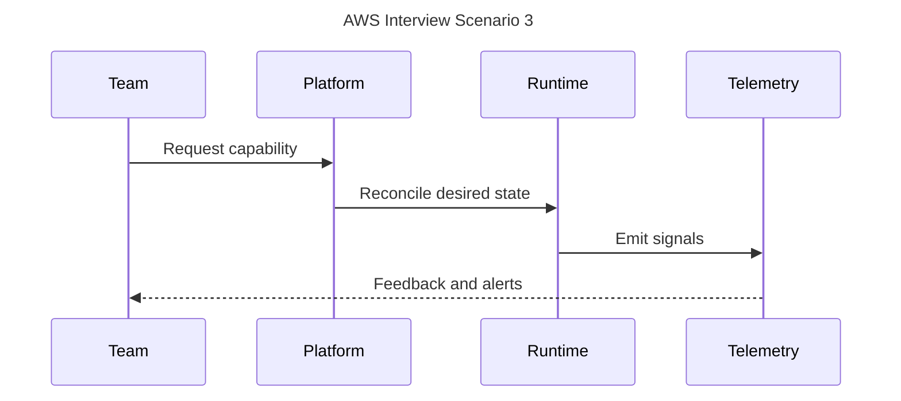
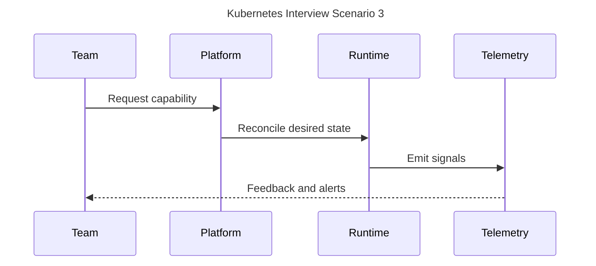
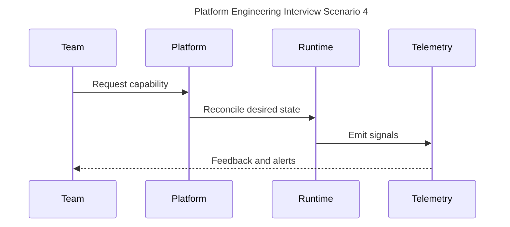
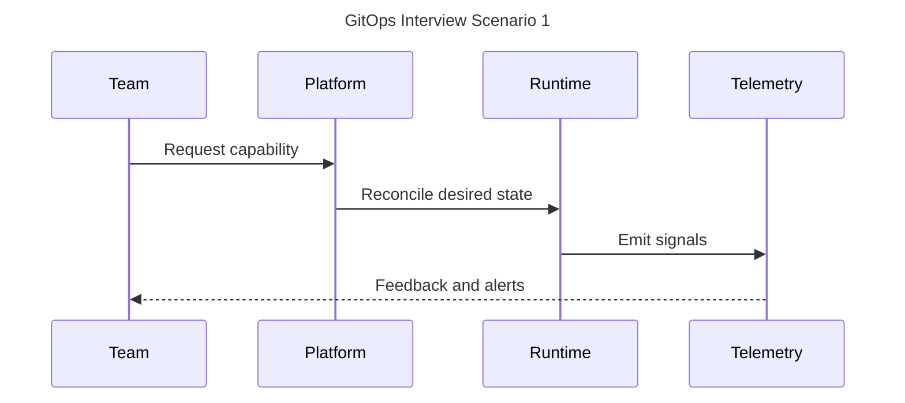

# Staff Platform Engineer Interview Companion

## AWS

### AWS Question 1

**Question:** How would you design, operate, and debug a production aws capability?

**Ideal Answer:** Start with requirements, define ownership, automate safe defaults, instrument golden signals, and document rollback.

**Staff Engineer Answer:** Challenge the premise, identify blast radius, negotiate migration strategy, and create durable engineering leverage.


**Follow-up Questions:** What fails first? How do you roll back? Which SLO matters?

**Production Story:** A change exposed hidden coupling; the staff engineer reduced blast radius with staged rollout and clearer ownership.

**Common Mistakes:** Tool-first answers, no rollback, no telemetry, and ignoring people/process constraints.

**Tradeoffs:** Speed versus safety, centralization versus autonomy, and abstraction versus debuggability.

**What would you improve?**

### AWS Question 2

**Question:** How would you design, operate, and debug a production aws capability?

**Ideal Answer:** Start with requirements, define ownership, automate safe defaults, instrument golden signals, and document rollback.

**Staff Engineer Answer:** Challenge the premise, identify blast radius, negotiate migration strategy, and create durable engineering leverage.


**Follow-up Questions:** What fails first? How do you roll back? Which SLO matters?

**Production Story:** A change exposed hidden coupling; the staff engineer reduced blast radius with staged rollout and clearer ownership.

**Common Mistakes:** Tool-first answers, no rollback, no telemetry, and ignoring people/process constraints.

**Tradeoffs:** Speed versus safety, centralization versus autonomy, and abstraction versus debuggability.

**What would you improve?**

### AWS Question 3

**Question:** How would you design, operate, and debug a production aws capability?

**Ideal Answer:** Start with requirements, define ownership, automate safe defaults, instrument golden signals, and document rollback.

**Staff Engineer Answer:** Challenge the premise, identify blast radius, negotiate migration strategy, and create durable engineering leverage.



**Follow-up Questions:** What fails first? How do you roll back? Which SLO matters?

**Production Story:** A change exposed hidden coupling; the staff engineer reduced blast radius with staged rollout and clearer ownership.

**Common Mistakes:** Tool-first answers, no rollback, no telemetry, and ignoring people/process constraints.

**Tradeoffs:** Speed versus safety, centralization versus autonomy, and abstraction versus debuggability.

**What would you improve?**

### AWS Question 4

**Question:** How would you design, operate, and debug a production aws capability?

**Ideal Answer:** Start with requirements, define ownership, automate safe defaults, instrument golden signals, and document rollback.

**Staff Engineer Answer:** Challenge the premise, identify blast radius, negotiate migration strategy, and create durable engineering leverage.


**Follow-up Questions:** What fails first? How do you roll back? Which SLO matters?

**Production Story:** A change exposed hidden coupling; the staff engineer reduced blast radius with staged rollout and clearer ownership.

**Common Mistakes:** Tool-first answers, no rollback, no telemetry, and ignoring people/process constraints.

**Tradeoffs:** Speed versus safety, centralization versus autonomy, and abstraction versus debuggability.

**What would you improve?**

## Kubernetes

### Kubernetes Question 1

**Question:** How would you design, operate, and debug a production kubernetes capability?

**Ideal Answer:** Start with requirements, define ownership, automate safe defaults, instrument golden signals, and document rollback.

**Staff Engineer Answer:** Challenge the premise, identify blast radius, negotiate migration strategy, and create durable engineering leverage.


**Follow-up Questions:** What fails first? How do you roll back? Which SLO matters?

**Production Story:** A change exposed hidden coupling; the staff engineer reduced blast radius with staged rollout and clearer ownership.

**Common Mistakes:** Tool-first answers, no rollback, no telemetry, and ignoring people/process constraints.

**Tradeoffs:** Speed versus safety, centralization versus autonomy, and abstraction versus debuggability.

**What would you improve?**

### Kubernetes Question 2

**Question:** How would you design, operate, and debug a production kubernetes capability?

**Ideal Answer:** Start with requirements, define ownership, automate safe defaults, instrument golden signals, and document rollback.

**Staff Engineer Answer:** Challenge the premise, identify blast radius, negotiate migration strategy, and create durable engineering leverage.


**Follow-up Questions:** What fails first? How do you roll back? Which SLO matters?

**Production Story:** A change exposed hidden coupling; the staff engineer reduced blast radius with staged rollout and clearer ownership.

**Common Mistakes:** Tool-first answers, no rollback, no telemetry, and ignoring people/process constraints.

**Tradeoffs:** Speed versus safety, centralization versus autonomy, and abstraction versus debuggability.

**What would you improve?**

### Kubernetes Question 3

**Question:** How would you design, operate, and debug a production kubernetes capability?

**Ideal Answer:** Start with requirements, define ownership, automate safe defaults, instrument golden signals, and document rollback.

**Staff Engineer Answer:** Challenge the premise, identify blast radius, negotiate migration strategy, and create durable engineering leverage.



**Follow-up Questions:** What fails first? How do you roll back? Which SLO matters?

**Production Story:** A change exposed hidden coupling; the staff engineer reduced blast radius with staged rollout and clearer ownership.

**Common Mistakes:** Tool-first answers, no rollback, no telemetry, and ignoring people/process constraints.

**Tradeoffs:** Speed versus safety, centralization versus autonomy, and abstraction versus debuggability.

**What would you improve?**

### Kubernetes Question 4

**Question:** How would you design, operate, and debug a production kubernetes capability?

**Ideal Answer:** Start with requirements, define ownership, automate safe defaults, instrument golden signals, and document rollback.

**Staff Engineer Answer:** Challenge the premise, identify blast radius, negotiate migration strategy, and create durable engineering leverage.


**Follow-up Questions:** What fails first? How do you roll back? Which SLO matters?

**Production Story:** A change exposed hidden coupling; the staff engineer reduced blast radius with staged rollout and clearer ownership.

**Common Mistakes:** Tool-first answers, no rollback, no telemetry, and ignoring people/process constraints.

**Tradeoffs:** Speed versus safety, centralization versus autonomy, and abstraction versus debuggability.

**What would you improve?**

## Platform Engineering

### Platform Engineering Question 1

**Question:** How would you design, operate, and debug a production platform engineering capability?

**Ideal Answer:** Start with requirements, define ownership, automate safe defaults, instrument golden signals, and document rollback.

**Staff Engineer Answer:** Challenge the premise, identify blast radius, negotiate migration strategy, and create durable engineering leverage.


**Follow-up Questions:** What fails first? How do you roll back? Which SLO matters?

**Production Story:** A change exposed hidden coupling; the staff engineer reduced blast radius with staged rollout and clearer ownership.

**Common Mistakes:** Tool-first answers, no rollback, no telemetry, and ignoring people/process constraints.

**Tradeoffs:** Speed versus safety, centralization versus autonomy, and abstraction versus debuggability.

**What would you improve?**

### Platform Engineering Question 2

**Question:** How would you design, operate, and debug a production platform engineering capability?

**Ideal Answer:** Start with requirements, define ownership, automate safe defaults, instrument golden signals, and document rollback.

**Staff Engineer Answer:** Challenge the premise, identify blast radius, negotiate migration strategy, and create durable engineering leverage.


**Follow-up Questions:** What fails first? How do you roll back? Which SLO matters?

**Production Story:** A change exposed hidden coupling; the staff engineer reduced blast radius with staged rollout and clearer ownership.

**Common Mistakes:** Tool-first answers, no rollback, no telemetry, and ignoring people/process constraints.

**Tradeoffs:** Speed versus safety, centralization versus autonomy, and abstraction versus debuggability.

**What would you improve?**

### Platform Engineering Question 3

**Question:** How would you design, operate, and debug a production platform engineering capability?

**Ideal Answer:** Start with requirements, define ownership, automate safe defaults, instrument golden signals, and document rollback.

**Staff Engineer Answer:** Challenge the premise, identify blast radius, negotiate migration strategy, and create durable engineering leverage.


**Follow-up Questions:** What fails first? How do you roll back? Which SLO matters?

**Production Story:** A change exposed hidden coupling; the staff engineer reduced blast radius with staged rollout and clearer ownership.

**Common Mistakes:** Tool-first answers, no rollback, no telemetry, and ignoring people/process constraints.

**Tradeoffs:** Speed versus safety, centralization versus autonomy, and abstraction versus debuggability.

**What would you improve?**

### Platform Engineering Question 4

**Question:** How would you design, operate, and debug a production platform engineering capability?

**Ideal Answer:** Start with requirements, define ownership, automate safe defaults, instrument golden signals, and document rollback.

**Staff Engineer Answer:** Challenge the premise, identify blast radius, negotiate migration strategy, and create durable engineering leverage.



**Follow-up Questions:** What fails first? How do you roll back? Which SLO matters?

**Production Story:** A change exposed hidden coupling; the staff engineer reduced blast radius with staged rollout and clearer ownership.

**Common Mistakes:** Tool-first answers, no rollback, no telemetry, and ignoring people/process constraints.

**Tradeoffs:** Speed versus safety, centralization versus autonomy, and abstraction versus debuggability.

**What would you improve?**

## GitOps

### GitOps Question 1

**Question:** How would you design, operate, and debug a production gitops capability?

**Ideal Answer:** Start with requirements, define ownership, automate safe defaults, instrument golden signals, and document rollback.

**Staff Engineer Answer:** Challenge the premise, identify blast radius, negotiate migration strategy, and create durable engineering leverage.



**Follow-up Questions:** What fails first? How do you roll back? Which SLO matters?

**Production Story:** A change exposed hidden coupling; the staff engineer reduced blast radius with staged rollout and clearer ownership.

**Common Mistakes:** Tool-first answers, no rollback, no telemetry, and ignoring people/process constraints.

**Tradeoffs:** Speed versus safety, centralization versus autonomy, and abstraction versus debuggability.

**What would you improve?**

### GitOps Question 2

**Question:** How would you design, operate, and debug a production gitops capability?

**Ideal Answer:** Start with requirements, define ownership, automate safe defaults, instrument golden signals, and document rollback.

**Staff Engineer Answer:** Challenge the premise, identify blast radius, negotiate migration strategy, and create durable engineering leverage.


**Follow-up Questions:** What fails first? How do you roll back? Which SLO matters?

**Production Story:** A change exposed hidden coupling; the staff engineer reduced blast radius with staged rollout and clearer ownership.

**Common Mistakes:** Tool-first answers, no rollback, no telemetry, and ignoring people/process constraints.

**Tradeoffs:** Speed versus safety, centralization versus autonomy, and abstraction versus debuggability.

**What would you improve?**

### GitOps Question 3

**Question:** How would you design, operate, and debug a production gitops capability?

**Ideal Answer:** Start with requirements, define ownership, automate safe defaults, instrument golden signals, and document rollback.

**Staff Engineer Answer:** Challenge the premise, identify blast radius, negotiate migration strategy, and create durable engineering leverage.


**Follow-up Questions:** What fails first? How do you roll back? Which SLO matters?

**Production Story:** A change exposed hidden coupling; the staff engineer reduced blast radius with staged rollout and clearer ownership.

**Common Mistakes:** Tool-first answers, no rollback, no telemetry, and ignoring people/process constraints.

**Tradeoffs:** Speed versus safety, centralization versus autonomy, and abstraction versus debuggability.

**What would you improve?**

### GitOps Question 4

**Question:** How would you design, operate, and debug a production gitops capability?

**Ideal Answer:** Start with requirements, define ownership, automate safe defaults, instrument golden signals, and document rollback.

**Staff Engineer Answer:** Challenge the premise, identify blast radius, negotiate migration strategy, and create durable engineering leverage.


**Follow-up Questions:** What fails first? How do you roll back? Which SLO matters?

**Production Story:** A change exposed hidden coupling; the staff engineer reduced blast radius with staged rollout and clearer ownership.

**Common Mistakes:** Tool-first answers, no rollback, no telemetry, and ignoring people/process constraints.

**Tradeoffs:** Speed versus safety, centralization versus autonomy, and abstraction versus debuggability.

**What would you improve?**

## Terraform

### Terraform Question 1

**Question:** How would you design, operate, and debug a production terraform capability?

**Ideal Answer:** Start with requirements, define ownership, automate safe defaults, instrument golden signals, and document rollback.

**Staff Engineer Answer:** Challenge the premise, identify blast radius, negotiate migration strategy, and create durable engineering leverage.


**Follow-up Questions:** What fails first? How do you roll back? Which SLO matters?

**Production Story:** A change exposed hidden coupling; the staff engineer reduced blast radius with staged rollout and clearer ownership.

**Common Mistakes:** Tool-first answers, no rollback, no telemetry, and ignoring people/process constraints.

**Tradeoffs:** Speed versus safety, centralization versus autonomy, and abstraction versus debuggability.

**What would you improve?**

### Terraform Question 2

**Question:** How would you design, operate, and debug a production terraform capability?

**Ideal Answer:** Start with requirements, define ownership, automate safe defaults, instrument golden signals, and document rollback.

**Staff Engineer Answer:** Challenge the premise, identify blast radius, negotiate migration strategy, and create durable engineering leverage.


**Follow-up Questions:** What fails first? How do you roll back? Which SLO matters?

**Production Story:** A change exposed hidden coupling; the staff engineer reduced blast radius with staged rollout and clearer ownership.

**Common Mistakes:** Tool-first answers, no rollback, no telemetry, and ignoring people/process constraints.

**Tradeoffs:** Speed versus safety, centralization versus autonomy, and abstraction versus debuggability.

**What would you improve?**

### Terraform Question 3

**Question:** How would you design, operate, and debug a production terraform capability?

**Ideal Answer:** Start with requirements, define ownership, automate safe defaults, instrument golden signals, and document rollback.

**Staff Engineer Answer:** Challenge the premise, identify blast radius, negotiate migration strategy, and create durable engineering leverage.


**Follow-up Questions:** What fails first? How do you roll back? Which SLO matters?

**Production Story:** A change exposed hidden coupling; the staff engineer reduced blast radius with staged rollout and clearer ownership.

**Common Mistakes:** Tool-first answers, no rollback, no telemetry, and ignoring people/process constraints.

**Tradeoffs:** Speed versus safety, centralization versus autonomy, and abstraction versus debuggability.

**What would you improve?**

### Terraform Question 4

**Question:** How would you design, operate, and debug a production terraform capability?

**Ideal Answer:** Start with requirements, define ownership, automate safe defaults, instrument golden signals, and document rollback.

**Staff Engineer Answer:** Challenge the premise, identify blast radius, negotiate migration strategy, and create durable engineering leverage.


**Follow-up Questions:** What fails first? How do you roll back? Which SLO matters?

**Production Story:** A change exposed hidden coupling; the staff engineer reduced blast radius with staged rollout and clearer ownership.

**Common Mistakes:** Tool-first answers, no rollback, no telemetry, and ignoring people/process constraints.

**Tradeoffs:** Speed versus safety, centralization versus autonomy, and abstraction versus debuggability.

**What would you improve?**

## Networking

### Networking Question 1

**Question:** How would you design, operate, and debug a production networking capability?

**Ideal Answer:** Start with requirements, define ownership, automate safe defaults, instrument golden signals, and document rollback.

**Staff Engineer Answer:** Challenge the premise, identify blast radius, negotiate migration strategy, and create durable engineering leverage.

```mermaid
---
title: Networking Interview Scenario 1
---
sequenceDiagram
  participant Team
  participant Platform
  participant Runtime
  participant Telemetry
  Team->>Platform: Request capability
  Platform->>Runtime: Reconcile desired state
  Runtime->>Telemetry: Emit signals
  Telemetry-->>Team: Feedback and alerts
```

**Follow-up Questions:** What fails first? How do you roll back? Which SLO matters?

**Production Story:** A change exposed hidden coupling; the staff engineer reduced blast radius with staged rollout and clearer ownership.

**Common Mistakes:** Tool-first answers, no rollback, no telemetry, and ignoring people/process constraints.

**Tradeoffs:** Speed versus safety, centralization versus autonomy, and abstraction versus debuggability.

**What would you improve?**

### Networking Question 2

**Question:** How would you design, operate, and debug a production networking capability?

**Ideal Answer:** Start with requirements, define ownership, automate safe defaults, instrument golden signals, and document rollback.

**Staff Engineer Answer:** Challenge the premise, identify blast radius, negotiate migration strategy, and create durable engineering leverage.

```mermaid
---
title: Networking Interview Scenario 2
---
sequenceDiagram
  participant Team
  participant Platform
  participant Runtime
  participant Telemetry
  Team->>Platform: Request capability
  Platform->>Runtime: Reconcile desired state
  Runtime->>Telemetry: Emit signals
  Telemetry-->>Team: Feedback and alerts
```

**Follow-up Questions:** What fails first? How do you roll back? Which SLO matters?

**Production Story:** A change exposed hidden coupling; the staff engineer reduced blast radius with staged rollout and clearer ownership.

**Common Mistakes:** Tool-first answers, no rollback, no telemetry, and ignoring people/process constraints.

**Tradeoffs:** Speed versus safety, centralization versus autonomy, and abstraction versus debuggability.

**What would you improve?**

### Networking Question 3

**Question:** How would you design, operate, and debug a production networking capability?

**Ideal Answer:** Start with requirements, define ownership, automate safe defaults, instrument golden signals, and document rollback.

**Staff Engineer Answer:** Challenge the premise, identify blast radius, negotiate migration strategy, and create durable engineering leverage.

```mermaid
---
title: Networking Interview Scenario 3
---
sequenceDiagram
  participant Team
  participant Platform
  participant Runtime
  participant Telemetry
  Team->>Platform: Request capability
  Platform->>Runtime: Reconcile desired state
  Runtime->>Telemetry: Emit signals
  Telemetry-->>Team: Feedback and alerts
```

**Follow-up Questions:** What fails first? How do you roll back? Which SLO matters?

**Production Story:** A change exposed hidden coupling; the staff engineer reduced blast radius with staged rollout and clearer ownership.

**Common Mistakes:** Tool-first answers, no rollback, no telemetry, and ignoring people/process constraints.

**Tradeoffs:** Speed versus safety, centralization versus autonomy, and abstraction versus debuggability.

**What would you improve?**

### Networking Question 4

**Question:** How would you design, operate, and debug a production networking capability?

**Ideal Answer:** Start with requirements, define ownership, automate safe defaults, instrument golden signals, and document rollback.

**Staff Engineer Answer:** Challenge the premise, identify blast radius, negotiate migration strategy, and create durable engineering leverage.

```mermaid
---
title: Networking Interview Scenario 4
---
sequenceDiagram
  participant Team
  participant Platform
  participant Runtime
  participant Telemetry
  Team->>Platform: Request capability
  Platform->>Runtime: Reconcile desired state
  Runtime->>Telemetry: Emit signals
  Telemetry-->>Team: Feedback and alerts
```

**Follow-up Questions:** What fails first? How do you roll back? Which SLO matters?

**Production Story:** A change exposed hidden coupling; the staff engineer reduced blast radius with staged rollout and clearer ownership.

**Common Mistakes:** Tool-first answers, no rollback, no telemetry, and ignoring people/process constraints.

**Tradeoffs:** Speed versus safety, centralization versus autonomy, and abstraction versus debuggability.

**What would you improve?**

## Linux

### Linux Question 1

**Question:** How would you design, operate, and debug a production linux capability?

**Ideal Answer:** Start with requirements, define ownership, automate safe defaults, instrument golden signals, and document rollback.

**Staff Engineer Answer:** Challenge the premise, identify blast radius, negotiate migration strategy, and create durable engineering leverage.

```mermaid
---
title: Linux Interview Scenario 1
---
sequenceDiagram
  participant Team
  participant Platform
  participant Runtime
  participant Telemetry
  Team->>Platform: Request capability
  Platform->>Runtime: Reconcile desired state
  Runtime->>Telemetry: Emit signals
  Telemetry-->>Team: Feedback and alerts
```

**Follow-up Questions:** What fails first? How do you roll back? Which SLO matters?

**Production Story:** A change exposed hidden coupling; the staff engineer reduced blast radius with staged rollout and clearer ownership.

**Common Mistakes:** Tool-first answers, no rollback, no telemetry, and ignoring people/process constraints.

**Tradeoffs:** Speed versus safety, centralization versus autonomy, and abstraction versus debuggability.

**What would you improve?**

### Linux Question 2

**Question:** How would you design, operate, and debug a production linux capability?

**Ideal Answer:** Start with requirements, define ownership, automate safe defaults, instrument golden signals, and document rollback.

**Staff Engineer Answer:** Challenge the premise, identify blast radius, negotiate migration strategy, and create durable engineering leverage.

```mermaid
---
title: Linux Interview Scenario 2
---
sequenceDiagram
  participant Team
  participant Platform
  participant Runtime
  participant Telemetry
  Team->>Platform: Request capability
  Platform->>Runtime: Reconcile desired state
  Runtime->>Telemetry: Emit signals
  Telemetry-->>Team: Feedback and alerts
```

**Follow-up Questions:** What fails first? How do you roll back? Which SLO matters?

**Production Story:** A change exposed hidden coupling; the staff engineer reduced blast radius with staged rollout and clearer ownership.

**Common Mistakes:** Tool-first answers, no rollback, no telemetry, and ignoring people/process constraints.

**Tradeoffs:** Speed versus safety, centralization versus autonomy, and abstraction versus debuggability.

**What would you improve?**

### Linux Question 3

**Question:** How would you design, operate, and debug a production linux capability?

**Ideal Answer:** Start with requirements, define ownership, automate safe defaults, instrument golden signals, and document rollback.

**Staff Engineer Answer:** Challenge the premise, identify blast radius, negotiate migration strategy, and create durable engineering leverage.

```mermaid
---
title: Linux Interview Scenario 3
---
sequenceDiagram
  participant Team
  participant Platform
  participant Runtime
  participant Telemetry
  Team->>Platform: Request capability
  Platform->>Runtime: Reconcile desired state
  Runtime->>Telemetry: Emit signals
  Telemetry-->>Team: Feedback and alerts
```

**Follow-up Questions:** What fails first? How do you roll back? Which SLO matters?

**Production Story:** A change exposed hidden coupling; the staff engineer reduced blast radius with staged rollout and clearer ownership.

**Common Mistakes:** Tool-first answers, no rollback, no telemetry, and ignoring people/process constraints.

**Tradeoffs:** Speed versus safety, centralization versus autonomy, and abstraction versus debuggability.

**What would you improve?**

### Linux Question 4

**Question:** How would you design, operate, and debug a production linux capability?

**Ideal Answer:** Start with requirements, define ownership, automate safe defaults, instrument golden signals, and document rollback.

**Staff Engineer Answer:** Challenge the premise, identify blast radius, negotiate migration strategy, and create durable engineering leverage.

```mermaid
---
title: Linux Interview Scenario 4
---
sequenceDiagram
  participant Team
  participant Platform
  participant Runtime
  participant Telemetry
  Team->>Platform: Request capability
  Platform->>Runtime: Reconcile desired state
  Runtime->>Telemetry: Emit signals
  Telemetry-->>Team: Feedback and alerts
```

**Follow-up Questions:** What fails first? How do you roll back? Which SLO matters?

**Production Story:** A change exposed hidden coupling; the staff engineer reduced blast radius with staged rollout and clearer ownership.

**Common Mistakes:** Tool-first answers, no rollback, no telemetry, and ignoring people/process constraints.

**Tradeoffs:** Speed versus safety, centralization versus autonomy, and abstraction versus debuggability.

**What would you improve?**

## Containers

### Containers Question 1

**Question:** How would you design, operate, and debug a production containers capability?

**Ideal Answer:** Start with requirements, define ownership, automate safe defaults, instrument golden signals, and document rollback.

**Staff Engineer Answer:** Challenge the premise, identify blast radius, negotiate migration strategy, and create durable engineering leverage.

```mermaid
---
title: Containers Interview Scenario 1
---
sequenceDiagram
  participant Team
  participant Platform
  participant Runtime
  participant Telemetry
  Team->>Platform: Request capability
  Platform->>Runtime: Reconcile desired state
  Runtime->>Telemetry: Emit signals
  Telemetry-->>Team: Feedback and alerts
```

**Follow-up Questions:** What fails first? How do you roll back? Which SLO matters?

**Production Story:** A change exposed hidden coupling; the staff engineer reduced blast radius with staged rollout and clearer ownership.

**Common Mistakes:** Tool-first answers, no rollback, no telemetry, and ignoring people/process constraints.

**Tradeoffs:** Speed versus safety, centralization versus autonomy, and abstraction versus debuggability.

**What would you improve?**

### Containers Question 2

**Question:** How would you design, operate, and debug a production containers capability?

**Ideal Answer:** Start with requirements, define ownership, automate safe defaults, instrument golden signals, and document rollback.

**Staff Engineer Answer:** Challenge the premise, identify blast radius, negotiate migration strategy, and create durable engineering leverage.

```mermaid
---
title: Containers Interview Scenario 2
---
sequenceDiagram
  participant Team
  participant Platform
  participant Runtime
  participant Telemetry
  Team->>Platform: Request capability
  Platform->>Runtime: Reconcile desired state
  Runtime->>Telemetry: Emit signals
  Telemetry-->>Team: Feedback and alerts
```

**Follow-up Questions:** What fails first? How do you roll back? Which SLO matters?

**Production Story:** A change exposed hidden coupling; the staff engineer reduced blast radius with staged rollout and clearer ownership.

**Common Mistakes:** Tool-first answers, no rollback, no telemetry, and ignoring people/process constraints.

**Tradeoffs:** Speed versus safety, centralization versus autonomy, and abstraction versus debuggability.

**What would you improve?**

### Containers Question 3

**Question:** How would you design, operate, and debug a production containers capability?

**Ideal Answer:** Start with requirements, define ownership, automate safe defaults, instrument golden signals, and document rollback.

**Staff Engineer Answer:** Challenge the premise, identify blast radius, negotiate migration strategy, and create durable engineering leverage.

```mermaid
---
title: Containers Interview Scenario 3
---
sequenceDiagram
  participant Team
  participant Platform
  participant Runtime
  participant Telemetry
  Team->>Platform: Request capability
  Platform->>Runtime: Reconcile desired state
  Runtime->>Telemetry: Emit signals
  Telemetry-->>Team: Feedback and alerts
```

**Follow-up Questions:** What fails first? How do you roll back? Which SLO matters?

**Production Story:** A change exposed hidden coupling; the staff engineer reduced blast radius with staged rollout and clearer ownership.

**Common Mistakes:** Tool-first answers, no rollback, no telemetry, and ignoring people/process constraints.

**Tradeoffs:** Speed versus safety, centralization versus autonomy, and abstraction versus debuggability.

**What would you improve?**

### Containers Question 4

**Question:** How would you design, operate, and debug a production containers capability?

**Ideal Answer:** Start with requirements, define ownership, automate safe defaults, instrument golden signals, and document rollback.

**Staff Engineer Answer:** Challenge the premise, identify blast radius, negotiate migration strategy, and create durable engineering leverage.

```mermaid
---
title: Containers Interview Scenario 4
---
sequenceDiagram
  participant Team
  participant Platform
  participant Runtime
  participant Telemetry
  Team->>Platform: Request capability
  Platform->>Runtime: Reconcile desired state
  Runtime->>Telemetry: Emit signals
  Telemetry-->>Team: Feedback and alerts
```

**Follow-up Questions:** What fails first? How do you roll back? Which SLO matters?

**Production Story:** A change exposed hidden coupling; the staff engineer reduced blast radius with staged rollout and clearer ownership.

**Common Mistakes:** Tool-first answers, no rollback, no telemetry, and ignoring people/process constraints.

**Tradeoffs:** Speed versus safety, centralization versus autonomy, and abstraction versus debuggability.

**What would you improve?**

## Observability

### Observability Question 1

**Question:** How would you design, operate, and debug a production observability capability?

**Ideal Answer:** Start with requirements, define ownership, automate safe defaults, instrument golden signals, and document rollback.

**Staff Engineer Answer:** Challenge the premise, identify blast radius, negotiate migration strategy, and create durable engineering leverage.

```mermaid
---
title: Observability Interview Scenario 1
---
sequenceDiagram
  participant Team
  participant Platform
  participant Runtime
  participant Telemetry
  Team->>Platform: Request capability
  Platform->>Runtime: Reconcile desired state
  Runtime->>Telemetry: Emit signals
  Telemetry-->>Team: Feedback and alerts
```

**Follow-up Questions:** What fails first? How do you roll back? Which SLO matters?

**Production Story:** A change exposed hidden coupling; the staff engineer reduced blast radius with staged rollout and clearer ownership.

**Common Mistakes:** Tool-first answers, no rollback, no telemetry, and ignoring people/process constraints.

**Tradeoffs:** Speed versus safety, centralization versus autonomy, and abstraction versus debuggability.

**What would you improve?**

### Observability Question 2

**Question:** How would you design, operate, and debug a production observability capability?

**Ideal Answer:** Start with requirements, define ownership, automate safe defaults, instrument golden signals, and document rollback.

**Staff Engineer Answer:** Challenge the premise, identify blast radius, negotiate migration strategy, and create durable engineering leverage.

```mermaid
---
title: Observability Interview Scenario 2
---
sequenceDiagram
  participant Team
  participant Platform
  participant Runtime
  participant Telemetry
  Team->>Platform: Request capability
  Platform->>Runtime: Reconcile desired state
  Runtime->>Telemetry: Emit signals
  Telemetry-->>Team: Feedback and alerts
```

**Follow-up Questions:** What fails first? How do you roll back? Which SLO matters?

**Production Story:** A change exposed hidden coupling; the staff engineer reduced blast radius with staged rollout and clearer ownership.

**Common Mistakes:** Tool-first answers, no rollback, no telemetry, and ignoring people/process constraints.

**Tradeoffs:** Speed versus safety, centralization versus autonomy, and abstraction versus debuggability.

**What would you improve?**

### Observability Question 3

**Question:** How would you design, operate, and debug a production observability capability?

**Ideal Answer:** Start with requirements, define ownership, automate safe defaults, instrument golden signals, and document rollback.

**Staff Engineer Answer:** Challenge the premise, identify blast radius, negotiate migration strategy, and create durable engineering leverage.

```mermaid
---
title: Observability Interview Scenario 3
---
sequenceDiagram
  participant Team
  participant Platform
  participant Runtime
  participant Telemetry
  Team->>Platform: Request capability
  Platform->>Runtime: Reconcile desired state
  Runtime->>Telemetry: Emit signals
  Telemetry-->>Team: Feedback and alerts
```

**Follow-up Questions:** What fails first? How do you roll back? Which SLO matters?

**Production Story:** A change exposed hidden coupling; the staff engineer reduced blast radius with staged rollout and clearer ownership.

**Common Mistakes:** Tool-first answers, no rollback, no telemetry, and ignoring people/process constraints.

**Tradeoffs:** Speed versus safety, centralization versus autonomy, and abstraction versus debuggability.

**What would you improve?**

### Observability Question 4

**Question:** How would you design, operate, and debug a production observability capability?

**Ideal Answer:** Start with requirements, define ownership, automate safe defaults, instrument golden signals, and document rollback.

**Staff Engineer Answer:** Challenge the premise, identify blast radius, negotiate migration strategy, and create durable engineering leverage.

```mermaid
---
title: Observability Interview Scenario 4
---
sequenceDiagram
  participant Team
  participant Platform
  participant Runtime
  participant Telemetry
  Team->>Platform: Request capability
  Platform->>Runtime: Reconcile desired state
  Runtime->>Telemetry: Emit signals
  Telemetry-->>Team: Feedback and alerts
```

**Follow-up Questions:** What fails first? How do you roll back? Which SLO matters?

**Production Story:** A change exposed hidden coupling; the staff engineer reduced blast radius with staged rollout and clearer ownership.

**Common Mistakes:** Tool-first answers, no rollback, no telemetry, and ignoring people/process constraints.

**Tradeoffs:** Speed versus safety, centralization versus autonomy, and abstraction versus debuggability.

**What would you improve?**

## Security

### Security Question 1

**Question:** How would you design, operate, and debug a production security capability?

**Ideal Answer:** Start with requirements, define ownership, automate safe defaults, instrument golden signals, and document rollback.

**Staff Engineer Answer:** Challenge the premise, identify blast radius, negotiate migration strategy, and create durable engineering leverage.

```mermaid
---
title: Security Interview Scenario 1
---
sequenceDiagram
  participant Team
  participant Platform
  participant Runtime
  participant Telemetry
  Team->>Platform: Request capability
  Platform->>Runtime: Reconcile desired state
  Runtime->>Telemetry: Emit signals
  Telemetry-->>Team: Feedback and alerts
```

**Follow-up Questions:** What fails first? How do you roll back? Which SLO matters?

**Production Story:** A change exposed hidden coupling; the staff engineer reduced blast radius with staged rollout and clearer ownership.

**Common Mistakes:** Tool-first answers, no rollback, no telemetry, and ignoring people/process constraints.

**Tradeoffs:** Speed versus safety, centralization versus autonomy, and abstraction versus debuggability.

**What would you improve?**

### Security Question 2

**Question:** How would you design, operate, and debug a production security capability?

**Ideal Answer:** Start with requirements, define ownership, automate safe defaults, instrument golden signals, and document rollback.

**Staff Engineer Answer:** Challenge the premise, identify blast radius, negotiate migration strategy, and create durable engineering leverage.

```mermaid
---
title: Security Interview Scenario 2
---
sequenceDiagram
  participant Team
  participant Platform
  participant Runtime
  participant Telemetry
  Team->>Platform: Request capability
  Platform->>Runtime: Reconcile desired state
  Runtime->>Telemetry: Emit signals
  Telemetry-->>Team: Feedback and alerts
```

**Follow-up Questions:** What fails first? How do you roll back? Which SLO matters?

**Production Story:** A change exposed hidden coupling; the staff engineer reduced blast radius with staged rollout and clearer ownership.

**Common Mistakes:** Tool-first answers, no rollback, no telemetry, and ignoring people/process constraints.

**Tradeoffs:** Speed versus safety, centralization versus autonomy, and abstraction versus debuggability.

**What would you improve?**

### Security Question 3

**Question:** How would you design, operate, and debug a production security capability?

**Ideal Answer:** Start with requirements, define ownership, automate safe defaults, instrument golden signals, and document rollback.

**Staff Engineer Answer:** Challenge the premise, identify blast radius, negotiate migration strategy, and create durable engineering leverage.

```mermaid
---
title: Security Interview Scenario 3
---
sequenceDiagram
  participant Team
  participant Platform
  participant Runtime
  participant Telemetry
  Team->>Platform: Request capability
  Platform->>Runtime: Reconcile desired state
  Runtime->>Telemetry: Emit signals
  Telemetry-->>Team: Feedback and alerts
```

**Follow-up Questions:** What fails first? How do you roll back? Which SLO matters?

**Production Story:** A change exposed hidden coupling; the staff engineer reduced blast radius with staged rollout and clearer ownership.

**Common Mistakes:** Tool-first answers, no rollback, no telemetry, and ignoring people/process constraints.

**Tradeoffs:** Speed versus safety, centralization versus autonomy, and abstraction versus debuggability.

**What would you improve?**

### Security Question 4

**Question:** How would you design, operate, and debug a production security capability?

**Ideal Answer:** Start with requirements, define ownership, automate safe defaults, instrument golden signals, and document rollback.

**Staff Engineer Answer:** Challenge the premise, identify blast radius, negotiate migration strategy, and create durable engineering leverage.

```mermaid
---
title: Security Interview Scenario 4
---
sequenceDiagram
  participant Team
  participant Platform
  participant Runtime
  participant Telemetry
  Team->>Platform: Request capability
  Platform->>Runtime: Reconcile desired state
  Runtime->>Telemetry: Emit signals
  Telemetry-->>Team: Feedback and alerts
```

**Follow-up Questions:** What fails first? How do you roll back? Which SLO matters?

**Production Story:** A change exposed hidden coupling; the staff engineer reduced blast radius with staged rollout and clearer ownership.

**Common Mistakes:** Tool-first answers, no rollback, no telemetry, and ignoring people/process constraints.

**Tradeoffs:** Speed versus safety, centralization versus autonomy, and abstraction versus debuggability.

**What would you improve?**

## Python

### Python Question 1

**Question:** How would you design, operate, and debug a production python capability?

**Ideal Answer:** Start with requirements, define ownership, automate safe defaults, instrument golden signals, and document rollback.

**Staff Engineer Answer:** Challenge the premise, identify blast radius, negotiate migration strategy, and create durable engineering leverage.

```mermaid
---
title: Python Interview Scenario 1
---
sequenceDiagram
  participant Team
  participant Platform
  participant Runtime
  participant Telemetry
  Team->>Platform: Request capability
  Platform->>Runtime: Reconcile desired state
  Runtime->>Telemetry: Emit signals
  Telemetry-->>Team: Feedback and alerts
```

**Follow-up Questions:** What fails first? How do you roll back? Which SLO matters?

**Production Story:** A change exposed hidden coupling; the staff engineer reduced blast radius with staged rollout and clearer ownership.

**Common Mistakes:** Tool-first answers, no rollback, no telemetry, and ignoring people/process constraints.

**Tradeoffs:** Speed versus safety, centralization versus autonomy, and abstraction versus debuggability.

**What would you improve?**

### Python Question 2

**Question:** How would you design, operate, and debug a production python capability?

**Ideal Answer:** Start with requirements, define ownership, automate safe defaults, instrument golden signals, and document rollback.

**Staff Engineer Answer:** Challenge the premise, identify blast radius, negotiate migration strategy, and create durable engineering leverage.

```mermaid
---
title: Python Interview Scenario 2
---
sequenceDiagram
  participant Team
  participant Platform
  participant Runtime
  participant Telemetry
  Team->>Platform: Request capability
  Platform->>Runtime: Reconcile desired state
  Runtime->>Telemetry: Emit signals
  Telemetry-->>Team: Feedback and alerts
```

**Follow-up Questions:** What fails first? How do you roll back? Which SLO matters?

**Production Story:** A change exposed hidden coupling; the staff engineer reduced blast radius with staged rollout and clearer ownership.

**Common Mistakes:** Tool-first answers, no rollback, no telemetry, and ignoring people/process constraints.

**Tradeoffs:** Speed versus safety, centralization versus autonomy, and abstraction versus debuggability.

**What would you improve?**

### Python Question 3

**Question:** How would you design, operate, and debug a production python capability?

**Ideal Answer:** Start with requirements, define ownership, automate safe defaults, instrument golden signals, and document rollback.

**Staff Engineer Answer:** Challenge the premise, identify blast radius, negotiate migration strategy, and create durable engineering leverage.

```mermaid
---
title: Python Interview Scenario 3
---
sequenceDiagram
  participant Team
  participant Platform
  participant Runtime
  participant Telemetry
  Team->>Platform: Request capability
  Platform->>Runtime: Reconcile desired state
  Runtime->>Telemetry: Emit signals
  Telemetry-->>Team: Feedback and alerts
```

**Follow-up Questions:** What fails first? How do you roll back? Which SLO matters?

**Production Story:** A change exposed hidden coupling; the staff engineer reduced blast radius with staged rollout and clearer ownership.

**Common Mistakes:** Tool-first answers, no rollback, no telemetry, and ignoring people/process constraints.

**Tradeoffs:** Speed versus safety, centralization versus autonomy, and abstraction versus debuggability.

**What would you improve?**

### Python Question 4

**Question:** How would you design, operate, and debug a production python capability?

**Ideal Answer:** Start with requirements, define ownership, automate safe defaults, instrument golden signals, and document rollback.

**Staff Engineer Answer:** Challenge the premise, identify blast radius, negotiate migration strategy, and create durable engineering leverage.

```mermaid
---
title: Python Interview Scenario 4
---
sequenceDiagram
  participant Team
  participant Platform
  participant Runtime
  participant Telemetry
  Team->>Platform: Request capability
  Platform->>Runtime: Reconcile desired state
  Runtime->>Telemetry: Emit signals
  Telemetry-->>Team: Feedback and alerts
```

**Follow-up Questions:** What fails first? How do you roll back? Which SLO matters?

**Production Story:** A change exposed hidden coupling; the staff engineer reduced blast radius with staged rollout and clearer ownership.

**Common Mistakes:** Tool-first answers, no rollback, no telemetry, and ignoring people/process constraints.

**Tradeoffs:** Speed versus safety, centralization versus autonomy, and abstraction versus debuggability.

**What would you improve?**

## Go

### Go Question 1

**Question:** How would you design, operate, and debug a production go capability?

**Ideal Answer:** Start with requirements, define ownership, automate safe defaults, instrument golden signals, and document rollback.

**Staff Engineer Answer:** Challenge the premise, identify blast radius, negotiate migration strategy, and create durable engineering leverage.

```mermaid
---
title: Go Interview Scenario 1
---
sequenceDiagram
  participant Team
  participant Platform
  participant Runtime
  participant Telemetry
  Team->>Platform: Request capability
  Platform->>Runtime: Reconcile desired state
  Runtime->>Telemetry: Emit signals
  Telemetry-->>Team: Feedback and alerts
```

**Follow-up Questions:** What fails first? How do you roll back? Which SLO matters?

**Production Story:** A change exposed hidden coupling; the staff engineer reduced blast radius with staged rollout and clearer ownership.

**Common Mistakes:** Tool-first answers, no rollback, no telemetry, and ignoring people/process constraints.

**Tradeoffs:** Speed versus safety, centralization versus autonomy, and abstraction versus debuggability.

**What would you improve?**

### Go Question 2

**Question:** How would you design, operate, and debug a production go capability?

**Ideal Answer:** Start with requirements, define ownership, automate safe defaults, instrument golden signals, and document rollback.

**Staff Engineer Answer:** Challenge the premise, identify blast radius, negotiate migration strategy, and create durable engineering leverage.

```mermaid
---
title: Go Interview Scenario 2
---
sequenceDiagram
  participant Team
  participant Platform
  participant Runtime
  participant Telemetry
  Team->>Platform: Request capability
  Platform->>Runtime: Reconcile desired state
  Runtime->>Telemetry: Emit signals
  Telemetry-->>Team: Feedback and alerts
```

**Follow-up Questions:** What fails first? How do you roll back? Which SLO matters?

**Production Story:** A change exposed hidden coupling; the staff engineer reduced blast radius with staged rollout and clearer ownership.

**Common Mistakes:** Tool-first answers, no rollback, no telemetry, and ignoring people/process constraints.

**Tradeoffs:** Speed versus safety, centralization versus autonomy, and abstraction versus debuggability.

**What would you improve?**

### Go Question 3

**Question:** How would you design, operate, and debug a production go capability?

**Ideal Answer:** Start with requirements, define ownership, automate safe defaults, instrument golden signals, and document rollback.

**Staff Engineer Answer:** Challenge the premise, identify blast radius, negotiate migration strategy, and create durable engineering leverage.

```mermaid
---
title: Go Interview Scenario 3
---
sequenceDiagram
  participant Team
  participant Platform
  participant Runtime
  participant Telemetry
  Team->>Platform: Request capability
  Platform->>Runtime: Reconcile desired state
  Runtime->>Telemetry: Emit signals
  Telemetry-->>Team: Feedback and alerts
```

**Follow-up Questions:** What fails first? How do you roll back? Which SLO matters?

**Production Story:** A change exposed hidden coupling; the staff engineer reduced blast radius with staged rollout and clearer ownership.

**Common Mistakes:** Tool-first answers, no rollback, no telemetry, and ignoring people/process constraints.

**Tradeoffs:** Speed versus safety, centralization versus autonomy, and abstraction versus debuggability.

**What would you improve?**

### Go Question 4

**Question:** How would you design, operate, and debug a production go capability?

**Ideal Answer:** Start with requirements, define ownership, automate safe defaults, instrument golden signals, and document rollback.

**Staff Engineer Answer:** Challenge the premise, identify blast radius, negotiate migration strategy, and create durable engineering leverage.

```mermaid
---
title: Go Interview Scenario 4
---
sequenceDiagram
  participant Team
  participant Platform
  participant Runtime
  participant Telemetry
  Team->>Platform: Request capability
  Platform->>Runtime: Reconcile desired state
  Runtime->>Telemetry: Emit signals
  Telemetry-->>Team: Feedback and alerts
```

**Follow-up Questions:** What fails first? How do you roll back? Which SLO matters?

**Production Story:** A change exposed hidden coupling; the staff engineer reduced blast radius with staged rollout and clearer ownership.

**Common Mistakes:** Tool-first answers, no rollback, no telemetry, and ignoring people/process constraints.

**Tradeoffs:** Speed versus safety, centralization versus autonomy, and abstraction versus debuggability.

**What would you improve?**

## AI Infrastructure

### AI Infrastructure Question 1

**Question:** How would you design, operate, and debug a production ai infrastructure capability?

**Ideal Answer:** Start with requirements, define ownership, automate safe defaults, instrument golden signals, and document rollback.

**Staff Engineer Answer:** Challenge the premise, identify blast radius, negotiate migration strategy, and create durable engineering leverage.

```mermaid
---
title: AI Infrastructure Interview Scenario 1
---
sequenceDiagram
  participant Team
  participant Platform
  participant Runtime
  participant Telemetry
  Team->>Platform: Request capability
  Platform->>Runtime: Reconcile desired state
  Runtime->>Telemetry: Emit signals
  Telemetry-->>Team: Feedback and alerts
```

**Follow-up Questions:** What fails first? How do you roll back? Which SLO matters?

**Production Story:** A change exposed hidden coupling; the staff engineer reduced blast radius with staged rollout and clearer ownership.

**Common Mistakes:** Tool-first answers, no rollback, no telemetry, and ignoring people/process constraints.

**Tradeoffs:** Speed versus safety, centralization versus autonomy, and abstraction versus debuggability.

**What would you improve?**

### AI Infrastructure Question 2

**Question:** How would you design, operate, and debug a production ai infrastructure capability?

**Ideal Answer:** Start with requirements, define ownership, automate safe defaults, instrument golden signals, and document rollback.

**Staff Engineer Answer:** Challenge the premise, identify blast radius, negotiate migration strategy, and create durable engineering leverage.

```mermaid
---
title: AI Infrastructure Interview Scenario 2
---
sequenceDiagram
  participant Team
  participant Platform
  participant Runtime
  participant Telemetry
  Team->>Platform: Request capability
  Platform->>Runtime: Reconcile desired state
  Runtime->>Telemetry: Emit signals
  Telemetry-->>Team: Feedback and alerts
```

**Follow-up Questions:** What fails first? How do you roll back? Which SLO matters?

**Production Story:** A change exposed hidden coupling; the staff engineer reduced blast radius with staged rollout and clearer ownership.

**Common Mistakes:** Tool-first answers, no rollback, no telemetry, and ignoring people/process constraints.

**Tradeoffs:** Speed versus safety, centralization versus autonomy, and abstraction versus debuggability.

**What would you improve?**

### AI Infrastructure Question 3

**Question:** How would you design, operate, and debug a production ai infrastructure capability?

**Ideal Answer:** Start with requirements, define ownership, automate safe defaults, instrument golden signals, and document rollback.

**Staff Engineer Answer:** Challenge the premise, identify blast radius, negotiate migration strategy, and create durable engineering leverage.

```mermaid
---
title: AI Infrastructure Interview Scenario 3
---
sequenceDiagram
  participant Team
  participant Platform
  participant Runtime
  participant Telemetry
  Team->>Platform: Request capability
  Platform->>Runtime: Reconcile desired state
  Runtime->>Telemetry: Emit signals
  Telemetry-->>Team: Feedback and alerts
```

**Follow-up Questions:** What fails first? How do you roll back? Which SLO matters?

**Production Story:** A change exposed hidden coupling; the staff engineer reduced blast radius with staged rollout and clearer ownership.

**Common Mistakes:** Tool-first answers, no rollback, no telemetry, and ignoring people/process constraints.

**Tradeoffs:** Speed versus safety, centralization versus autonomy, and abstraction versus debuggability.

**What would you improve?**

### AI Infrastructure Question 4

**Question:** How would you design, operate, and debug a production ai infrastructure capability?

**Ideal Answer:** Start with requirements, define ownership, automate safe defaults, instrument golden signals, and document rollback.

**Staff Engineer Answer:** Challenge the premise, identify blast radius, negotiate migration strategy, and create durable engineering leverage.

```mermaid
---
title: AI Infrastructure Interview Scenario 4
---
sequenceDiagram
  participant Team
  participant Platform
  participant Runtime
  participant Telemetry
  Team->>Platform: Request capability
  Platform->>Runtime: Reconcile desired state
  Runtime->>Telemetry: Emit signals
  Telemetry-->>Team: Feedback and alerts
```

**Follow-up Questions:** What fails first? How do you roll back? Which SLO matters?

**Production Story:** A change exposed hidden coupling; the staff engineer reduced blast radius with staged rollout and clearer ownership.

**Common Mistakes:** Tool-first answers, no rollback, no telemetry, and ignoring people/process constraints.

**Tradeoffs:** Speed versus safety, centralization versus autonomy, and abstraction versus debuggability.

**What would you improve?**

## Production Incident Walkthroughs

### Production Incident Walkthrough 1

Question: A critical platform path is degraded during peak traffic.

Ideal Answer: Triage impact, freeze risky changes, inspect recent deploys, compare telemetry, mitigate, then preserve evidence.

Staff Engineer Answer: Coordinate incident command, communicate clearly, reduce blast radius, and convert findings into platform improvements.

What would you improve?

### Production Incident Walkthrough 2

Question: A critical platform path is degraded during peak traffic.

Ideal Answer: Triage impact, freeze risky changes, inspect recent deploys, compare telemetry, mitigate, then preserve evidence.

Staff Engineer Answer: Coordinate incident command, communicate clearly, reduce blast radius, and convert findings into platform improvements.

What would you improve?

### Production Incident Walkthrough 3

Question: A critical platform path is degraded during peak traffic.

Ideal Answer: Triage impact, freeze risky changes, inspect recent deploys, compare telemetry, mitigate, then preserve evidence.

Staff Engineer Answer: Coordinate incident command, communicate clearly, reduce blast radius, and convert findings into platform improvements.

What would you improve?

### Production Incident Walkthrough 4

Question: A critical platform path is degraded during peak traffic.

Ideal Answer: Triage impact, freeze risky changes, inspect recent deploys, compare telemetry, mitigate, then preserve evidence.

Staff Engineer Answer: Coordinate incident command, communicate clearly, reduce blast radius, and convert findings into platform improvements.

What would you improve?

### Production Incident Walkthrough 5

Question: A critical platform path is degraded during peak traffic.

Ideal Answer: Triage impact, freeze risky changes, inspect recent deploys, compare telemetry, mitigate, then preserve evidence.

Staff Engineer Answer: Coordinate incident command, communicate clearly, reduce blast radius, and convert findings into platform improvements.

What would you improve?

### Production Incident Walkthrough 6

Question: A critical platform path is degraded during peak traffic.

Ideal Answer: Triage impact, freeze risky changes, inspect recent deploys, compare telemetry, mitigate, then preserve evidence.

Staff Engineer Answer: Coordinate incident command, communicate clearly, reduce blast radius, and convert findings into platform improvements.

What would you improve?

### Production Incident Walkthrough 7

Question: A critical platform path is degraded during peak traffic.

Ideal Answer: Triage impact, freeze risky changes, inspect recent deploys, compare telemetry, mitigate, then preserve evidence.

Staff Engineer Answer: Coordinate incident command, communicate clearly, reduce blast radius, and convert findings into platform improvements.

What would you improve?

### Production Incident Walkthrough 8

Question: A critical platform path is degraded during peak traffic.

Ideal Answer: Triage impact, freeze risky changes, inspect recent deploys, compare telemetry, mitigate, then preserve evidence.

Staff Engineer Answer: Coordinate incident command, communicate clearly, reduce blast radius, and convert findings into platform improvements.

What would you improve?

### Production Incident Walkthrough 9

Question: A critical platform path is degraded during peak traffic.

Ideal Answer: Triage impact, freeze risky changes, inspect recent deploys, compare telemetry, mitigate, then preserve evidence.

Staff Engineer Answer: Coordinate incident command, communicate clearly, reduce blast radius, and convert findings into platform improvements.

What would you improve?

### Production Incident Walkthrough 10

Question: A critical platform path is degraded during peak traffic.

Ideal Answer: Triage impact, freeze risky changes, inspect recent deploys, compare telemetry, mitigate, then preserve evidence.

Staff Engineer Answer: Coordinate incident command, communicate clearly, reduce blast radius, and convert findings into platform improvements.

What would you improve?

### Production Incident Walkthrough 11

Question: A critical platform path is degraded during peak traffic.

Ideal Answer: Triage impact, freeze risky changes, inspect recent deploys, compare telemetry, mitigate, then preserve evidence.

Staff Engineer Answer: Coordinate incident command, communicate clearly, reduce blast radius, and convert findings into platform improvements.

What would you improve?

### Production Incident Walkthrough 12

Question: A critical platform path is degraded during peak traffic.

Ideal Answer: Triage impact, freeze risky changes, inspect recent deploys, compare telemetry, mitigate, then preserve evidence.

Staff Engineer Answer: Coordinate incident command, communicate clearly, reduce blast radius, and convert findings into platform improvements.

What would you improve?

### Production Incident Walkthrough 13

Question: A critical platform path is degraded during peak traffic.

Ideal Answer: Triage impact, freeze risky changes, inspect recent deploys, compare telemetry, mitigate, then preserve evidence.

Staff Engineer Answer: Coordinate incident command, communicate clearly, reduce blast radius, and convert findings into platform improvements.

What would you improve?

### Production Incident Walkthrough 14

Question: A critical platform path is degraded during peak traffic.

Ideal Answer: Triage impact, freeze risky changes, inspect recent deploys, compare telemetry, mitigate, then preserve evidence.

Staff Engineer Answer: Coordinate incident command, communicate clearly, reduce blast radius, and convert findings into platform improvements.

What would you improve?

### Production Incident Walkthrough 15

Question: A critical platform path is degraded during peak traffic.

Ideal Answer: Triage impact, freeze risky changes, inspect recent deploys, compare telemetry, mitigate, then preserve evidence.

Staff Engineer Answer: Coordinate incident command, communicate clearly, reduce blast radius, and convert findings into platform improvements.

What would you improve?

### Production Incident Walkthrough 16

Question: A critical platform path is degraded during peak traffic.

Ideal Answer: Triage impact, freeze risky changes, inspect recent deploys, compare telemetry, mitigate, then preserve evidence.

Staff Engineer Answer: Coordinate incident command, communicate clearly, reduce blast radius, and convert findings into platform improvements.

What would you improve?

### Production Incident Walkthrough 17

Question: A critical platform path is degraded during peak traffic.

Ideal Answer: Triage impact, freeze risky changes, inspect recent deploys, compare telemetry, mitigate, then preserve evidence.

Staff Engineer Answer: Coordinate incident command, communicate clearly, reduce blast radius, and convert findings into platform improvements.

What would you improve?

### Production Incident Walkthrough 18

Question: A critical platform path is degraded during peak traffic.

Ideal Answer: Triage impact, freeze risky changes, inspect recent deploys, compare telemetry, mitigate, then preserve evidence.

Staff Engineer Answer: Coordinate incident command, communicate clearly, reduce blast radius, and convert findings into platform improvements.

What would you improve?

### Production Incident Walkthrough 19

Question: A critical platform path is degraded during peak traffic.

Ideal Answer: Triage impact, freeze risky changes, inspect recent deploys, compare telemetry, mitigate, then preserve evidence.

Staff Engineer Answer: Coordinate incident command, communicate clearly, reduce blast radius, and convert findings into platform improvements.

What would you improve?

### Production Incident Walkthrough 20

Question: A critical platform path is degraded during peak traffic.

Ideal Answer: Triage impact, freeze risky changes, inspect recent deploys, compare telemetry, mitigate, then preserve evidence.

Staff Engineer Answer: Coordinate incident command, communicate clearly, reduce blast radius, and convert findings into platform improvements.

What would you improve?

## System Design Exercises

### System Design Exercise 1

Question: A critical platform path is degraded during peak traffic.

Ideal Answer: Triage impact, freeze risky changes, inspect recent deploys, compare telemetry, mitigate, then preserve evidence.

Staff Engineer Answer: Coordinate incident command, communicate clearly, reduce blast radius, and convert findings into platform improvements.

What would you improve?

### System Design Exercise 2

Question: A critical platform path is degraded during peak traffic.

Ideal Answer: Triage impact, freeze risky changes, inspect recent deploys, compare telemetry, mitigate, then preserve evidence.

Staff Engineer Answer: Coordinate incident command, communicate clearly, reduce blast radius, and convert findings into platform improvements.

What would you improve?

### System Design Exercise 3

Question: A critical platform path is degraded during peak traffic.

Ideal Answer: Triage impact, freeze risky changes, inspect recent deploys, compare telemetry, mitigate, then preserve evidence.

Staff Engineer Answer: Coordinate incident command, communicate clearly, reduce blast radius, and convert findings into platform improvements.

What would you improve?

### System Design Exercise 4

Question: A critical platform path is degraded during peak traffic.

Ideal Answer: Triage impact, freeze risky changes, inspect recent deploys, compare telemetry, mitigate, then preserve evidence.

Staff Engineer Answer: Coordinate incident command, communicate clearly, reduce blast radius, and convert findings into platform improvements.

What would you improve?

### System Design Exercise 5

Question: A critical platform path is degraded during peak traffic.

Ideal Answer: Triage impact, freeze risky changes, inspect recent deploys, compare telemetry, mitigate, then preserve evidence.

Staff Engineer Answer: Coordinate incident command, communicate clearly, reduce blast radius, and convert findings into platform improvements.

What would you improve?

### System Design Exercise 6

Question: A critical platform path is degraded during peak traffic.

Ideal Answer: Triage impact, freeze risky changes, inspect recent deploys, compare telemetry, mitigate, then preserve evidence.

Staff Engineer Answer: Coordinate incident command, communicate clearly, reduce blast radius, and convert findings into platform improvements.

What would you improve?

### System Design Exercise 7

Question: A critical platform path is degraded during peak traffic.

Ideal Answer: Triage impact, freeze risky changes, inspect recent deploys, compare telemetry, mitigate, then preserve evidence.

Staff Engineer Answer: Coordinate incident command, communicate clearly, reduce blast radius, and convert findings into platform improvements.

What would you improve?

### System Design Exercise 8

Question: A critical platform path is degraded during peak traffic.

Ideal Answer: Triage impact, freeze risky changes, inspect recent deploys, compare telemetry, mitigate, then preserve evidence.

Staff Engineer Answer: Coordinate incident command, communicate clearly, reduce blast radius, and convert findings into platform improvements.

What would you improve?

### System Design Exercise 9

Question: A critical platform path is degraded during peak traffic.

Ideal Answer: Triage impact, freeze risky changes, inspect recent deploys, compare telemetry, mitigate, then preserve evidence.

Staff Engineer Answer: Coordinate incident command, communicate clearly, reduce blast radius, and convert findings into platform improvements.

What would you improve?

### System Design Exercise 10

Question: A critical platform path is degraded during peak traffic.

Ideal Answer: Triage impact, freeze risky changes, inspect recent deploys, compare telemetry, mitigate, then preserve evidence.

Staff Engineer Answer: Coordinate incident command, communicate clearly, reduce blast radius, and convert findings into platform improvements.

What would you improve?

### System Design Exercise 11

Question: A critical platform path is degraded during peak traffic.

Ideal Answer: Triage impact, freeze risky changes, inspect recent deploys, compare telemetry, mitigate, then preserve evidence.

Staff Engineer Answer: Coordinate incident command, communicate clearly, reduce blast radius, and convert findings into platform improvements.

What would you improve?

### System Design Exercise 12

Question: A critical platform path is degraded during peak traffic.

Ideal Answer: Triage impact, freeze risky changes, inspect recent deploys, compare telemetry, mitigate, then preserve evidence.

Staff Engineer Answer: Coordinate incident command, communicate clearly, reduce blast radius, and convert findings into platform improvements.

What would you improve?

### System Design Exercise 13

Question: A critical platform path is degraded during peak traffic.

Ideal Answer: Triage impact, freeze risky changes, inspect recent deploys, compare telemetry, mitigate, then preserve evidence.

Staff Engineer Answer: Coordinate incident command, communicate clearly, reduce blast radius, and convert findings into platform improvements.

What would you improve?

### System Design Exercise 14

Question: A critical platform path is degraded during peak traffic.

Ideal Answer: Triage impact, freeze risky changes, inspect recent deploys, compare telemetry, mitigate, then preserve evidence.

Staff Engineer Answer: Coordinate incident command, communicate clearly, reduce blast radius, and convert findings into platform improvements.

What would you improve?

### System Design Exercise 15

Question: A critical platform path is degraded during peak traffic.

Ideal Answer: Triage impact, freeze risky changes, inspect recent deploys, compare telemetry, mitigate, then preserve evidence.

Staff Engineer Answer: Coordinate incident command, communicate clearly, reduce blast radius, and convert findings into platform improvements.

What would you improve?

### System Design Exercise 16

Question: A critical platform path is degraded during peak traffic.

Ideal Answer: Triage impact, freeze risky changes, inspect recent deploys, compare telemetry, mitigate, then preserve evidence.

Staff Engineer Answer: Coordinate incident command, communicate clearly, reduce blast radius, and convert findings into platform improvements.

What would you improve?

### System Design Exercise 17

Question: A critical platform path is degraded during peak traffic.

Ideal Answer: Triage impact, freeze risky changes, inspect recent deploys, compare telemetry, mitigate, then preserve evidence.

Staff Engineer Answer: Coordinate incident command, communicate clearly, reduce blast radius, and convert findings into platform improvements.

What would you improve?

### System Design Exercise 18

Question: A critical platform path is degraded during peak traffic.

Ideal Answer: Triage impact, freeze risky changes, inspect recent deploys, compare telemetry, mitigate, then preserve evidence.

Staff Engineer Answer: Coordinate incident command, communicate clearly, reduce blast radius, and convert findings into platform improvements.

What would you improve?

### System Design Exercise 19

Question: A critical platform path is degraded during peak traffic.

Ideal Answer: Triage impact, freeze risky changes, inspect recent deploys, compare telemetry, mitigate, then preserve evidence.

Staff Engineer Answer: Coordinate incident command, communicate clearly, reduce blast radius, and convert findings into platform improvements.

What would you improve?

### System Design Exercise 20

Question: A critical platform path is degraded during peak traffic.

Ideal Answer: Triage impact, freeze risky changes, inspect recent deploys, compare telemetry, mitigate, then preserve evidence.

Staff Engineer Answer: Coordinate incident command, communicate clearly, reduce blast radius, and convert findings into platform improvements.

What would you improve?

## Architecture Reviews

### Architecture Review 1

Question: A critical platform path is degraded during peak traffic.

Ideal Answer: Triage impact, freeze risky changes, inspect recent deploys, compare telemetry, mitigate, then preserve evidence.

Staff Engineer Answer: Coordinate incident command, communicate clearly, reduce blast radius, and convert findings into platform improvements.

What would you improve?

### Architecture Review 2

Question: A critical platform path is degraded during peak traffic.

Ideal Answer: Triage impact, freeze risky changes, inspect recent deploys, compare telemetry, mitigate, then preserve evidence.

Staff Engineer Answer: Coordinate incident command, communicate clearly, reduce blast radius, and convert findings into platform improvements.

What would you improve?

### Architecture Review 3

Question: A critical platform path is degraded during peak traffic.

Ideal Answer: Triage impact, freeze risky changes, inspect recent deploys, compare telemetry, mitigate, then preserve evidence.

Staff Engineer Answer: Coordinate incident command, communicate clearly, reduce blast radius, and convert findings into platform improvements.

What would you improve?

### Architecture Review 4

Question: A critical platform path is degraded during peak traffic.

Ideal Answer: Triage impact, freeze risky changes, inspect recent deploys, compare telemetry, mitigate, then preserve evidence.

Staff Engineer Answer: Coordinate incident command, communicate clearly, reduce blast radius, and convert findings into platform improvements.

What would you improve?

### Architecture Review 5

Question: A critical platform path is degraded during peak traffic.

Ideal Answer: Triage impact, freeze risky changes, inspect recent deploys, compare telemetry, mitigate, then preserve evidence.

Staff Engineer Answer: Coordinate incident command, communicate clearly, reduce blast radius, and convert findings into platform improvements.

What would you improve?

### Architecture Review 6

Question: A critical platform path is degraded during peak traffic.

Ideal Answer: Triage impact, freeze risky changes, inspect recent deploys, compare telemetry, mitigate, then preserve evidence.

Staff Engineer Answer: Coordinate incident command, communicate clearly, reduce blast radius, and convert findings into platform improvements.

What would you improve?

### Architecture Review 7

Question: A critical platform path is degraded during peak traffic.

Ideal Answer: Triage impact, freeze risky changes, inspect recent deploys, compare telemetry, mitigate, then preserve evidence.

Staff Engineer Answer: Coordinate incident command, communicate clearly, reduce blast radius, and convert findings into platform improvements.

What would you improve?

### Architecture Review 8

Question: A critical platform path is degraded during peak traffic.

Ideal Answer: Triage impact, freeze risky changes, inspect recent deploys, compare telemetry, mitigate, then preserve evidence.

Staff Engineer Answer: Coordinate incident command, communicate clearly, reduce blast radius, and convert findings into platform improvements.

What would you improve?

### Architecture Review 9

Question: A critical platform path is degraded during peak traffic.

Ideal Answer: Triage impact, freeze risky changes, inspect recent deploys, compare telemetry, mitigate, then preserve evidence.

Staff Engineer Answer: Coordinate incident command, communicate clearly, reduce blast radius, and convert findings into platform improvements.

What would you improve?

### Architecture Review 10

Question: A critical platform path is degraded during peak traffic.

Ideal Answer: Triage impact, freeze risky changes, inspect recent deploys, compare telemetry, mitigate, then preserve evidence.

Staff Engineer Answer: Coordinate incident command, communicate clearly, reduce blast radius, and convert findings into platform improvements.

What would you improve?

### Architecture Review 11

Question: A critical platform path is degraded during peak traffic.

Ideal Answer: Triage impact, freeze risky changes, inspect recent deploys, compare telemetry, mitigate, then preserve evidence.

Staff Engineer Answer: Coordinate incident command, communicate clearly, reduce blast radius, and convert findings into platform improvements.

What would you improve?

### Architecture Review 12

Question: A critical platform path is degraded during peak traffic.

Ideal Answer: Triage impact, freeze risky changes, inspect recent deploys, compare telemetry, mitigate, then preserve evidence.

Staff Engineer Answer: Coordinate incident command, communicate clearly, reduce blast radius, and convert findings into platform improvements.

What would you improve?

### Architecture Review 13

Question: A critical platform path is degraded during peak traffic.

Ideal Answer: Triage impact, freeze risky changes, inspect recent deploys, compare telemetry, mitigate, then preserve evidence.

Staff Engineer Answer: Coordinate incident command, communicate clearly, reduce blast radius, and convert findings into platform improvements.

What would you improve?

### Architecture Review 14

Question: A critical platform path is degraded during peak traffic.

Ideal Answer: Triage impact, freeze risky changes, inspect recent deploys, compare telemetry, mitigate, then preserve evidence.

Staff Engineer Answer: Coordinate incident command, communicate clearly, reduce blast radius, and convert findings into platform improvements.

What would you improve?

### Architecture Review 15

Question: A critical platform path is degraded during peak traffic.

Ideal Answer: Triage impact, freeze risky changes, inspect recent deploys, compare telemetry, mitigate, then preserve evidence.

Staff Engineer Answer: Coordinate incident command, communicate clearly, reduce blast radius, and convert findings into platform improvements.

What would you improve?

### Architecture Review 16

Question: A critical platform path is degraded during peak traffic.

Ideal Answer: Triage impact, freeze risky changes, inspect recent deploys, compare telemetry, mitigate, then preserve evidence.

Staff Engineer Answer: Coordinate incident command, communicate clearly, reduce blast radius, and convert findings into platform improvements.

What would you improve?

### Architecture Review 17

Question: A critical platform path is degraded during peak traffic.

Ideal Answer: Triage impact, freeze risky changes, inspect recent deploys, compare telemetry, mitigate, then preserve evidence.

Staff Engineer Answer: Coordinate incident command, communicate clearly, reduce blast radius, and convert findings into platform improvements.

What would you improve?

### Architecture Review 18

Question: A critical platform path is degraded during peak traffic.

Ideal Answer: Triage impact, freeze risky changes, inspect recent deploys, compare telemetry, mitigate, then preserve evidence.

Staff Engineer Answer: Coordinate incident command, communicate clearly, reduce blast radius, and convert findings into platform improvements.

What would you improve?

### Architecture Review 19

Question: A critical platform path is degraded during peak traffic.

Ideal Answer: Triage impact, freeze risky changes, inspect recent deploys, compare telemetry, mitigate, then preserve evidence.

Staff Engineer Answer: Coordinate incident command, communicate clearly, reduce blast radius, and convert findings into platform improvements.

What would you improve?

### Architecture Review 20

Question: A critical platform path is degraded during peak traffic.

Ideal Answer: Triage impact, freeze risky changes, inspect recent deploys, compare telemetry, mitigate, then preserve evidence.

Staff Engineer Answer: Coordinate incident command, communicate clearly, reduce blast radius, and convert findings into platform improvements.

What would you improve?

## AI Infrastructure Scenarios

### AI Infrastructure Scenario 1

Question: A critical platform path is degraded during peak traffic.

Ideal Answer: Triage impact, freeze risky changes, inspect recent deploys, compare telemetry, mitigate, then preserve evidence.

Staff Engineer Answer: Coordinate incident command, communicate clearly, reduce blast radius, and convert findings into platform improvements.

What would you improve?

### AI Infrastructure Scenario 2

Question: A critical platform path is degraded during peak traffic.

Ideal Answer: Triage impact, freeze risky changes, inspect recent deploys, compare telemetry, mitigate, then preserve evidence.

Staff Engineer Answer: Coordinate incident command, communicate clearly, reduce blast radius, and convert findings into platform improvements.

What would you improve?

### AI Infrastructure Scenario 3

Question: A critical platform path is degraded during peak traffic.

Ideal Answer: Triage impact, freeze risky changes, inspect recent deploys, compare telemetry, mitigate, then preserve evidence.

Staff Engineer Answer: Coordinate incident command, communicate clearly, reduce blast radius, and convert findings into platform improvements.

What would you improve?

### AI Infrastructure Scenario 4

Question: A critical platform path is degraded during peak traffic.

Ideal Answer: Triage impact, freeze risky changes, inspect recent deploys, compare telemetry, mitigate, then preserve evidence.

Staff Engineer Answer: Coordinate incident command, communicate clearly, reduce blast radius, and convert findings into platform improvements.

What would you improve?

### AI Infrastructure Scenario 5

Question: A critical platform path is degraded during peak traffic.

Ideal Answer: Triage impact, freeze risky changes, inspect recent deploys, compare telemetry, mitigate, then preserve evidence.

Staff Engineer Answer: Coordinate incident command, communicate clearly, reduce blast radius, and convert findings into platform improvements.

What would you improve?

### AI Infrastructure Scenario 6

Question: A critical platform path is degraded during peak traffic.

Ideal Answer: Triage impact, freeze risky changes, inspect recent deploys, compare telemetry, mitigate, then preserve evidence.

Staff Engineer Answer: Coordinate incident command, communicate clearly, reduce blast radius, and convert findings into platform improvements.

What would you improve?

### AI Infrastructure Scenario 7

Question: A critical platform path is degraded during peak traffic.

Ideal Answer: Triage impact, freeze risky changes, inspect recent deploys, compare telemetry, mitigate, then preserve evidence.

Staff Engineer Answer: Coordinate incident command, communicate clearly, reduce blast radius, and convert findings into platform improvements.

What would you improve?

### AI Infrastructure Scenario 8

Question: A critical platform path is degraded during peak traffic.

Ideal Answer: Triage impact, freeze risky changes, inspect recent deploys, compare telemetry, mitigate, then preserve evidence.

Staff Engineer Answer: Coordinate incident command, communicate clearly, reduce blast radius, and convert findings into platform improvements.

What would you improve?

### AI Infrastructure Scenario 9

Question: A critical platform path is degraded during peak traffic.

Ideal Answer: Triage impact, freeze risky changes, inspect recent deploys, compare telemetry, mitigate, then preserve evidence.

Staff Engineer Answer: Coordinate incident command, communicate clearly, reduce blast radius, and convert findings into platform improvements.

What would you improve?

### AI Infrastructure Scenario 10

Question: A critical platform path is degraded during peak traffic.

Ideal Answer: Triage impact, freeze risky changes, inspect recent deploys, compare telemetry, mitigate, then preserve evidence.

Staff Engineer Answer: Coordinate incident command, communicate clearly, reduce blast radius, and convert findings into platform improvements.

What would you improve?

