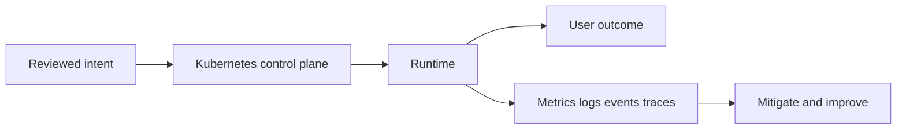
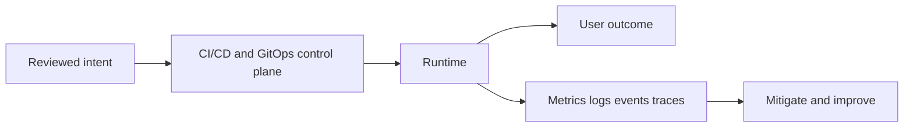

# Staff Platform Engineer Interview Companion

These 97 concrete prompts test mechanism, trade-offs, and incident judgment. Each fictional architecture is an interview aid, not a claim about a real company.


# Kubernetes

## Question

**Walk me through what happens after a Deployment is submitted.**

## 30-Second Answer

I would start by bounding user impact and the last known change, then trace **walk me through what happens after a deployment is submitted** across desired state, control-plane status, runtime evidence, and dependencies. I would mitigate with the smallest reversible action before changing the system permanently.

## Strong Senior Answer

For **Walk me through what happens after a Deployment is submitted**, first define the success signal and timeline. Preserve evidence: deployment revision, artifact digest, audit events, Kubernetes events, relevant metrics, and representative traces. Compare healthy and unhealthy dimensions—zone, node pool, tenant, version, or request class—rather than restarting everything.

Then test hypotheses in dependency order. Confirm source intent, API acceptance, controller convergence, capacity, identity, networking, and serving readiness. Distinguish correlation from causation with a diff and a controlled rollback or traffic shift. Record commands and timestamps. A rollback is a new reviewed change; GitOps does not invent application rollback automatically.

## Staff-Level Expansion

At staff level, **Walk me through what happens after a Deployment is submitted** also requires asking why one fault escaped controls and how architecture limits recurrence. I assign control-plane and workload ownership, define an SLO and error-budget policy, reduce the failure domain, and turn the diagnostic signal into pre-deployment validation or an actionable alert. I also identify organizational coupling: approval latency, undocumented exceptions, unsafe access, or a contract that hides too much.

## Architecture Diagram



## Likely Follow-ups

* Which evidence would falsify your first hypothesis?
* What is the safest mitigation if the control plane is unavailable?
* Which boundary limits blast radius, and who owns it?

## Common Weak Answer

Naming a tool or issuing restarts before defining impact, preserving evidence, checking recent changes, or explaining rollback risk. Another weak answer treats a green process-health probe as proof of a correct user response.

## Experience Prompt

Describe a related decision or incident you personally influenced. State the constraint, your specific action, a measurable operational result, and the durable guardrail added afterward. Be explicit where your example differs from this scenario.

## Question

**How would you troubleshoot Pods stuck in Pending?**

## 30-Second Answer

I would start by bounding user impact and the last known change, then trace **how would you troubleshoot pods stuck in pending** across desired state, control-plane status, runtime evidence, and dependencies. I would mitigate with the smallest reversible action before changing the system permanently.

## Strong Senior Answer

For **How would you troubleshoot Pods stuck in Pending**, first define the success signal and timeline. Preserve evidence: deployment revision, artifact digest, audit events, Kubernetes events, relevant metrics, and representative traces. Compare healthy and unhealthy dimensions—zone, node pool, tenant, version, or request class—rather than restarting everything.

Then test hypotheses in dependency order. Confirm source intent, API acceptance, controller convergence, capacity, identity, networking, and serving readiness. Distinguish correlation from causation with a diff and a controlled rollback or traffic shift. Record commands and timestamps. A rollback is a new reviewed change; GitOps does not invent application rollback automatically.

## Staff-Level Expansion

At staff level, **How would you troubleshoot Pods stuck in Pending** also requires asking why one fault escaped controls and how architecture limits recurrence. I assign control-plane and workload ownership, define an SLO and error-budget policy, reduce the failure domain, and turn the diagnostic signal into pre-deployment validation or an actionable alert. I also identify organizational coupling: approval latency, undocumented exceptions, unsafe access, or a contract that hides too much.

## Architecture Diagram


## Likely Follow-ups

* Which evidence would falsify your first hypothesis?
* What is the safest mitigation if the control plane is unavailable?
* Which boundary limits blast radius, and who owns it?

## Common Weak Answer

Naming a tool or issuing restarts before defining impact, preserving evidence, checking recent changes, or explaining rollback risk. Another weak answer treats a green process-health probe as proof of a correct user response.

## Experience Prompt

Describe a related decision or incident you personally influenced. State the constraint, your specific action, a measurable operational result, and the durable guardrail added afterward. Be explicit where your example differs from this scenario.

## Question

**Why can a Pod be Running but absent from Service endpoints?**

## 30-Second Answer

I would start by bounding user impact and the last known change, then trace **why can a pod be running but absent from service endpoints** across desired state, control-plane status, runtime evidence, and dependencies. I would mitigate with the smallest reversible action before changing the system permanently.

## Strong Senior Answer

For **Why can a Pod be Running but absent from Service endpoints**, first define the success signal and timeline. Preserve evidence: deployment revision, artifact digest, audit events, Kubernetes events, relevant metrics, and representative traces. Compare healthy and unhealthy dimensions—zone, node pool, tenant, version, or request class—rather than restarting everything.

Then test hypotheses in dependency order. Confirm source intent, API acceptance, controller convergence, capacity, identity, networking, and serving readiness. Distinguish correlation from causation with a diff and a controlled rollback or traffic shift. Record commands and timestamps. A rollback is a new reviewed change; GitOps does not invent application rollback automatically.

## Staff-Level Expansion

At staff level, **Why can a Pod be Running but absent from Service endpoints** also requires asking why one fault escaped controls and how architecture limits recurrence. I assign control-plane and workload ownership, define an SLO and error-budget policy, reduce the failure domain, and turn the diagnostic signal into pre-deployment validation or an actionable alert. I also identify organizational coupling: approval latency, undocumented exceptions, unsafe access, or a contract that hides too much.

## Architecture Diagram


## Likely Follow-ups

* Which evidence would falsify your first hypothesis?
* What is the safest mitigation if the control plane is unavailable?
* Which boundary limits blast radius, and who owns it?

## Common Weak Answer

Naming a tool or issuing restarts before defining impact, preserving evidence, checking recent changes, or explaining rollback risk. Another weak answer treats a green process-health probe as proof of a correct user response.

## Experience Prompt

Describe a related decision or incident you personally influenced. State the constraint, your specific action, a measurable operational result, and the durable guardrail added afterward. Be explicit where your example differs from this scenario.

## Question

**How do informers and work queues make controllers scalable?**

## 30-Second Answer

I would start by bounding user impact and the last known change, then trace **how do informers and work queues make controllers scalable** across desired state, control-plane status, runtime evidence, and dependencies. I would mitigate with the smallest reversible action before changing the system permanently.

## Strong Senior Answer

For **How do informers and work queues make controllers scalable**, first define the success signal and timeline. Preserve evidence: deployment revision, artifact digest, audit events, Kubernetes events, relevant metrics, and representative traces. Compare healthy and unhealthy dimensions—zone, node pool, tenant, version, or request class—rather than restarting everything.

Then test hypotheses in dependency order. Confirm source intent, API acceptance, controller convergence, capacity, identity, networking, and serving readiness. Distinguish correlation from causation with a diff and a controlled rollback or traffic shift. Record commands and timestamps. A rollback is a new reviewed change; GitOps does not invent application rollback automatically.

## Staff-Level Expansion

At staff level, **How do informers and work queues make controllers scalable** also requires asking why one fault escaped controls and how architecture limits recurrence. I assign control-plane and workload ownership, define an SLO and error-budget policy, reduce the failure domain, and turn the diagnostic signal into pre-deployment validation or an actionable alert. I also identify organizational coupling: approval latency, undocumented exceptions, unsafe access, or a contract that hides too much.

## Architecture Diagram


## Likely Follow-ups

* Which evidence would falsify your first hypothesis?
* What is the safest mitigation if the control plane is unavailable?
* Which boundary limits blast radius, and who owns it?

## Common Weak Answer

Naming a tool or issuing restarts before defining impact, preserving evidence, checking recent changes, or explaining rollback risk. Another weak answer treats a green process-health probe as proof of a correct user response.

## Experience Prompt

Describe a related decision or incident you personally influenced. State the constraint, your specific action, a measurable operational result, and the durable guardrail added afterward. Be explicit where your example differs from this scenario.

## Question

**How would you design a safe EKS control-plane and node upgrade?**

## 30-Second Answer

I would start by bounding user impact and the last known change, then trace **how would you design a safe eks control-plane and node upgrade** across desired state, control-plane status, runtime evidence, and dependencies. I would mitigate with the smallest reversible action before changing the system permanently.

## Strong Senior Answer

For **How would you design a safe EKS control-plane and node upgrade**, first define the success signal and timeline. Preserve evidence: deployment revision, artifact digest, audit events, Kubernetes events, relevant metrics, and representative traces. Compare healthy and unhealthy dimensions—zone, node pool, tenant, version, or request class—rather than restarting everything.

Then test hypotheses in dependency order. Confirm source intent, API acceptance, controller convergence, capacity, identity, networking, and serving readiness. Distinguish correlation from causation with a diff and a controlled rollback or traffic shift. Record commands and timestamps. A rollback is a new reviewed change; GitOps does not invent application rollback automatically.

## Staff-Level Expansion

At staff level, **How would you design a safe EKS control-plane and node upgrade** also requires asking why one fault escaped controls and how architecture limits recurrence. I assign control-plane and workload ownership, define an SLO and error-budget policy, reduce the failure domain, and turn the diagnostic signal into pre-deployment validation or an actionable alert. I also identify organizational coupling: approval latency, undocumented exceptions, unsafe access, or a contract that hides too much.

## Architecture Diagram


## Likely Follow-ups

* Which evidence would falsify your first hypothesis?
* What is the safest mitigation if the control plane is unavailable?
* Which boundary limits blast radius, and who owns it?

## Common Weak Answer

Naming a tool or issuing restarts before defining impact, preserving evidence, checking recent changes, or explaining rollback risk. Another weak answer treats a green process-health probe as proof of a correct user response.

## Experience Prompt

Describe a related decision or incident you personally influenced. State the constraint, your specific action, a measurable operational result, and the durable guardrail added afterward. Be explicit where your example differs from this scenario.

## Question

**When do taints, affinity, and topology spread solve different problems?**

## 30-Second Answer

I would start by bounding user impact and the last known change, then trace **when do taints, affinity, and topology spread solve different problems** across desired state, control-plane status, runtime evidence, and dependencies. I would mitigate with the smallest reversible action before changing the system permanently.

## Strong Senior Answer

For **When do taints, affinity, and topology spread solve different problems**, first define the success signal and timeline. Preserve evidence: deployment revision, artifact digest, audit events, Kubernetes events, relevant metrics, and representative traces. Compare healthy and unhealthy dimensions—zone, node pool, tenant, version, or request class—rather than restarting everything.

Then test hypotheses in dependency order. Confirm source intent, API acceptance, controller convergence, capacity, identity, networking, and serving readiness. Distinguish correlation from causation with a diff and a controlled rollback or traffic shift. Record commands and timestamps. A rollback is a new reviewed change; GitOps does not invent application rollback automatically.

## Staff-Level Expansion

At staff level, **When do taints, affinity, and topology spread solve different problems** also requires asking why one fault escaped controls and how architecture limits recurrence. I assign control-plane and workload ownership, define an SLO and error-budget policy, reduce the failure domain, and turn the diagnostic signal into pre-deployment validation or an actionable alert. I also identify organizational coupling: approval latency, undocumented exceptions, unsafe access, or a contract that hides too much.

## Architecture Diagram


## Likely Follow-ups

* Which evidence would falsify your first hypothesis?
* What is the safest mitigation if the control plane is unavailable?
* Which boundary limits blast radius, and who owns it?

## Common Weak Answer

Naming a tool or issuing restarts before defining impact, preserving evidence, checking recent changes, or explaining rollback risk. Another weak answer treats a green process-health probe as proof of a correct user response.

## Experience Prompt

Describe a related decision or incident you personally influenced. State the constraint, your specific action, a measurable operational result, and the durable guardrail added afterward. Be explicit where your example differs from this scenario.

## Question

**How do requests, limits, HPA, and node autoscaling interact?**

## 30-Second Answer

I would start by bounding user impact and the last known change, then trace **how do requests, limits, hpa, and node autoscaling interact** across desired state, control-plane status, runtime evidence, and dependencies. I would mitigate with the smallest reversible action before changing the system permanently.

## Strong Senior Answer

For **How do requests, limits, HPA, and node autoscaling interact**, first define the success signal and timeline. Preserve evidence: deployment revision, artifact digest, audit events, Kubernetes events, relevant metrics, and representative traces. Compare healthy and unhealthy dimensions—zone, node pool, tenant, version, or request class—rather than restarting everything.

Then test hypotheses in dependency order. Confirm source intent, API acceptance, controller convergence, capacity, identity, networking, and serving readiness. Distinguish correlation from causation with a diff and a controlled rollback or traffic shift. Record commands and timestamps. A rollback is a new reviewed change; GitOps does not invent application rollback automatically.

## Staff-Level Expansion

At staff level, **How do requests, limits, HPA, and node autoscaling interact** also requires asking why one fault escaped controls and how architecture limits recurrence. I assign control-plane and workload ownership, define an SLO and error-budget policy, reduce the failure domain, and turn the diagnostic signal into pre-deployment validation or an actionable alert. I also identify organizational coupling: approval latency, undocumented exceptions, unsafe access, or a contract that hides too much.

## Architecture Diagram


## Likely Follow-ups

* Which evidence would falsify your first hypothesis?
* What is the safest mitigation if the control plane is unavailable?
* Which boundary limits blast radius, and who owns it?

## Common Weak Answer

Naming a tool or issuing restarts before defining impact, preserving evidence, checking recent changes, or explaining rollback risk. Another weak answer treats a green process-health probe as proof of a correct user response.

## Experience Prompt

Describe a related decision or incident you personally influenced. State the constraint, your specific action, a measurable operational result, and the durable guardrail added afterward. Be explicit where your example differs from this scenario.

## Question

**What happens from a Service virtual IP to a Pod?**

## 30-Second Answer

I would start by bounding user impact and the last known change, then trace **what happens from a service virtual ip to a pod** across desired state, control-plane status, runtime evidence, and dependencies. I would mitigate with the smallest reversible action before changing the system permanently.

## Strong Senior Answer

For **What happens from a Service virtual IP to a Pod**, first define the success signal and timeline. Preserve evidence: deployment revision, artifact digest, audit events, Kubernetes events, relevant metrics, and representative traces. Compare healthy and unhealthy dimensions—zone, node pool, tenant, version, or request class—rather than restarting everything.

Then test hypotheses in dependency order. Confirm source intent, API acceptance, controller convergence, capacity, identity, networking, and serving readiness. Distinguish correlation from causation with a diff and a controlled rollback or traffic shift. Record commands and timestamps. A rollback is a new reviewed change; GitOps does not invent application rollback automatically.

## Staff-Level Expansion

At staff level, **What happens from a Service virtual IP to a Pod** also requires asking why one fault escaped controls and how architecture limits recurrence. I assign control-plane and workload ownership, define an SLO and error-budget policy, reduce the failure domain, and turn the diagnostic signal into pre-deployment validation or an actionable alert. I also identify organizational coupling: approval latency, undocumented exceptions, unsafe access, or a contract that hides too much.

## Architecture Diagram


## Likely Follow-ups

* Which evidence would falsify your first hypothesis?
* What is the safest mitigation if the control plane is unavailable?
* Which boundary limits blast radius, and who owns it?

## Common Weak Answer

Naming a tool or issuing restarts before defining impact, preserving evidence, checking recent changes, or explaining rollback risk. Another weak answer treats a green process-health probe as proof of a correct user response.

## Experience Prompt

Describe a related decision or incident you personally influenced. State the constraint, your specific action, a measurable operational result, and the durable guardrail added afterward. Be explicit where your example differs from this scenario.

## Question

**How would you diagnose intermittent cluster DNS failures?**

## 30-Second Answer

I would start by bounding user impact and the last known change, then trace **how would you diagnose intermittent cluster dns failures** across desired state, control-plane status, runtime evidence, and dependencies. I would mitigate with the smallest reversible action before changing the system permanently.

## Strong Senior Answer

For **How would you diagnose intermittent cluster DNS failures**, first define the success signal and timeline. Preserve evidence: deployment revision, artifact digest, audit events, Kubernetes events, relevant metrics, and representative traces. Compare healthy and unhealthy dimensions—zone, node pool, tenant, version, or request class—rather than restarting everything.

Then test hypotheses in dependency order. Confirm source intent, API acceptance, controller convergence, capacity, identity, networking, and serving readiness. Distinguish correlation from causation with a diff and a controlled rollback or traffic shift. Record commands and timestamps. A rollback is a new reviewed change; GitOps does not invent application rollback automatically.

## Staff-Level Expansion

At staff level, **How would you diagnose intermittent cluster DNS failures** also requires asking why one fault escaped controls and how architecture limits recurrence. I assign control-plane and workload ownership, define an SLO and error-budget policy, reduce the failure domain, and turn the diagnostic signal into pre-deployment validation or an actionable alert. I also identify organizational coupling: approval latency, undocumented exceptions, unsafe access, or a contract that hides too much.

## Architecture Diagram


## Likely Follow-ups

* Which evidence would falsify your first hypothesis?
* What is the safest mitigation if the control plane is unavailable?
* Which boundary limits blast radius, and who owns it?

## Common Weak Answer

Naming a tool or issuing restarts before defining impact, preserving evidence, checking recent changes, or explaining rollback risk. Another weak answer treats a green process-health probe as proof of a correct user response.

## Experience Prompt

Describe a related decision or incident you personally influenced. State the constraint, your specific action, a measurable operational result, and the durable guardrail added afterward. Be explicit where your example differs from this scenario.

## Question

**How do CSI provisioning and volume attachment fail?**

## 30-Second Answer

I would start by bounding user impact and the last known change, then trace **how do csi provisioning and volume attachment fail** across desired state, control-plane status, runtime evidence, and dependencies. I would mitigate with the smallest reversible action before changing the system permanently.

## Strong Senior Answer

For **How do CSI provisioning and volume attachment fail**, first define the success signal and timeline. Preserve evidence: deployment revision, artifact digest, audit events, Kubernetes events, relevant metrics, and representative traces. Compare healthy and unhealthy dimensions—zone, node pool, tenant, version, or request class—rather than restarting everything.

Then test hypotheses in dependency order. Confirm source intent, API acceptance, controller convergence, capacity, identity, networking, and serving readiness. Distinguish correlation from causation with a diff and a controlled rollback or traffic shift. Record commands and timestamps. A rollback is a new reviewed change; GitOps does not invent application rollback automatically.

## Staff-Level Expansion

At staff level, **How do CSI provisioning and volume attachment fail** also requires asking why one fault escaped controls and how architecture limits recurrence. I assign control-plane and workload ownership, define an SLO and error-budget policy, reduce the failure domain, and turn the diagnostic signal into pre-deployment validation or an actionable alert. I also identify organizational coupling: approval latency, undocumented exceptions, unsafe access, or a contract that hides too much.

## Architecture Diagram


## Likely Follow-ups

* Which evidence would falsify your first hypothesis?
* What is the safest mitigation if the control plane is unavailable?
* Which boundary limits blast radius, and who owns it?

## Common Weak Answer

Naming a tool or issuing restarts before defining impact, preserving evidence, checking recent changes, or explaining rollback risk. Another weak answer treats a green process-health probe as proof of a correct user response.

## Experience Prompt

Describe a related decision or incident you personally influenced. State the constraint, your specific action, a measurable operational result, and the durable guardrail added afterward. Be explicit where your example differs from this scenario.

## Question

**How do finalizers and owner references affect deletion?**

## 30-Second Answer

I would start by bounding user impact and the last known change, then trace **how do finalizers and owner references affect deletion** across desired state, control-plane status, runtime evidence, and dependencies. I would mitigate with the smallest reversible action before changing the system permanently.

## Strong Senior Answer

For **How do finalizers and owner references affect deletion**, first define the success signal and timeline. Preserve evidence: deployment revision, artifact digest, audit events, Kubernetes events, relevant metrics, and representative traces. Compare healthy and unhealthy dimensions—zone, node pool, tenant, version, or request class—rather than restarting everything.

Then test hypotheses in dependency order. Confirm source intent, API acceptance, controller convergence, capacity, identity, networking, and serving readiness. Distinguish correlation from causation with a diff and a controlled rollback or traffic shift. Record commands and timestamps. A rollback is a new reviewed change; GitOps does not invent application rollback automatically.

## Staff-Level Expansion

At staff level, **How do finalizers and owner references affect deletion** also requires asking why one fault escaped controls and how architecture limits recurrence. I assign control-plane and workload ownership, define an SLO and error-budget policy, reduce the failure domain, and turn the diagnostic signal into pre-deployment validation or an actionable alert. I also identify organizational coupling: approval latency, undocumented exceptions, unsafe access, or a contract that hides too much.

## Architecture Diagram


## Likely Follow-ups

* Which evidence would falsify your first hypothesis?
* What is the safest mitigation if the control plane is unavailable?
* Which boundary limits blast radius, and who owns it?

## Common Weak Answer

Naming a tool or issuing restarts before defining impact, preserving evidence, checking recent changes, or explaining rollback risk. Another weak answer treats a green process-health probe as proof of a correct user response.

## Experience Prompt

Describe a related decision or incident you personally influenced. State the constraint, your specific action, a measurable operational result, and the durable guardrail added afterward. Be explicit where your example differs from this scenario.

## Question

**When should you build a CRD and controller instead of a service?**

## 30-Second Answer

I would start by bounding user impact and the last known change, then trace **when should you build a crd and controller instead of a service** across desired state, control-plane status, runtime evidence, and dependencies. I would mitigate with the smallest reversible action before changing the system permanently.

## Strong Senior Answer

For **When should you build a CRD and controller instead of a service**, first define the success signal and timeline. Preserve evidence: deployment revision, artifact digest, audit events, Kubernetes events, relevant metrics, and representative traces. Compare healthy and unhealthy dimensions—zone, node pool, tenant, version, or request class—rather than restarting everything.

Then test hypotheses in dependency order. Confirm source intent, API acceptance, controller convergence, capacity, identity, networking, and serving readiness. Distinguish correlation from causation with a diff and a controlled rollback or traffic shift. Record commands and timestamps. A rollback is a new reviewed change; GitOps does not invent application rollback automatically.

## Staff-Level Expansion

At staff level, **When should you build a CRD and controller instead of a service** also requires asking why one fault escaped controls and how architecture limits recurrence. I assign control-plane and workload ownership, define an SLO and error-budget policy, reduce the failure domain, and turn the diagnostic signal into pre-deployment validation or an actionable alert. I also identify organizational coupling: approval latency, undocumented exceptions, unsafe access, or a contract that hides too much.

## Architecture Diagram


## Likely Follow-ups

* Which evidence would falsify your first hypothesis?
* What is the safest mitigation if the control plane is unavailable?
* Which boundary limits blast radius, and who owns it?

## Common Weak Answer

Naming a tool or issuing restarts before defining impact, preserving evidence, checking recent changes, or explaining rollback risk. Another weak answer treats a green process-health probe as proof of a correct user response.

## Experience Prompt

Describe a related decision or incident you personally influenced. State the constraint, your specific action, a measurable operational result, and the durable guardrail added afterward. Be explicit where your example differs from this scenario.

## Question

**How would you secure admission webhooks against an outage?**

## 30-Second Answer

I would start by bounding user impact and the last known change, then trace **how would you secure admission webhooks against an outage** across desired state, control-plane status, runtime evidence, and dependencies. I would mitigate with the smallest reversible action before changing the system permanently.

## Strong Senior Answer

For **How would you secure admission webhooks against an outage**, first define the success signal and timeline. Preserve evidence: deployment revision, artifact digest, audit events, Kubernetes events, relevant metrics, and representative traces. Compare healthy and unhealthy dimensions—zone, node pool, tenant, version, or request class—rather than restarting everything.

Then test hypotheses in dependency order. Confirm source intent, API acceptance, controller convergence, capacity, identity, networking, and serving readiness. Distinguish correlation from causation with a diff and a controlled rollback or traffic shift. Record commands and timestamps. A rollback is a new reviewed change; GitOps does not invent application rollback automatically.

## Staff-Level Expansion

At staff level, **How would you secure admission webhooks against an outage** also requires asking why one fault escaped controls and how architecture limits recurrence. I assign control-plane and workload ownership, define an SLO and error-budget policy, reduce the failure domain, and turn the diagnostic signal into pre-deployment validation or an actionable alert. I also identify organizational coupling: approval latency, undocumented exceptions, unsafe access, or a contract that hides too much.

## Architecture Diagram


## Likely Follow-ups

* Which evidence would falsify your first hypothesis?
* What is the safest mitigation if the control plane is unavailable?
* Which boundary limits blast radius, and who owns it?

## Common Weak Answer

Naming a tool or issuing restarts before defining impact, preserving evidence, checking recent changes, or explaining rollback risk. Another weak answer treats a green process-health probe as proof of a correct user response.

## Experience Prompt

Describe a related decision or incident you personally influenced. State the constraint, your specific action, a measurable operational result, and the durable guardrail added afterward. Be explicit where your example differs from this scenario.

## Question

**Compare Helm packaging with Kustomize overlays.**

## 30-Second Answer

I would start by bounding user impact and the last known change, then trace **compare helm packaging with kustomize overlays** across desired state, control-plane status, runtime evidence, and dependencies. I would mitigate with the smallest reversible action before changing the system permanently.

## Strong Senior Answer

For **Compare Helm packaging with Kustomize overlays**, first define the success signal and timeline. Preserve evidence: deployment revision, artifact digest, audit events, Kubernetes events, relevant metrics, and representative traces. Compare healthy and unhealthy dimensions—zone, node pool, tenant, version, or request class—rather than restarting everything.

Then test hypotheses in dependency order. Confirm source intent, API acceptance, controller convergence, capacity, identity, networking, and serving readiness. Distinguish correlation from causation with a diff and a controlled rollback or traffic shift. Record commands and timestamps. A rollback is a new reviewed change; GitOps does not invent application rollback automatically.

## Staff-Level Expansion

At staff level, **Compare Helm packaging with Kustomize overlays** also requires asking why one fault escaped controls and how architecture limits recurrence. I assign control-plane and workload ownership, define an SLO and error-budget policy, reduce the failure domain, and turn the diagnostic signal into pre-deployment validation or an actionable alert. I also identify organizational coupling: approval latency, undocumented exceptions, unsafe access, or a contract that hides too much.

## Architecture Diagram


## Likely Follow-ups

* Which evidence would falsify your first hypothesis?
* What is the safest mitigation if the control plane is unavailable?
* Which boundary limits blast radius, and who owns it?

## Common Weak Answer

Naming a tool or issuing restarts before defining impact, preserving evidence, checking recent changes, or explaining rollback risk. Another weak answer treats a green process-health probe as proof of a correct user response.

## Experience Prompt

Describe a related decision or incident you personally influenced. State the constraint, your specific action, a measurable operational result, and the durable guardrail added afterward. Be explicit where your example differs from this scenario.

## Question

**When would you avoid a service mesh?**

## 30-Second Answer

I would start by bounding user impact and the last known change, then trace **when would you avoid a service mesh** across desired state, control-plane status, runtime evidence, and dependencies. I would mitigate with the smallest reversible action before changing the system permanently.

## Strong Senior Answer

For **When would you avoid a service mesh**, first define the success signal and timeline. Preserve evidence: deployment revision, artifact digest, audit events, Kubernetes events, relevant metrics, and representative traces. Compare healthy and unhealthy dimensions—zone, node pool, tenant, version, or request class—rather than restarting everything.

Then test hypotheses in dependency order. Confirm source intent, API acceptance, controller convergence, capacity, identity, networking, and serving readiness. Distinguish correlation from causation with a diff and a controlled rollback or traffic shift. Record commands and timestamps. A rollback is a new reviewed change; GitOps does not invent application rollback automatically.

## Staff-Level Expansion

At staff level, **When would you avoid a service mesh** also requires asking why one fault escaped controls and how architecture limits recurrence. I assign control-plane and workload ownership, define an SLO and error-budget policy, reduce the failure domain, and turn the diagnostic signal into pre-deployment validation or an actionable alert. I also identify organizational coupling: approval latency, undocumented exceptions, unsafe access, or a contract that hides too much.

## Architecture Diagram


## Likely Follow-ups

* Which evidence would falsify your first hypothesis?
* What is the safest mitigation if the control plane is unavailable?
* Which boundary limits blast radius, and who owns it?

## Common Weak Answer

Naming a tool or issuing restarts before defining impact, preserving evidence, checking recent changes, or explaining rollback risk. Another weak answer treats a green process-health probe as proof of a correct user response.

## Experience Prompt

Describe a related decision or incident you personally influenced. State the constraint, your specific action, a measurable operational result, and the durable guardrail added afterward. Be explicit where your example differs from this scenario.


# CI/CD and GitOps

## Question

**How do you promote one immutable artifact across environments?**

## 30-Second Answer

I would start by bounding user impact and the last known change, then trace **how do you promote one immutable artifact across environments** across desired state, control-plane status, runtime evidence, and dependencies. I would mitigate with the smallest reversible action before changing the system permanently.

## Strong Senior Answer

For **How do you promote one immutable artifact across environments**, first define the success signal and timeline. Preserve evidence: deployment revision, artifact digest, audit events, Kubernetes events, relevant metrics, and representative traces. Compare healthy and unhealthy dimensions—zone, node pool, tenant, version, or request class—rather than restarting everything.

Then test hypotheses in dependency order. Confirm source intent, API acceptance, controller convergence, capacity, identity, networking, and serving readiness. Distinguish correlation from causation with a diff and a controlled rollback or traffic shift. Record commands and timestamps. A rollback is a new reviewed change; GitOps does not invent application rollback automatically.

## Staff-Level Expansion

At staff level, **How do you promote one immutable artifact across environments** also requires asking why one fault escaped controls and how architecture limits recurrence. I assign control-plane and workload ownership, define an SLO and error-budget policy, reduce the failure domain, and turn the diagnostic signal into pre-deployment validation or an actionable alert. I also identify organizational coupling: approval latency, undocumented exceptions, unsafe access, or a contract that hides too much.

## Architecture Diagram



## Likely Follow-ups

* Which evidence would falsify your first hypothesis?
* What is the safest mitigation if the control plane is unavailable?
* Which boundary limits blast radius, and who owns it?

## Common Weak Answer

Naming a tool or issuing restarts before defining impact, preserving evidence, checking recent changes, or explaining rollback risk. Another weak answer treats a green process-health probe as proof of a correct user response.

## Experience Prompt

Describe a related decision or incident you personally influenced. State the constraint, your specific action, a measurable operational result, and the durable guardrail added afterward. Be explicit where your example differs from this scenario.

## Question

**Argo CD is OutOfSync but the application works; what do you inspect?**

## 30-Second Answer

I would start by bounding user impact and the last known change, then trace **argo cd is outofsync but the application works; what do you inspect** across desired state, control-plane status, runtime evidence, and dependencies. I would mitigate with the smallest reversible action before changing the system permanently.

## Strong Senior Answer

For **Argo CD is OutOfSync but the application works; what do you inspect**, first define the success signal and timeline. Preserve evidence: deployment revision, artifact digest, audit events, Kubernetes events, relevant metrics, and representative traces. Compare healthy and unhealthy dimensions—zone, node pool, tenant, version, or request class—rather than restarting everything.

Then test hypotheses in dependency order. Confirm source intent, API acceptance, controller convergence, capacity, identity, networking, and serving readiness. Distinguish correlation from causation with a diff and a controlled rollback or traffic shift. Record commands and timestamps. A rollback is a new reviewed change; GitOps does not invent application rollback automatically.

## Staff-Level Expansion

At staff level, **Argo CD is OutOfSync but the application works; what do you inspect** also requires asking why one fault escaped controls and how architecture limits recurrence. I assign control-plane and workload ownership, define an SLO and error-budget policy, reduce the failure domain, and turn the diagnostic signal into pre-deployment validation or an actionable alert. I also identify organizational coupling: approval latency, undocumented exceptions, unsafe access, or a contract that hides too much.

## Architecture Diagram


## Likely Follow-ups

* Which evidence would falsify your first hypothesis?
* What is the safest mitigation if the control plane is unavailable?
* Which boundary limits blast radius, and who owns it?

## Common Weak Answer

Naming a tool or issuing restarts before defining impact, preserving evidence, checking recent changes, or explaining rollback risk. Another weak answer treats a green process-health probe as proof of a correct user response.

## Experience Prompt

Describe a related decision or incident you personally influenced. State the constraint, your specific action, a measurable operational result, and the durable guardrail added afterward. Be explicit where your example differs from this scenario.

## Question

**How would you prevent an untrusted pull request from stealing CI credentials?**

## 30-Second Answer

I would start by bounding user impact and the last known change, then trace **how would you prevent an untrusted pull request from stealing ci credentials** across desired state, control-plane status, runtime evidence, and dependencies. I would mitigate with the smallest reversible action before changing the system permanently.

## Strong Senior Answer

For **How would you prevent an untrusted pull request from stealing CI credentials**, first define the success signal and timeline. Preserve evidence: deployment revision, artifact digest, audit events, Kubernetes events, relevant metrics, and representative traces. Compare healthy and unhealthy dimensions—zone, node pool, tenant, version, or request class—rather than restarting everything.

Then test hypotheses in dependency order. Confirm source intent, API acceptance, controller convergence, capacity, identity, networking, and serving readiness. Distinguish correlation from causation with a diff and a controlled rollback or traffic shift. Record commands and timestamps. A rollback is a new reviewed change; GitOps does not invent application rollback automatically.

## Staff-Level Expansion

At staff level, **How would you prevent an untrusted pull request from stealing CI credentials** also requires asking why one fault escaped controls and how architecture limits recurrence. I assign control-plane and workload ownership, define an SLO and error-budget policy, reduce the failure domain, and turn the diagnostic signal into pre-deployment validation or an actionable alert. I also identify organizational coupling: approval latency, undocumented exceptions, unsafe access, or a contract that hides too much.

## Architecture Diagram


## Likely Follow-ups

* Which evidence would falsify your first hypothesis?
* What is the safest mitigation if the control plane is unavailable?
* Which boundary limits blast radius, and who owns it?

## Common Weak Answer

Naming a tool or issuing restarts before defining impact, preserving evidence, checking recent changes, or explaining rollback risk. Another weak answer treats a green process-health probe as proof of a correct user response.

## Experience Prompt

Describe a related decision or incident you personally influenced. State the constraint, your specific action, a measurable operational result, and the durable guardrail added afterward. Be explicit where your example differs from this scenario.

## Question

**Design a pipeline that provides useful evidence in under ten minutes.**

## 30-Second Answer

I would start by bounding user impact and the last known change, then trace **design a pipeline that provides useful evidence in under ten minutes** across desired state, control-plane status, runtime evidence, and dependencies. I would mitigate with the smallest reversible action before changing the system permanently.

## Strong Senior Answer

For **Design a pipeline that provides useful evidence in under ten minutes**, first define the success signal and timeline. Preserve evidence: deployment revision, artifact digest, audit events, Kubernetes events, relevant metrics, and representative traces. Compare healthy and unhealthy dimensions—zone, node pool, tenant, version, or request class—rather than restarting everything.

Then test hypotheses in dependency order. Confirm source intent, API acceptance, controller convergence, capacity, identity, networking, and serving readiness. Distinguish correlation from causation with a diff and a controlled rollback or traffic shift. Record commands and timestamps. A rollback is a new reviewed change; GitOps does not invent application rollback automatically.

## Staff-Level Expansion

At staff level, **Design a pipeline that provides useful evidence in under ten minutes** also requires asking why one fault escaped controls and how architecture limits recurrence. I assign control-plane and workload ownership, define an SLO and error-budget policy, reduce the failure domain, and turn the diagnostic signal into pre-deployment validation or an actionable alert. I also identify organizational coupling: approval latency, undocumented exceptions, unsafe access, or a contract that hides too much.

## Architecture Diagram


## Likely Follow-ups

* Which evidence would falsify your first hypothesis?
* What is the safest mitigation if the control plane is unavailable?
* Which boundary limits blast radius, and who owns it?

## Common Weak Answer

Naming a tool or issuing restarts before defining impact, preserving evidence, checking recent changes, or explaining rollback risk. Another weak answer treats a green process-health probe as proof of a correct user response.

## Experience Prompt

Describe a related decision or incident you personally influenced. State the constraint, your specific action, a measurable operational result, and the durable guardrail added afterward. Be explicit where your example differs from this scenario.

## Question

**How do you make container builds reproducible?**

## 30-Second Answer

I would start by bounding user impact and the last known change, then trace **how do you make container builds reproducible** across desired state, control-plane status, runtime evidence, and dependencies. I would mitigate with the smallest reversible action before changing the system permanently.

## Strong Senior Answer

For **How do you make container builds reproducible**, first define the success signal and timeline. Preserve evidence: deployment revision, artifact digest, audit events, Kubernetes events, relevant metrics, and representative traces. Compare healthy and unhealthy dimensions—zone, node pool, tenant, version, or request class—rather than restarting everything.

Then test hypotheses in dependency order. Confirm source intent, API acceptance, controller convergence, capacity, identity, networking, and serving readiness. Distinguish correlation from causation with a diff and a controlled rollback or traffic shift. Record commands and timestamps. A rollback is a new reviewed change; GitOps does not invent application rollback automatically.

## Staff-Level Expansion

At staff level, **How do you make container builds reproducible** also requires asking why one fault escaped controls and how architecture limits recurrence. I assign control-plane and workload ownership, define an SLO and error-budget policy, reduce the failure domain, and turn the diagnostic signal into pre-deployment validation or an actionable alert. I also identify organizational coupling: approval latency, undocumented exceptions, unsafe access, or a contract that hides too much.

## Architecture Diagram


## Likely Follow-ups

* Which evidence would falsify your first hypothesis?
* What is the safest mitigation if the control plane is unavailable?
* Which boundary limits blast radius, and who owns it?

## Common Weak Answer

Naming a tool or issuing restarts before defining impact, preserving evidence, checking recent changes, or explaining rollback risk. Another weak answer treats a green process-health probe as proof of a correct user response.

## Experience Prompt

Describe a related decision or incident you personally influenced. State the constraint, your specific action, a measurable operational result, and the durable guardrail added afterward. Be explicit where your example differs from this scenario.

## Question

**What should an artifact provenance attestation prove?**

## 30-Second Answer

I would start by bounding user impact and the last known change, then trace **what should an artifact provenance attestation prove** across desired state, control-plane status, runtime evidence, and dependencies. I would mitigate with the smallest reversible action before changing the system permanently.

## Strong Senior Answer

For **What should an artifact provenance attestation prove**, first define the success signal and timeline. Preserve evidence: deployment revision, artifact digest, audit events, Kubernetes events, relevant metrics, and representative traces. Compare healthy and unhealthy dimensions—zone, node pool, tenant, version, or request class—rather than restarting everything.

Then test hypotheses in dependency order. Confirm source intent, API acceptance, controller convergence, capacity, identity, networking, and serving readiness. Distinguish correlation from causation with a diff and a controlled rollback or traffic shift. Record commands and timestamps. A rollback is a new reviewed change; GitOps does not invent application rollback automatically.

## Staff-Level Expansion

At staff level, **What should an artifact provenance attestation prove** also requires asking why one fault escaped controls and how architecture limits recurrence. I assign control-plane and workload ownership, define an SLO and error-budget policy, reduce the failure domain, and turn the diagnostic signal into pre-deployment validation or an actionable alert. I also identify organizational coupling: approval latency, undocumented exceptions, unsafe access, or a contract that hides too much.

## Architecture Diagram

```mermaid
flowchart LR
  Intent6[Reviewed intent] --> Control6[CI/CD and GitOps control plane]
  Control6 --> Runtime6[Runtime]
  Runtime6 --> User6[User outcome]
  Runtime6 --> Evidence6[Metrics logs events traces]
  Evidence6 --> Decision6[Mitigate and improve]
```

## Likely Follow-ups

* Which evidence would falsify your first hypothesis?
* What is the safest mitigation if the control plane is unavailable?
* Which boundary limits blast radius, and who owns it?

## Common Weak Answer

Naming a tool or issuing restarts before defining impact, preserving evidence, checking recent changes, or explaining rollback risk. Another weak answer treats a green process-health probe as proof of a correct user response.

## Experience Prompt

Describe a related decision or incident you personally influenced. State the constraint, your specific action, a measurable operational result, and the durable guardrail added afterward. Be explicit where your example differs from this scenario.

## Question

**How do you roll back a GitOps deployment safely?**

## 30-Second Answer

I would start by bounding user impact and the last known change, then trace **how do you roll back a gitops deployment safely** across desired state, control-plane status, runtime evidence, and dependencies. I would mitigate with the smallest reversible action before changing the system permanently.

## Strong Senior Answer

For **How do you roll back a GitOps deployment safely**, first define the success signal and timeline. Preserve evidence: deployment revision, artifact digest, audit events, Kubernetes events, relevant metrics, and representative traces. Compare healthy and unhealthy dimensions—zone, node pool, tenant, version, or request class—rather than restarting everything.

Then test hypotheses in dependency order. Confirm source intent, API acceptance, controller convergence, capacity, identity, networking, and serving readiness. Distinguish correlation from causation with a diff and a controlled rollback or traffic shift. Record commands and timestamps. A rollback is a new reviewed change; GitOps does not invent application rollback automatically.

## Staff-Level Expansion

At staff level, **How do you roll back a GitOps deployment safely** also requires asking why one fault escaped controls and how architecture limits recurrence. I assign control-plane and workload ownership, define an SLO and error-budget policy, reduce the failure domain, and turn the diagnostic signal into pre-deployment validation or an actionable alert. I also identify organizational coupling: approval latency, undocumented exceptions, unsafe access, or a contract that hides too much.

## Architecture Diagram

```mermaid
flowchart LR
  Intent7[Reviewed intent] --> Control7[CI/CD and GitOps control plane]
  Control7 --> Runtime7[Runtime]
  Runtime7 --> User7[User outcome]
  Runtime7 --> Evidence7[Metrics logs events traces]
  Evidence7 --> Decision7[Mitigate and improve]
```

## Likely Follow-ups

* Which evidence would falsify your first hypothesis?
* What is the safest mitigation if the control plane is unavailable?
* Which boundary limits blast radius, and who owns it?

## Common Weak Answer

Naming a tool or issuing restarts before defining impact, preserving evidence, checking recent changes, or explaining rollback risk. Another weak answer treats a green process-health probe as proof of a correct user response.

## Experience Prompt

Describe a related decision or incident you personally influenced. State the constraint, your specific action, a measurable operational result, and the durable guardrail added afterward. Be explicit where your example differs from this scenario.

## Question

**Compare Argo CD and Flux for a multi-tenant platform.**

## 30-Second Answer

I would start by bounding user impact and the last known change, then trace **compare argo cd and flux for a multi-tenant platform** across desired state, control-plane status, runtime evidence, and dependencies. I would mitigate with the smallest reversible action before changing the system permanently.

## Strong Senior Answer

For **Compare Argo CD and Flux for a multi-tenant platform**, first define the success signal and timeline. Preserve evidence: deployment revision, artifact digest, audit events, Kubernetes events, relevant metrics, and representative traces. Compare healthy and unhealthy dimensions—zone, node pool, tenant, version, or request class—rather than restarting everything.

Then test hypotheses in dependency order. Confirm source intent, API acceptance, controller convergence, capacity, identity, networking, and serving readiness. Distinguish correlation from causation with a diff and a controlled rollback or traffic shift. Record commands and timestamps. A rollback is a new reviewed change; GitOps does not invent application rollback automatically.

## Staff-Level Expansion

At staff level, **Compare Argo CD and Flux for a multi-tenant platform** also requires asking why one fault escaped controls and how architecture limits recurrence. I assign control-plane and workload ownership, define an SLO and error-budget policy, reduce the failure domain, and turn the diagnostic signal into pre-deployment validation or an actionable alert. I also identify organizational coupling: approval latency, undocumented exceptions, unsafe access, or a contract that hides too much.

## Architecture Diagram

```mermaid
flowchart LR
  Intent8[Reviewed intent] --> Control8[CI/CD and GitOps control plane]
  Control8 --> Runtime8[Runtime]
  Runtime8 --> User8[User outcome]
  Runtime8 --> Evidence8[Metrics logs events traces]
  Evidence8 --> Decision8[Mitigate and improve]
```

## Likely Follow-ups

* Which evidence would falsify your first hypothesis?
* What is the safest mitigation if the control plane is unavailable?
* Which boundary limits blast radius, and who owns it?

## Common Weak Answer

Naming a tool or issuing restarts before defining impact, preserving evidence, checking recent changes, or explaining rollback risk. Another weak answer treats a green process-health probe as proof of a correct user response.

## Experience Prompt

Describe a related decision or incident you personally influenced. State the constraint, your specific action, a measurable operational result, and the durable guardrail added afterward. Be explicit where your example differs from this scenario.

## Question

**How do you separate deployment from release?**

## 30-Second Answer

I would start by bounding user impact and the last known change, then trace **how do you separate deployment from release** across desired state, control-plane status, runtime evidence, and dependencies. I would mitigate with the smallest reversible action before changing the system permanently.

## Strong Senior Answer

For **How do you separate deployment from release**, first define the success signal and timeline. Preserve evidence: deployment revision, artifact digest, audit events, Kubernetes events, relevant metrics, and representative traces. Compare healthy and unhealthy dimensions—zone, node pool, tenant, version, or request class—rather than restarting everything.

Then test hypotheses in dependency order. Confirm source intent, API acceptance, controller convergence, capacity, identity, networking, and serving readiness. Distinguish correlation from causation with a diff and a controlled rollback or traffic shift. Record commands and timestamps. A rollback is a new reviewed change; GitOps does not invent application rollback automatically.

## Staff-Level Expansion

At staff level, **How do you separate deployment from release** also requires asking why one fault escaped controls and how architecture limits recurrence. I assign control-plane and workload ownership, define an SLO and error-budget policy, reduce the failure domain, and turn the diagnostic signal into pre-deployment validation or an actionable alert. I also identify organizational coupling: approval latency, undocumented exceptions, unsafe access, or a contract that hides too much.

## Architecture Diagram

```mermaid
flowchart LR
  Intent9[Reviewed intent] --> Control9[CI/CD and GitOps control plane]
  Control9 --> Runtime9[Runtime]
  Runtime9 --> User9[User outcome]
  Runtime9 --> Evidence9[Metrics logs events traces]
  Evidence9 --> Decision9[Mitigate and improve]
```

## Likely Follow-ups

* Which evidence would falsify your first hypothesis?
* What is the safest mitigation if the control plane is unavailable?
* Which boundary limits blast radius, and who owns it?

## Common Weak Answer

Naming a tool or issuing restarts before defining impact, preserving evidence, checking recent changes, or explaining rollback risk. Another weak answer treats a green process-health probe as proof of a correct user response.

## Experience Prompt

Describe a related decision or incident you personally influenced. State the constraint, your specific action, a measurable operational result, and the durable guardrail added afterward. Be explicit where your example differs from this scenario.

## Question

**When is blue-green safer than a canary?**

## 30-Second Answer

I would start by bounding user impact and the last known change, then trace **when is blue-green safer than a canary** across desired state, control-plane status, runtime evidence, and dependencies. I would mitigate with the smallest reversible action before changing the system permanently.

## Strong Senior Answer

For **When is blue-green safer than a canary**, first define the success signal and timeline. Preserve evidence: deployment revision, artifact digest, audit events, Kubernetes events, relevant metrics, and representative traces. Compare healthy and unhealthy dimensions—zone, node pool, tenant, version, or request class—rather than restarting everything.

Then test hypotheses in dependency order. Confirm source intent, API acceptance, controller convergence, capacity, identity, networking, and serving readiness. Distinguish correlation from causation with a diff and a controlled rollback or traffic shift. Record commands and timestamps. A rollback is a new reviewed change; GitOps does not invent application rollback automatically.

## Staff-Level Expansion

At staff level, **When is blue-green safer than a canary** also requires asking why one fault escaped controls and how architecture limits recurrence. I assign control-plane and workload ownership, define an SLO and error-budget policy, reduce the failure domain, and turn the diagnostic signal into pre-deployment validation or an actionable alert. I also identify organizational coupling: approval latency, undocumented exceptions, unsafe access, or a contract that hides too much.

## Architecture Diagram

```mermaid
flowchart LR
  Intent10[Reviewed intent] --> Control10[CI/CD and GitOps control plane]
  Control10 --> Runtime10[Runtime]
  Runtime10 --> User10[User outcome]
  Runtime10 --> Evidence10[Metrics logs events traces]
  Evidence10 --> Decision10[Mitigate and improve]
```

## Likely Follow-ups

* Which evidence would falsify your first hypothesis?
* What is the safest mitigation if the control plane is unavailable?
* Which boundary limits blast radius, and who owns it?

## Common Weak Answer

Naming a tool or issuing restarts before defining impact, preserving evidence, checking recent changes, or explaining rollback risk. Another weak answer treats a green process-health probe as proof of a correct user response.

## Experience Prompt

Describe a related decision or incident you personally influenced. State the constraint, your specific action, a measurable operational result, and the durable guardrail added afterward. Be explicit where your example differs from this scenario.

## Question

**How would you detect and control configuration drift?**

## 30-Second Answer

I would start by bounding user impact and the last known change, then trace **how would you detect and control configuration drift** across desired state, control-plane status, runtime evidence, and dependencies. I would mitigate with the smallest reversible action before changing the system permanently.

## Strong Senior Answer

For **How would you detect and control configuration drift**, first define the success signal and timeline. Preserve evidence: deployment revision, artifact digest, audit events, Kubernetes events, relevant metrics, and representative traces. Compare healthy and unhealthy dimensions—zone, node pool, tenant, version, or request class—rather than restarting everything.

Then test hypotheses in dependency order. Confirm source intent, API acceptance, controller convergence, capacity, identity, networking, and serving readiness. Distinguish correlation from causation with a diff and a controlled rollback or traffic shift. Record commands and timestamps. A rollback is a new reviewed change; GitOps does not invent application rollback automatically.

## Staff-Level Expansion

At staff level, **How would you detect and control configuration drift** also requires asking why one fault escaped controls and how architecture limits recurrence. I assign control-plane and workload ownership, define an SLO and error-budget policy, reduce the failure domain, and turn the diagnostic signal into pre-deployment validation or an actionable alert. I also identify organizational coupling: approval latency, undocumented exceptions, unsafe access, or a contract that hides too much.

## Architecture Diagram

```mermaid
flowchart LR
  Intent11[Reviewed intent] --> Control11[CI/CD and GitOps control plane]
  Control11 --> Runtime11[Runtime]
  Runtime11 --> User11[User outcome]
  Runtime11 --> Evidence11[Metrics logs events traces]
  Evidence11 --> Decision11[Mitigate and improve]
```

## Likely Follow-ups

* Which evidence would falsify your first hypothesis?
* What is the safest mitigation if the control plane is unavailable?
* Which boundary limits blast radius, and who owns it?

## Common Weak Answer

Naming a tool or issuing restarts before defining impact, preserving evidence, checking recent changes, or explaining rollback risk. Another weak answer treats a green process-health probe as proof of a correct user response.

## Experience Prompt

Describe a related decision or incident you personally influenced. State the constraint, your specific action, a measurable operational result, and the durable guardrail added afterward. Be explicit where your example differs from this scenario.

## Question

**How do you rotate a signing key without stopping delivery?**

## 30-Second Answer

I would start by bounding user impact and the last known change, then trace **how do you rotate a signing key without stopping delivery** across desired state, control-plane status, runtime evidence, and dependencies. I would mitigate with the smallest reversible action before changing the system permanently.

## Strong Senior Answer

For **How do you rotate a signing key without stopping delivery**, first define the success signal and timeline. Preserve evidence: deployment revision, artifact digest, audit events, Kubernetes events, relevant metrics, and representative traces. Compare healthy and unhealthy dimensions—zone, node pool, tenant, version, or request class—rather than restarting everything.

Then test hypotheses in dependency order. Confirm source intent, API acceptance, controller convergence, capacity, identity, networking, and serving readiness. Distinguish correlation from causation with a diff and a controlled rollback or traffic shift. Record commands and timestamps. A rollback is a new reviewed change; GitOps does not invent application rollback automatically.

## Staff-Level Expansion

At staff level, **How do you rotate a signing key without stopping delivery** also requires asking why one fault escaped controls and how architecture limits recurrence. I assign control-plane and workload ownership, define an SLO and error-budget policy, reduce the failure domain, and turn the diagnostic signal into pre-deployment validation or an actionable alert. I also identify organizational coupling: approval latency, undocumented exceptions, unsafe access, or a contract that hides too much.

## Architecture Diagram

```mermaid
flowchart LR
  Intent12[Reviewed intent] --> Control12[CI/CD and GitOps control plane]
  Control12 --> Runtime12[Runtime]
  Runtime12 --> User12[User outcome]
  Runtime12 --> Evidence12[Metrics logs events traces]
  Evidence12 --> Decision12[Mitigate and improve]
```

## Likely Follow-ups

* Which evidence would falsify your first hypothesis?
* What is the safest mitigation if the control plane is unavailable?
* Which boundary limits blast radius, and who owns it?

## Common Weak Answer

Naming a tool or issuing restarts before defining impact, preserving evidence, checking recent changes, or explaining rollback risk. Another weak answer treats a green process-health probe as proof of a correct user response.

## Experience Prompt

Describe a related decision or incident you personally influenced. State the constraint, your specific action, a measurable operational result, and the durable guardrail added afterward. Be explicit where your example differs from this scenario.


# Terraform and IaC

## Question

**How would you design Terraform state for multiple teams and AWS accounts?**

## 30-Second Answer

I would start by bounding user impact and the last known change, then trace **how would you design terraform state for multiple teams and aws accounts** across desired state, control-plane status, runtime evidence, and dependencies. I would mitigate with the smallest reversible action before changing the system permanently.

## Strong Senior Answer

For **How would you design Terraform state for multiple teams and AWS accounts**, first define the success signal and timeline. Preserve evidence: deployment revision, artifact digest, audit events, Kubernetes events, relevant metrics, and representative traces. Compare healthy and unhealthy dimensions—zone, node pool, tenant, version, or request class—rather than restarting everything.

Then test hypotheses in dependency order. Confirm source intent, API acceptance, controller convergence, capacity, identity, networking, and serving readiness. Distinguish correlation from causation with a diff and a controlled rollback or traffic shift. Record commands and timestamps. A rollback is a new reviewed change; GitOps does not invent application rollback automatically.

## Staff-Level Expansion

At staff level, **How would you design Terraform state for multiple teams and AWS accounts** also requires asking why one fault escaped controls and how architecture limits recurrence. I assign control-plane and workload ownership, define an SLO and error-budget policy, reduce the failure domain, and turn the diagnostic signal into pre-deployment validation or an actionable alert. I also identify organizational coupling: approval latency, undocumented exceptions, unsafe access, or a contract that hides too much.

## Architecture Diagram

```mermaid
flowchart LR
  Intent1[Reviewed intent] --> Control1[Terraform and IaC control plane]
  Control1 --> Runtime1[Runtime]
  Runtime1 --> User1[User outcome]
  Runtime1 --> Evidence1[Metrics logs events traces]
  Evidence1 --> Decision1[Mitigate and improve]
```

## Likely Follow-ups

* Which evidence would falsify your first hypothesis?
* What is the safest mitigation if the control plane is unavailable?
* Which boundary limits blast radius, and who owns it?

## Common Weak Answer

Naming a tool or issuing restarts before defining impact, preserving evidence, checking recent changes, or explaining rollback risk. Another weak answer treats a green process-health probe as proof of a correct user response.

## Experience Prompt

Describe a related decision or incident you personally influenced. State the constraint, your specific action, a measurable operational result, and the durable guardrail added afterward. Be explicit where your example differs from this scenario.

## Question

**A Terraform state lock is stale during an incident; what do you do?**

## 30-Second Answer

I would start by bounding user impact and the last known change, then trace **a terraform state lock is stale during an incident; what do you do** across desired state, control-plane status, runtime evidence, and dependencies. I would mitigate with the smallest reversible action before changing the system permanently.

## Strong Senior Answer

For **A Terraform state lock is stale during an incident; what do you do**, first define the success signal and timeline. Preserve evidence: deployment revision, artifact digest, audit events, Kubernetes events, relevant metrics, and representative traces. Compare healthy and unhealthy dimensions—zone, node pool, tenant, version, or request class—rather than restarting everything.

Then test hypotheses in dependency order. Confirm source intent, API acceptance, controller convergence, capacity, identity, networking, and serving readiness. Distinguish correlation from causation with a diff and a controlled rollback or traffic shift. Record commands and timestamps. A rollback is a new reviewed change; GitOps does not invent application rollback automatically.

## Staff-Level Expansion

At staff level, **A Terraform state lock is stale during an incident; what do you do** also requires asking why one fault escaped controls and how architecture limits recurrence. I assign control-plane and workload ownership, define an SLO and error-budget policy, reduce the failure domain, and turn the diagnostic signal into pre-deployment validation or an actionable alert. I also identify organizational coupling: approval latency, undocumented exceptions, unsafe access, or a contract that hides too much.

## Architecture Diagram

```mermaid
flowchart LR
  Intent2[Reviewed intent] --> Control2[Terraform and IaC control plane]
  Control2 --> Runtime2[Runtime]
  Runtime2 --> User2[User outcome]
  Runtime2 --> Evidence2[Metrics logs events traces]
  Evidence2 --> Decision2[Mitigate and improve]
```

## Likely Follow-ups

* Which evidence would falsify your first hypothesis?
* What is the safest mitigation if the control plane is unavailable?
* Which boundary limits blast radius, and who owns it?

## Common Weak Answer

Naming a tool or issuing restarts before defining impact, preserving evidence, checking recent changes, or explaining rollback risk. Another weak answer treats a green process-health probe as proof of a correct user response.

## Experience Prompt

Describe a related decision or incident you personally influenced. State the constraint, your specific action, a measurable operational result, and the durable guardrail added afterward. Be explicit where your example differs from this scenario.

## Question

**How do plan, refresh, and apply relate to remote reality?**

## 30-Second Answer

I would start by bounding user impact and the last known change, then trace **how do plan, refresh, and apply relate to remote reality** across desired state, control-plane status, runtime evidence, and dependencies. I would mitigate with the smallest reversible action before changing the system permanently.

## Strong Senior Answer

For **How do plan, refresh, and apply relate to remote reality**, first define the success signal and timeline. Preserve evidence: deployment revision, artifact digest, audit events, Kubernetes events, relevant metrics, and representative traces. Compare healthy and unhealthy dimensions—zone, node pool, tenant, version, or request class—rather than restarting everything.

Then test hypotheses in dependency order. Confirm source intent, API acceptance, controller convergence, capacity, identity, networking, and serving readiness. Distinguish correlation from causation with a diff and a controlled rollback or traffic shift. Record commands and timestamps. A rollback is a new reviewed change; GitOps does not invent application rollback automatically.

## Staff-Level Expansion

At staff level, **How do plan, refresh, and apply relate to remote reality** also requires asking why one fault escaped controls and how architecture limits recurrence. I assign control-plane and workload ownership, define an SLO and error-budget policy, reduce the failure domain, and turn the diagnostic signal into pre-deployment validation or an actionable alert. I also identify organizational coupling: approval latency, undocumented exceptions, unsafe access, or a contract that hides too much.

## Architecture Diagram

```mermaid
flowchart LR
  Intent3[Reviewed intent] --> Control3[Terraform and IaC control plane]
  Control3 --> Runtime3[Runtime]
  Runtime3 --> User3[User outcome]
  Runtime3 --> Evidence3[Metrics logs events traces]
  Evidence3 --> Decision3[Mitigate and improve]
```

## Likely Follow-ups

* Which evidence would falsify your first hypothesis?
* What is the safest mitigation if the control plane is unavailable?
* Which boundary limits blast radius, and who owns it?

## Common Weak Answer

Naming a tool or issuing restarts before defining impact, preserving evidence, checking recent changes, or explaining rollback risk. Another weak answer treats a green process-health probe as proof of a correct user response.

## Experience Prompt

Describe a related decision or incident you personally influenced. State the constraint, your specific action, a measurable operational result, and the durable guardrail added afterward. Be explicit where your example differs from this scenario.

## Question

**How would you recover a resource accidentally removed from state?**

## 30-Second Answer

I would start by bounding user impact and the last known change, then trace **how would you recover a resource accidentally removed from state** across desired state, control-plane status, runtime evidence, and dependencies. I would mitigate with the smallest reversible action before changing the system permanently.

## Strong Senior Answer

For **How would you recover a resource accidentally removed from state**, first define the success signal and timeline. Preserve evidence: deployment revision, artifact digest, audit events, Kubernetes events, relevant metrics, and representative traces. Compare healthy and unhealthy dimensions—zone, node pool, tenant, version, or request class—rather than restarting everything.

Then test hypotheses in dependency order. Confirm source intent, API acceptance, controller convergence, capacity, identity, networking, and serving readiness. Distinguish correlation from causation with a diff and a controlled rollback or traffic shift. Record commands and timestamps. A rollback is a new reviewed change; GitOps does not invent application rollback automatically.

## Staff-Level Expansion

At staff level, **How would you recover a resource accidentally removed from state** also requires asking why one fault escaped controls and how architecture limits recurrence. I assign control-plane and workload ownership, define an SLO and error-budget policy, reduce the failure domain, and turn the diagnostic signal into pre-deployment validation or an actionable alert. I also identify organizational coupling: approval latency, undocumented exceptions, unsafe access, or a contract that hides too much.

## Architecture Diagram

```mermaid
flowchart LR
  Intent4[Reviewed intent] --> Control4[Terraform and IaC control plane]
  Control4 --> Runtime4[Runtime]
  Runtime4 --> User4[User outcome]
  Runtime4 --> Evidence4[Metrics logs events traces]
  Evidence4 --> Decision4[Mitigate and improve]
```

## Likely Follow-ups

* Which evidence would falsify your first hypothesis?
* What is the safest mitigation if the control plane is unavailable?
* Which boundary limits blast radius, and who owns it?

## Common Weak Answer

Naming a tool or issuing restarts before defining impact, preserving evidence, checking recent changes, or explaining rollback risk. Another weak answer treats a green process-health probe as proof of a correct user response.

## Experience Prompt

Describe a related decision or incident you personally influenced. State the constraint, your specific action, a measurable operational result, and the durable guardrail added afterward. Be explicit where your example differs from this scenario.

## Question

**What belongs in a reusable Terraform module?**

## 30-Second Answer

I would start by bounding user impact and the last known change, then trace **what belongs in a reusable terraform module** across desired state, control-plane status, runtime evidence, and dependencies. I would mitigate with the smallest reversible action before changing the system permanently.

## Strong Senior Answer

For **What belongs in a reusable Terraform module**, first define the success signal and timeline. Preserve evidence: deployment revision, artifact digest, audit events, Kubernetes events, relevant metrics, and representative traces. Compare healthy and unhealthy dimensions—zone, node pool, tenant, version, or request class—rather than restarting everything.

Then test hypotheses in dependency order. Confirm source intent, API acceptance, controller convergence, capacity, identity, networking, and serving readiness. Distinguish correlation from causation with a diff and a controlled rollback or traffic shift. Record commands and timestamps. A rollback is a new reviewed change; GitOps does not invent application rollback automatically.

## Staff-Level Expansion

At staff level, **What belongs in a reusable Terraform module** also requires asking why one fault escaped controls and how architecture limits recurrence. I assign control-plane and workload ownership, define an SLO and error-budget policy, reduce the failure domain, and turn the diagnostic signal into pre-deployment validation or an actionable alert. I also identify organizational coupling: approval latency, undocumented exceptions, unsafe access, or a contract that hides too much.

## Architecture Diagram

```mermaid
flowchart LR
  Intent5[Reviewed intent] --> Control5[Terraform and IaC control plane]
  Control5 --> Runtime5[Runtime]
  Runtime5 --> User5[User outcome]
  Runtime5 --> Evidence5[Metrics logs events traces]
  Evidence5 --> Decision5[Mitigate and improve]
```

## Likely Follow-ups

* Which evidence would falsify your first hypothesis?
* What is the safest mitigation if the control plane is unavailable?
* Which boundary limits blast radius, and who owns it?

## Common Weak Answer

Naming a tool or issuing restarts before defining impact, preserving evidence, checking recent changes, or explaining rollback risk. Another weak answer treats a green process-health probe as proof of a correct user response.

## Experience Prompt

Describe a related decision or incident you personally influenced. State the constraint, your specific action, a measurable operational result, and the durable guardrail added afterward. Be explicit where your example differs from this scenario.

## Question

**How do provider aliases support multi-account deployments?**

## 30-Second Answer

I would start by bounding user impact and the last known change, then trace **how do provider aliases support multi-account deployments** across desired state, control-plane status, runtime evidence, and dependencies. I would mitigate with the smallest reversible action before changing the system permanently.

## Strong Senior Answer

For **How do provider aliases support multi-account deployments**, first define the success signal and timeline. Preserve evidence: deployment revision, artifact digest, audit events, Kubernetes events, relevant metrics, and representative traces. Compare healthy and unhealthy dimensions—zone, node pool, tenant, version, or request class—rather than restarting everything.

Then test hypotheses in dependency order. Confirm source intent, API acceptance, controller convergence, capacity, identity, networking, and serving readiness. Distinguish correlation from causation with a diff and a controlled rollback or traffic shift. Record commands and timestamps. A rollback is a new reviewed change; GitOps does not invent application rollback automatically.

## Staff-Level Expansion

At staff level, **How do provider aliases support multi-account deployments** also requires asking why one fault escaped controls and how architecture limits recurrence. I assign control-plane and workload ownership, define an SLO and error-budget policy, reduce the failure domain, and turn the diagnostic signal into pre-deployment validation or an actionable alert. I also identify organizational coupling: approval latency, undocumented exceptions, unsafe access, or a contract that hides too much.

## Architecture Diagram

```mermaid
flowchart LR
  Intent6[Reviewed intent] --> Control6[Terraform and IaC control plane]
  Control6 --> Runtime6[Runtime]
  Runtime6 --> User6[User outcome]
  Runtime6 --> Evidence6[Metrics logs events traces]
  Evidence6 --> Decision6[Mitigate and improve]
```

## Likely Follow-ups

* Which evidence would falsify your first hypothesis?
* What is the safest mitigation if the control plane is unavailable?
* Which boundary limits blast radius, and who owns it?

## Common Weak Answer

Naming a tool or issuing restarts before defining impact, preserving evidence, checking recent changes, or explaining rollback risk. Another weak answer treats a green process-health probe as proof of a correct user response.

## Experience Prompt

Describe a related decision or incident you personally influenced. State the constraint, your specific action, a measurable operational result, and the durable guardrail added afterward. Be explicit where your example differs from this scenario.

## Question

**How do you introduce moved blocks during a refactor?**

## 30-Second Answer

I would start by bounding user impact and the last known change, then trace **how do you introduce moved blocks during a refactor** across desired state, control-plane status, runtime evidence, and dependencies. I would mitigate with the smallest reversible action before changing the system permanently.

## Strong Senior Answer

For **How do you introduce moved blocks during a refactor**, first define the success signal and timeline. Preserve evidence: deployment revision, artifact digest, audit events, Kubernetes events, relevant metrics, and representative traces. Compare healthy and unhealthy dimensions—zone, node pool, tenant, version, or request class—rather than restarting everything.

Then test hypotheses in dependency order. Confirm source intent, API acceptance, controller convergence, capacity, identity, networking, and serving readiness. Distinguish correlation from causation with a diff and a controlled rollback or traffic shift. Record commands and timestamps. A rollback is a new reviewed change; GitOps does not invent application rollback automatically.

## Staff-Level Expansion

At staff level, **How do you introduce moved blocks during a refactor** also requires asking why one fault escaped controls and how architecture limits recurrence. I assign control-plane and workload ownership, define an SLO and error-budget policy, reduce the failure domain, and turn the diagnostic signal into pre-deployment validation or an actionable alert. I also identify organizational coupling: approval latency, undocumented exceptions, unsafe access, or a contract that hides too much.

## Architecture Diagram

```mermaid
flowchart LR
  Intent7[Reviewed intent] --> Control7[Terraform and IaC control plane]
  Control7 --> Runtime7[Runtime]
  Runtime7 --> User7[User outcome]
  Runtime7 --> Evidence7[Metrics logs events traces]
  Evidence7 --> Decision7[Mitigate and improve]
```

## Likely Follow-ups

* Which evidence would falsify your first hypothesis?
* What is the safest mitigation if the control plane is unavailable?
* Which boundary limits blast radius, and who owns it?

## Common Weak Answer

Naming a tool or issuing restarts before defining impact, preserving evidence, checking recent changes, or explaining rollback risk. Another weak answer treats a green process-health probe as proof of a correct user response.

## Experience Prompt

Describe a related decision or incident you personally influenced. State the constraint, your specific action, a measurable operational result, and the durable guardrail added afterward. Be explicit where your example differs from this scenario.

## Question

**When is create_before_destroy unsafe?**

## 30-Second Answer

I would start by bounding user impact and the last known change, then trace **when is create_before_destroy unsafe** across desired state, control-plane status, runtime evidence, and dependencies. I would mitigate with the smallest reversible action before changing the system permanently.

## Strong Senior Answer

For **When is create_before_destroy unsafe**, first define the success signal and timeline. Preserve evidence: deployment revision, artifact digest, audit events, Kubernetes events, relevant metrics, and representative traces. Compare healthy and unhealthy dimensions—zone, node pool, tenant, version, or request class—rather than restarting everything.

Then test hypotheses in dependency order. Confirm source intent, API acceptance, controller convergence, capacity, identity, networking, and serving readiness. Distinguish correlation from causation with a diff and a controlled rollback or traffic shift. Record commands and timestamps. A rollback is a new reviewed change; GitOps does not invent application rollback automatically.

## Staff-Level Expansion

At staff level, **When is create_before_destroy unsafe** also requires asking why one fault escaped controls and how architecture limits recurrence. I assign control-plane and workload ownership, define an SLO and error-budget policy, reduce the failure domain, and turn the diagnostic signal into pre-deployment validation or an actionable alert. I also identify organizational coupling: approval latency, undocumented exceptions, unsafe access, or a contract that hides too much.

## Architecture Diagram

```mermaid
flowchart LR
  Intent8[Reviewed intent] --> Control8[Terraform and IaC control plane]
  Control8 --> Runtime8[Runtime]
  Runtime8 --> User8[User outcome]
  Runtime8 --> Evidence8[Metrics logs events traces]
  Evidence8 --> Decision8[Mitigate and improve]
```

## Likely Follow-ups

* Which evidence would falsify your first hypothesis?
* What is the safest mitigation if the control plane is unavailable?
* Which boundary limits blast radius, and who owns it?

## Common Weak Answer

Naming a tool or issuing restarts before defining impact, preserving evidence, checking recent changes, or explaining rollback risk. Another weak answer treats a green process-health probe as proof of a correct user response.

## Experience Prompt

Describe a related decision or incident you personally influenced. State the constraint, your specific action, a measurable operational result, and the durable guardrail added afterward. Be explicit where your example differs from this scenario.

## Question

**How do you detect drift without blindly applying it?**

## 30-Second Answer

I would start by bounding user impact and the last known change, then trace **how do you detect drift without blindly applying it** across desired state, control-plane status, runtime evidence, and dependencies. I would mitigate with the smallest reversible action before changing the system permanently.

## Strong Senior Answer

For **How do you detect drift without blindly applying it**, first define the success signal and timeline. Preserve evidence: deployment revision, artifact digest, audit events, Kubernetes events, relevant metrics, and representative traces. Compare healthy and unhealthy dimensions—zone, node pool, tenant, version, or request class—rather than restarting everything.

Then test hypotheses in dependency order. Confirm source intent, API acceptance, controller convergence, capacity, identity, networking, and serving readiness. Distinguish correlation from causation with a diff and a controlled rollback or traffic shift. Record commands and timestamps. A rollback is a new reviewed change; GitOps does not invent application rollback automatically.

## Staff-Level Expansion

At staff level, **How do you detect drift without blindly applying it** also requires asking why one fault escaped controls and how architecture limits recurrence. I assign control-plane and workload ownership, define an SLO and error-budget policy, reduce the failure domain, and turn the diagnostic signal into pre-deployment validation or an actionable alert. I also identify organizational coupling: approval latency, undocumented exceptions, unsafe access, or a contract that hides too much.

## Architecture Diagram

```mermaid
flowchart LR
  Intent9[Reviewed intent] --> Control9[Terraform and IaC control plane]
  Control9 --> Runtime9[Runtime]
  Runtime9 --> User9[User outcome]
  Runtime9 --> Evidence9[Metrics logs events traces]
  Evidence9 --> Decision9[Mitigate and improve]
```

## Likely Follow-ups

* Which evidence would falsify your first hypothesis?
* What is the safest mitigation if the control plane is unavailable?
* Which boundary limits blast radius, and who owns it?

## Common Weak Answer

Naming a tool or issuing restarts before defining impact, preserving evidence, checking recent changes, or explaining rollback risk. Another weak answer treats a green process-health probe as proof of a correct user response.

## Experience Prompt

Describe a related decision or incident you personally influenced. State the constraint, your specific action, a measurable operational result, and the durable guardrail added afterward. Be explicit where your example differs from this scenario.

## Question

**Compare Terraform, CloudFormation, and Crossplane boundaries.**

## 30-Second Answer

I would start by bounding user impact and the last known change, then trace **compare terraform, cloudformation, and crossplane boundaries** across desired state, control-plane status, runtime evidence, and dependencies. I would mitigate with the smallest reversible action before changing the system permanently.

## Strong Senior Answer

For **Compare Terraform, CloudFormation, and Crossplane boundaries**, first define the success signal and timeline. Preserve evidence: deployment revision, artifact digest, audit events, Kubernetes events, relevant metrics, and representative traces. Compare healthy and unhealthy dimensions—zone, node pool, tenant, version, or request class—rather than restarting everything.

Then test hypotheses in dependency order. Confirm source intent, API acceptance, controller convergence, capacity, identity, networking, and serving readiness. Distinguish correlation from causation with a diff and a controlled rollback or traffic shift. Record commands and timestamps. A rollback is a new reviewed change; GitOps does not invent application rollback automatically.

## Staff-Level Expansion

At staff level, **Compare Terraform, CloudFormation, and Crossplane boundaries** also requires asking why one fault escaped controls and how architecture limits recurrence. I assign control-plane and workload ownership, define an SLO and error-budget policy, reduce the failure domain, and turn the diagnostic signal into pre-deployment validation or an actionable alert. I also identify organizational coupling: approval latency, undocumented exceptions, unsafe access, or a contract that hides too much.

## Architecture Diagram

```mermaid
flowchart LR
  Intent10[Reviewed intent] --> Control10[Terraform and IaC control plane]
  Control10 --> Runtime10[Runtime]
  Runtime10 --> User10[User outcome]
  Runtime10 --> Evidence10[Metrics logs events traces]
  Evidence10 --> Decision10[Mitigate and improve]
```

## Likely Follow-ups

* Which evidence would falsify your first hypothesis?
* What is the safest mitigation if the control plane is unavailable?
* Which boundary limits blast radius, and who owns it?

## Common Weak Answer

Naming a tool or issuing restarts before defining impact, preserving evidence, checking recent changes, or explaining rollback risk. Another weak answer treats a green process-health probe as proof of a correct user response.

## Experience Prompt

Describe a related decision or incident you personally influenced. State the constraint, your specific action, a measurable operational result, and the durable guardrail added afterward. Be explicit where your example differs from this scenario.

## Question

**When is Ansible preferable to image baking or cloud-init?**

## 30-Second Answer

I would start by bounding user impact and the last known change, then trace **when is ansible preferable to image baking or cloud-init** across desired state, control-plane status, runtime evidence, and dependencies. I would mitigate with the smallest reversible action before changing the system permanently.

## Strong Senior Answer

For **When is Ansible preferable to image baking or cloud-init**, first define the success signal and timeline. Preserve evidence: deployment revision, artifact digest, audit events, Kubernetes events, relevant metrics, and representative traces. Compare healthy and unhealthy dimensions—zone, node pool, tenant, version, or request class—rather than restarting everything.

Then test hypotheses in dependency order. Confirm source intent, API acceptance, controller convergence, capacity, identity, networking, and serving readiness. Distinguish correlation from causation with a diff and a controlled rollback or traffic shift. Record commands and timestamps. A rollback is a new reviewed change; GitOps does not invent application rollback automatically.

## Staff-Level Expansion

At staff level, **When is Ansible preferable to image baking or cloud-init** also requires asking why one fault escaped controls and how architecture limits recurrence. I assign control-plane and workload ownership, define an SLO and error-budget policy, reduce the failure domain, and turn the diagnostic signal into pre-deployment validation or an actionable alert. I also identify organizational coupling: approval latency, undocumented exceptions, unsafe access, or a contract that hides too much.

## Architecture Diagram

```mermaid
flowchart LR
  Intent11[Reviewed intent] --> Control11[Terraform and IaC control plane]
  Control11 --> Runtime11[Runtime]
  Runtime11 --> User11[User outcome]
  Runtime11 --> Evidence11[Metrics logs events traces]
  Evidence11 --> Decision11[Mitigate and improve]
```

## Likely Follow-ups

* Which evidence would falsify your first hypothesis?
* What is the safest mitigation if the control plane is unavailable?
* Which boundary limits blast radius, and who owns it?

## Common Weak Answer

Naming a tool or issuing restarts before defining impact, preserving evidence, checking recent changes, or explaining rollback risk. Another weak answer treats a green process-health probe as proof of a correct user response.

## Experience Prompt

Describe a related decision or incident you personally influenced. State the constraint, your specific action, a measurable operational result, and the durable guardrail added afterward. Be explicit where your example differs from this scenario.

## Question

**How do you test a breaking provider upgrade?**

## 30-Second Answer

I would start by bounding user impact and the last known change, then trace **how do you test a breaking provider upgrade** across desired state, control-plane status, runtime evidence, and dependencies. I would mitigate with the smallest reversible action before changing the system permanently.

## Strong Senior Answer

For **How do you test a breaking provider upgrade**, first define the success signal and timeline. Preserve evidence: deployment revision, artifact digest, audit events, Kubernetes events, relevant metrics, and representative traces. Compare healthy and unhealthy dimensions—zone, node pool, tenant, version, or request class—rather than restarting everything.

Then test hypotheses in dependency order. Confirm source intent, API acceptance, controller convergence, capacity, identity, networking, and serving readiness. Distinguish correlation from causation with a diff and a controlled rollback or traffic shift. Record commands and timestamps. A rollback is a new reviewed change; GitOps does not invent application rollback automatically.

## Staff-Level Expansion

At staff level, **How do you test a breaking provider upgrade** also requires asking why one fault escaped controls and how architecture limits recurrence. I assign control-plane and workload ownership, define an SLO and error-budget policy, reduce the failure domain, and turn the diagnostic signal into pre-deployment validation or an actionable alert. I also identify organizational coupling: approval latency, undocumented exceptions, unsafe access, or a contract that hides too much.

## Architecture Diagram

```mermaid
flowchart LR
  Intent12[Reviewed intent] --> Control12[Terraform and IaC control plane]
  Control12 --> Runtime12[Runtime]
  Runtime12 --> User12[User outcome]
  Runtime12 --> Evidence12[Metrics logs events traces]
  Evidence12 --> Decision12[Mitigate and improve]
```

## Likely Follow-ups

* Which evidence would falsify your first hypothesis?
* What is the safest mitigation if the control plane is unavailable?
* Which boundary limits blast radius, and who owns it?

## Common Weak Answer

Naming a tool or issuing restarts before defining impact, preserving evidence, checking recent changes, or explaining rollback risk. Another weak answer treats a green process-health probe as proof of a correct user response.

## Experience Prompt

Describe a related decision or incident you personally influenced. State the constraint, your specific action, a measurable operational result, and the durable guardrail added afterward. Be explicit where your example differs from this scenario.


# AWS

## Question

**How would you upgrade EKS without creating a major outage?**

## 30-Second Answer

I would start by bounding user impact and the last known change, then trace **how would you upgrade eks without creating a major outage** across desired state, control-plane status, runtime evidence, and dependencies. I would mitigate with the smallest reversible action before changing the system permanently.

## Strong Senior Answer

For **How would you upgrade EKS without creating a major outage**, first define the success signal and timeline. Preserve evidence: deployment revision, artifact digest, audit events, Kubernetes events, relevant metrics, and representative traces. Compare healthy and unhealthy dimensions—zone, node pool, tenant, version, or request class—rather than restarting everything.

Then test hypotheses in dependency order. Confirm source intent, API acceptance, controller convergence, capacity, identity, networking, and serving readiness. Distinguish correlation from causation with a diff and a controlled rollback or traffic shift. Record commands and timestamps. A rollback is a new reviewed change; GitOps does not invent application rollback automatically.

## Staff-Level Expansion

At staff level, **How would you upgrade EKS without creating a major outage** also requires asking why one fault escaped controls and how architecture limits recurrence. I assign control-plane and workload ownership, define an SLO and error-budget policy, reduce the failure domain, and turn the diagnostic signal into pre-deployment validation or an actionable alert. I also identify organizational coupling: approval latency, undocumented exceptions, unsafe access, or a contract that hides too much.

## Architecture Diagram

```mermaid
flowchart LR
  Intent1[Reviewed intent] --> Control1[AWS control plane]
  Control1 --> Runtime1[Runtime]
  Runtime1 --> User1[User outcome]
  Runtime1 --> Evidence1[Metrics logs events traces]
  Evidence1 --> Decision1[Mitigate and improve]
```

## Likely Follow-ups

* Which evidence would falsify your first hypothesis?
* What is the safest mitigation if the control plane is unavailable?
* Which boundary limits blast radius, and who owns it?

## Common Weak Answer

Naming a tool or issuing restarts before defining impact, preserving evidence, checking recent changes, or explaining rollback risk. Another weak answer treats a green process-health probe as proof of a correct user response.

## Experience Prompt

Describe a related decision or incident you personally influenced. State the constraint, your specific action, a measurable operational result, and the durable guardrail added afterward. Be explicit where your example differs from this scenario.

## Question

**Design a multi-account landing zone for regulated workloads.**

## 30-Second Answer

I would start by bounding user impact and the last known change, then trace **design a multi-account landing zone for regulated workloads** across desired state, control-plane status, runtime evidence, and dependencies. I would mitigate with the smallest reversible action before changing the system permanently.

## Strong Senior Answer

For **Design a multi-account landing zone for regulated workloads**, first define the success signal and timeline. Preserve evidence: deployment revision, artifact digest, audit events, Kubernetes events, relevant metrics, and representative traces. Compare healthy and unhealthy dimensions—zone, node pool, tenant, version, or request class—rather than restarting everything.

Then test hypotheses in dependency order. Confirm source intent, API acceptance, controller convergence, capacity, identity, networking, and serving readiness. Distinguish correlation from causation with a diff and a controlled rollback or traffic shift. Record commands and timestamps. A rollback is a new reviewed change; GitOps does not invent application rollback automatically.

## Staff-Level Expansion

At staff level, **Design a multi-account landing zone for regulated workloads** also requires asking why one fault escaped controls and how architecture limits recurrence. I assign control-plane and workload ownership, define an SLO and error-budget policy, reduce the failure domain, and turn the diagnostic signal into pre-deployment validation or an actionable alert. I also identify organizational coupling: approval latency, undocumented exceptions, unsafe access, or a contract that hides too much.

## Architecture Diagram

```mermaid
flowchart LR
  Intent2[Reviewed intent] --> Control2[AWS control plane]
  Control2 --> Runtime2[Runtime]
  Runtime2 --> User2[User outcome]
  Runtime2 --> Evidence2[Metrics logs events traces]
  Evidence2 --> Decision2[Mitigate and improve]
```

## Likely Follow-ups

* Which evidence would falsify your first hypothesis?
* What is the safest mitigation if the control plane is unavailable?
* Which boundary limits blast radius, and who owns it?

## Common Weak Answer

Naming a tool or issuing restarts before defining impact, preserving evidence, checking recent changes, or explaining rollback risk. Another weak answer treats a green process-health probe as proof of a correct user response.

## Experience Prompt

Describe a related decision or incident you personally influenced. State the constraint, your specific action, a measurable operational result, and the durable guardrail added afterward. Be explicit where your example differs from this scenario.

## Question

**How does a packet travel from an ALB to an EKS Pod?**

## 30-Second Answer

I would start by bounding user impact and the last known change, then trace **how does a packet travel from an alb to an eks pod** across desired state, control-plane status, runtime evidence, and dependencies. I would mitigate with the smallest reversible action before changing the system permanently.

## Strong Senior Answer

For **How does a packet travel from an ALB to an EKS Pod**, first define the success signal and timeline. Preserve evidence: deployment revision, artifact digest, audit events, Kubernetes events, relevant metrics, and representative traces. Compare healthy and unhealthy dimensions—zone, node pool, tenant, version, or request class—rather than restarting everything.

Then test hypotheses in dependency order. Confirm source intent, API acceptance, controller convergence, capacity, identity, networking, and serving readiness. Distinguish correlation from causation with a diff and a controlled rollback or traffic shift. Record commands and timestamps. A rollback is a new reviewed change; GitOps does not invent application rollback automatically.

## Staff-Level Expansion

At staff level, **How does a packet travel from an ALB to an EKS Pod** also requires asking why one fault escaped controls and how architecture limits recurrence. I assign control-plane and workload ownership, define an SLO and error-budget policy, reduce the failure domain, and turn the diagnostic signal into pre-deployment validation or an actionable alert. I also identify organizational coupling: approval latency, undocumented exceptions, unsafe access, or a contract that hides too much.

## Architecture Diagram

```mermaid
flowchart LR
  Intent3[Reviewed intent] --> Control3[AWS control plane]
  Control3 --> Runtime3[Runtime]
  Runtime3 --> User3[User outcome]
  Runtime3 --> Evidence3[Metrics logs events traces]
  Evidence3 --> Decision3[Mitigate and improve]
```

## Likely Follow-ups

* Which evidence would falsify your first hypothesis?
* What is the safest mitigation if the control plane is unavailable?
* Which boundary limits blast radius, and who owns it?

## Common Weak Answer

Naming a tool or issuing restarts before defining impact, preserving evidence, checking recent changes, or explaining rollback risk. Another weak answer treats a green process-health probe as proof of a correct user response.

## Experience Prompt

Describe a related decision or incident you personally influenced. State the constraint, your specific action, a measurable operational result, and the durable guardrail added afterward. Be explicit where your example differs from this scenario.

## Question

**How would you connect overlapping VPC address spaces?**

## 30-Second Answer

I would start by bounding user impact and the last known change, then trace **how would you connect overlapping vpc address spaces** across desired state, control-plane status, runtime evidence, and dependencies. I would mitigate with the smallest reversible action before changing the system permanently.

## Strong Senior Answer

For **How would you connect overlapping VPC address spaces**, first define the success signal and timeline. Preserve evidence: deployment revision, artifact digest, audit events, Kubernetes events, relevant metrics, and representative traces. Compare healthy and unhealthy dimensions—zone, node pool, tenant, version, or request class—rather than restarting everything.

Then test hypotheses in dependency order. Confirm source intent, API acceptance, controller convergence, capacity, identity, networking, and serving readiness. Distinguish correlation from causation with a diff and a controlled rollback or traffic shift. Record commands and timestamps. A rollback is a new reviewed change; GitOps does not invent application rollback automatically.

## Staff-Level Expansion

At staff level, **How would you connect overlapping VPC address spaces** also requires asking why one fault escaped controls and how architecture limits recurrence. I assign control-plane and workload ownership, define an SLO and error-budget policy, reduce the failure domain, and turn the diagnostic signal into pre-deployment validation or an actionable alert. I also identify organizational coupling: approval latency, undocumented exceptions, unsafe access, or a contract that hides too much.

## Architecture Diagram

```mermaid
flowchart LR
  Intent4[Reviewed intent] --> Control4[AWS control plane]
  Control4 --> Runtime4[Runtime]
  Runtime4 --> User4[User outcome]
  Runtime4 --> Evidence4[Metrics logs events traces]
  Evidence4 --> Decision4[Mitigate and improve]
```

## Likely Follow-ups

* Which evidence would falsify your first hypothesis?
* What is the safest mitigation if the control plane is unavailable?
* Which boundary limits blast radius, and who owns it?

## Common Weak Answer

Naming a tool or issuing restarts before defining impact, preserving evidence, checking recent changes, or explaining rollback risk. Another weak answer treats a green process-health probe as proof of a correct user response.

## Experience Prompt

Describe a related decision or incident you personally influenced. State the constraint, your specific action, a measurable operational result, and the durable guardrail added afterward. Be explicit where your example differs from this scenario.

## Question

**How do IRSA or EKS Pod Identity reduce credential risk?**

## 30-Second Answer

I would start by bounding user impact and the last known change, then trace **how do irsa or eks pod identity reduce credential risk** across desired state, control-plane status, runtime evidence, and dependencies. I would mitigate with the smallest reversible action before changing the system permanently.

## Strong Senior Answer

For **How do IRSA or EKS Pod Identity reduce credential risk**, first define the success signal and timeline. Preserve evidence: deployment revision, artifact digest, audit events, Kubernetes events, relevant metrics, and representative traces. Compare healthy and unhealthy dimensions—zone, node pool, tenant, version, or request class—rather than restarting everything.

Then test hypotheses in dependency order. Confirm source intent, API acceptance, controller convergence, capacity, identity, networking, and serving readiness. Distinguish correlation from causation with a diff and a controlled rollback or traffic shift. Record commands and timestamps. A rollback is a new reviewed change; GitOps does not invent application rollback automatically.

## Staff-Level Expansion

At staff level, **How do IRSA or EKS Pod Identity reduce credential risk** also requires asking why one fault escaped controls and how architecture limits recurrence. I assign control-plane and workload ownership, define an SLO and error-budget policy, reduce the failure domain, and turn the diagnostic signal into pre-deployment validation or an actionable alert. I also identify organizational coupling: approval latency, undocumented exceptions, unsafe access, or a contract that hides too much.

## Architecture Diagram

```mermaid
flowchart LR
  Intent5[Reviewed intent] --> Control5[AWS control plane]
  Control5 --> Runtime5[Runtime]
  Runtime5 --> User5[User outcome]
  Runtime5 --> Evidence5[Metrics logs events traces]
  Evidence5 --> Decision5[Mitigate and improve]
```

## Likely Follow-ups

* Which evidence would falsify your first hypothesis?
* What is the safest mitigation if the control plane is unavailable?
* Which boundary limits blast radius, and who owns it?

## Common Weak Answer

Naming a tool or issuing restarts before defining impact, preserving evidence, checking recent changes, or explaining rollback risk. Another weak answer treats a green process-health probe as proof of a correct user response.

## Experience Prompt

Describe a related decision or incident you personally influenced. State the constraint, your specific action, a measurable operational result, and the durable guardrail added afterward. Be explicit where your example differs from this scenario.

## Question

**How do you debug an IAM AccessDenied result?**

## 30-Second Answer

I would start by bounding user impact and the last known change, then trace **how do you debug an iam accessdenied result** across desired state, control-plane status, runtime evidence, and dependencies. I would mitigate with the smallest reversible action before changing the system permanently.

## Strong Senior Answer

For **How do you debug an IAM AccessDenied result**, first define the success signal and timeline. Preserve evidence: deployment revision, artifact digest, audit events, Kubernetes events, relevant metrics, and representative traces. Compare healthy and unhealthy dimensions—zone, node pool, tenant, version, or request class—rather than restarting everything.

Then test hypotheses in dependency order. Confirm source intent, API acceptance, controller convergence, capacity, identity, networking, and serving readiness. Distinguish correlation from causation with a diff and a controlled rollback or traffic shift. Record commands and timestamps. A rollback is a new reviewed change; GitOps does not invent application rollback automatically.

## Staff-Level Expansion

At staff level, **How do you debug an IAM AccessDenied result** also requires asking why one fault escaped controls and how architecture limits recurrence. I assign control-plane and workload ownership, define an SLO and error-budget policy, reduce the failure domain, and turn the diagnostic signal into pre-deployment validation or an actionable alert. I also identify organizational coupling: approval latency, undocumented exceptions, unsafe access, or a contract that hides too much.

## Architecture Diagram

```mermaid
flowchart LR
  Intent6[Reviewed intent] --> Control6[AWS control plane]
  Control6 --> Runtime6[Runtime]
  Runtime6 --> User6[User outcome]
  Runtime6 --> Evidence6[Metrics logs events traces]
  Evidence6 --> Decision6[Mitigate and improve]
```

## Likely Follow-ups

* Which evidence would falsify your first hypothesis?
* What is the safest mitigation if the control plane is unavailable?
* Which boundary limits blast radius, and who owns it?

## Common Weak Answer

Naming a tool or issuing restarts before defining impact, preserving evidence, checking recent changes, or explaining rollback risk. Another weak answer treats a green process-health probe as proof of a correct user response.

## Experience Prompt

Describe a related decision or incident you personally influenced. State the constraint, your specific action, a measurable operational result, and the durable guardrail added afterward. Be explicit where your example differs from this scenario.

## Question

**When do you choose NAT Gateway, VPC endpoints, or an egress proxy?**

## 30-Second Answer

I would start by bounding user impact and the last known change, then trace **when do you choose nat gateway, vpc endpoints, or an egress proxy** across desired state, control-plane status, runtime evidence, and dependencies. I would mitigate with the smallest reversible action before changing the system permanently.

## Strong Senior Answer

For **When do you choose NAT Gateway, VPC endpoints, or an egress proxy**, first define the success signal and timeline. Preserve evidence: deployment revision, artifact digest, audit events, Kubernetes events, relevant metrics, and representative traces. Compare healthy and unhealthy dimensions—zone, node pool, tenant, version, or request class—rather than restarting everything.

Then test hypotheses in dependency order. Confirm source intent, API acceptance, controller convergence, capacity, identity, networking, and serving readiness. Distinguish correlation from causation with a diff and a controlled rollback or traffic shift. Record commands and timestamps. A rollback is a new reviewed change; GitOps does not invent application rollback automatically.

## Staff-Level Expansion

At staff level, **When do you choose NAT Gateway, VPC endpoints, or an egress proxy** also requires asking why one fault escaped controls and how architecture limits recurrence. I assign control-plane and workload ownership, define an SLO and error-budget policy, reduce the failure domain, and turn the diagnostic signal into pre-deployment validation or an actionable alert. I also identify organizational coupling: approval latency, undocumented exceptions, unsafe access, or a contract that hides too much.

## Architecture Diagram

```mermaid
flowchart LR
  Intent7[Reviewed intent] --> Control7[AWS control plane]
  Control7 --> Runtime7[Runtime]
  Runtime7 --> User7[User outcome]
  Runtime7 --> Evidence7[Metrics logs events traces]
  Evidence7 --> Decision7[Mitigate and improve]
```

## Likely Follow-ups

* Which evidence would falsify your first hypothesis?
* What is the safest mitigation if the control plane is unavailable?
* Which boundary limits blast radius, and who owns it?

## Common Weak Answer

Naming a tool or issuing restarts before defining impact, preserving evidence, checking recent changes, or explaining rollback risk. Another weak answer treats a green process-health probe as proof of a correct user response.

## Experience Prompt

Describe a related decision or incident you personally influenced. State the constraint, your specific action, a measurable operational result, and the durable guardrail added afterward. Be explicit where your example differs from this scenario.

## Question

**How would you design Route 53 failover without creating split brain?**

## 30-Second Answer

I would start by bounding user impact and the last known change, then trace **how would you design route 53 failover without creating split brain** across desired state, control-plane status, runtime evidence, and dependencies. I would mitigate with the smallest reversible action before changing the system permanently.

## Strong Senior Answer

For **How would you design Route 53 failover without creating split brain**, first define the success signal and timeline. Preserve evidence: deployment revision, artifact digest, audit events, Kubernetes events, relevant metrics, and representative traces. Compare healthy and unhealthy dimensions—zone, node pool, tenant, version, or request class—rather than restarting everything.

Then test hypotheses in dependency order. Confirm source intent, API acceptance, controller convergence, capacity, identity, networking, and serving readiness. Distinguish correlation from causation with a diff and a controlled rollback or traffic shift. Record commands and timestamps. A rollback is a new reviewed change; GitOps does not invent application rollback automatically.

## Staff-Level Expansion

At staff level, **How would you design Route 53 failover without creating split brain** also requires asking why one fault escaped controls and how architecture limits recurrence. I assign control-plane and workload ownership, define an SLO and error-budget policy, reduce the failure domain, and turn the diagnostic signal into pre-deployment validation or an actionable alert. I also identify organizational coupling: approval latency, undocumented exceptions, unsafe access, or a contract that hides too much.

## Architecture Diagram

```mermaid
flowchart LR
  Intent8[Reviewed intent] --> Control8[AWS control plane]
  Control8 --> Runtime8[Runtime]
  Runtime8 --> User8[User outcome]
  Runtime8 --> Evidence8[Metrics logs events traces]
  Evidence8 --> Decision8[Mitigate and improve]
```

## Likely Follow-ups

* Which evidence would falsify your first hypothesis?
* What is the safest mitigation if the control plane is unavailable?
* Which boundary limits blast radius, and who owns it?

## Common Weak Answer

Naming a tool or issuing restarts before defining impact, preserving evidence, checking recent changes, or explaining rollback risk. Another weak answer treats a green process-health probe as proof of a correct user response.

## Experience Prompt

Describe a related decision or incident you personally influenced. State the constraint, your specific action, a measurable operational result, and the durable guardrail added afterward. Be explicit where your example differs from this scenario.

## Question

**What failure boundaries should an RDS design address?**

## 30-Second Answer

I would start by bounding user impact and the last known change, then trace **what failure boundaries should an rds design address** across desired state, control-plane status, runtime evidence, and dependencies. I would mitigate with the smallest reversible action before changing the system permanently.

## Strong Senior Answer

For **What failure boundaries should an RDS design address**, first define the success signal and timeline. Preserve evidence: deployment revision, artifact digest, audit events, Kubernetes events, relevant metrics, and representative traces. Compare healthy and unhealthy dimensions—zone, node pool, tenant, version, or request class—rather than restarting everything.

Then test hypotheses in dependency order. Confirm source intent, API acceptance, controller convergence, capacity, identity, networking, and serving readiness. Distinguish correlation from causation with a diff and a controlled rollback or traffic shift. Record commands and timestamps. A rollback is a new reviewed change; GitOps does not invent application rollback automatically.

## Staff-Level Expansion

At staff level, **What failure boundaries should an RDS design address** also requires asking why one fault escaped controls and how architecture limits recurrence. I assign control-plane and workload ownership, define an SLO and error-budget policy, reduce the failure domain, and turn the diagnostic signal into pre-deployment validation or an actionable alert. I also identify organizational coupling: approval latency, undocumented exceptions, unsafe access, or a contract that hides too much.

## Architecture Diagram

```mermaid
flowchart LR
  Intent9[Reviewed intent] --> Control9[AWS control plane]
  Control9 --> Runtime9[Runtime]
  Runtime9 --> User9[User outcome]
  Runtime9 --> Evidence9[Metrics logs events traces]
  Evidence9 --> Decision9[Mitigate and improve]
```

## Likely Follow-ups

* Which evidence would falsify your first hypothesis?
* What is the safest mitigation if the control plane is unavailable?
* Which boundary limits blast radius, and who owns it?

## Common Weak Answer

Naming a tool or issuing restarts before defining impact, preserving evidence, checking recent changes, or explaining rollback risk. Another weak answer treats a green process-health probe as proof of a correct user response.

## Experience Prompt

Describe a related decision or incident you personally influenced. State the constraint, your specific action, a measurable operational result, and the durable guardrail added afterward. Be explicit where your example differs from this scenario.

## Question

**How do CloudTrail, Config, and GuardDuty serve different purposes?**

## 30-Second Answer

I would start by bounding user impact and the last known change, then trace **how do cloudtrail, config, and guardduty serve different purposes** across desired state, control-plane status, runtime evidence, and dependencies. I would mitigate with the smallest reversible action before changing the system permanently.

## Strong Senior Answer

For **How do CloudTrail, Config, and GuardDuty serve different purposes**, first define the success signal and timeline. Preserve evidence: deployment revision, artifact digest, audit events, Kubernetes events, relevant metrics, and representative traces. Compare healthy and unhealthy dimensions—zone, node pool, tenant, version, or request class—rather than restarting everything.

Then test hypotheses in dependency order. Confirm source intent, API acceptance, controller convergence, capacity, identity, networking, and serving readiness. Distinguish correlation from causation with a diff and a controlled rollback or traffic shift. Record commands and timestamps. A rollback is a new reviewed change; GitOps does not invent application rollback automatically.

## Staff-Level Expansion

At staff level, **How do CloudTrail, Config, and GuardDuty serve different purposes** also requires asking why one fault escaped controls and how architecture limits recurrence. I assign control-plane and workload ownership, define an SLO and error-budget policy, reduce the failure domain, and turn the diagnostic signal into pre-deployment validation or an actionable alert. I also identify organizational coupling: approval latency, undocumented exceptions, unsafe access, or a contract that hides too much.

## Architecture Diagram

```mermaid
flowchart LR
  Intent10[Reviewed intent] --> Control10[AWS control plane]
  Control10 --> Runtime10[Runtime]
  Runtime10 --> User10[User outcome]
  Runtime10 --> Evidence10[Metrics logs events traces]
  Evidence10 --> Decision10[Mitigate and improve]
```

## Likely Follow-ups

* Which evidence would falsify your first hypothesis?
* What is the safest mitigation if the control plane is unavailable?
* Which boundary limits blast radius, and who owns it?

## Common Weak Answer

Naming a tool or issuing restarts before defining impact, preserving evidence, checking recent changes, or explaining rollback risk. Another weak answer treats a green process-health probe as proof of a correct user response.

## Experience Prompt

Describe a related decision or incident you personally influenced. State the constraint, your specific action, a measurable operational result, and the durable guardrail added afterward. Be explicit where your example differs from this scenario.

## Question

**How would you control ECR access and image lifecycle?**

## 30-Second Answer

I would start by bounding user impact and the last known change, then trace **how would you control ecr access and image lifecycle** across desired state, control-plane status, runtime evidence, and dependencies. I would mitigate with the smallest reversible action before changing the system permanently.

## Strong Senior Answer

For **How would you control ECR access and image lifecycle**, first define the success signal and timeline. Preserve evidence: deployment revision, artifact digest, audit events, Kubernetes events, relevant metrics, and representative traces. Compare healthy and unhealthy dimensions—zone, node pool, tenant, version, or request class—rather than restarting everything.

Then test hypotheses in dependency order. Confirm source intent, API acceptance, controller convergence, capacity, identity, networking, and serving readiness. Distinguish correlation from causation with a diff and a controlled rollback or traffic shift. Record commands and timestamps. A rollback is a new reviewed change; GitOps does not invent application rollback automatically.

## Staff-Level Expansion

At staff level, **How would you control ECR access and image lifecycle** also requires asking why one fault escaped controls and how architecture limits recurrence. I assign control-plane and workload ownership, define an SLO and error-budget policy, reduce the failure domain, and turn the diagnostic signal into pre-deployment validation or an actionable alert. I also identify organizational coupling: approval latency, undocumented exceptions, unsafe access, or a contract that hides too much.

## Architecture Diagram

```mermaid
flowchart LR
  Intent11[Reviewed intent] --> Control11[AWS control plane]
  Control11 --> Runtime11[Runtime]
  Runtime11 --> User11[User outcome]
  Runtime11 --> Evidence11[Metrics logs events traces]
  Evidence11 --> Decision11[Mitigate and improve]
```

## Likely Follow-ups

* Which evidence would falsify your first hypothesis?
* What is the safest mitigation if the control plane is unavailable?
* Which boundary limits blast radius, and who owns it?

## Common Weak Answer

Naming a tool or issuing restarts before defining impact, preserving evidence, checking recent changes, or explaining rollback risk. Another weak answer treats a green process-health probe as proof of a correct user response.

## Experience Prompt

Describe a related decision or incident you personally influenced. State the constraint, your specific action, a measurable operational result, and the durable guardrail added afterward. Be explicit where your example differs from this scenario.

## Question

**How do you constrain blast radius during an AWS organization change?**

## 30-Second Answer

I would start by bounding user impact and the last known change, then trace **how do you constrain blast radius during an aws organization change** across desired state, control-plane status, runtime evidence, and dependencies. I would mitigate with the smallest reversible action before changing the system permanently.

## Strong Senior Answer

For **How do you constrain blast radius during an AWS organization change**, first define the success signal and timeline. Preserve evidence: deployment revision, artifact digest, audit events, Kubernetes events, relevant metrics, and representative traces. Compare healthy and unhealthy dimensions—zone, node pool, tenant, version, or request class—rather than restarting everything.

Then test hypotheses in dependency order. Confirm source intent, API acceptance, controller convergence, capacity, identity, networking, and serving readiness. Distinguish correlation from causation with a diff and a controlled rollback or traffic shift. Record commands and timestamps. A rollback is a new reviewed change; GitOps does not invent application rollback automatically.

## Staff-Level Expansion

At staff level, **How do you constrain blast radius during an AWS organization change** also requires asking why one fault escaped controls and how architecture limits recurrence. I assign control-plane and workload ownership, define an SLO and error-budget policy, reduce the failure domain, and turn the diagnostic signal into pre-deployment validation or an actionable alert. I also identify organizational coupling: approval latency, undocumented exceptions, unsafe access, or a contract that hides too much.

## Architecture Diagram

```mermaid
flowchart LR
  Intent12[Reviewed intent] --> Control12[AWS control plane]
  Control12 --> Runtime12[Runtime]
  Runtime12 --> User12[User outcome]
  Runtime12 --> Evidence12[Metrics logs events traces]
  Evidence12 --> Decision12[Mitigate and improve]
```

## Likely Follow-ups

* Which evidence would falsify your first hypothesis?
* What is the safest mitigation if the control plane is unavailable?
* Which boundary limits blast radius, and who owns it?

## Common Weak Answer

Naming a tool or issuing restarts before defining impact, preserving evidence, checking recent changes, or explaining rollback risk. Another weak answer treats a green process-health probe as proof of a correct user response.

## Experience Prompt

Describe a related decision or incident you personally influenced. State the constraint, your specific action, a measurable operational result, and the durable guardrail added afterward. Be explicit where your example differs from this scenario.


# Observability and SRE

## Question

**A deployment increased latency but produced no errors; how do you investigate?**

## 30-Second Answer

I would start by bounding user impact and the last known change, then trace **a deployment increased latency but produced no errors; how do you investigate** across desired state, control-plane status, runtime evidence, and dependencies. I would mitigate with the smallest reversible action before changing the system permanently.

## Strong Senior Answer

For **A deployment increased latency but produced no errors; how do you investigate**, first define the success signal and timeline. Preserve evidence: deployment revision, artifact digest, audit events, Kubernetes events, relevant metrics, and representative traces. Compare healthy and unhealthy dimensions—zone, node pool, tenant, version, or request class—rather than restarting everything.

Then test hypotheses in dependency order. Confirm source intent, API acceptance, controller convergence, capacity, identity, networking, and serving readiness. Distinguish correlation from causation with a diff and a controlled rollback or traffic shift. Record commands and timestamps. A rollback is a new reviewed change; GitOps does not invent application rollback automatically.

## Staff-Level Expansion

At staff level, **A deployment increased latency but produced no errors; how do you investigate** also requires asking why one fault escaped controls and how architecture limits recurrence. I assign control-plane and workload ownership, define an SLO and error-budget policy, reduce the failure domain, and turn the diagnostic signal into pre-deployment validation or an actionable alert. I also identify organizational coupling: approval latency, undocumented exceptions, unsafe access, or a contract that hides too much.

## Architecture Diagram

```mermaid
flowchart LR
  Intent1[Reviewed intent] --> Control1[Observability and SRE control plane]
  Control1 --> Runtime1[Runtime]
  Runtime1 --> User1[User outcome]
  Runtime1 --> Evidence1[Metrics logs events traces]
  Evidence1 --> Decision1[Mitigate and improve]
```

## Likely Follow-ups

* Which evidence would falsify your first hypothesis?
* What is the safest mitigation if the control plane is unavailable?
* Which boundary limits blast radius, and who owns it?

## Common Weak Answer

Naming a tool or issuing restarts before defining impact, preserving evidence, checking recent changes, or explaining rollback risk. Another weak answer treats a green process-health probe as proof of a correct user response.

## Experience Prompt

Describe a related decision or incident you personally influenced. State the constraint, your specific action, a measurable operational result, and the durable guardrail added afterward. Be explicit where your example differs from this scenario.

## Question

**How do you select an SLI for an asynchronous fraud decision?**

## 30-Second Answer

I would start by bounding user impact and the last known change, then trace **how do you select an sli for an asynchronous fraud decision** across desired state, control-plane status, runtime evidence, and dependencies. I would mitigate with the smallest reversible action before changing the system permanently.

## Strong Senior Answer

For **How do you select an SLI for an asynchronous fraud decision**, first define the success signal and timeline. Preserve evidence: deployment revision, artifact digest, audit events, Kubernetes events, relevant metrics, and representative traces. Compare healthy and unhealthy dimensions—zone, node pool, tenant, version, or request class—rather than restarting everything.

Then test hypotheses in dependency order. Confirm source intent, API acceptance, controller convergence, capacity, identity, networking, and serving readiness. Distinguish correlation from causation with a diff and a controlled rollback or traffic shift. Record commands and timestamps. A rollback is a new reviewed change; GitOps does not invent application rollback automatically.

## Staff-Level Expansion

At staff level, **How do you select an SLI for an asynchronous fraud decision** also requires asking why one fault escaped controls and how architecture limits recurrence. I assign control-plane and workload ownership, define an SLO and error-budget policy, reduce the failure domain, and turn the diagnostic signal into pre-deployment validation or an actionable alert. I also identify organizational coupling: approval latency, undocumented exceptions, unsafe access, or a contract that hides too much.

## Architecture Diagram

```mermaid
flowchart LR
  Intent2[Reviewed intent] --> Control2[Observability and SRE control plane]
  Control2 --> Runtime2[Runtime]
  Runtime2 --> User2[User outcome]
  Runtime2 --> Evidence2[Metrics logs events traces]
  Evidence2 --> Decision2[Mitigate and improve]
```

## Likely Follow-ups

* Which evidence would falsify your first hypothesis?
* What is the safest mitigation if the control plane is unavailable?
* Which boundary limits blast radius, and who owns it?

## Common Weak Answer

Naming a tool or issuing restarts before defining impact, preserving evidence, checking recent changes, or explaining rollback risk. Another weak answer treats a green process-health probe as proof of a correct user response.

## Experience Prompt

Describe a related decision or incident you personally influenced. State the constraint, your specific action, a measurable operational result, and the durable guardrail added afterward. Be explicit where your example differs from this scenario.

## Question

**What makes an alert actionable rather than merely accurate?**

## 30-Second Answer

I would start by bounding user impact and the last known change, then trace **what makes an alert actionable rather than merely accurate** across desired state, control-plane status, runtime evidence, and dependencies. I would mitigate with the smallest reversible action before changing the system permanently.

## Strong Senior Answer

For **What makes an alert actionable rather than merely accurate**, first define the success signal and timeline. Preserve evidence: deployment revision, artifact digest, audit events, Kubernetes events, relevant metrics, and representative traces. Compare healthy and unhealthy dimensions—zone, node pool, tenant, version, or request class—rather than restarting everything.

Then test hypotheses in dependency order. Confirm source intent, API acceptance, controller convergence, capacity, identity, networking, and serving readiness. Distinguish correlation from causation with a diff and a controlled rollback or traffic shift. Record commands and timestamps. A rollback is a new reviewed change; GitOps does not invent application rollback automatically.

## Staff-Level Expansion

At staff level, **What makes an alert actionable rather than merely accurate** also requires asking why one fault escaped controls and how architecture limits recurrence. I assign control-plane and workload ownership, define an SLO and error-budget policy, reduce the failure domain, and turn the diagnostic signal into pre-deployment validation or an actionable alert. I also identify organizational coupling: approval latency, undocumented exceptions, unsafe access, or a contract that hides too much.

## Architecture Diagram

```mermaid
flowchart LR
  Intent3[Reviewed intent] --> Control3[Observability and SRE control plane]
  Control3 --> Runtime3[Runtime]
  Runtime3 --> User3[User outcome]
  Runtime3 --> Evidence3[Metrics logs events traces]
  Evidence3 --> Decision3[Mitigate and improve]
```

## Likely Follow-ups

* Which evidence would falsify your first hypothesis?
* What is the safest mitigation if the control plane is unavailable?
* Which boundary limits blast radius, and who owns it?

## Common Weak Answer

Naming a tool or issuing restarts before defining impact, preserving evidence, checking recent changes, or explaining rollback risk. Another weak answer treats a green process-health probe as proof of a correct user response.

## Experience Prompt

Describe a related decision or incident you personally influenced. State the constraint, your specific action, a measurable operational result, and the durable guardrail added afterward. Be explicit where your example differs from this scenario.

## Question

**How do burn-rate alerts protect an error budget?**

## 30-Second Answer

I would start by bounding user impact and the last known change, then trace **how do burn-rate alerts protect an error budget** across desired state, control-plane status, runtime evidence, and dependencies. I would mitigate with the smallest reversible action before changing the system permanently.

## Strong Senior Answer

For **How do burn-rate alerts protect an error budget**, first define the success signal and timeline. Preserve evidence: deployment revision, artifact digest, audit events, Kubernetes events, relevant metrics, and representative traces. Compare healthy and unhealthy dimensions—zone, node pool, tenant, version, or request class—rather than restarting everything.

Then test hypotheses in dependency order. Confirm source intent, API acceptance, controller convergence, capacity, identity, networking, and serving readiness. Distinguish correlation from causation with a diff and a controlled rollback or traffic shift. Record commands and timestamps. A rollback is a new reviewed change; GitOps does not invent application rollback automatically.

## Staff-Level Expansion

At staff level, **How do burn-rate alerts protect an error budget** also requires asking why one fault escaped controls and how architecture limits recurrence. I assign control-plane and workload ownership, define an SLO and error-budget policy, reduce the failure domain, and turn the diagnostic signal into pre-deployment validation or an actionable alert. I also identify organizational coupling: approval latency, undocumented exceptions, unsafe access, or a contract that hides too much.

## Architecture Diagram

```mermaid
flowchart LR
  Intent4[Reviewed intent] --> Control4[Observability and SRE control plane]
  Control4 --> Runtime4[Runtime]
  Runtime4 --> User4[User outcome]
  Runtime4 --> Evidence4[Metrics logs events traces]
  Evidence4 --> Decision4[Mitigate and improve]
```

## Likely Follow-ups

* Which evidence would falsify your first hypothesis?
* What is the safest mitigation if the control plane is unavailable?
* Which boundary limits blast radius, and who owns it?

## Common Weak Answer

Naming a tool or issuing restarts before defining impact, preserving evidence, checking recent changes, or explaining rollback risk. Another weak answer treats a green process-health probe as proof of a correct user response.

## Experience Prompt

Describe a related decision or incident you personally influenced. State the constraint, your specific action, a measurable operational result, and the durable guardrail added afterward. Be explicit where your example differs from this scenario.

## Question

**When should a metric label be rejected as high cardinality?**

## 30-Second Answer

I would start by bounding user impact and the last known change, then trace **when should a metric label be rejected as high cardinality** across desired state, control-plane status, runtime evidence, and dependencies. I would mitigate with the smallest reversible action before changing the system permanently.

## Strong Senior Answer

For **When should a metric label be rejected as high cardinality**, first define the success signal and timeline. Preserve evidence: deployment revision, artifact digest, audit events, Kubernetes events, relevant metrics, and representative traces. Compare healthy and unhealthy dimensions—zone, node pool, tenant, version, or request class—rather than restarting everything.

Then test hypotheses in dependency order. Confirm source intent, API acceptance, controller convergence, capacity, identity, networking, and serving readiness. Distinguish correlation from causation with a diff and a controlled rollback or traffic shift. Record commands and timestamps. A rollback is a new reviewed change; GitOps does not invent application rollback automatically.

## Staff-Level Expansion

At staff level, **When should a metric label be rejected as high cardinality** also requires asking why one fault escaped controls and how architecture limits recurrence. I assign control-plane and workload ownership, define an SLO and error-budget policy, reduce the failure domain, and turn the diagnostic signal into pre-deployment validation or an actionable alert. I also identify organizational coupling: approval latency, undocumented exceptions, unsafe access, or a contract that hides too much.

## Architecture Diagram

```mermaid
flowchart LR
  Intent5[Reviewed intent] --> Control5[Observability and SRE control plane]
  Control5 --> Runtime5[Runtime]
  Runtime5 --> User5[User outcome]
  Runtime5 --> Evidence5[Metrics logs events traces]
  Evidence5 --> Decision5[Mitigate and improve]
```

## Likely Follow-ups

* Which evidence would falsify your first hypothesis?
* What is the safest mitigation if the control plane is unavailable?
* Which boundary limits blast radius, and who owns it?

## Common Weak Answer

Naming a tool or issuing restarts before defining impact, preserving evidence, checking recent changes, or explaining rollback risk. Another weak answer treats a green process-health probe as proof of a correct user response.

## Experience Prompt

Describe a related decision or incident you personally influenced. State the constraint, your specific action, a measurable operational result, and the durable guardrail added afterward. Be explicit where your example differs from this scenario.

## Question

**How do logs and traces complement RED metrics?**

## 30-Second Answer

I would start by bounding user impact and the last known change, then trace **how do logs and traces complement red metrics** across desired state, control-plane status, runtime evidence, and dependencies. I would mitigate with the smallest reversible action before changing the system permanently.

## Strong Senior Answer

For **How do logs and traces complement RED metrics**, first define the success signal and timeline. Preserve evidence: deployment revision, artifact digest, audit events, Kubernetes events, relevant metrics, and representative traces. Compare healthy and unhealthy dimensions—zone, node pool, tenant, version, or request class—rather than restarting everything.

Then test hypotheses in dependency order. Confirm source intent, API acceptance, controller convergence, capacity, identity, networking, and serving readiness. Distinguish correlation from causation with a diff and a controlled rollback or traffic shift. Record commands and timestamps. A rollback is a new reviewed change; GitOps does not invent application rollback automatically.

## Staff-Level Expansion

At staff level, **How do logs and traces complement RED metrics** also requires asking why one fault escaped controls and how architecture limits recurrence. I assign control-plane and workload ownership, define an SLO and error-budget policy, reduce the failure domain, and turn the diagnostic signal into pre-deployment validation or an actionable alert. I also identify organizational coupling: approval latency, undocumented exceptions, unsafe access, or a contract that hides too much.

## Architecture Diagram

```mermaid
flowchart LR
  Intent6[Reviewed intent] --> Control6[Observability and SRE control plane]
  Control6 --> Runtime6[Runtime]
  Runtime6 --> User6[User outcome]
  Runtime6 --> Evidence6[Metrics logs events traces]
  Evidence6 --> Decision6[Mitigate and improve]
```

## Likely Follow-ups

* Which evidence would falsify your first hypothesis?
* What is the safest mitigation if the control plane is unavailable?
* Which boundary limits blast radius, and who owns it?

## Common Weak Answer

Naming a tool or issuing restarts before defining impact, preserving evidence, checking recent changes, or explaining rollback risk. Another weak answer treats a green process-health probe as proof of a correct user response.

## Experience Prompt

Describe a related decision or incident you personally influenced. State the constraint, your specific action, a measurable operational result, and the durable guardrail added afterward. Be explicit where your example differs from this scenario.

## Question

**How would you sample traces without losing rare failures?**

## 30-Second Answer

I would start by bounding user impact and the last known change, then trace **how would you sample traces without losing rare failures** across desired state, control-plane status, runtime evidence, and dependencies. I would mitigate with the smallest reversible action before changing the system permanently.

## Strong Senior Answer

For **How would you sample traces without losing rare failures**, first define the success signal and timeline. Preserve evidence: deployment revision, artifact digest, audit events, Kubernetes events, relevant metrics, and representative traces. Compare healthy and unhealthy dimensions—zone, node pool, tenant, version, or request class—rather than restarting everything.

Then test hypotheses in dependency order. Confirm source intent, API acceptance, controller convergence, capacity, identity, networking, and serving readiness. Distinguish correlation from causation with a diff and a controlled rollback or traffic shift. Record commands and timestamps. A rollback is a new reviewed change; GitOps does not invent application rollback automatically.

## Staff-Level Expansion

At staff level, **How would you sample traces without losing rare failures** also requires asking why one fault escaped controls and how architecture limits recurrence. I assign control-plane and workload ownership, define an SLO and error-budget policy, reduce the failure domain, and turn the diagnostic signal into pre-deployment validation or an actionable alert. I also identify organizational coupling: approval latency, undocumented exceptions, unsafe access, or a contract that hides too much.

## Architecture Diagram

```mermaid
flowchart LR
  Intent7[Reviewed intent] --> Control7[Observability and SRE control plane]
  Control7 --> Runtime7[Runtime]
  Runtime7 --> User7[User outcome]
  Runtime7 --> Evidence7[Metrics logs events traces]
  Evidence7 --> Decision7[Mitigate and improve]
```

## Likely Follow-ups

* Which evidence would falsify your first hypothesis?
* What is the safest mitigation if the control plane is unavailable?
* Which boundary limits blast radius, and who owns it?

## Common Weak Answer

Naming a tool or issuing restarts before defining impact, preserving evidence, checking recent changes, or explaining rollback risk. Another weak answer treats a green process-health probe as proof of a correct user response.

## Experience Prompt

Describe a related decision or incident you personally influenced. State the constraint, your specific action, a measurable operational result, and the durable guardrail added afterward. Be explicit where your example differs from this scenario.

## Question

**What should happen when the telemetry backend is unavailable?**

## 30-Second Answer

I would start by bounding user impact and the last known change, then trace **what should happen when the telemetry backend is unavailable** across desired state, control-plane status, runtime evidence, and dependencies. I would mitigate with the smallest reversible action before changing the system permanently.

## Strong Senior Answer

For **What should happen when the telemetry backend is unavailable**, first define the success signal and timeline. Preserve evidence: deployment revision, artifact digest, audit events, Kubernetes events, relevant metrics, and representative traces. Compare healthy and unhealthy dimensions—zone, node pool, tenant, version, or request class—rather than restarting everything.

Then test hypotheses in dependency order. Confirm source intent, API acceptance, controller convergence, capacity, identity, networking, and serving readiness. Distinguish correlation from causation with a diff and a controlled rollback or traffic shift. Record commands and timestamps. A rollback is a new reviewed change; GitOps does not invent application rollback automatically.

## Staff-Level Expansion

At staff level, **What should happen when the telemetry backend is unavailable** also requires asking why one fault escaped controls and how architecture limits recurrence. I assign control-plane and workload ownership, define an SLO and error-budget policy, reduce the failure domain, and turn the diagnostic signal into pre-deployment validation or an actionable alert. I also identify organizational coupling: approval latency, undocumented exceptions, unsafe access, or a contract that hides too much.

## Architecture Diagram

```mermaid
flowchart LR
  Intent8[Reviewed intent] --> Control8[Observability and SRE control plane]
  Control8 --> Runtime8[Runtime]
  Runtime8 --> User8[User outcome]
  Runtime8 --> Evidence8[Metrics logs events traces]
  Evidence8 --> Decision8[Mitigate and improve]
```

## Likely Follow-ups

* Which evidence would falsify your first hypothesis?
* What is the safest mitigation if the control plane is unavailable?
* Which boundary limits blast radius, and who owns it?

## Common Weak Answer

Naming a tool or issuing restarts before defining impact, preserving evidence, checking recent changes, or explaining rollback risk. Another weak answer treats a green process-health probe as proof of a correct user response.

## Experience Prompt

Describe a related decision or incident you personally influenced. State the constraint, your specific action, a measurable operational result, and the durable guardrail added afterward. Be explicit where your example differs from this scenario.

## Question

**How do you distinguish saturation from a downstream slowdown?**

## 30-Second Answer

I would start by bounding user impact and the last known change, then trace **how do you distinguish saturation from a downstream slowdown** across desired state, control-plane status, runtime evidence, and dependencies. I would mitigate with the smallest reversible action before changing the system permanently.

## Strong Senior Answer

For **How do you distinguish saturation from a downstream slowdown**, first define the success signal and timeline. Preserve evidence: deployment revision, artifact digest, audit events, Kubernetes events, relevant metrics, and representative traces. Compare healthy and unhealthy dimensions—zone, node pool, tenant, version, or request class—rather than restarting everything.

Then test hypotheses in dependency order. Confirm source intent, API acceptance, controller convergence, capacity, identity, networking, and serving readiness. Distinguish correlation from causation with a diff and a controlled rollback or traffic shift. Record commands and timestamps. A rollback is a new reviewed change; GitOps does not invent application rollback automatically.

## Staff-Level Expansion

At staff level, **How do you distinguish saturation from a downstream slowdown** also requires asking why one fault escaped controls and how architecture limits recurrence. I assign control-plane and workload ownership, define an SLO and error-budget policy, reduce the failure domain, and turn the diagnostic signal into pre-deployment validation or an actionable alert. I also identify organizational coupling: approval latency, undocumented exceptions, unsafe access, or a contract that hides too much.

## Architecture Diagram

```mermaid
flowchart LR
  Intent9[Reviewed intent] --> Control9[Observability and SRE control plane]
  Control9 --> Runtime9[Runtime]
  Runtime9 --> User9[User outcome]
  Runtime9 --> Evidence9[Metrics logs events traces]
  Evidence9 --> Decision9[Mitigate and improve]
```

## Likely Follow-ups

* Which evidence would falsify your first hypothesis?
* What is the safest mitigation if the control plane is unavailable?
* Which boundary limits blast radius, and who owns it?

## Common Weak Answer

Naming a tool or issuing restarts before defining impact, preserving evidence, checking recent changes, or explaining rollback risk. Another weak answer treats a green process-health probe as proof of a correct user response.

## Experience Prompt

Describe a related decision or incident you personally influenced. State the constraint, your specific action, a measurable operational result, and the durable guardrail added afterward. Be explicit where your example differs from this scenario.

## Question

**How should an error budget change release decisions?**

## 30-Second Answer

I would start by bounding user impact and the last known change, then trace **how should an error budget change release decisions** across desired state, control-plane status, runtime evidence, and dependencies. I would mitigate with the smallest reversible action before changing the system permanently.

## Strong Senior Answer

For **How should an error budget change release decisions**, first define the success signal and timeline. Preserve evidence: deployment revision, artifact digest, audit events, Kubernetes events, relevant metrics, and representative traces. Compare healthy and unhealthy dimensions—zone, node pool, tenant, version, or request class—rather than restarting everything.

Then test hypotheses in dependency order. Confirm source intent, API acceptance, controller convergence, capacity, identity, networking, and serving readiness. Distinguish correlation from causation with a diff and a controlled rollback or traffic shift. Record commands and timestamps. A rollback is a new reviewed change; GitOps does not invent application rollback automatically.

## Staff-Level Expansion

At staff level, **How should an error budget change release decisions** also requires asking why one fault escaped controls and how architecture limits recurrence. I assign control-plane and workload ownership, define an SLO and error-budget policy, reduce the failure domain, and turn the diagnostic signal into pre-deployment validation or an actionable alert. I also identify organizational coupling: approval latency, undocumented exceptions, unsafe access, or a contract that hides too much.

## Architecture Diagram

```mermaid
flowchart LR
  Intent10[Reviewed intent] --> Control10[Observability and SRE control plane]
  Control10 --> Runtime10[Runtime]
  Runtime10 --> User10[User outcome]
  Runtime10 --> Evidence10[Metrics logs events traces]
  Evidence10 --> Decision10[Mitigate and improve]
```

## Likely Follow-ups

* Which evidence would falsify your first hypothesis?
* What is the safest mitigation if the control plane is unavailable?
* Which boundary limits blast radius, and who owns it?

## Common Weak Answer

Naming a tool or issuing restarts before defining impact, preserving evidence, checking recent changes, or explaining rollback risk. Another weak answer treats a green process-health probe as proof of a correct user response.

## Experience Prompt

Describe a related decision or incident you personally influenced. State the constraint, your specific action, a measurable operational result, and the durable guardrail added afterward. Be explicit where your example differs from this scenario.


# Platform Engineering

## Question

**How do you decide what belongs on a golden path?**

## 30-Second Answer

I would start by bounding user impact and the last known change, then trace **how do you decide what belongs on a golden path** across desired state, control-plane status, runtime evidence, and dependencies. I would mitigate with the smallest reversible action before changing the system permanently.

## Strong Senior Answer

For **How do you decide what belongs on a golden path**, first define the success signal and timeline. Preserve evidence: deployment revision, artifact digest, audit events, Kubernetes events, relevant metrics, and representative traces. Compare healthy and unhealthy dimensions—zone, node pool, tenant, version, or request class—rather than restarting everything.

Then test hypotheses in dependency order. Confirm source intent, API acceptance, controller convergence, capacity, identity, networking, and serving readiness. Distinguish correlation from causation with a diff and a controlled rollback or traffic shift. Record commands and timestamps. A rollback is a new reviewed change; GitOps does not invent application rollback automatically.

## Staff-Level Expansion

At staff level, **How do you decide what belongs on a golden path** also requires asking why one fault escaped controls and how architecture limits recurrence. I assign control-plane and workload ownership, define an SLO and error-budget policy, reduce the failure domain, and turn the diagnostic signal into pre-deployment validation or an actionable alert. I also identify organizational coupling: approval latency, undocumented exceptions, unsafe access, or a contract that hides too much.

## Architecture Diagram

```mermaid
flowchart LR
  Intent1[Reviewed intent] --> Control1[Platform Engineering control plane]
  Control1 --> Runtime1[Runtime]
  Runtime1 --> User1[User outcome]
  Runtime1 --> Evidence1[Metrics logs events traces]
  Evidence1 --> Decision1[Mitigate and improve]
```

## Likely Follow-ups

* Which evidence would falsify your first hypothesis?
* What is the safest mitigation if the control plane is unavailable?
* Which boundary limits blast radius, and who owns it?

## Common Weak Answer

Naming a tool or issuing restarts before defining impact, preserving evidence, checking recent changes, or explaining rollback risk. Another weak answer treats a green process-health probe as proof of a correct user response.

## Experience Prompt

Describe a related decision or incident you personally influenced. State the constraint, your specific action, a measurable operational result, and the durable guardrail added afterward. Be explicit where your example differs from this scenario.

## Question

**How would you measure whether a platform reduces cognitive load?**

## 30-Second Answer

I would start by bounding user impact and the last known change, then trace **how would you measure whether a platform reduces cognitive load** across desired state, control-plane status, runtime evidence, and dependencies. I would mitigate with the smallest reversible action before changing the system permanently.

## Strong Senior Answer

For **How would you measure whether a platform reduces cognitive load**, first define the success signal and timeline. Preserve evidence: deployment revision, artifact digest, audit events, Kubernetes events, relevant metrics, and representative traces. Compare healthy and unhealthy dimensions—zone, node pool, tenant, version, or request class—rather than restarting everything.

Then test hypotheses in dependency order. Confirm source intent, API acceptance, controller convergence, capacity, identity, networking, and serving readiness. Distinguish correlation from causation with a diff and a controlled rollback or traffic shift. Record commands and timestamps. A rollback is a new reviewed change; GitOps does not invent application rollback automatically.

## Staff-Level Expansion

At staff level, **How would you measure whether a platform reduces cognitive load** also requires asking why one fault escaped controls and how architecture limits recurrence. I assign control-plane and workload ownership, define an SLO and error-budget policy, reduce the failure domain, and turn the diagnostic signal into pre-deployment validation or an actionable alert. I also identify organizational coupling: approval latency, undocumented exceptions, unsafe access, or a contract that hides too much.

## Architecture Diagram

```mermaid
flowchart LR
  Intent2[Reviewed intent] --> Control2[Platform Engineering control plane]
  Control2 --> Runtime2[Runtime]
  Runtime2 --> User2[User outcome]
  Runtime2 --> Evidence2[Metrics logs events traces]
  Evidence2 --> Decision2[Mitigate and improve]
```

## Likely Follow-ups

* Which evidence would falsify your first hypothesis?
* What is the safest mitigation if the control plane is unavailable?
* Which boundary limits blast radius, and who owns it?

## Common Weak Answer

Naming a tool or issuing restarts before defining impact, preserving evidence, checking recent changes, or explaining rollback risk. Another weak answer treats a green process-health probe as proof of a correct user response.

## Experience Prompt

Describe a related decision or incident you personally influenced. State the constraint, your specific action, a measurable operational result, and the durable guardrail added afterward. Be explicit where your example differs from this scenario.

## Question

**When should a platform API expose underlying cloud choices?**

## 30-Second Answer

I would start by bounding user impact and the last known change, then trace **when should a platform api expose underlying cloud choices** across desired state, control-plane status, runtime evidence, and dependencies. I would mitigate with the smallest reversible action before changing the system permanently.

## Strong Senior Answer

For **When should a platform API expose underlying cloud choices**, first define the success signal and timeline. Preserve evidence: deployment revision, artifact digest, audit events, Kubernetes events, relevant metrics, and representative traces. Compare healthy and unhealthy dimensions—zone, node pool, tenant, version, or request class—rather than restarting everything.

Then test hypotheses in dependency order. Confirm source intent, API acceptance, controller convergence, capacity, identity, networking, and serving readiness. Distinguish correlation from causation with a diff and a controlled rollback or traffic shift. Record commands and timestamps. A rollback is a new reviewed change; GitOps does not invent application rollback automatically.

## Staff-Level Expansion

At staff level, **When should a platform API expose underlying cloud choices** also requires asking why one fault escaped controls and how architecture limits recurrence. I assign control-plane and workload ownership, define an SLO and error-budget policy, reduce the failure domain, and turn the diagnostic signal into pre-deployment validation or an actionable alert. I also identify organizational coupling: approval latency, undocumented exceptions, unsafe access, or a contract that hides too much.

## Architecture Diagram

```mermaid
flowchart LR
  Intent3[Reviewed intent] --> Control3[Platform Engineering control plane]
  Control3 --> Runtime3[Runtime]
  Runtime3 --> User3[User outcome]
  Runtime3 --> Evidence3[Metrics logs events traces]
  Evidence3 --> Decision3[Mitigate and improve]
```

## Likely Follow-ups

* Which evidence would falsify your first hypothesis?
* What is the safest mitigation if the control plane is unavailable?
* Which boundary limits blast radius, and who owns it?

## Common Weak Answer

Naming a tool or issuing restarts before defining impact, preserving evidence, checking recent changes, or explaining rollback risk. Another weak answer treats a green process-health probe as proof of a correct user response.

## Experience Prompt

Describe a related decision or incident you personally influenced. State the constraint, your specific action, a measurable operational result, and the durable guardrail added afterward. Be explicit where your example differs from this scenario.

## Question

**How do you version a self-service contract used by hundreds of services?**

## 30-Second Answer

I would start by bounding user impact and the last known change, then trace **how do you version a self-service contract used by hundreds of services** across desired state, control-plane status, runtime evidence, and dependencies. I would mitigate with the smallest reversible action before changing the system permanently.

## Strong Senior Answer

For **How do you version a self-service contract used by hundreds of services**, first define the success signal and timeline. Preserve evidence: deployment revision, artifact digest, audit events, Kubernetes events, relevant metrics, and representative traces. Compare healthy and unhealthy dimensions—zone, node pool, tenant, version, or request class—rather than restarting everything.

Then test hypotheses in dependency order. Confirm source intent, API acceptance, controller convergence, capacity, identity, networking, and serving readiness. Distinguish correlation from causation with a diff and a controlled rollback or traffic shift. Record commands and timestamps. A rollback is a new reviewed change; GitOps does not invent application rollback automatically.

## Staff-Level Expansion

At staff level, **How do you version a self-service contract used by hundreds of services** also requires asking why one fault escaped controls and how architecture limits recurrence. I assign control-plane and workload ownership, define an SLO and error-budget policy, reduce the failure domain, and turn the diagnostic signal into pre-deployment validation or an actionable alert. I also identify organizational coupling: approval latency, undocumented exceptions, unsafe access, or a contract that hides too much.

## Architecture Diagram

```mermaid
flowchart LR
  Intent4[Reviewed intent] --> Control4[Platform Engineering control plane]
  Control4 --> Runtime4[Runtime]
  Runtime4 --> User4[User outcome]
  Runtime4 --> Evidence4[Metrics logs events traces]
  Evidence4 --> Decision4[Mitigate and improve]
```

## Likely Follow-ups

* Which evidence would falsify your first hypothesis?
* What is the safest mitigation if the control plane is unavailable?
* Which boundary limits blast radius, and who owns it?

## Common Weak Answer

Naming a tool or issuing restarts before defining impact, preserving evidence, checking recent changes, or explaining rollback risk. Another weak answer treats a green process-health probe as proof of a correct user response.

## Experience Prompt

Describe a related decision or incident you personally influenced. State the constraint, your specific action, a measurable operational result, and the durable guardrail added afterward. Be explicit where your example differs from this scenario.

## Question

**How do you balance centralized policy with team autonomy?**

## 30-Second Answer

I would start by bounding user impact and the last known change, then trace **how do you balance centralized policy with team autonomy** across desired state, control-plane status, runtime evidence, and dependencies. I would mitigate with the smallest reversible action before changing the system permanently.

## Strong Senior Answer

For **How do you balance centralized policy with team autonomy**, first define the success signal and timeline. Preserve evidence: deployment revision, artifact digest, audit events, Kubernetes events, relevant metrics, and representative traces. Compare healthy and unhealthy dimensions—zone, node pool, tenant, version, or request class—rather than restarting everything.

Then test hypotheses in dependency order. Confirm source intent, API acceptance, controller convergence, capacity, identity, networking, and serving readiness. Distinguish correlation from causation with a diff and a controlled rollback or traffic shift. Record commands and timestamps. A rollback is a new reviewed change; GitOps does not invent application rollback automatically.

## Staff-Level Expansion

At staff level, **How do you balance centralized policy with team autonomy** also requires asking why one fault escaped controls and how architecture limits recurrence. I assign control-plane and workload ownership, define an SLO and error-budget policy, reduce the failure domain, and turn the diagnostic signal into pre-deployment validation or an actionable alert. I also identify organizational coupling: approval latency, undocumented exceptions, unsafe access, or a contract that hides too much.

## Architecture Diagram

```mermaid
flowchart LR
  Intent5[Reviewed intent] --> Control5[Platform Engineering control plane]
  Control5 --> Runtime5[Runtime]
  Runtime5 --> User5[User outcome]
  Runtime5 --> Evidence5[Metrics logs events traces]
  Evidence5 --> Decision5[Mitigate and improve]
```

## Likely Follow-ups

* Which evidence would falsify your first hypothesis?
* What is the safest mitigation if the control plane is unavailable?
* Which boundary limits blast radius, and who owns it?

## Common Weak Answer

Naming a tool or issuing restarts before defining impact, preserving evidence, checking recent changes, or explaining rollback risk. Another weak answer treats a green process-health probe as proof of a correct user response.

## Experience Prompt

Describe a related decision or incident you personally influenced. State the constraint, your specific action, a measurable operational result, and the durable guardrail added afterward. Be explicit where your example differs from this scenario.

## Question

**When is Crossplane a good platform API implementation?**

## 30-Second Answer

I would start by bounding user impact and the last known change, then trace **when is crossplane a good platform api implementation** across desired state, control-plane status, runtime evidence, and dependencies. I would mitigate with the smallest reversible action before changing the system permanently.

## Strong Senior Answer

For **When is Crossplane a good platform API implementation**, first define the success signal and timeline. Preserve evidence: deployment revision, artifact digest, audit events, Kubernetes events, relevant metrics, and representative traces. Compare healthy and unhealthy dimensions—zone, node pool, tenant, version, or request class—rather than restarting everything.

Then test hypotheses in dependency order. Confirm source intent, API acceptance, controller convergence, capacity, identity, networking, and serving readiness. Distinguish correlation from causation with a diff and a controlled rollback or traffic shift. Record commands and timestamps. A rollback is a new reviewed change; GitOps does not invent application rollback automatically.

## Staff-Level Expansion

At staff level, **When is Crossplane a good platform API implementation** also requires asking why one fault escaped controls and how architecture limits recurrence. I assign control-plane and workload ownership, define an SLO and error-budget policy, reduce the failure domain, and turn the diagnostic signal into pre-deployment validation or an actionable alert. I also identify organizational coupling: approval latency, undocumented exceptions, unsafe access, or a contract that hides too much.

## Architecture Diagram

```mermaid
flowchart LR
  Intent6[Reviewed intent] --> Control6[Platform Engineering control plane]
  Control6 --> Runtime6[Runtime]
  Runtime6 --> User6[User outcome]
  Runtime6 --> Evidence6[Metrics logs events traces]
  Evidence6 --> Decision6[Mitigate and improve]
```

## Likely Follow-ups

* Which evidence would falsify your first hypothesis?
* What is the safest mitigation if the control plane is unavailable?
* Which boundary limits blast radius, and who owns it?

## Common Weak Answer

Naming a tool or issuing restarts before defining impact, preserving evidence, checking recent changes, or explaining rollback risk. Another weak answer treats a green process-health probe as proof of a correct user response.

## Experience Prompt

Describe a related decision or incident you personally influenced. State the constraint, your specific action, a measurable operational result, and the durable guardrail added afterward. Be explicit where your example differs from this scenario.

## Question

**How do you prioritize platform toil against feature requests?**

## 30-Second Answer

I would start by bounding user impact and the last known change, then trace **how do you prioritize platform toil against feature requests** across desired state, control-plane status, runtime evidence, and dependencies. I would mitigate with the smallest reversible action before changing the system permanently.

## Strong Senior Answer

For **How do you prioritize platform toil against feature requests**, first define the success signal and timeline. Preserve evidence: deployment revision, artifact digest, audit events, Kubernetes events, relevant metrics, and representative traces. Compare healthy and unhealthy dimensions—zone, node pool, tenant, version, or request class—rather than restarting everything.

Then test hypotheses in dependency order. Confirm source intent, API acceptance, controller convergence, capacity, identity, networking, and serving readiness. Distinguish correlation from causation with a diff and a controlled rollback or traffic shift. Record commands and timestamps. A rollback is a new reviewed change; GitOps does not invent application rollback automatically.

## Staff-Level Expansion

At staff level, **How do you prioritize platform toil against feature requests** also requires asking why one fault escaped controls and how architecture limits recurrence. I assign control-plane and workload ownership, define an SLO and error-budget policy, reduce the failure domain, and turn the diagnostic signal into pre-deployment validation or an actionable alert. I also identify organizational coupling: approval latency, undocumented exceptions, unsafe access, or a contract that hides too much.

## Architecture Diagram

```mermaid
flowchart LR
  Intent7[Reviewed intent] --> Control7[Platform Engineering control plane]
  Control7 --> Runtime7[Runtime]
  Runtime7 --> User7[User outcome]
  Runtime7 --> Evidence7[Metrics logs events traces]
  Evidence7 --> Decision7[Mitigate and improve]
```

## Likely Follow-ups

* Which evidence would falsify your first hypothesis?
* What is the safest mitigation if the control plane is unavailable?
* Which boundary limits blast radius, and who owns it?

## Common Weak Answer

Naming a tool or issuing restarts before defining impact, preserving evidence, checking recent changes, or explaining rollback risk. Another weak answer treats a green process-health probe as proof of a correct user response.

## Experience Prompt

Describe a related decision or incident you personally influenced. State the constraint, your specific action, a measurable operational result, and the durable guardrail added afterward. Be explicit where your example differs from this scenario.

## Question

**How would you migrate teams without a big-bang mandate?**

## 30-Second Answer

I would start by bounding user impact and the last known change, then trace **how would you migrate teams without a big-bang mandate** across desired state, control-plane status, runtime evidence, and dependencies. I would mitigate with the smallest reversible action before changing the system permanently.

## Strong Senior Answer

For **How would you migrate teams without a big-bang mandate**, first define the success signal and timeline. Preserve evidence: deployment revision, artifact digest, audit events, Kubernetes events, relevant metrics, and representative traces. Compare healthy and unhealthy dimensions—zone, node pool, tenant, version, or request class—rather than restarting everything.

Then test hypotheses in dependency order. Confirm source intent, API acceptance, controller convergence, capacity, identity, networking, and serving readiness. Distinguish correlation from causation with a diff and a controlled rollback or traffic shift. Record commands and timestamps. A rollback is a new reviewed change; GitOps does not invent application rollback automatically.

## Staff-Level Expansion

At staff level, **How would you migrate teams without a big-bang mandate** also requires asking why one fault escaped controls and how architecture limits recurrence. I assign control-plane and workload ownership, define an SLO and error-budget policy, reduce the failure domain, and turn the diagnostic signal into pre-deployment validation or an actionable alert. I also identify organizational coupling: approval latency, undocumented exceptions, unsafe access, or a contract that hides too much.

## Architecture Diagram

```mermaid
flowchart LR
  Intent8[Reviewed intent] --> Control8[Platform Engineering control plane]
  Control8 --> Runtime8[Runtime]
  Runtime8 --> User8[User outcome]
  Runtime8 --> Evidence8[Metrics logs events traces]
  Evidence8 --> Decision8[Mitigate and improve]
```

## Likely Follow-ups

* Which evidence would falsify your first hypothesis?
* What is the safest mitigation if the control plane is unavailable?
* Which boundary limits blast radius, and who owns it?

## Common Weak Answer

Naming a tool or issuing restarts before defining impact, preserving evidence, checking recent changes, or explaining rollback risk. Another weak answer treats a green process-health probe as proof of a correct user response.

## Experience Prompt

Describe a related decision or incident you personally influenced. State the constraint, your specific action, a measurable operational result, and the durable guardrail added afterward. Be explicit where your example differs from this scenario.


# AI Infrastructure

## Question

**Design an LLM inference platform on EKS.**

## 30-Second Answer

I would start by bounding user impact and the last known change, then trace **design an llm inference platform on eks** across desired state, control-plane status, runtime evidence, and dependencies. I would mitigate with the smallest reversible action before changing the system permanently.

## Strong Senior Answer

For **Design an LLM inference platform on EKS**, first define the success signal and timeline. Preserve evidence: deployment revision, artifact digest, audit events, Kubernetes events, relevant metrics, and representative traces. Compare healthy and unhealthy dimensions—zone, node pool, tenant, version, or request class—rather than restarting everything.

Then test hypotheses in dependency order. Confirm source intent, API acceptance, controller convergence, capacity, identity, networking, and serving readiness. Distinguish correlation from causation with a diff and a controlled rollback or traffic shift. Record commands and timestamps. A rollback is a new reviewed change; GitOps does not invent application rollback automatically.

## Staff-Level Expansion

At staff level, **Design an LLM inference platform on EKS** also requires asking why one fault escaped controls and how architecture limits recurrence. I assign control-plane and workload ownership, define an SLO and error-budget policy, reduce the failure domain, and turn the diagnostic signal into pre-deployment validation or an actionable alert. I also identify organizational coupling: approval latency, undocumented exceptions, unsafe access, or a contract that hides too much.

## Architecture Diagram

```mermaid
flowchart LR
  Intent1[Reviewed intent] --> Control1[AI Infrastructure control plane]
  Control1 --> Runtime1[Runtime]
  Runtime1 --> User1[User outcome]
  Runtime1 --> Evidence1[Metrics logs events traces]
  Evidence1 --> Decision1[Mitigate and improve]
```

## Likely Follow-ups

* Which evidence would falsify your first hypothesis?
* What is the safest mitigation if the control plane is unavailable?
* Which boundary limits blast radius, and who owns it?

## Common Weak Answer

Naming a tool or issuing restarts before defining impact, preserving evidence, checking recent changes, or explaining rollback risk. Another weak answer treats a green process-health probe as proof of a correct user response.

## Experience Prompt

Describe a related decision or incident you personally influenced. State the constraint, your specific action, a measurable operational result, and the durable guardrail added afterward. Be explicit where your example differs from this scenario.

## Question

**How do you diagnose GPU memory exhaustion with low GPU utilization?**

## 30-Second Answer

I would start by bounding user impact and the last known change, then trace **how do you diagnose gpu memory exhaustion with low gpu utilization** across desired state, control-plane status, runtime evidence, and dependencies. I would mitigate with the smallest reversible action before changing the system permanently.

## Strong Senior Answer

For **How do you diagnose GPU memory exhaustion with low GPU utilization**, first define the success signal and timeline. Preserve evidence: deployment revision, artifact digest, audit events, Kubernetes events, relevant metrics, and representative traces. Compare healthy and unhealthy dimensions—zone, node pool, tenant, version, or request class—rather than restarting everything.

Then test hypotheses in dependency order. Confirm source intent, API acceptance, controller convergence, capacity, identity, networking, and serving readiness. Distinguish correlation from causation with a diff and a controlled rollback or traffic shift. Record commands and timestamps. A rollback is a new reviewed change; GitOps does not invent application rollback automatically.

## Staff-Level Expansion

At staff level, **How do you diagnose GPU memory exhaustion with low GPU utilization** also requires asking why one fault escaped controls and how architecture limits recurrence. I assign control-plane and workload ownership, define an SLO and error-budget policy, reduce the failure domain, and turn the diagnostic signal into pre-deployment validation or an actionable alert. I also identify organizational coupling: approval latency, undocumented exceptions, unsafe access, or a contract that hides too much.

## Architecture Diagram

```mermaid
flowchart LR
  Intent2[Reviewed intent] --> Control2[AI Infrastructure control plane]
  Control2 --> Runtime2[Runtime]
  Runtime2 --> User2[User outcome]
  Runtime2 --> Evidence2[Metrics logs events traces]
  Evidence2 --> Decision2[Mitigate and improve]
```

## Likely Follow-ups

* Which evidence would falsify your first hypothesis?
* What is the safest mitigation if the control plane is unavailable?
* Which boundary limits blast radius, and who owns it?

## Common Weak Answer

Naming a tool or issuing restarts before defining impact, preserving evidence, checking recent changes, or explaining rollback risk. Another weak answer treats a green process-health probe as proof of a correct user response.

## Experience Prompt

Describe a related decision or incident you personally influenced. State the constraint, your specific action, a measurable operational result, and the durable guardrail added afterward. Be explicit where your example differs from this scenario.

## Question

**How do batching and concurrency affect token latency?**

## 30-Second Answer

I would start by bounding user impact and the last known change, then trace **how do batching and concurrency affect token latency** across desired state, control-plane status, runtime evidence, and dependencies. I would mitigate with the smallest reversible action before changing the system permanently.

## Strong Senior Answer

For **How do batching and concurrency affect token latency**, first define the success signal and timeline. Preserve evidence: deployment revision, artifact digest, audit events, Kubernetes events, relevant metrics, and representative traces. Compare healthy and unhealthy dimensions—zone, node pool, tenant, version, or request class—rather than restarting everything.

Then test hypotheses in dependency order. Confirm source intent, API acceptance, controller convergence, capacity, identity, networking, and serving readiness. Distinguish correlation from causation with a diff and a controlled rollback or traffic shift. Record commands and timestamps. A rollback is a new reviewed change; GitOps does not invent application rollback automatically.

## Staff-Level Expansion

At staff level, **How do batching and concurrency affect token latency** also requires asking why one fault escaped controls and how architecture limits recurrence. I assign control-plane and workload ownership, define an SLO and error-budget policy, reduce the failure domain, and turn the diagnostic signal into pre-deployment validation or an actionable alert. I also identify organizational coupling: approval latency, undocumented exceptions, unsafe access, or a contract that hides too much.

## Architecture Diagram

```mermaid
flowchart LR
  Intent3[Reviewed intent] --> Control3[AI Infrastructure control plane]
  Control3 --> Runtime3[Runtime]
  Runtime3 --> User3[User outcome]
  Runtime3 --> Evidence3[Metrics logs events traces]
  Evidence3 --> Decision3[Mitigate and improve]
```

## Likely Follow-ups

* Which evidence would falsify your first hypothesis?
* What is the safest mitigation if the control plane is unavailable?
* Which boundary limits blast radius, and who owns it?

## Common Weak Answer

Naming a tool or issuing restarts before defining impact, preserving evidence, checking recent changes, or explaining rollback risk. Another weak answer treats a green process-health probe as proof of a correct user response.

## Experience Prompt

Describe a related decision or incident you personally influenced. State the constraint, your specific action, a measurable operational result, and the durable guardrail added afterward. Be explicit where your example differs from this scenario.

## Question

**When would you select vLLM, Triton, or KServe?**

## 30-Second Answer

I would start by bounding user impact and the last known change, then trace **when would you select vllm, triton, or kserve** across desired state, control-plane status, runtime evidence, and dependencies. I would mitigate with the smallest reversible action before changing the system permanently.

## Strong Senior Answer

For **When would you select vLLM, Triton, or KServe**, first define the success signal and timeline. Preserve evidence: deployment revision, artifact digest, audit events, Kubernetes events, relevant metrics, and representative traces. Compare healthy and unhealthy dimensions—zone, node pool, tenant, version, or request class—rather than restarting everything.

Then test hypotheses in dependency order. Confirm source intent, API acceptance, controller convergence, capacity, identity, networking, and serving readiness. Distinguish correlation from causation with a diff and a controlled rollback or traffic shift. Record commands and timestamps. A rollback is a new reviewed change; GitOps does not invent application rollback automatically.

## Staff-Level Expansion

At staff level, **When would you select vLLM, Triton, or KServe** also requires asking why one fault escaped controls and how architecture limits recurrence. I assign control-plane and workload ownership, define an SLO and error-budget policy, reduce the failure domain, and turn the diagnostic signal into pre-deployment validation or an actionable alert. I also identify organizational coupling: approval latency, undocumented exceptions, unsafe access, or a contract that hides too much.

## Architecture Diagram

```mermaid
flowchart LR
  Intent4[Reviewed intent] --> Control4[AI Infrastructure control plane]
  Control4 --> Runtime4[Runtime]
  Runtime4 --> User4[User outcome]
  Runtime4 --> Evidence4[Metrics logs events traces]
  Evidence4 --> Decision4[Mitigate and improve]
```

## Likely Follow-ups

* Which evidence would falsify your first hypothesis?
* What is the safest mitigation if the control plane is unavailable?
* Which boundary limits blast radius, and who owns it?

## Common Weak Answer

Naming a tool or issuing restarts before defining impact, preserving evidence, checking recent changes, or explaining rollback risk. Another weak answer treats a green process-health probe as proof of a correct user response.

## Experience Prompt

Describe a related decision or incident you personally influenced. State the constraint, your specific action, a measurable operational result, and the durable guardrail added afterward. Be explicit where your example differs from this scenario.

## Question

**How do you secure a RAG pipeline against data leakage?**

## 30-Second Answer

I would start by bounding user impact and the last known change, then trace **how do you secure a rag pipeline against data leakage** across desired state, control-plane status, runtime evidence, and dependencies. I would mitigate with the smallest reversible action before changing the system permanently.

## Strong Senior Answer

For **How do you secure a RAG pipeline against data leakage**, first define the success signal and timeline. Preserve evidence: deployment revision, artifact digest, audit events, Kubernetes events, relevant metrics, and representative traces. Compare healthy and unhealthy dimensions—zone, node pool, tenant, version, or request class—rather than restarting everything.

Then test hypotheses in dependency order. Confirm source intent, API acceptance, controller convergence, capacity, identity, networking, and serving readiness. Distinguish correlation from causation with a diff and a controlled rollback or traffic shift. Record commands and timestamps. A rollback is a new reviewed change; GitOps does not invent application rollback automatically.

## Staff-Level Expansion

At staff level, **How do you secure a RAG pipeline against data leakage** also requires asking why one fault escaped controls and how architecture limits recurrence. I assign control-plane and workload ownership, define an SLO and error-budget policy, reduce the failure domain, and turn the diagnostic signal into pre-deployment validation or an actionable alert. I also identify organizational coupling: approval latency, undocumented exceptions, unsafe access, or a contract that hides too much.

## Architecture Diagram

```mermaid
flowchart LR
  Intent5[Reviewed intent] --> Control5[AI Infrastructure control plane]
  Control5 --> Runtime5[Runtime]
  Runtime5 --> User5[User outcome]
  Runtime5 --> Evidence5[Metrics logs events traces]
  Evidence5 --> Decision5[Mitigate and improve]
```

## Likely Follow-ups

* Which evidence would falsify your first hypothesis?
* What is the safest mitigation if the control plane is unavailable?
* Which boundary limits blast radius, and who owns it?

## Common Weak Answer

Naming a tool or issuing restarts before defining impact, preserving evidence, checking recent changes, or explaining rollback risk. Another weak answer treats a green process-health probe as proof of a correct user response.

## Experience Prompt

Describe a related decision or incident you personally influenced. State the constraint, your specific action, a measurable operational result, and the durable guardrail added afterward. Be explicit where your example differs from this scenario.

## Question

**How should model artifacts be promoted and verified?**

## 30-Second Answer

I would start by bounding user impact and the last known change, then trace **how should model artifacts be promoted and verified** across desired state, control-plane status, runtime evidence, and dependencies. I would mitigate with the smallest reversible action before changing the system permanently.

## Strong Senior Answer

For **How should model artifacts be promoted and verified**, first define the success signal and timeline. Preserve evidence: deployment revision, artifact digest, audit events, Kubernetes events, relevant metrics, and representative traces. Compare healthy and unhealthy dimensions—zone, node pool, tenant, version, or request class—rather than restarting everything.

Then test hypotheses in dependency order. Confirm source intent, API acceptance, controller convergence, capacity, identity, networking, and serving readiness. Distinguish correlation from causation with a diff and a controlled rollback or traffic shift. Record commands and timestamps. A rollback is a new reviewed change; GitOps does not invent application rollback automatically.

## Staff-Level Expansion

At staff level, **How should model artifacts be promoted and verified** also requires asking why one fault escaped controls and how architecture limits recurrence. I assign control-plane and workload ownership, define an SLO and error-budget policy, reduce the failure domain, and turn the diagnostic signal into pre-deployment validation or an actionable alert. I also identify organizational coupling: approval latency, undocumented exceptions, unsafe access, or a contract that hides too much.

## Architecture Diagram

```mermaid
flowchart LR
  Intent6[Reviewed intent] --> Control6[AI Infrastructure control plane]
  Control6 --> Runtime6[Runtime]
  Runtime6 --> User6[User outcome]
  Runtime6 --> Evidence6[Metrics logs events traces]
  Evidence6 --> Decision6[Mitigate and improve]
```

## Likely Follow-ups

* Which evidence would falsify your first hypothesis?
* What is the safest mitigation if the control plane is unavailable?
* Which boundary limits blast radius, and who owns it?

## Common Weak Answer

Naming a tool or issuing restarts before defining impact, preserving evidence, checking recent changes, or explaining rollback risk. Another weak answer treats a green process-health probe as proof of a correct user response.

## Experience Prompt

Describe a related decision or incident you personally influenced. State the constraint, your specific action, a measurable operational result, and the durable guardrail added afterward. Be explicit where your example differs from this scenario.

## Question

**How do you schedule heterogeneous GPU classes?**

## 30-Second Answer

I would start by bounding user impact and the last known change, then trace **how do you schedule heterogeneous gpu classes** across desired state, control-plane status, runtime evidence, and dependencies. I would mitigate with the smallest reversible action before changing the system permanently.

## Strong Senior Answer

For **How do you schedule heterogeneous GPU classes**, first define the success signal and timeline. Preserve evidence: deployment revision, artifact digest, audit events, Kubernetes events, relevant metrics, and representative traces. Compare healthy and unhealthy dimensions—zone, node pool, tenant, version, or request class—rather than restarting everything.

Then test hypotheses in dependency order. Confirm source intent, API acceptance, controller convergence, capacity, identity, networking, and serving readiness. Distinguish correlation from causation with a diff and a controlled rollback or traffic shift. Record commands and timestamps. A rollback is a new reviewed change; GitOps does not invent application rollback automatically.

## Staff-Level Expansion

At staff level, **How do you schedule heterogeneous GPU classes** also requires asking why one fault escaped controls and how architecture limits recurrence. I assign control-plane and workload ownership, define an SLO and error-budget policy, reduce the failure domain, and turn the diagnostic signal into pre-deployment validation or an actionable alert. I also identify organizational coupling: approval latency, undocumented exceptions, unsafe access, or a contract that hides too much.

## Architecture Diagram

```mermaid
flowchart LR
  Intent7[Reviewed intent] --> Control7[AI Infrastructure control plane]
  Control7 --> Runtime7[Runtime]
  Runtime7 --> User7[User outcome]
  Runtime7 --> Evidence7[Metrics logs events traces]
  Evidence7 --> Decision7[Mitigate and improve]
```

## Likely Follow-ups

* Which evidence would falsify your first hypothesis?
* What is the safest mitigation if the control plane is unavailable?
* Which boundary limits blast radius, and who owns it?

## Common Weak Answer

Naming a tool or issuing restarts before defining impact, preserving evidence, checking recent changes, or explaining rollback risk. Another weak answer treats a green process-health probe as proof of a correct user response.

## Experience Prompt

Describe a related decision or incident you personally influenced. State the constraint, your specific action, a measurable operational result, and the durable guardrail added afterward. Be explicit where your example differs from this scenario.

## Question

**How would you degrade gracefully when inference demand exceeds capacity?**

## 30-Second Answer

I would start by bounding user impact and the last known change, then trace **how would you degrade gracefully when inference demand exceeds capacity** across desired state, control-plane status, runtime evidence, and dependencies. I would mitigate with the smallest reversible action before changing the system permanently.

## Strong Senior Answer

For **How would you degrade gracefully when inference demand exceeds capacity**, first define the success signal and timeline. Preserve evidence: deployment revision, artifact digest, audit events, Kubernetes events, relevant metrics, and representative traces. Compare healthy and unhealthy dimensions—zone, node pool, tenant, version, or request class—rather than restarting everything.

Then test hypotheses in dependency order. Confirm source intent, API acceptance, controller convergence, capacity, identity, networking, and serving readiness. Distinguish correlation from causation with a diff and a controlled rollback or traffic shift. Record commands and timestamps. A rollback is a new reviewed change; GitOps does not invent application rollback automatically.

## Staff-Level Expansion

At staff level, **How would you degrade gracefully when inference demand exceeds capacity** also requires asking why one fault escaped controls and how architecture limits recurrence. I assign control-plane and workload ownership, define an SLO and error-budget policy, reduce the failure domain, and turn the diagnostic signal into pre-deployment validation or an actionable alert. I also identify organizational coupling: approval latency, undocumented exceptions, unsafe access, or a contract that hides too much.

## Architecture Diagram

```mermaid
flowchart LR
  Intent8[Reviewed intent] --> Control8[AI Infrastructure control plane]
  Control8 --> Runtime8[Runtime]
  Runtime8 --> User8[User outcome]
  Runtime8 --> Evidence8[Metrics logs events traces]
  Evidence8 --> Decision8[Mitigate and improve]
```

## Likely Follow-ups

* Which evidence would falsify your first hypothesis?
* What is the safest mitigation if the control plane is unavailable?
* Which boundary limits blast radius, and who owns it?

## Common Weak Answer

Naming a tool or issuing restarts before defining impact, preserving evidence, checking recent changes, or explaining rollback risk. Another weak answer treats a green process-health probe as proof of a correct user response.

## Experience Prompt

Describe a related decision or incident you personally influenced. State the constraint, your specific action, a measurable operational result, and the durable guardrail added afterward. Be explicit where your example differs from this scenario.


# System Design Scenarios

## Question

**Design a safe multi-region release strategy.**

## 30-Second Answer

I would start by bounding user impact and the last known change, then trace **design a safe multi-region release strategy** across desired state, control-plane status, runtime evidence, and dependencies. I would mitigate with the smallest reversible action before changing the system permanently.

## Strong Senior Answer

For **Design a safe multi-region release strategy**, first define the success signal and timeline. Preserve evidence: deployment revision, artifact digest, audit events, Kubernetes events, relevant metrics, and representative traces. Compare healthy and unhealthy dimensions—zone, node pool, tenant, version, or request class—rather than restarting everything.

Then test hypotheses in dependency order. Confirm source intent, API acceptance, controller convergence, capacity, identity, networking, and serving readiness. Distinguish correlation from causation with a diff and a controlled rollback or traffic shift. Record commands and timestamps. A rollback is a new reviewed change; GitOps does not invent application rollback automatically.

## Staff-Level Expansion

At staff level, **Design a safe multi-region release strategy** also requires asking why one fault escaped controls and how architecture limits recurrence. I assign control-plane and workload ownership, define an SLO and error-budget policy, reduce the failure domain, and turn the diagnostic signal into pre-deployment validation or an actionable alert. I also identify organizational coupling: approval latency, undocumented exceptions, unsafe access, or a contract that hides too much.

## Architecture Diagram

```mermaid
flowchart LR
  Intent1[Reviewed intent] --> Control1[System Design Scenarios control plane]
  Control1 --> Runtime1[Runtime]
  Runtime1 --> User1[User outcome]
  Runtime1 --> Evidence1[Metrics logs events traces]
  Evidence1 --> Decision1[Mitigate and improve]
```

## Likely Follow-ups

* Which evidence would falsify your first hypothesis?
* What is the safest mitigation if the control plane is unavailable?
* Which boundary limits blast radius, and who owns it?

## Common Weak Answer

Naming a tool or issuing restarts before defining impact, preserving evidence, checking recent changes, or explaining rollback risk. Another weak answer treats a green process-health probe as proof of a correct user response.

## Experience Prompt

Describe a related decision or incident you personally influenced. State the constraint, your specific action, a measurable operational result, and the durable guardrail added afterward. Be explicit where your example differs from this scenario.

## Question

**Design a regulated code-to-production platform.**

## 30-Second Answer

I would start by bounding user impact and the last known change, then trace **design a regulated code-to-production platform** across desired state, control-plane status, runtime evidence, and dependencies. I would mitigate with the smallest reversible action before changing the system permanently.

## Strong Senior Answer

For **Design a regulated code-to-production platform**, first define the success signal and timeline. Preserve evidence: deployment revision, artifact digest, audit events, Kubernetes events, relevant metrics, and representative traces. Compare healthy and unhealthy dimensions—zone, node pool, tenant, version, or request class—rather than restarting everything.

Then test hypotheses in dependency order. Confirm source intent, API acceptance, controller convergence, capacity, identity, networking, and serving readiness. Distinguish correlation from causation with a diff and a controlled rollback or traffic shift. Record commands and timestamps. A rollback is a new reviewed change; GitOps does not invent application rollback automatically.

## Staff-Level Expansion

At staff level, **Design a regulated code-to-production platform** also requires asking why one fault escaped controls and how architecture limits recurrence. I assign control-plane and workload ownership, define an SLO and error-budget policy, reduce the failure domain, and turn the diagnostic signal into pre-deployment validation or an actionable alert. I also identify organizational coupling: approval latency, undocumented exceptions, unsafe access, or a contract that hides too much.

## Architecture Diagram

```mermaid
flowchart LR
  Intent2[Reviewed intent] --> Control2[System Design Scenarios control plane]
  Control2 --> Runtime2[Runtime]
  Runtime2 --> User2[User outcome]
  Runtime2 --> Evidence2[Metrics logs events traces]
  Evidence2 --> Decision2[Mitigate and improve]
```

## Likely Follow-ups

* Which evidence would falsify your first hypothesis?
* What is the safest mitigation if the control plane is unavailable?
* Which boundary limits blast radius, and who owns it?

## Common Weak Answer

Naming a tool or issuing restarts before defining impact, preserving evidence, checking recent changes, or explaining rollback risk. Another weak answer treats a green process-health probe as proof of a correct user response.

## Experience Prompt

Describe a related decision or incident you personally influenced. State the constraint, your specific action, a measurable operational result, and the durable guardrail added afterward. Be explicit where your example differs from this scenario.

## Question

**Design a multi-tenant GitOps control plane.**

## 30-Second Answer

I would start by bounding user impact and the last known change, then trace **design a multi-tenant gitops control plane** across desired state, control-plane status, runtime evidence, and dependencies. I would mitigate with the smallest reversible action before changing the system permanently.

## Strong Senior Answer

For **Design a multi-tenant GitOps control plane**, first define the success signal and timeline. Preserve evidence: deployment revision, artifact digest, audit events, Kubernetes events, relevant metrics, and representative traces. Compare healthy and unhealthy dimensions—zone, node pool, tenant, version, or request class—rather than restarting everything.

Then test hypotheses in dependency order. Confirm source intent, API acceptance, controller convergence, capacity, identity, networking, and serving readiness. Distinguish correlation from causation with a diff and a controlled rollback or traffic shift. Record commands and timestamps. A rollback is a new reviewed change; GitOps does not invent application rollback automatically.

## Staff-Level Expansion

At staff level, **Design a multi-tenant GitOps control plane** also requires asking why one fault escaped controls and how architecture limits recurrence. I assign control-plane and workload ownership, define an SLO and error-budget policy, reduce the failure domain, and turn the diagnostic signal into pre-deployment validation or an actionable alert. I also identify organizational coupling: approval latency, undocumented exceptions, unsafe access, or a contract that hides too much.

## Architecture Diagram

```mermaid
flowchart LR
  Intent3[Reviewed intent] --> Control3[System Design Scenarios control plane]
  Control3 --> Runtime3[Runtime]
  Runtime3 --> User3[User outcome]
  Runtime3 --> Evidence3[Metrics logs events traces]
  Evidence3 --> Decision3[Mitigate and improve]
```

## Likely Follow-ups

* Which evidence would falsify your first hypothesis?
* What is the safest mitigation if the control plane is unavailable?
* Which boundary limits blast radius, and who owns it?

## Common Weak Answer

Naming a tool or issuing restarts before defining impact, preserving evidence, checking recent changes, or explaining rollback risk. Another weak answer treats a green process-health probe as proof of a correct user response.

## Experience Prompt

Describe a related decision or incident you personally influenced. State the constraint, your specific action, a measurable operational result, and the durable guardrail added afterward. Be explicit where your example differs from this scenario.

## Question

**Design a secrets delivery system for EKS.**

## 30-Second Answer

I would start by bounding user impact and the last known change, then trace **design a secrets delivery system for eks** across desired state, control-plane status, runtime evidence, and dependencies. I would mitigate with the smallest reversible action before changing the system permanently.

## Strong Senior Answer

For **Design a secrets delivery system for EKS**, first define the success signal and timeline. Preserve evidence: deployment revision, artifact digest, audit events, Kubernetes events, relevant metrics, and representative traces. Compare healthy and unhealthy dimensions—zone, node pool, tenant, version, or request class—rather than restarting everything.

Then test hypotheses in dependency order. Confirm source intent, API acceptance, controller convergence, capacity, identity, networking, and serving readiness. Distinguish correlation from causation with a diff and a controlled rollback or traffic shift. Record commands and timestamps. A rollback is a new reviewed change; GitOps does not invent application rollback automatically.

## Staff-Level Expansion

At staff level, **Design a secrets delivery system for EKS** also requires asking why one fault escaped controls and how architecture limits recurrence. I assign control-plane and workload ownership, define an SLO and error-budget policy, reduce the failure domain, and turn the diagnostic signal into pre-deployment validation or an actionable alert. I also identify organizational coupling: approval latency, undocumented exceptions, unsafe access, or a contract that hides too much.

## Architecture Diagram

```mermaid
flowchart LR
  Intent4[Reviewed intent] --> Control4[System Design Scenarios control plane]
  Control4 --> Runtime4[Runtime]
  Runtime4 --> User4[User outcome]
  Runtime4 --> Evidence4[Metrics logs events traces]
  Evidence4 --> Decision4[Mitigate and improve]
```

## Likely Follow-ups

* Which evidence would falsify your first hypothesis?
* What is the safest mitigation if the control plane is unavailable?
* Which boundary limits blast radius, and who owns it?

## Common Weak Answer

Naming a tool or issuing restarts before defining impact, preserving evidence, checking recent changes, or explaining rollback risk. Another weak answer treats a green process-health probe as proof of a correct user response.

## Experience Prompt

Describe a related decision or incident you personally influenced. State the constraint, your specific action, a measurable operational result, and the durable guardrail added afterward. Be explicit where your example differs from this scenario.

## Question

**Design certificate issuance and renewal for thousands of services.**

## 30-Second Answer

I would start by bounding user impact and the last known change, then trace **design certificate issuance and renewal for thousands of services** across desired state, control-plane status, runtime evidence, and dependencies. I would mitigate with the smallest reversible action before changing the system permanently.

## Strong Senior Answer

For **Design certificate issuance and renewal for thousands of services**, first define the success signal and timeline. Preserve evidence: deployment revision, artifact digest, audit events, Kubernetes events, relevant metrics, and representative traces. Compare healthy and unhealthy dimensions—zone, node pool, tenant, version, or request class—rather than restarting everything.

Then test hypotheses in dependency order. Confirm source intent, API acceptance, controller convergence, capacity, identity, networking, and serving readiness. Distinguish correlation from causation with a diff and a controlled rollback or traffic shift. Record commands and timestamps. A rollback is a new reviewed change; GitOps does not invent application rollback automatically.

## Staff-Level Expansion

At staff level, **Design certificate issuance and renewal for thousands of services** also requires asking why one fault escaped controls and how architecture limits recurrence. I assign control-plane and workload ownership, define an SLO and error-budget policy, reduce the failure domain, and turn the diagnostic signal into pre-deployment validation or an actionable alert. I also identify organizational coupling: approval latency, undocumented exceptions, unsafe access, or a contract that hides too much.

## Architecture Diagram

```mermaid
flowchart LR
  Intent5[Reviewed intent] --> Control5[System Design Scenarios control plane]
  Control5 --> Runtime5[Runtime]
  Runtime5 --> User5[User outcome]
  Runtime5 --> Evidence5[Metrics logs events traces]
  Evidence5 --> Decision5[Mitigate and improve]
```

## Likely Follow-ups

* Which evidence would falsify your first hypothesis?
* What is the safest mitigation if the control plane is unavailable?
* Which boundary limits blast radius, and who owns it?

## Common Weak Answer

Naming a tool or issuing restarts before defining impact, preserving evidence, checking recent changes, or explaining rollback risk. Another weak answer treats a green process-health probe as proof of a correct user response.

## Experience Prompt

Describe a related decision or incident you personally influenced. State the constraint, your specific action, a measurable operational result, and the durable guardrail added afterward. Be explicit where your example differs from this scenario.

## Question

**Design an observability pipeline that survives a regional failure.**

## 30-Second Answer

I would start by bounding user impact and the last known change, then trace **design an observability pipeline that survives a regional failure** across desired state, control-plane status, runtime evidence, and dependencies. I would mitigate with the smallest reversible action before changing the system permanently.

## Strong Senior Answer

For **Design an observability pipeline that survives a regional failure**, first define the success signal and timeline. Preserve evidence: deployment revision, artifact digest, audit events, Kubernetes events, relevant metrics, and representative traces. Compare healthy and unhealthy dimensions—zone, node pool, tenant, version, or request class—rather than restarting everything.

Then test hypotheses in dependency order. Confirm source intent, API acceptance, controller convergence, capacity, identity, networking, and serving readiness. Distinguish correlation from causation with a diff and a controlled rollback or traffic shift. Record commands and timestamps. A rollback is a new reviewed change; GitOps does not invent application rollback automatically.

## Staff-Level Expansion

At staff level, **Design an observability pipeline that survives a regional failure** also requires asking why one fault escaped controls and how architecture limits recurrence. I assign control-plane and workload ownership, define an SLO and error-budget policy, reduce the failure domain, and turn the diagnostic signal into pre-deployment validation or an actionable alert. I also identify organizational coupling: approval latency, undocumented exceptions, unsafe access, or a contract that hides too much.

## Architecture Diagram

```mermaid
flowchart LR
  Intent6[Reviewed intent] --> Control6[System Design Scenarios control plane]
  Control6 --> Runtime6[Runtime]
  Runtime6 --> User6[User outcome]
  Runtime6 --> Evidence6[Metrics logs events traces]
  Evidence6 --> Decision6[Mitigate and improve]
```

## Likely Follow-ups

* Which evidence would falsify your first hypothesis?
* What is the safest mitigation if the control plane is unavailable?
* Which boundary limits blast radius, and who owns it?

## Common Weak Answer

Naming a tool or issuing restarts before defining impact, preserving evidence, checking recent changes, or explaining rollback risk. Another weak answer treats a green process-health probe as proof of a correct user response.

## Experience Prompt

Describe a related decision or incident you personally influenced. State the constraint, your specific action, a measurable operational result, and the durable guardrail added afterward. Be explicit where your example differs from this scenario.

## Question

**Design a self-service PostgreSQL platform.**

## 30-Second Answer

I would start by bounding user impact and the last known change, then trace **design a self-service postgresql platform** across desired state, control-plane status, runtime evidence, and dependencies. I would mitigate with the smallest reversible action before changing the system permanently.

## Strong Senior Answer

For **Design a self-service PostgreSQL platform**, first define the success signal and timeline. Preserve evidence: deployment revision, artifact digest, audit events, Kubernetes events, relevant metrics, and representative traces. Compare healthy and unhealthy dimensions—zone, node pool, tenant, version, or request class—rather than restarting everything.

Then test hypotheses in dependency order. Confirm source intent, API acceptance, controller convergence, capacity, identity, networking, and serving readiness. Distinguish correlation from causation with a diff and a controlled rollback or traffic shift. Record commands and timestamps. A rollback is a new reviewed change; GitOps does not invent application rollback automatically.

## Staff-Level Expansion

At staff level, **Design a self-service PostgreSQL platform** also requires asking why one fault escaped controls and how architecture limits recurrence. I assign control-plane and workload ownership, define an SLO and error-budget policy, reduce the failure domain, and turn the diagnostic signal into pre-deployment validation or an actionable alert. I also identify organizational coupling: approval latency, undocumented exceptions, unsafe access, or a contract that hides too much.

## Architecture Diagram

```mermaid
flowchart LR
  Intent7[Reviewed intent] --> Control7[System Design Scenarios control plane]
  Control7 --> Runtime7[Runtime]
  Runtime7 --> User7[User outcome]
  Runtime7 --> Evidence7[Metrics logs events traces]
  Evidence7 --> Decision7[Mitigate and improve]
```

## Likely Follow-ups

* Which evidence would falsify your first hypothesis?
* What is the safest mitigation if the control plane is unavailable?
* Which boundary limits blast radius, and who owns it?

## Common Weak Answer

Naming a tool or issuing restarts before defining impact, preserving evidence, checking recent changes, or explaining rollback risk. Another weak answer treats a green process-health probe as proof of a correct user response.

## Experience Prompt

Describe a related decision or incident you personally influenced. State the constraint, your specific action, a measurable operational result, and the durable guardrail added afterward. Be explicit where your example differs from this scenario.

## Question

**Design a Kafka-based fraud-event processing platform.**

## 30-Second Answer

I would start by bounding user impact and the last known change, then trace **design a kafka-based fraud-event processing platform** across desired state, control-plane status, runtime evidence, and dependencies. I would mitigate with the smallest reversible action before changing the system permanently.

## Strong Senior Answer

For **Design a Kafka-based fraud-event processing platform**, first define the success signal and timeline. Preserve evidence: deployment revision, artifact digest, audit events, Kubernetes events, relevant metrics, and representative traces. Compare healthy and unhealthy dimensions—zone, node pool, tenant, version, or request class—rather than restarting everything.

Then test hypotheses in dependency order. Confirm source intent, API acceptance, controller convergence, capacity, identity, networking, and serving readiness. Distinguish correlation from causation with a diff and a controlled rollback or traffic shift. Record commands and timestamps. A rollback is a new reviewed change; GitOps does not invent application rollback automatically.

## Staff-Level Expansion

At staff level, **Design a Kafka-based fraud-event processing platform** also requires asking why one fault escaped controls and how architecture limits recurrence. I assign control-plane and workload ownership, define an SLO and error-budget policy, reduce the failure domain, and turn the diagnostic signal into pre-deployment validation or an actionable alert. I also identify organizational coupling: approval latency, undocumented exceptions, unsafe access, or a contract that hides too much.

## Architecture Diagram

```mermaid
flowchart LR
  Intent8[Reviewed intent] --> Control8[System Design Scenarios control plane]
  Control8 --> Runtime8[Runtime]
  Runtime8 --> User8[User outcome]
  Runtime8 --> Evidence8[Metrics logs events traces]
  Evidence8 --> Decision8[Mitigate and improve]
```

## Likely Follow-ups

* Which evidence would falsify your first hypothesis?
* What is the safest mitigation if the control plane is unavailable?
* Which boundary limits blast radius, and who owns it?

## Common Weak Answer

Naming a tool or issuing restarts before defining impact, preserving evidence, checking recent changes, or explaining rollback risk. Another weak answer treats a green process-health probe as proof of a correct user response.

## Experience Prompt

Describe a related decision or incident you personally influenced. State the constraint, your specific action, a measurable operational result, and the durable guardrail added afterward. Be explicit where your example differs from this scenario.

## Question

**Design an internal developer platform with measurable adoption.**

## 30-Second Answer

I would start by bounding user impact and the last known change, then trace **design an internal developer platform with measurable adoption** across desired state, control-plane status, runtime evidence, and dependencies. I would mitigate with the smallest reversible action before changing the system permanently.

## Strong Senior Answer

For **Design an internal developer platform with measurable adoption**, first define the success signal and timeline. Preserve evidence: deployment revision, artifact digest, audit events, Kubernetes events, relevant metrics, and representative traces. Compare healthy and unhealthy dimensions—zone, node pool, tenant, version, or request class—rather than restarting everything.

Then test hypotheses in dependency order. Confirm source intent, API acceptance, controller convergence, capacity, identity, networking, and serving readiness. Distinguish correlation from causation with a diff and a controlled rollback or traffic shift. Record commands and timestamps. A rollback is a new reviewed change; GitOps does not invent application rollback automatically.

## Staff-Level Expansion

At staff level, **Design an internal developer platform with measurable adoption** also requires asking why one fault escaped controls and how architecture limits recurrence. I assign control-plane and workload ownership, define an SLO and error-budget policy, reduce the failure domain, and turn the diagnostic signal into pre-deployment validation or an actionable alert. I also identify organizational coupling: approval latency, undocumented exceptions, unsafe access, or a contract that hides too much.

## Architecture Diagram

```mermaid
flowchart LR
  Intent9[Reviewed intent] --> Control9[System Design Scenarios control plane]
  Control9 --> Runtime9[Runtime]
  Runtime9 --> User9[User outcome]
  Runtime9 --> Evidence9[Metrics logs events traces]
  Evidence9 --> Decision9[Mitigate and improve]
```

## Likely Follow-ups

* Which evidence would falsify your first hypothesis?
* What is the safest mitigation if the control plane is unavailable?
* Which boundary limits blast radius, and who owns it?

## Common Weak Answer

Naming a tool or issuing restarts before defining impact, preserving evidence, checking recent changes, or explaining rollback risk. Another weak answer treats a green process-health probe as proof of a correct user response.

## Experience Prompt

Describe a related decision or incident you personally influenced. State the constraint, your specific action, a measurable operational result, and the durable guardrail added afterward. Be explicit where your example differs from this scenario.

## Question

**Design disaster recovery for a stateful Kubernetes service.**

## 30-Second Answer

I would start by bounding user impact and the last known change, then trace **design disaster recovery for a stateful kubernetes service** across desired state, control-plane status, runtime evidence, and dependencies. I would mitigate with the smallest reversible action before changing the system permanently.

## Strong Senior Answer

For **Design disaster recovery for a stateful Kubernetes service**, first define the success signal and timeline. Preserve evidence: deployment revision, artifact digest, audit events, Kubernetes events, relevant metrics, and representative traces. Compare healthy and unhealthy dimensions—zone, node pool, tenant, version, or request class—rather than restarting everything.

Then test hypotheses in dependency order. Confirm source intent, API acceptance, controller convergence, capacity, identity, networking, and serving readiness. Distinguish correlation from causation with a diff and a controlled rollback or traffic shift. Record commands and timestamps. A rollback is a new reviewed change; GitOps does not invent application rollback automatically.

## Staff-Level Expansion

At staff level, **Design disaster recovery for a stateful Kubernetes service** also requires asking why one fault escaped controls and how architecture limits recurrence. I assign control-plane and workload ownership, define an SLO and error-budget policy, reduce the failure domain, and turn the diagnostic signal into pre-deployment validation or an actionable alert. I also identify organizational coupling: approval latency, undocumented exceptions, unsafe access, or a contract that hides too much.

## Architecture Diagram

```mermaid
flowchart LR
  Intent10[Reviewed intent] --> Control10[System Design Scenarios control plane]
  Control10 --> Runtime10[Runtime]
  Runtime10 --> User10[User outcome]
  Runtime10 --> Evidence10[Metrics logs events traces]
  Evidence10 --> Decision10[Mitigate and improve]
```

## Likely Follow-ups

* Which evidence would falsify your first hypothesis?
* What is the safest mitigation if the control plane is unavailable?
* Which boundary limits blast radius, and who owns it?

## Common Weak Answer

Naming a tool or issuing restarts before defining impact, preserving evidence, checking recent changes, or explaining rollback risk. Another weak answer treats a green process-health probe as proof of a correct user response.

## Experience Prompt

Describe a related decision or incident you personally influenced. State the constraint, your specific action, a measurable operational result, and the durable guardrail added afterward. Be explicit where your example differs from this scenario.


# Production Troubleshooting Scenarios

## Question

**Pods are Pending only in one Availability Zone; lead the incident.**

## 30-Second Answer

I would start by bounding user impact and the last known change, then trace **pods are pending only in one availability zone; lead the incident** across desired state, control-plane status, runtime evidence, and dependencies. I would mitigate with the smallest reversible action before changing the system permanently.

## Strong Senior Answer

For **Pods are Pending only in one Availability Zone; lead the incident**, first define the success signal and timeline. Preserve evidence: deployment revision, artifact digest, audit events, Kubernetes events, relevant metrics, and representative traces. Compare healthy and unhealthy dimensions—zone, node pool, tenant, version, or request class—rather than restarting everything.

Then test hypotheses in dependency order. Confirm source intent, API acceptance, controller convergence, capacity, identity, networking, and serving readiness. Distinguish correlation from causation with a diff and a controlled rollback or traffic shift. Record commands and timestamps. A rollback is a new reviewed change; GitOps does not invent application rollback automatically.

## Staff-Level Expansion

At staff level, **Pods are Pending only in one Availability Zone; lead the incident** also requires asking why one fault escaped controls and how architecture limits recurrence. I assign control-plane and workload ownership, define an SLO and error-budget policy, reduce the failure domain, and turn the diagnostic signal into pre-deployment validation or an actionable alert. I also identify organizational coupling: approval latency, undocumented exceptions, unsafe access, or a contract that hides too much.

## Architecture Diagram

```mermaid
flowchart LR
  Intent1[Reviewed intent] --> Control1[Production Troubleshooting Scenarios control plane]
  Control1 --> Runtime1[Runtime]
  Runtime1 --> User1[User outcome]
  Runtime1 --> Evidence1[Metrics logs events traces]
  Evidence1 --> Decision1[Mitigate and improve]
```

## Likely Follow-ups

* Which evidence would falsify your first hypothesis?
* What is the safest mitigation if the control plane is unavailable?
* Which boundary limits blast radius, and who owns it?

## Common Weak Answer

Naming a tool or issuing restarts before defining impact, preserving evidence, checking recent changes, or explaining rollback risk. Another weak answer treats a green process-health probe as proof of a correct user response.

## Experience Prompt

Describe a related decision or incident you personally influenced. State the constraint, your specific action, a measurable operational result, and the durable guardrail added afterward. Be explicit where your example differs from this scenario.

## Question

**Argo CD repeatedly reverts a field mutated by another controller.**

## 30-Second Answer

I would start by bounding user impact and the last known change, then trace **argo cd repeatedly reverts a field mutated by another controller** across desired state, control-plane status, runtime evidence, and dependencies. I would mitigate with the smallest reversible action before changing the system permanently.

## Strong Senior Answer

For **Argo CD repeatedly reverts a field mutated by another controller**, first define the success signal and timeline. Preserve evidence: deployment revision, artifact digest, audit events, Kubernetes events, relevant metrics, and representative traces. Compare healthy and unhealthy dimensions—zone, node pool, tenant, version, or request class—rather than restarting everything.

Then test hypotheses in dependency order. Confirm source intent, API acceptance, controller convergence, capacity, identity, networking, and serving readiness. Distinguish correlation from causation with a diff and a controlled rollback or traffic shift. Record commands and timestamps. A rollback is a new reviewed change; GitOps does not invent application rollback automatically.

## Staff-Level Expansion

At staff level, **Argo CD repeatedly reverts a field mutated by another controller** also requires asking why one fault escaped controls and how architecture limits recurrence. I assign control-plane and workload ownership, define an SLO and error-budget policy, reduce the failure domain, and turn the diagnostic signal into pre-deployment validation or an actionable alert. I also identify organizational coupling: approval latency, undocumented exceptions, unsafe access, or a contract that hides too much.

## Architecture Diagram

```mermaid
flowchart LR
  Intent2[Reviewed intent] --> Control2[Production Troubleshooting Scenarios control plane]
  Control2 --> Runtime2[Runtime]
  Runtime2 --> User2[User outcome]
  Runtime2 --> Evidence2[Metrics logs events traces]
  Evidence2 --> Decision2[Mitigate and improve]
```

## Likely Follow-ups

* Which evidence would falsify your first hypothesis?
* What is the safest mitigation if the control plane is unavailable?
* Which boundary limits blast radius, and who owns it?

## Common Weak Answer

Naming a tool or issuing restarts before defining impact, preserving evidence, checking recent changes, or explaining rollback risk. Another weak answer treats a green process-health probe as proof of a correct user response.

## Experience Prompt

Describe a related decision or incident you personally influenced. State the constraint, your specific action, a measurable operational result, and the durable guardrail added afterward. Be explicit where your example differs from this scenario.

## Question

**A signed but incompatible container image reached production.**

## 30-Second Answer

I would start by bounding user impact and the last known change, then trace **a signed but incompatible container image reached production** across desired state, control-plane status, runtime evidence, and dependencies. I would mitigate with the smallest reversible action before changing the system permanently.

## Strong Senior Answer

For **A signed but incompatible container image reached production**, first define the success signal and timeline. Preserve evidence: deployment revision, artifact digest, audit events, Kubernetes events, relevant metrics, and representative traces. Compare healthy and unhealthy dimensions—zone, node pool, tenant, version, or request class—rather than restarting everything.

Then test hypotheses in dependency order. Confirm source intent, API acceptance, controller convergence, capacity, identity, networking, and serving readiness. Distinguish correlation from causation with a diff and a controlled rollback or traffic shift. Record commands and timestamps. A rollback is a new reviewed change; GitOps does not invent application rollback automatically.

## Staff-Level Expansion

At staff level, **A signed but incompatible container image reached production** also requires asking why one fault escaped controls and how architecture limits recurrence. I assign control-plane and workload ownership, define an SLO and error-budget policy, reduce the failure domain, and turn the diagnostic signal into pre-deployment validation or an actionable alert. I also identify organizational coupling: approval latency, undocumented exceptions, unsafe access, or a contract that hides too much.

## Architecture Diagram

```mermaid
flowchart LR
  Intent3[Reviewed intent] --> Control3[Production Troubleshooting Scenarios control plane]
  Control3 --> Runtime3[Runtime]
  Runtime3 --> User3[User outcome]
  Runtime3 --> Evidence3[Metrics logs events traces]
  Evidence3 --> Decision3[Mitigate and improve]
```

## Likely Follow-ups

* Which evidence would falsify your first hypothesis?
* What is the safest mitigation if the control plane is unavailable?
* Which boundary limits blast radius, and who owns it?

## Common Weak Answer

Naming a tool or issuing restarts before defining impact, preserving evidence, checking recent changes, or explaining rollback risk. Another weak answer treats a green process-health probe as proof of a correct user response.

## Experience Prompt

Describe a related decision or incident you personally influenced. State the constraint, your specific action, a measurable operational result, and the durable guardrail added afterward. Be explicit where your example differs from this scenario.

## Question

**Terraform reports a lock while no pipeline appears active.**

## 30-Second Answer

I would start by bounding user impact and the last known change, then trace **terraform reports a lock while no pipeline appears active** across desired state, control-plane status, runtime evidence, and dependencies. I would mitigate with the smallest reversible action before changing the system permanently.

## Strong Senior Answer

For **Terraform reports a lock while no pipeline appears active**, first define the success signal and timeline. Preserve evidence: deployment revision, artifact digest, audit events, Kubernetes events, relevant metrics, and representative traces. Compare healthy and unhealthy dimensions—zone, node pool, tenant, version, or request class—rather than restarting everything.

Then test hypotheses in dependency order. Confirm source intent, API acceptance, controller convergence, capacity, identity, networking, and serving readiness. Distinguish correlation from causation with a diff and a controlled rollback or traffic shift. Record commands and timestamps. A rollback is a new reviewed change; GitOps does not invent application rollback automatically.

## Staff-Level Expansion

At staff level, **Terraform reports a lock while no pipeline appears active** also requires asking why one fault escaped controls and how architecture limits recurrence. I assign control-plane and workload ownership, define an SLO and error-budget policy, reduce the failure domain, and turn the diagnostic signal into pre-deployment validation or an actionable alert. I also identify organizational coupling: approval latency, undocumented exceptions, unsafe access, or a contract that hides too much.

## Architecture Diagram

```mermaid
flowchart LR
  Intent4[Reviewed intent] --> Control4[Production Troubleshooting Scenarios control plane]
  Control4 --> Runtime4[Runtime]
  Runtime4 --> User4[User outcome]
  Runtime4 --> Evidence4[Metrics logs events traces]
  Evidence4 --> Decision4[Mitigate and improve]
```

## Likely Follow-ups

* Which evidence would falsify your first hypothesis?
* What is the safest mitigation if the control plane is unavailable?
* Which boundary limits blast radius, and who owns it?

## Common Weak Answer

Naming a tool or issuing restarts before defining impact, preserving evidence, checking recent changes, or explaining rollback risk. Another weak answer treats a green process-health probe as proof of a correct user response.

## Experience Prompt

Describe a related decision or incident you personally influenced. State the constraint, your specific action, a measurable operational result, and the durable guardrail added afterward. Be explicit where your example differs from this scenario.

## Question

**Certificates stopped renewing before a holiday freeze.**

## 30-Second Answer

I would start by bounding user impact and the last known change, then trace **certificates stopped renewing before a holiday freeze** across desired state, control-plane status, runtime evidence, and dependencies. I would mitigate with the smallest reversible action before changing the system permanently.

## Strong Senior Answer

For **Certificates stopped renewing before a holiday freeze**, first define the success signal and timeline. Preserve evidence: deployment revision, artifact digest, audit events, Kubernetes events, relevant metrics, and representative traces. Compare healthy and unhealthy dimensions—zone, node pool, tenant, version, or request class—rather than restarting everything.

Then test hypotheses in dependency order. Confirm source intent, API acceptance, controller convergence, capacity, identity, networking, and serving readiness. Distinguish correlation from causation with a diff and a controlled rollback or traffic shift. Record commands and timestamps. A rollback is a new reviewed change; GitOps does not invent application rollback automatically.

## Staff-Level Expansion

At staff level, **Certificates stopped renewing before a holiday freeze** also requires asking why one fault escaped controls and how architecture limits recurrence. I assign control-plane and workload ownership, define an SLO and error-budget policy, reduce the failure domain, and turn the diagnostic signal into pre-deployment validation or an actionable alert. I also identify organizational coupling: approval latency, undocumented exceptions, unsafe access, or a contract that hides too much.

## Architecture Diagram

```mermaid
flowchart LR
  Intent5[Reviewed intent] --> Control5[Production Troubleshooting Scenarios control plane]
  Control5 --> Runtime5[Runtime]
  Runtime5 --> User5[User outcome]
  Runtime5 --> Evidence5[Metrics logs events traces]
  Evidence5 --> Decision5[Mitigate and improve]
```

## Likely Follow-ups

* Which evidence would falsify your first hypothesis?
* What is the safest mitigation if the control plane is unavailable?
* Which boundary limits blast radius, and who owns it?

## Common Weak Answer

Naming a tool or issuing restarts before defining impact, preserving evidence, checking recent changes, or explaining rollback risk. Another weak answer treats a green process-health probe as proof of a correct user response.

## Experience Prompt

Describe a related decision or incident you personally influenced. State the constraint, your specific action, a measurable operational result, and the durable guardrail added afterward. Be explicit where your example differs from this scenario.

## Question

**DNS resolution works from laptops but fails from Pods.**

## 30-Second Answer

I would start by bounding user impact and the last known change, then trace **dns resolution works from laptops but fails from pods** across desired state, control-plane status, runtime evidence, and dependencies. I would mitigate with the smallest reversible action before changing the system permanently.

## Strong Senior Answer

For **DNS resolution works from laptops but fails from Pods**, first define the success signal and timeline. Preserve evidence: deployment revision, artifact digest, audit events, Kubernetes events, relevant metrics, and representative traces. Compare healthy and unhealthy dimensions—zone, node pool, tenant, version, or request class—rather than restarting everything.

Then test hypotheses in dependency order. Confirm source intent, API acceptance, controller convergence, capacity, identity, networking, and serving readiness. Distinguish correlation from causation with a diff and a controlled rollback or traffic shift. Record commands and timestamps. A rollback is a new reviewed change; GitOps does not invent application rollback automatically.

## Staff-Level Expansion

At staff level, **DNS resolution works from laptops but fails from Pods** also requires asking why one fault escaped controls and how architecture limits recurrence. I assign control-plane and workload ownership, define an SLO and error-budget policy, reduce the failure domain, and turn the diagnostic signal into pre-deployment validation or an actionable alert. I also identify organizational coupling: approval latency, undocumented exceptions, unsafe access, or a contract that hides too much.

## Architecture Diagram

```mermaid
flowchart LR
  Intent6[Reviewed intent] --> Control6[Production Troubleshooting Scenarios control plane]
  Control6 --> Runtime6[Runtime]
  Runtime6 --> User6[User outcome]
  Runtime6 --> Evidence6[Metrics logs events traces]
  Evidence6 --> Decision6[Mitigate and improve]
```

## Likely Follow-ups

* Which evidence would falsify your first hypothesis?
* What is the safest mitigation if the control plane is unavailable?
* Which boundary limits blast radius, and who owns it?

## Common Weak Answer

Naming a tool or issuing restarts before defining impact, preserving evidence, checking recent changes, or explaining rollback risk. Another weak answer treats a green process-health probe as proof of a correct user response.

## Experience Prompt

Describe a related decision or incident you personally influenced. State the constraint, your specific action, a measurable operational result, and the durable guardrail added afterward. Be explicit where your example differs from this scenario.

## Question

**Database connections are exhausted after a harmless-looking rollout.**

## 30-Second Answer

I would start by bounding user impact and the last known change, then trace **database connections are exhausted after a harmless-looking rollout** across desired state, control-plane status, runtime evidence, and dependencies. I would mitigate with the smallest reversible action before changing the system permanently.

## Strong Senior Answer

For **Database connections are exhausted after a harmless-looking rollout**, first define the success signal and timeline. Preserve evidence: deployment revision, artifact digest, audit events, Kubernetes events, relevant metrics, and representative traces. Compare healthy and unhealthy dimensions—zone, node pool, tenant, version, or request class—rather than restarting everything.

Then test hypotheses in dependency order. Confirm source intent, API acceptance, controller convergence, capacity, identity, networking, and serving readiness. Distinguish correlation from causation with a diff and a controlled rollback or traffic shift. Record commands and timestamps. A rollback is a new reviewed change; GitOps does not invent application rollback automatically.

## Staff-Level Expansion

At staff level, **Database connections are exhausted after a harmless-looking rollout** also requires asking why one fault escaped controls and how architecture limits recurrence. I assign control-plane and workload ownership, define an SLO and error-budget policy, reduce the failure domain, and turn the diagnostic signal into pre-deployment validation or an actionable alert. I also identify organizational coupling: approval latency, undocumented exceptions, unsafe access, or a contract that hides too much.

## Architecture Diagram

```mermaid
flowchart LR
  Intent7[Reviewed intent] --> Control7[Production Troubleshooting Scenarios control plane]
  Control7 --> Runtime7[Runtime]
  Runtime7 --> User7[User outcome]
  Runtime7 --> Evidence7[Metrics logs events traces]
  Evidence7 --> Decision7[Mitigate and improve]
```

## Likely Follow-ups

* Which evidence would falsify your first hypothesis?
* What is the safest mitigation if the control plane is unavailable?
* Which boundary limits blast radius, and who owns it?

## Common Weak Answer

Naming a tool or issuing restarts before defining impact, preserving evidence, checking recent changes, or explaining rollback risk. Another weak answer treats a green process-health probe as proof of a correct user response.

## Experience Prompt

Describe a related decision or incident you personally influenced. State the constraint, your specific action, a measurable operational result, and the durable guardrail added afterward. Be explicit where your example differs from this scenario.

## Question

**LLM p99 latency doubled while request volume stayed flat.**

## 30-Second Answer

I would start by bounding user impact and the last known change, then trace **llm p99 latency doubled while request volume stayed flat** across desired state, control-plane status, runtime evidence, and dependencies. I would mitigate with the smallest reversible action before changing the system permanently.

## Strong Senior Answer

For **LLM p99 latency doubled while request volume stayed flat**, first define the success signal and timeline. Preserve evidence: deployment revision, artifact digest, audit events, Kubernetes events, relevant metrics, and representative traces. Compare healthy and unhealthy dimensions—zone, node pool, tenant, version, or request class—rather than restarting everything.

Then test hypotheses in dependency order. Confirm source intent, API acceptance, controller convergence, capacity, identity, networking, and serving readiness. Distinguish correlation from causation with a diff and a controlled rollback or traffic shift. Record commands and timestamps. A rollback is a new reviewed change; GitOps does not invent application rollback automatically.

## Staff-Level Expansion

At staff level, **LLM p99 latency doubled while request volume stayed flat** also requires asking why one fault escaped controls and how architecture limits recurrence. I assign control-plane and workload ownership, define an SLO and error-budget policy, reduce the failure domain, and turn the diagnostic signal into pre-deployment validation or an actionable alert. I also identify organizational coupling: approval latency, undocumented exceptions, unsafe access, or a contract that hides too much.

## Architecture Diagram

```mermaid
flowchart LR
  Intent8[Reviewed intent] --> Control8[Production Troubleshooting Scenarios control plane]
  Control8 --> Runtime8[Runtime]
  Runtime8 --> User8[User outcome]
  Runtime8 --> Evidence8[Metrics logs events traces]
  Evidence8 --> Decision8[Mitigate and improve]
```

## Likely Follow-ups

* Which evidence would falsify your first hypothesis?
* What is the safest mitigation if the control plane is unavailable?
* Which boundary limits blast radius, and who owns it?

## Common Weak Answer

Naming a tool or issuing restarts before defining impact, preserving evidence, checking recent changes, or explaining rollback risk. Another weak answer treats a green process-health probe as proof of a correct user response.

## Experience Prompt

Describe a related decision or incident you personally influenced. State the constraint, your specific action, a measurable operational result, and the durable guardrail added afterward. Be explicit where your example differs from this scenario.

## Question

**An EKS node replacement evicts too many replicas at once.**

## 30-Second Answer

I would start by bounding user impact and the last known change, then trace **an eks node replacement evicts too many replicas at once** across desired state, control-plane status, runtime evidence, and dependencies. I would mitigate with the smallest reversible action before changing the system permanently.

## Strong Senior Answer

For **An EKS node replacement evicts too many replicas at once**, first define the success signal and timeline. Preserve evidence: deployment revision, artifact digest, audit events, Kubernetes events, relevant metrics, and representative traces. Compare healthy and unhealthy dimensions—zone, node pool, tenant, version, or request class—rather than restarting everything.

Then test hypotheses in dependency order. Confirm source intent, API acceptance, controller convergence, capacity, identity, networking, and serving readiness. Distinguish correlation from causation with a diff and a controlled rollback or traffic shift. Record commands and timestamps. A rollback is a new reviewed change; GitOps does not invent application rollback automatically.

## Staff-Level Expansion

At staff level, **An EKS node replacement evicts too many replicas at once** also requires asking why one fault escaped controls and how architecture limits recurrence. I assign control-plane and workload ownership, define an SLO and error-budget policy, reduce the failure domain, and turn the diagnostic signal into pre-deployment validation or an actionable alert. I also identify organizational coupling: approval latency, undocumented exceptions, unsafe access, or a contract that hides too much.

## Architecture Diagram

```mermaid
flowchart LR
  Intent9[Reviewed intent] --> Control9[Production Troubleshooting Scenarios control plane]
  Control9 --> Runtime9[Runtime]
  Runtime9 --> User9[User outcome]
  Runtime9 --> Evidence9[Metrics logs events traces]
  Evidence9 --> Decision9[Mitigate and improve]
```

## Likely Follow-ups

* Which evidence would falsify your first hypothesis?
* What is the safest mitigation if the control plane is unavailable?
* Which boundary limits blast radius, and who owns it?

## Common Weak Answer

Naming a tool or issuing restarts before defining impact, preserving evidence, checking recent changes, or explaining rollback risk. Another weak answer treats a green process-health probe as proof of a correct user response.

## Experience Prompt

Describe a related decision or incident you personally influenced. State the constraint, your specific action, a measurable operational result, and the durable guardrail added afterward. Be explicit where your example differs from this scenario.

## Question

**Users see 502 responses although every readiness probe is green.**

## 30-Second Answer

I would start by bounding user impact and the last known change, then trace **users see 502 responses although every readiness probe is green** across desired state, control-plane status, runtime evidence, and dependencies. I would mitigate with the smallest reversible action before changing the system permanently.

## Strong Senior Answer

For **Users see 502 responses although every readiness probe is green**, first define the success signal and timeline. Preserve evidence: deployment revision, artifact digest, audit events, Kubernetes events, relevant metrics, and representative traces. Compare healthy and unhealthy dimensions—zone, node pool, tenant, version, or request class—rather than restarting everything.

Then test hypotheses in dependency order. Confirm source intent, API acceptance, controller convergence, capacity, identity, networking, and serving readiness. Distinguish correlation from causation with a diff and a controlled rollback or traffic shift. Record commands and timestamps. A rollback is a new reviewed change; GitOps does not invent application rollback automatically.

## Staff-Level Expansion

At staff level, **Users see 502 responses although every readiness probe is green** also requires asking why one fault escaped controls and how architecture limits recurrence. I assign control-plane and workload ownership, define an SLO and error-budget policy, reduce the failure domain, and turn the diagnostic signal into pre-deployment validation or an actionable alert. I also identify organizational coupling: approval latency, undocumented exceptions, unsafe access, or a contract that hides too much.

## Architecture Diagram

```mermaid
flowchart LR
  Intent10[Reviewed intent] --> Control10[Production Troubleshooting Scenarios control plane]
  Control10 --> Runtime10[Runtime]
  Runtime10 --> User10[User outcome]
  Runtime10 --> Evidence10[Metrics logs events traces]
  Evidence10 --> Decision10[Mitigate and improve]
```

## Likely Follow-ups

* Which evidence would falsify your first hypothesis?
* What is the safest mitigation if the control plane is unavailable?
* Which boundary limits blast radius, and who owns it?

## Common Weak Answer

Naming a tool or issuing restarts before defining impact, preserving evidence, checking recent changes, or explaining rollback risk. Another weak answer treats a green process-health probe as proof of a correct user response.

## Experience Prompt

Describe a related decision or incident you personally influenced. State the constraint, your specific action, a measurable operational result, and the durable guardrail added afterward. Be explicit where your example differs from this scenario.
