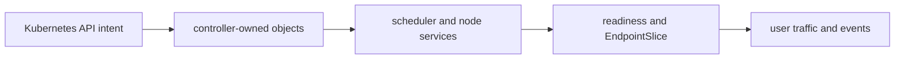
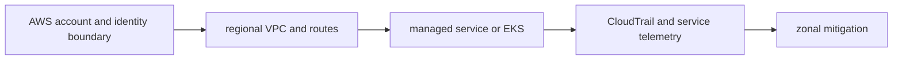
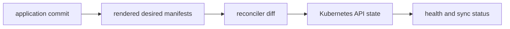
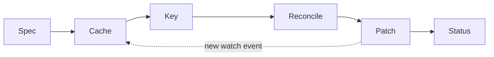
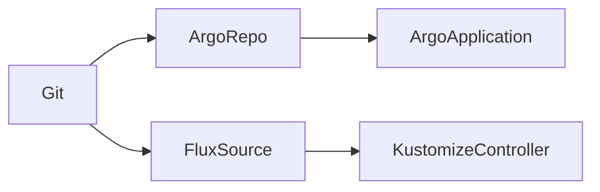
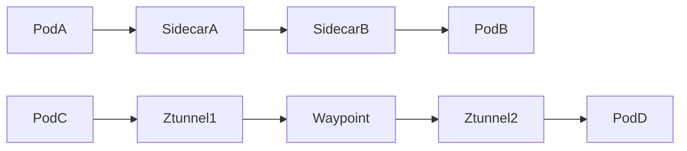
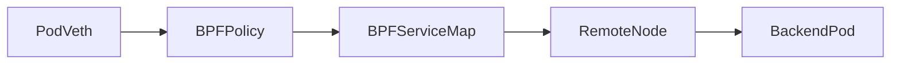
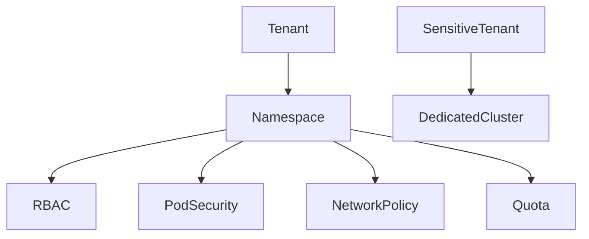

# Kubernetes

## Question

**Walk me through what happens after a Deployment is submitted.**

## 30-Second Answer

**Question focus: Walk me through what happens after a Deployment is submitted.** The API server authenticates, authorizes, admits, and persists the Deployment in etcd. The Deployment controller creates a ReplicaSet; the ReplicaSet controller creates Pods. The scheduler filters and scores nodes and writes each binding. The selected kubelet asks CRI to create the sandbox and container and CNI to attach networking. Only after readiness succeeds does the EndpointSlice controller publish the Pod address for Service traffic.

## Strong Senior Answer

**Question focus: Walk me through what happens after a Deployment is submitted.** Trace the mechanisms named in this question: Kubernetes API intent → controller-owned objects → scheduler and node services → readiness and EndpointSlice → user traffic and events. For each, name its API or state, identity, timeout, retry owner, capacity limit, and evidence. Separate acceptance from convergence and readiness from a correct user result. Preserve the exact revision and audit principal before mitigation; rollback or failover is safe only when state compatibility and traffic ownership are explicit.

**Question-specific test:** Walk me through what happens after a Deployment is submitted.

## Staff-Level Expansion

**Question focus: Walk me through what happens after a Deployment is submitted.** Name the exact state boundary and accountable owner **scheduler and node services**. Add a pre-production check for the failure you described, an SLO based on **user traffic and events**, and a recovery exercise that removes **controller-owned objects** or **readiness and EndpointSlice**. Discuss migration and cost: isolation changes the correlated-failure risk but creates more instances to patch, observe, and support.

**Question-specific test:** Walk me through what happens after a Deployment is submitted.

## Diagram or Decision Flow



**Question-specific test:** Walk me through what happens after a Deployment is submitted.

## Commands or Evidence

Use the commands and records named in the answer to establish timestamps, revisions, ownership, and the first failed boundary; retain the output with the incident or change record.

**Question-specific test:** Walk me through what happens after a Deployment is submitted.

## Likely Follow-ups

* Which observation at **scheduler and node services** would falsify your first hypothesis?
* What remains available when **controller-owned objects** fails?
* What exact metric at **user traffic and events** proves recovery?

**Question-specific test:** Walk me through what happens after a Deployment is submitted.

## Common Weak Answer

Jumping to a restart or product name without tracing kubernetes api intent to user traffic and events, distinguishing state owners, or defining a safe rollback.

**Question-specific test:** Walk me through what happens after a Deployment is submitted.

## Experience Prompt

Use an incident or design decision involving the named mechanism: state the constraint, your decision, one timestamped signal, the measurable result, and the guardrail added.

**Question-specific test:** Walk me through what happens after a Deployment is submitted.
## Question

**How would you troubleshoot Pods stuck in Pending?**

## 30-Second Answer

**Question focus: How would you troubleshoot Pods stuck in Pending?** Start with `kubectl describe pod` and scheduler events: they state which filter rejected every node. Compare Pod requests with allocatable CPU, memory, ephemeral storage, and GPU; then check taints/tolerations, node or Pod affinity, topology spread, and unbound PVC topology. Check ResourceQuota and LimitRange admission, node-group maximum and launch failures, cloud vCPU/GPU quotas, and subnet IP availability. Add capacity only after identifying the unsatisfied constraint.

## Strong Senior Answer

**Question focus: How would you troubleshoot Pods stuck in Pending?** Trace the mechanisms named in this question: Kubernetes API intent → controller-owned objects → scheduler and node services → readiness and EndpointSlice → user traffic and events. For each, name its API or state, identity, timeout, retry owner, capacity limit, and evidence. Separate acceptance from convergence and readiness from a correct user result. Preserve the exact revision and audit principal before mitigation; rollback or failover is safe only when state compatibility and traffic ownership are explicit.

**Question-specific test:** How would you troubleshoot Pods stuck in Pending?

## Staff-Level Expansion

**Question focus: How would you troubleshoot Pods stuck in Pending?** Name the exact state boundary and accountable owner **scheduler and node services**. Add a pre-production check for the failure you described, an SLO based on **user traffic and events**, and a recovery exercise that removes **controller-owned objects** or **readiness and EndpointSlice**. Discuss migration and cost: isolation changes the correlated-failure risk but creates more instances to patch, observe, and support.

**Question-specific test:** How would you troubleshoot Pods stuck in Pending?

## Diagram or Decision Flow


**Question-specific test:** How would you troubleshoot Pods stuck in Pending?

## Commands or Evidence

Use the commands and records named in the answer to establish timestamps, revisions, ownership, and the first failed boundary; retain the output with the incident or change record.

**Question-specific test:** How would you troubleshoot Pods stuck in Pending?

## Likely Follow-ups

* Which observation at **scheduler and node services** would falsify your first hypothesis?
* What remains available when **controller-owned objects** fails?
* What exact metric at **user traffic and events** proves recovery?

**Question-specific test:** How would you troubleshoot Pods stuck in Pending?

## Common Weak Answer

Jumping to a restart or product name without tracing kubernetes api intent to user traffic and events, distinguishing state owners, or defining a safe rollback.

**Question-specific test:** How would you troubleshoot Pods stuck in Pending?

## Experience Prompt

Use an incident or design decision involving the named mechanism: state the constraint, your decision, one timestamped signal, the measurable result, and the guardrail added.

**Question-specific test:** How would you troubleshoot Pods stuck in Pending?
## Question

**Why can a Pod be Running but absent from Service endpoints?**

## 30-Second Answer

**Question focus: Why can a Pod be Running but absent from Service endpoints?** Running describes container process state, not traffic eligibility. Verify the Pod Ready condition, readiness gates, and whether it is terminating. Compare Service selectors with Pod labels and inspect EndpointSlices. Confirm the Service port and named `targetPort` resolve to a declared container port. A failed readiness probe, selector mismatch, false readiness gate, terminating endpoint, or misspelled named port correctly keeps or makes the address unusable.

## Strong Senior Answer

**Question focus: Why can a Pod be Running but absent from Service endpoints?** Trace the mechanisms named in this question: Kubernetes API intent → controller-owned objects → scheduler and node services → readiness and EndpointSlice → user traffic and events. For each, name its API or state, identity, timeout, retry owner, capacity limit, and evidence. Separate acceptance from convergence and readiness from a correct user result. Preserve the exact revision and audit principal before mitigation; rollback or failover is safe only when state compatibility and traffic ownership are explicit.

**Question-specific test:** Why can a Pod be Running but absent from Service endpoints?

## Staff-Level Expansion

**Question focus: Why can a Pod be Running but absent from Service endpoints?** Name the exact state boundary and accountable owner **scheduler and node services**. Add a pre-production check for the failure you described, an SLO based on **user traffic and events**, and a recovery exercise that removes **controller-owned objects** or **readiness and EndpointSlice**. Discuss migration and cost: isolation changes the correlated-failure risk but creates more instances to patch, observe, and support.

**Question-specific test:** Why can a Pod be Running but absent from Service endpoints?

## Diagram or Decision Flow


**Question-specific test:** Why can a Pod be Running but absent from Service endpoints?

## Commands or Evidence

Use the commands and records named in the answer to establish timestamps, revisions, ownership, and the first failed boundary; retain the output with the incident or change record.

**Question-specific test:** Why can a Pod be Running but absent from Service endpoints?

## Likely Follow-ups

* Which observation at **scheduler and node services** would falsify your first hypothesis?
* What remains available when **controller-owned objects** fails?
* What exact metric at **user traffic and events** proves recovery?

**Question-specific test:** Why can a Pod be Running but absent from Service endpoints?

## Common Weak Answer

Jumping to a restart or product name without tracing kubernetes api intent to user traffic and events, distinguishing state owners, or defining a safe rollback.

**Question-specific test:** Why can a Pod be Running but absent from Service endpoints?

## Experience Prompt

Use an incident or design decision involving the named mechanism: state the constraint, your decision, one timestamped signal, the measurable result, and the guardrail added.

**Question-specific test:** Why can a Pod be Running but absent from Service endpoints?
## Question

**How do informers and work queues make controllers scalable?**

## 30-Second Answer

**Question focus: How do informers and work queues make controllers scalable?** Trace the exact mechanism from **Kubernetes API intent** through **controller-owned objects** and **scheduler and node services** to **readiness and EndpointSlice**. The important distinction is which component owns desired state versus runtime state. Verify the claimed behavior with **user traffic and events**, and state the capacity, security, and availability trade-off rather than treating the mechanism as automatic.

## Strong Senior Answer

**Question focus: How do informers and work queues make controllers scalable?** Trace the mechanisms named in this question: Kubernetes API intent → controller-owned objects → scheduler and node services → readiness and EndpointSlice → user traffic and events. For each, name its API or state, identity, timeout, retry owner, capacity limit, and evidence. Separate acceptance from convergence and readiness from a correct user result. Preserve the exact revision and audit principal before mitigation; rollback or failover is safe only when state compatibility and traffic ownership are explicit.

**Question-specific test:** How do informers and work queues make controllers scalable?

## Staff-Level Expansion

**Question focus: How do informers and work queues make controllers scalable?** Name the exact state boundary and accountable owner **scheduler and node services**. Add a pre-production check for the failure you described, an SLO based on **user traffic and events**, and a recovery exercise that removes **controller-owned objects** or **readiness and EndpointSlice**. Discuss migration and cost: isolation changes the correlated-failure risk but creates more instances to patch, observe, and support.

**Question-specific test:** How do informers and work queues make controllers scalable?

## Diagram or Decision Flow


**Question-specific test:** How do informers and work queues make controllers scalable?

## Commands or Evidence

Use the commands and records named in the answer to establish timestamps, revisions, ownership, and the first failed boundary; retain the output with the incident or change record.

**Question-specific test:** How do informers and work queues make controllers scalable?

## Likely Follow-ups

* Which observation at **scheduler and node services** would falsify your first hypothesis?
* What remains available when **controller-owned objects** fails?
* What exact metric at **user traffic and events** proves recovery?

**Question-specific test:** How do informers and work queues make controllers scalable?

## Common Weak Answer

Jumping to a restart or product name without tracing kubernetes api intent to user traffic and events, distinguishing state owners, or defining a safe rollback.

**Question-specific test:** How do informers and work queues make controllers scalable?

## Experience Prompt

Use an incident or design decision involving the named mechanism: state the constraint, your decision, one timestamped signal, the measurable result, and the guardrail added.

**Question-specific test:** How do informers and work queues make controllers scalable?
## Question

**How would you design a safe EKS control-plane and node upgrade?**

## 30-Second Answer

**Question focus: How would you design a safe EKS control-plane and node upgrade?** Start with availability, latency, security, tenancy, RPO/RTO, and ownership. Build explicit boundaries from **AWS account and identity boundary** to **regional VPC and routes**, keep authoritative state at **managed service or EKS**, isolate **CloudTrail and service telemetry** by failure domain, and make **zonal mitigation** the promotion and recovery gate. Test dependency loss and rollback before onboarding tenants.

## Strong Senior Answer

**Question focus: How would you design a safe EKS control-plane and node upgrade?** Trace the mechanisms named in this question: AWS account and identity boundary → regional VPC and routes → managed service or EKS → CloudTrail and service telemetry → zonal mitigation. For each, name its API or state, identity, timeout, retry owner, capacity limit, and evidence. Separate acceptance from convergence and readiness from a correct user result. Preserve the exact revision and audit principal before mitigation; rollback or failover is safe only when state compatibility and traffic ownership are explicit.

**Question-specific test:** How would you design a safe EKS control-plane and node upgrade?

## Staff-Level Expansion

**Question focus: How would you design a safe EKS control-plane and node upgrade?** Name the exact state boundary and accountable owner **managed service or EKS**. Add a pre-production check for the failure you described, an SLO based on **zonal mitigation**, and a recovery exercise that removes **regional VPC and routes** or **CloudTrail and service telemetry**. Discuss migration and cost: isolation changes the correlated-failure risk but creates more instances to patch, observe, and support.

**Question-specific test:** How would you design a safe EKS control-plane and node upgrade?

## Diagram or Decision Flow



**Question-specific test:** How would you design a safe EKS control-plane and node upgrade?

## Commands or Evidence

Use the commands and records named in the answer to establish timestamps, revisions, ownership, and the first failed boundary; retain the output with the incident or change record.

**Question-specific test:** How would you design a safe EKS control-plane and node upgrade?

## Likely Follow-ups

* Which observation at **managed service or EKS** would falsify your first hypothesis?
* What remains available when **regional VPC and routes** fails?
* What exact metric at **zonal mitigation** proves recovery?

**Question-specific test:** How would you design a safe EKS control-plane and node upgrade?

## Common Weak Answer

Jumping to a restart or product name without tracing aws account and identity boundary to zonal mitigation, distinguishing state owners, or defining a safe rollback.

**Question-specific test:** How would you design a safe EKS control-plane and node upgrade?

## Experience Prompt

Use an incident or design decision involving the named mechanism: state the constraint, your decision, one timestamped signal, the measurable result, and the guardrail added.

**Question-specific test:** How would you design a safe EKS control-plane and node upgrade?
## Question

**When do taints, affinity, and topology spread solve different problems?**

## 30-Second Answer

**Question focus: When do taints, affinity, and topology spread solve different problems?** Use the mechanism only when the constraint at **Kubernetes API intent** cannot be met more simply. Evaluate operational ownership of **scheduler and node services**, its blast radius and recovery behavior, then prove the decision using **user traffic and events**. Avoid it when its extra control surface is harder to operate than the risk it removes.

## Strong Senior Answer

**Question focus: When do taints, affinity, and topology spread solve different problems?** Trace the mechanisms named in this question: Kubernetes API intent → controller-owned objects → scheduler and node services → readiness and EndpointSlice → user traffic and events. For each, name its API or state, identity, timeout, retry owner, capacity limit, and evidence. Separate acceptance from convergence and readiness from a correct user result. Preserve the exact revision and audit principal before mitigation; rollback or failover is safe only when state compatibility and traffic ownership are explicit.

**Question-specific test:** When do taints, affinity, and topology spread solve different problems?

## Staff-Level Expansion

**Question focus: When do taints, affinity, and topology spread solve different problems?** Name the exact state boundary and accountable owner **scheduler and node services**. Add a pre-production check for the failure you described, an SLO based on **user traffic and events**, and a recovery exercise that removes **controller-owned objects** or **readiness and EndpointSlice**. Discuss migration and cost: isolation changes the correlated-failure risk but creates more instances to patch, observe, and support.

**Question-specific test:** When do taints, affinity, and topology spread solve different problems?

## Diagram or Decision Flow


**Question-specific test:** When do taints, affinity, and topology spread solve different problems?

## Commands or Evidence

Use the commands and records named in the answer to establish timestamps, revisions, ownership, and the first failed boundary; retain the output with the incident or change record.

**Question-specific test:** When do taints, affinity, and topology spread solve different problems?

## Likely Follow-ups

* Which observation at **scheduler and node services** would falsify your first hypothesis?
* What remains available when **controller-owned objects** fails?
* What exact metric at **user traffic and events** proves recovery?

**Question-specific test:** When do taints, affinity, and topology spread solve different problems?

## Common Weak Answer

Jumping to a restart or product name without tracing kubernetes api intent to user traffic and events, distinguishing state owners, or defining a safe rollback.

**Question-specific test:** When do taints, affinity, and topology spread solve different problems?

## Experience Prompt

Use an incident or design decision involving the named mechanism: state the constraint, your decision, one timestamped signal, the measurable result, and the guardrail added.

**Question-specific test:** When do taints, affinity, and topology spread solve different problems?
## Question

**How do requests, limits, HPA, and node autoscaling interact?**

## 30-Second Answer

**Question focus: How do requests, limits, HPA, and node autoscaling interact?** Trace the exact mechanism from **Kubernetes API intent** through **controller-owned objects** and **scheduler and node services** to **readiness and EndpointSlice**. The important distinction is which component owns desired state versus runtime state. Verify the claimed behavior with **user traffic and events**, and state the capacity, security, and availability trade-off rather than treating the mechanism as automatic.

## Strong Senior Answer

**Question focus: How do requests, limits, HPA, and node autoscaling interact?** Trace the mechanisms named in this question: Kubernetes API intent → controller-owned objects → scheduler and node services → readiness and EndpointSlice → user traffic and events. For each, name its API or state, identity, timeout, retry owner, capacity limit, and evidence. Separate acceptance from convergence and readiness from a correct user result. Preserve the exact revision and audit principal before mitigation; rollback or failover is safe only when state compatibility and traffic ownership are explicit.

**Question-specific test:** How do requests, limits, HPA, and node autoscaling interact?

## Staff-Level Expansion

**Question focus: How do requests, limits, HPA, and node autoscaling interact?** Name the exact state boundary and accountable owner **scheduler and node services**. Add a pre-production check for the failure you described, an SLO based on **user traffic and events**, and a recovery exercise that removes **controller-owned objects** or **readiness and EndpointSlice**. Discuss migration and cost: isolation changes the correlated-failure risk but creates more instances to patch, observe, and support.

**Question-specific test:** How do requests, limits, HPA, and node autoscaling interact?

## Diagram or Decision Flow


**Question-specific test:** How do requests, limits, HPA, and node autoscaling interact?

## Commands or Evidence

Use the commands and records named in the answer to establish timestamps, revisions, ownership, and the first failed boundary; retain the output with the incident or change record.

**Question-specific test:** How do requests, limits, HPA, and node autoscaling interact?

## Likely Follow-ups

* Which observation at **scheduler and node services** would falsify your first hypothesis?
* What remains available when **controller-owned objects** fails?
* What exact metric at **user traffic and events** proves recovery?

**Question-specific test:** How do requests, limits, HPA, and node autoscaling interact?

## Common Weak Answer

Jumping to a restart or product name without tracing kubernetes api intent to user traffic and events, distinguishing state owners, or defining a safe rollback.

**Question-specific test:** How do requests, limits, HPA, and node autoscaling interact?

## Experience Prompt

Use an incident or design decision involving the named mechanism: state the constraint, your decision, one timestamped signal, the measurable result, and the guardrail added.

**Question-specific test:** How do requests, limits, HPA, and node autoscaling interact?
## Question

**What happens from a Service virtual IP to a Pod?**

## 30-Second Answer

**Question focus: What happens from a Service virtual IP to a Pod?** Trace the exact mechanism from **Kubernetes API intent** through **controller-owned objects** and **scheduler and node services** to **readiness and EndpointSlice**. The important distinction is which component owns desired state versus runtime state. Verify the claimed behavior with **user traffic and events**, and state the capacity, security, and availability trade-off rather than treating the mechanism as automatic.

## Strong Senior Answer

**Question focus: What happens from a Service virtual IP to a Pod?** Trace the mechanisms named in this question: Kubernetes API intent → controller-owned objects → scheduler and node services → readiness and EndpointSlice → user traffic and events. For each, name its API or state, identity, timeout, retry owner, capacity limit, and evidence. Separate acceptance from convergence and readiness from a correct user result. Preserve the exact revision and audit principal before mitigation; rollback or failover is safe only when state compatibility and traffic ownership are explicit.

**Question-specific test:** What happens from a Service virtual IP to a Pod?

## Staff-Level Expansion

**Question focus: What happens from a Service virtual IP to a Pod?** Name the exact state boundary and accountable owner **scheduler and node services**. Add a pre-production check for the failure you described, an SLO based on **user traffic and events**, and a recovery exercise that removes **controller-owned objects** or **readiness and EndpointSlice**. Discuss migration and cost: isolation changes the correlated-failure risk but creates more instances to patch, observe, and support.

**Question-specific test:** What happens from a Service virtual IP to a Pod?

## Diagram or Decision Flow


**Question-specific test:** What happens from a Service virtual IP to a Pod?

## Commands or Evidence

Use the commands and records named in the answer to establish timestamps, revisions, ownership, and the first failed boundary; retain the output with the incident or change record.

**Question-specific test:** What happens from a Service virtual IP to a Pod?

## Likely Follow-ups

* Which observation at **scheduler and node services** would falsify your first hypothesis?
* What remains available when **controller-owned objects** fails?
* What exact metric at **user traffic and events** proves recovery?

**Question-specific test:** What happens from a Service virtual IP to a Pod?

## Common Weak Answer

Jumping to a restart or product name without tracing kubernetes api intent to user traffic and events, distinguishing state owners, or defining a safe rollback.

**Question-specific test:** What happens from a Service virtual IP to a Pod?

## Experience Prompt

Use an incident or design decision involving the named mechanism: state the constraint, your decision, one timestamped signal, the measurable result, and the guardrail added.

**Question-specific test:** What happens from a Service virtual IP to a Pod?
## Question

**How would you diagnose intermittent cluster DNS failures?**

## 30-Second Answer

**Question focus: How would you diagnose intermittent cluster DNS failures?** Bound impact and compare the last healthy revision, zone, tenant, or node with the failing cohort. Follow evidence in order from **Kubernetes API intent** through **controller-owned objects**, **scheduler and node services**, and **readiness and EndpointSlice**; stop at the first divergent handoff. Apply the smallest reversible mitigation, preserve events and timestamps, and confirm recovery with **user traffic and events**.

## Strong Senior Answer

**Question focus: How would you diagnose intermittent cluster DNS failures?** Trace the mechanisms named in this question: Kubernetes API intent → controller-owned objects → scheduler and node services → readiness and EndpointSlice → user traffic and events. For each, name its API or state, identity, timeout, retry owner, capacity limit, and evidence. Separate acceptance from convergence and readiness from a correct user result. Preserve the exact revision and audit principal before mitigation; rollback or failover is safe only when state compatibility and traffic ownership are explicit.

**Question-specific test:** How would you diagnose intermittent cluster DNS failures?

## Staff-Level Expansion

**Question focus: How would you diagnose intermittent cluster DNS failures?** Name the exact state boundary and accountable owner **scheduler and node services**. Add a pre-production check for the failure you described, an SLO based on **user traffic and events**, and a recovery exercise that removes **controller-owned objects** or **readiness and EndpointSlice**. Discuss migration and cost: isolation changes the correlated-failure risk but creates more instances to patch, observe, and support.

**Question-specific test:** How would you diagnose intermittent cluster DNS failures?

## Diagram or Decision Flow


**Question-specific test:** How would you diagnose intermittent cluster DNS failures?

## Commands or Evidence

Use the commands and records named in the answer to establish timestamps, revisions, ownership, and the first failed boundary; retain the output with the incident or change record.

**Question-specific test:** How would you diagnose intermittent cluster DNS failures?

## Likely Follow-ups

* Which observation at **scheduler and node services** would falsify your first hypothesis?
* What remains available when **controller-owned objects** fails?
* What exact metric at **user traffic and events** proves recovery?

**Question-specific test:** How would you diagnose intermittent cluster DNS failures?

## Common Weak Answer

Jumping to a restart or product name without tracing kubernetes api intent to user traffic and events, distinguishing state owners, or defining a safe rollback.

**Question-specific test:** How would you diagnose intermittent cluster DNS failures?

## Experience Prompt

Use an incident or design decision involving the named mechanism: state the constraint, your decision, one timestamped signal, the measurable result, and the guardrail added.

**Question-specific test:** How would you diagnose intermittent cluster DNS failures?
## Question

**How do CSI provisioning and volume attachment fail?**

## 30-Second Answer

**Question focus: How do CSI provisioning and volume attachment fail?** Trace the exact mechanism from **Kubernetes API intent** through **controller-owned objects** and **scheduler and node services** to **readiness and EndpointSlice**. The important distinction is which component owns desired state versus runtime state. Verify the claimed behavior with **user traffic and events**, and state the capacity, security, and availability trade-off rather than treating the mechanism as automatic.

## Strong Senior Answer

**Question focus: How do CSI provisioning and volume attachment fail?** Trace the mechanisms named in this question: Kubernetes API intent → controller-owned objects → scheduler and node services → readiness and EndpointSlice → user traffic and events. For each, name its API or state, identity, timeout, retry owner, capacity limit, and evidence. Separate acceptance from convergence and readiness from a correct user result. Preserve the exact revision and audit principal before mitigation; rollback or failover is safe only when state compatibility and traffic ownership are explicit.

**Question-specific test:** How do CSI provisioning and volume attachment fail?

## Staff-Level Expansion

**Question focus: How do CSI provisioning and volume attachment fail?** Name the exact state boundary and accountable owner **scheduler and node services**. Add a pre-production check for the failure you described, an SLO based on **user traffic and events**, and a recovery exercise that removes **controller-owned objects** or **readiness and EndpointSlice**. Discuss migration and cost: isolation changes the correlated-failure risk but creates more instances to patch, observe, and support.

**Question-specific test:** How do CSI provisioning and volume attachment fail?

## Diagram or Decision Flow


**Question-specific test:** How do CSI provisioning and volume attachment fail?

## Commands or Evidence

Use the commands and records named in the answer to establish timestamps, revisions, ownership, and the first failed boundary; retain the output with the incident or change record.

**Question-specific test:** How do CSI provisioning and volume attachment fail?

## Likely Follow-ups

* Which observation at **scheduler and node services** would falsify your first hypothesis?
* What remains available when **controller-owned objects** fails?
* What exact metric at **user traffic and events** proves recovery?

**Question-specific test:** How do CSI provisioning and volume attachment fail?

## Common Weak Answer

Jumping to a restart or product name without tracing kubernetes api intent to user traffic and events, distinguishing state owners, or defining a safe rollback.

**Question-specific test:** How do CSI provisioning and volume attachment fail?

## Experience Prompt

Use an incident or design decision involving the named mechanism: state the constraint, your decision, one timestamped signal, the measurable result, and the guardrail added.

**Question-specific test:** How do CSI provisioning and volume attachment fail?
## Question

**How do finalizers and owner references affect deletion?**

## 30-Second Answer

**Question focus: How do finalizers and owner references affect deletion?** Trace the exact mechanism from **Kubernetes API intent** through **controller-owned objects** and **scheduler and node services** to **readiness and EndpointSlice**. The important distinction is which component owns desired state versus runtime state. Verify the claimed behavior with **user traffic and events**, and state the capacity, security, and availability trade-off rather than treating the mechanism as automatic.

## Strong Senior Answer

**Question focus: How do finalizers and owner references affect deletion?** Trace the mechanisms named in this question: Kubernetes API intent → controller-owned objects → scheduler and node services → readiness and EndpointSlice → user traffic and events. For each, name its API or state, identity, timeout, retry owner, capacity limit, and evidence. Separate acceptance from convergence and readiness from a correct user result. Preserve the exact revision and audit principal before mitigation; rollback or failover is safe only when state compatibility and traffic ownership are explicit.

**Question-specific test:** How do finalizers and owner references affect deletion?

## Staff-Level Expansion

**Question focus: How do finalizers and owner references affect deletion?** Name the exact state boundary and accountable owner **scheduler and node services**. Add a pre-production check for the failure you described, an SLO based on **user traffic and events**, and a recovery exercise that removes **controller-owned objects** or **readiness and EndpointSlice**. Discuss migration and cost: isolation changes the correlated-failure risk but creates more instances to patch, observe, and support.

**Question-specific test:** How do finalizers and owner references affect deletion?

## Diagram or Decision Flow


**Question-specific test:** How do finalizers and owner references affect deletion?

## Commands or Evidence

Use the commands and records named in the answer to establish timestamps, revisions, ownership, and the first failed boundary; retain the output with the incident or change record.

**Question-specific test:** How do finalizers and owner references affect deletion?

## Likely Follow-ups

* Which observation at **scheduler and node services** would falsify your first hypothesis?
* What remains available when **controller-owned objects** fails?
* What exact metric at **user traffic and events** proves recovery?

**Question-specific test:** How do finalizers and owner references affect deletion?

## Common Weak Answer

Jumping to a restart or product name without tracing kubernetes api intent to user traffic and events, distinguishing state owners, or defining a safe rollback.

**Question-specific test:** How do finalizers and owner references affect deletion?

## Experience Prompt

Use an incident or design decision involving the named mechanism: state the constraint, your decision, one timestamped signal, the measurable result, and the guardrail added.

**Question-specific test:** How do finalizers and owner references affect deletion?
## Question

**When should you build a CRD and controller instead of a service?**

## 30-Second Answer

**Question focus: When should you build a CRD and controller instead of a service?** Use the mechanism only when the constraint at **Kubernetes API intent** cannot be met more simply. Evaluate operational ownership of **scheduler and node services**, its blast radius and recovery behavior, then prove the decision using **user traffic and events**. Avoid it when its extra control surface is harder to operate than the risk it removes.

## Strong Senior Answer

**Question focus: When should you build a CRD and controller instead of a service?** Trace the mechanisms named in this question: Kubernetes API intent → controller-owned objects → scheduler and node services → readiness and EndpointSlice → user traffic and events. For each, name its API or state, identity, timeout, retry owner, capacity limit, and evidence. Separate acceptance from convergence and readiness from a correct user result. Preserve the exact revision and audit principal before mitigation; rollback or failover is safe only when state compatibility and traffic ownership are explicit.

**Question-specific test:** When should you build a CRD and controller instead of a service?

## Staff-Level Expansion

**Question focus: When should you build a CRD and controller instead of a service?** Name the exact state boundary and accountable owner **scheduler and node services**. Add a pre-production check for the failure you described, an SLO based on **user traffic and events**, and a recovery exercise that removes **controller-owned objects** or **readiness and EndpointSlice**. Discuss migration and cost: isolation changes the correlated-failure risk but creates more instances to patch, observe, and support.

**Question-specific test:** When should you build a CRD and controller instead of a service?

## Diagram or Decision Flow


**Question-specific test:** When should you build a CRD and controller instead of a service?

## Commands or Evidence

Use the commands and records named in the answer to establish timestamps, revisions, ownership, and the first failed boundary; retain the output with the incident or change record.

**Question-specific test:** When should you build a CRD and controller instead of a service?

## Likely Follow-ups

* Which observation at **scheduler and node services** would falsify your first hypothesis?
* What remains available when **controller-owned objects** fails?
* What exact metric at **user traffic and events** proves recovery?

**Question-specific test:** When should you build a CRD and controller instead of a service?

## Common Weak Answer

Jumping to a restart or product name without tracing kubernetes api intent to user traffic and events, distinguishing state owners, or defining a safe rollback.

**Question-specific test:** When should you build a CRD and controller instead of a service?

## Experience Prompt

Use an incident or design decision involving the named mechanism: state the constraint, your decision, one timestamped signal, the measurable result, and the guardrail added.

**Question-specific test:** When should you build a CRD and controller instead of a service?
## Question

**How would you secure admission webhooks against an outage?**

## 30-Second Answer

**Question focus: How would you secure admission webhooks against an outage?** Trace the exact mechanism from **Kubernetes API intent** through **controller-owned objects** and **scheduler and node services** to **readiness and EndpointSlice**. The important distinction is which component owns desired state versus runtime state. Verify the claimed behavior with **user traffic and events**, and state the capacity, security, and availability trade-off rather than treating the mechanism as automatic.

## Strong Senior Answer

**Question focus: How would you secure admission webhooks against an outage?** Trace the mechanisms named in this question: Kubernetes API intent → controller-owned objects → scheduler and node services → readiness and EndpointSlice → user traffic and events. For each, name its API or state, identity, timeout, retry owner, capacity limit, and evidence. Separate acceptance from convergence and readiness from a correct user result. Preserve the exact revision and audit principal before mitigation; rollback or failover is safe only when state compatibility and traffic ownership are explicit.

**Question-specific test:** How would you secure admission webhooks against an outage?

## Staff-Level Expansion

**Question focus: How would you secure admission webhooks against an outage?** Name the exact state boundary and accountable owner **scheduler and node services**. Add a pre-production check for the failure you described, an SLO based on **user traffic and events**, and a recovery exercise that removes **controller-owned objects** or **readiness and EndpointSlice**. Discuss migration and cost: isolation changes the correlated-failure risk but creates more instances to patch, observe, and support.

**Question-specific test:** How would you secure admission webhooks against an outage?

## Diagram or Decision Flow


**Question-specific test:** How would you secure admission webhooks against an outage?

## Commands or Evidence

Use the commands and records named in the answer to establish timestamps, revisions, ownership, and the first failed boundary; retain the output with the incident or change record.

**Question-specific test:** How would you secure admission webhooks against an outage?

## Likely Follow-ups

* Which observation at **scheduler and node services** would falsify your first hypothesis?
* What remains available when **controller-owned objects** fails?
* What exact metric at **user traffic and events** proves recovery?

**Question-specific test:** How would you secure admission webhooks against an outage?

## Common Weak Answer

Jumping to a restart or product name without tracing kubernetes api intent to user traffic and events, distinguishing state owners, or defining a safe rollback.

**Question-specific test:** How would you secure admission webhooks against an outage?

## Experience Prompt

Use an incident or design decision involving the named mechanism: state the constraint, your decision, one timestamped signal, the measurable result, and the guardrail added.

**Question-specific test:** How would you secure admission webhooks against an outage?
## Question

**Compare Helm packaging with Kustomize overlays.**

## 30-Second Answer

**Question focus: Compare Helm packaging with Kustomize overlays.** Compare ownership boundaries rather than feature lists: **rendered desired manifests** controls desired behavior, **reconciler diff** owns state or reconciliation, and **Kubernetes API state** exposes runtime consequences. Choose the option whose failure mode, upgrade path, team expertise, and portability match the workload; validate the choice with health and sync status.

## Strong Senior Answer

**Question focus: Compare Helm packaging with Kustomize overlays.** Trace the mechanisms named in this question: application commit → rendered desired manifests → reconciler diff → Kubernetes API state → health and sync status. For each, name its API or state, identity, timeout, retry owner, capacity limit, and evidence. Separate acceptance from convergence and readiness from a correct user result. Preserve the exact revision and audit principal before mitigation; rollback or failover is safe only when state compatibility and traffic ownership are explicit.

**Question-specific test:** Compare Helm packaging with Kustomize overlays.

## Staff-Level Expansion

**Question focus: Compare Helm packaging with Kustomize overlays.** Name the exact state boundary and accountable owner **reconciler diff**. Add a pre-production check for the failure you described, an SLO based on **health and sync status**, and a recovery exercise that removes **rendered desired manifests** or **Kubernetes API state**. Discuss migration and cost: isolation changes the correlated-failure risk but creates more instances to patch, observe, and support.

**Question-specific test:** Compare Helm packaging with Kustomize overlays.

## Diagram or Decision Flow



**Question-specific test:** Compare Helm packaging with Kustomize overlays.

## Commands or Evidence

Use the commands and records named in the answer to establish timestamps, revisions, ownership, and the first failed boundary; retain the output with the incident or change record.

**Question-specific test:** Compare Helm packaging with Kustomize overlays.

## Likely Follow-ups

* Which observation at **reconciler diff** would falsify your first hypothesis?
* What remains available when **rendered desired manifests** fails?
* What exact metric at **health and sync status** proves recovery?

**Question-specific test:** Compare Helm packaging with Kustomize overlays.

## Common Weak Answer

Jumping to a restart or product name without tracing application commit to health and sync status, distinguishing state owners, or defining a safe rollback.

**Question-specific test:** Compare Helm packaging with Kustomize overlays.

## Experience Prompt

Use an incident or design decision involving the named mechanism: state the constraint, your decision, one timestamped signal, the measurable result, and the guardrail added.

**Question-specific test:** Compare Helm packaging with Kustomize overlays.
## Question

**When would you avoid a service mesh?**

## 30-Second Answer

**Question focus: When would you avoid a service mesh?** Use the mechanism only when the constraint at **Kubernetes API intent** cannot be met more simply. Evaluate operational ownership of **scheduler and node services**, its blast radius and recovery behavior, then prove the decision using **user traffic and events**. Avoid it when its extra control surface is harder to operate than the risk it removes.

## Strong Senior Answer

**Question focus: When would you avoid a service mesh?** Trace the mechanisms named in this question: Kubernetes API intent → controller-owned objects → scheduler and node services → readiness and EndpointSlice → user traffic and events. For each, name its API or state, identity, timeout, retry owner, capacity limit, and evidence. Separate acceptance from convergence and readiness from a correct user result. Preserve the exact revision and audit principal before mitigation; rollback or failover is safe only when state compatibility and traffic ownership are explicit.

**Question-specific test:** When would you avoid a service mesh?

## Staff-Level Expansion

**Question focus: When would you avoid a service mesh?** Name the exact state boundary and accountable owner **scheduler and node services**. Add a pre-production check for the failure you described, an SLO based on **user traffic and events**, and a recovery exercise that removes **controller-owned objects** or **readiness and EndpointSlice**. Discuss migration and cost: isolation changes the correlated-failure risk but creates more instances to patch, observe, and support.

**Question-specific test:** When would you avoid a service mesh?

## Diagram or Decision Flow


**Question-specific test:** When would you avoid a service mesh?

## Commands or Evidence

Use the commands and records named in the answer to establish timestamps, revisions, ownership, and the first failed boundary; retain the output with the incident or change record.

**Question-specific test:** When would you avoid a service mesh?

## Likely Follow-ups

* Which observation at **scheduler and node services** would falsify your first hypothesis?
* What remains available when **controller-owned objects** fails?
* What exact metric at **user traffic and events** proves recovery?

**Question-specific test:** When would you avoid a service mesh?

## Common Weak Answer

Jumping to a restart or product name without tracing kubernetes api intent to user traffic and events, distinguishing state owners, or defining a safe rollback.

**Question-specific test:** When would you avoid a service mesh?

## Experience Prompt

Use an incident or design decision involving the named mechanism: state the constraint, your decision, one timestamped signal, the measurable result, and the guardrail added.

**Question-specific test:** When would you avoid a service mesh?
## Question

**How do reconciliation and idempotency make a controller reliable?**

## 30-Second Answer

A controller repeatedly compares cached desired state with observed state; it must make the same input safe to process more than once because watches duplicate, caches lag, and workers retry.

## Strong Senior Answer

Use generation and observedGeneration plus conditions to show which spec was processed. Read through an informer, write via the API with optimistic concurrency, and treat AlreadyExists or conflict as expected convergence signals.

**Question-specific test:** How do reconciliation and idempotency make a controller reliable?

## Staff-Level Expansion

At scale, queue a namespaced key rather than an object, rate-limit per-key failures, bound worker concurrency, and distinguish terminal invalid specs from transient dependency errors. Never encode a one-shot workflow in an event handler.

**Question-specific test:** How do reconciliation and idempotency make a controller reliable?

## Diagram or Decision Flow



**Question-specific test:** How do reconciliation and idempotency make a controller reliable?

## Commands or Evidence

```bash
kubectl get models -o yaml
kubectl get events --sort-by=.lastTimestamp
```

**Question-specific test:** How do reconciliation and idempotency make a controller reliable?

## Likely Follow-ups

* What makes an operation idempotent? How do you handle stale cache?

**Question-specific test:** How do reconciliation and idempotency make a controller reliable?

## Common Weak Answer

Saying “the loop retries” without explaining safe repeated writes, conflicts, status, or terminal errors.

**Question-specific test:** How do reconciliation and idempotency make a controller reliable?

## Experience Prompt

Describe a production decision involving this exact mechanism, the evidence used, a reversible mitigation, and the guardrail added afterward.

**Question-specific test:** How do reconciliation and idempotency make a controller reliable?
## Question

**How do Argo CD and Flux differ?**

## 30-Second Answer

Both reconcile Git desired state, but choose based on operating model rather than a feature checklist: Argo CD centers an Application API/UI and pull-based cluster reconciliation; Flux composes toolkit controllers and source/kustomize/helm APIs.

## Strong Senior Answer

Compare tenancy boundaries, repository/render scale, progressive-delivery integration, notifications, secret strategy and how teams debug reconciliation. Argo repo-server renders while application-controller diffs/syncs; Flux source-controller produces artifacts consumed by specialized reconcilers.

**Question-specific test:** How do Argo CD and Flux differ?

## Staff-Level Expansion

Standardize one paved path and measure reconciliation SLOs. Do not run both against the same objects. Neither makes Git a data backup or automatically proves application health/rollback.

**Question-specific test:** How do Argo CD and Flux differ?

## Diagram or Decision Flow



**Question-specific test:** How do Argo CD and Flux differ?

## Commands or Evidence

```bash
argocd app get app
flux get all -A
```

**Question-specific test:** How do Argo CD and Flux differ?

## Likely Follow-ups

* How is health distinct from sync? When would you choose toolkit composition?

**Question-specific test:** How do Argo CD and Flux differ?

## Common Weak Answer

Choosing from UI preference alone or claiming either tool automatically rolls an unhealthy app back.

**Question-specific test:** How do Argo CD and Flux differ?

## Experience Prompt

Describe a production decision involving this exact mechanism, the evidence used, a reversible mitigation, and the guardrail added afterward.

**Question-specific test:** How do Argo CD and Flux differ?
## Question

**When would you use Istio sidecars versus ambient mode?**

## 30-Second Answer

Sidecars provide a per-Pod proxy boundary and mature L7 controls; ambient moves mTLS to node ztunnels and adds waypoint proxies only for L7, reducing injection and per-Pod overhead but changing failure and policy boundaries.

## Strong Senior Answer

Compare required traffic features, supported protocols, isolation, upgrade mechanics, resource cost and platform maturity. Identity still comes from mesh trust; gateways still handle boundary traffic. Ambient is not simply “sidecars without cost.”

**Question-specific test:** When would you use Istio sidecars versus ambient mode?

## Staff-Level Expansion

Canary the dataplane by namespace, test bypass and NetworkPolicy interaction, rotate roots, and observe certificate and proxy/ztunnel health. Keep application retries from multiplying mesh retries.

**Question-specific test:** When would you use Istio sidecars versus ambient mode?

## Diagram or Decision Flow



**Question-specific test:** When would you use Istio sidecars versus ambient mode?

## Commands or Evidence

```bash
istioctl proxy-status
istioctl analyze -A
kubectl get authorizationpolicy -A
```

**Question-specific test:** When would you use Istio sidecars versus ambient mode?

## Likely Follow-ups

* Which L7 policies require waypoint? What is the blast radius of a ztunnel?

**Question-specific test:** When would you use Istio sidecars versus ambient mode?

## Common Weak Answer

Calling ambient universally better or ignoring identity, gateway, compatibility and shared-node failure domains.

**Question-specific test:** When would you use Istio sidecars versus ambient mode?

## Experience Prompt

Describe a production decision involving this exact mechanism, the evidence used, a reversible mitigation, and the guardrail added afterward.

**Question-specific test:** When would you use Istio sidecars versus ambient mode?
## Question

**What does Cilium change by using eBPF?**

## 30-Second Answer

Cilium can implement Pod networking, Service translation, policy and observability with eBPF programs/maps in the kernel, replacing or augmenting kube-proxy. Kubernetes Service and EndpointSlice semantics still apply.

## Strong Senior Answer

Trace packets through veth, routing and BPF maps. Validate the configured kube-proxy replacement mode, identity-based policy, native routing or tunneling, MTU and cloud IPAM. Hubble supplies flow evidence but not application truth.

**Question-specific test:** What does Cilium change by using eBPF?

## Staff-Level Expansion

Treat kernel/version compatibility, map pressure and agent/operator availability as platform risks. Roll upgrades gradually and retain a tested recovery path; do not debug only with iptables tools when eBPF owns translation.

**Question-specific test:** What does Cilium change by using eBPF?

## Diagram or Decision Flow



**Question-specific test:** What does Cilium change by using eBPF?

## Commands or Evidence

```bash
cilium status --verbose
cilium service list
hubble observe --from-pod ns/app
```

**Question-specific test:** What does Cilium change by using eBPF?

## Likely Follow-ups

* How are policies represented? What happens if the agent restarts?

**Question-specific test:** What does Cilium change by using eBPF?

## Common Weak Answer

Saying “eBPF is faster” without explaining maps, attach points, routing mode or operational tooling.

**Question-specific test:** What does Cilium change by using eBPF?

## Experience Prompt

Describe a production decision involving this exact mechanism, the evidence used, a reversible mitigation, and the guardrail added afterward.

**Question-specific test:** What does Cilium change by using eBPF?
## Question

**How would you secure a multi-tenant Kubernetes cluster?**

## 30-Second Answer

Start by deciding whether tenants are trusted enough to share a cluster. Use namespaces only as one boundary, then layer identity/RBAC, admission, Pod Security, network policy, quotas, node isolation and audit; use separate clusters for hostile or regulatory isolation.

## Strong Senior Answer

Prevent cross-namespace reads, privileged/host access and dangerous workload identity. Default-deny traffic, scope secrets, enforce requests/limits and quotas, isolate sensitive nodes, protect cluster-scoped APIs, and constrain controllers/webhooks that can see all tenants.

**Question-specific test:** How would you secure a multi-tenant Kubernetes cluster?

## Staff-Level Expansion

Offer tenant onboarding as policy-tested automation. Measure denied actions, quota pressure and noisy-neighbor SLOs. Document exception expiry and a migration path to stronger account/cluster boundaries.

**Question-specific test:** How would you secure a multi-tenant Kubernetes cluster?

## Diagram or Decision Flow



**Question-specific test:** How would you secure a multi-tenant Kubernetes cluster?

## Commands or Evidence

```bash
kubectl auth can-i --as=tenant-user --list -n tenant-a
kubectl get resourcequota,networkpolicy -A
kubectl get pods -A -o json
```

**Question-specific test:** How would you secure a multi-tenant Kubernetes cluster?

## Likely Follow-ups

* When is namespace isolation insufficient? How do shared CRDs affect tenants?

**Question-specific test:** How would you secure a multi-tenant Kubernetes cluster?

## Common Weak Answer

Listing namespaces and RBAC as if they isolate kernels, nodes, cluster-scoped APIs and cloud identity.

**Question-specific test:** How would you secure a multi-tenant Kubernetes cluster?

## Experience Prompt

Describe a production decision involving this exact mechanism, the evidence used, a reversible mitigation, and the guardrail added afterward.

**Question-specific test:** How would you secure a multi-tenant Kubernetes cluster?
