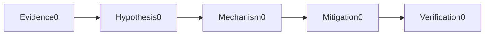
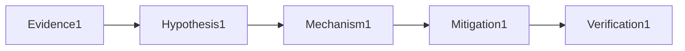

# Linux Networking

## Question

**How do you diagnose a Linux host with high load?**

## 30-Second Answer

Separate runnable CPU demand from uninterruptible I/O wait using vmstat, pidstat and iostat; then map pressure to a process and recent change.

## Strong Senior Answer

Start with a timestamped failing example and compare the mechanism named in the question against a healthy peer. Separate runnable CPU demand from uninterruptible I/O wait using vmstat, pidstat and iostat; then map pressure to a process and recent change. Preserve evidence before mitigation and verify the user-visible outcome afterward.

**Question-specific test:** How do you diagnose a Linux host with high load?

## Staff-Level Expansion

Define ownership, a measurable failure threshold and a reversible response for this mechanism. Prevent recurrence by testing the exact failure rather than adding an unrelated capacity control.

**Question-specific test:** How do you diagnose a Linux host with high load?

## Diagram or Decision Flow

**Question-specific test:** How do you diagnose a Linux host with high load?

## Commands or Evidence

Capture native status, timestamps, configuration revision, saturation and the user-visible probe appropriate to **How do you diagnose a Linux host with high load?**

**Question-specific test:** How do you diagnose a Linux host with high load?

## Likely Follow-ups

* What evidence would falsify your first hypothesis?
* When would you stop and roll back?

**Question-specific test:** How do you diagnose a Linux host with high load?

## Common Weak Answer

Naming a tool without explaining the relevant state, failure boundary, safety constraint or proof of recovery.

**Question-specific test:** How do you diagnose a Linux host with high load?

## Experience Prompt

Give one example involving how do you diagnose a linux host with high load? Include impact, evidence, decision and lasting improvement.

**Question-specific test:** How do you diagnose a Linux host with high load?
## Question

**How do you debug intermittent TCP timeout?**

## 30-Second Answer

Resolve DNS, inspect the selected route, socket retransmits, conntrack and packet captures at both endpoints before blaming the application.

## Strong Senior Answer

Start with a timestamped failing example and compare the mechanism named in the question against a healthy peer. Resolve DNS, inspect the selected route, socket retransmits, conntrack and packet captures at both endpoints before blaming the application. Preserve evidence before mitigation and verify the user-visible outcome afterward.

**Question-specific test:** How do you debug intermittent TCP timeout?

## Staff-Level Expansion

Define ownership, a measurable failure threshold and a reversible response for this mechanism. Prevent recurrence by testing the exact failure rather than adding an unrelated capacity control.

**Question-specific test:** How do you debug intermittent TCP timeout?

## Diagram or Decision Flow

**Question-specific test:** How do you debug intermittent TCP timeout?

## Commands or Evidence

Capture native status, timestamps, configuration revision, saturation and the user-visible probe appropriate to **How do you debug intermittent TCP timeout?**

**Question-specific test:** How do you debug intermittent TCP timeout?

## Likely Follow-ups

* What evidence would falsify your first hypothesis?
* When would you stop and roll back?

**Question-specific test:** How do you debug intermittent TCP timeout?

## Common Weak Answer

Naming a tool without explaining the relevant state, failure boundary, safety constraint or proof of recovery.

**Question-specific test:** How do you debug intermittent TCP timeout?

## Experience Prompt

Give one example involving how do you debug intermittent tcp timeout? Include impact, evidence, decision and lasting improvement.

**Question-specific test:** How do you debug intermittent TCP timeout?
## Question

**How do you identify an MTU black hole?**

## 30-Second Answer

Small handshakes work while larger packets stall; compare interface/path MTU and capture missing ICMP fragmentation-needed or repeated large retransmits.

## Strong Senior Answer

Start with a timestamped failing example and compare the mechanism named in the question against a healthy peer. Small handshakes work while larger packets stall; compare interface/path MTU and capture missing ICMP fragmentation-needed or repeated large retransmits. Preserve evidence before mitigation and verify the user-visible outcome afterward.

**Question-specific test:** How do you identify an MTU black hole?

## Staff-Level Expansion

Define ownership, a measurable failure threshold and a reversible response for this mechanism. Prevent recurrence by testing the exact failure rather than adding an unrelated capacity control.

**Question-specific test:** How do you identify an MTU black hole?

## Diagram or Decision Flow

**Question-specific test:** How do you identify an MTU black hole?

## Commands or Evidence

Capture native status, timestamps, configuration revision, saturation and the user-visible probe appropriate to **How do you identify an MTU black hole?**

**Question-specific test:** How do you identify an MTU black hole?

## Likely Follow-ups

* What evidence would falsify your first hypothesis?
* When would you stop and roll back?

**Question-specific test:** How do you identify an MTU black hole?

## Common Weak Answer

Naming a tool without explaining the relevant state, failure boundary, safety constraint or proof of recovery.

**Question-specific test:** How do you identify an MTU black hole?

## Experience Prompt

Give one example involving how do you identify an mtu black hole? Include impact, evidence, decision and lasting improvement.

**Question-specific test:** How do you identify an MTU black hole?
