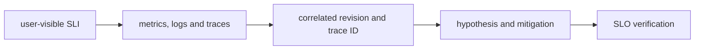

# Observability and SRE

## Question

**A deployment increased latency but produced no errors; how do you investigate?**

## 30-Second Answer

**Question focus: A deployment increased latency but produced no errors; how do you investigate?** Bound impact and compare the last healthy revision, zone, tenant, or node with the failing cohort. Follow evidence in order from **user-visible SLI** through **metrics, logs and traces**, **correlated revision and trace ID**, and **hypothesis and mitigation**; stop at the first divergent handoff. Apply the smallest reversible mitigation, preserve events and timestamps, and confirm recovery with **SLO verification**.

## Strong Senior Answer

**Question focus: A deployment increased latency but produced no errors; how do you investigate?** Trace the mechanisms named in this question: user-visible SLI → metrics, logs and traces → correlated revision and trace ID → hypothesis and mitigation → SLO verification. For each, name its API or state, identity, timeout, retry owner, capacity limit, and evidence. Separate acceptance from convergence and readiness from a correct user result. Preserve the exact revision and audit principal before mitigation; rollback or failover is safe only when state compatibility and traffic ownership are explicit.

**Question-specific test:** A deployment increased latency but produced no errors; how do you investigate?

## Staff-Level Expansion

**Question focus: A deployment increased latency but produced no errors; how do you investigate?** Name the exact state boundary and accountable owner **correlated revision and trace ID**. Add a pre-production check for the failure you described, an SLO based on **SLO verification**, and a recovery exercise that removes **metrics, logs and traces** or **hypothesis and mitigation**. Discuss migration and cost: isolation changes the correlated-failure risk but creates more instances to patch, observe, and support.

**Question-specific test:** A deployment increased latency but produced no errors; how do you investigate?

## Diagram or Decision Flow

**Question-specific test:** A deployment increased latency but produced no errors; how do you investigate?

## Commands or Evidence

Use the commands and records named in the answer to establish timestamps, revisions, ownership, and the first failed boundary; retain the output with the incident or change record.

**Question-specific test:** A deployment increased latency but produced no errors; how do you investigate?

## Likely Follow-ups

* Which observation at **correlated revision and trace ID** would falsify your first hypothesis?
* What remains available when **metrics, logs and traces** fails?
* What exact metric at **SLO verification** proves recovery?

**Question-specific test:** A deployment increased latency but produced no errors; how do you investigate?

## Common Weak Answer

Jumping to a restart or product name without tracing user-visible sli to slo verification, distinguishing state owners, or defining a safe rollback.

**Question-specific test:** A deployment increased latency but produced no errors; how do you investigate?

## Experience Prompt

Use an incident or design decision involving the named mechanism: state the constraint, your decision, one timestamped signal, the measurable result, and the guardrail added.

**Question-specific test:** A deployment increased latency but produced no errors; how do you investigate?
## Question

**How do you select an SLI for an asynchronous fraud decision?**

## 30-Second Answer

**Question focus: How do you select an SLI for an asynchronous fraud decision?** Trace the exact mechanism from **user-visible SLI** through **metrics, logs and traces** and **correlated revision and trace ID** to **hypothesis and mitigation**. The important distinction is which component owns desired state versus runtime state. Verify the claimed behavior with **SLO verification**, and state the capacity, security, and availability trade-off rather than treating the mechanism as automatic.

## Strong Senior Answer

**Question focus: How do you select an SLI for an asynchronous fraud decision?** Trace the mechanisms named in this question: user-visible SLI → metrics, logs and traces → correlated revision and trace ID → hypothesis and mitigation → SLO verification. For each, name its API or state, identity, timeout, retry owner, capacity limit, and evidence. Separate acceptance from convergence and readiness from a correct user result. Preserve the exact revision and audit principal before mitigation; rollback or failover is safe only when state compatibility and traffic ownership are explicit.

**Question-specific test:** How do you select an SLI for an asynchronous fraud decision?

## Staff-Level Expansion

**Question focus: How do you select an SLI for an asynchronous fraud decision?** Name the exact state boundary and accountable owner **correlated revision and trace ID**. Add a pre-production check for the failure you described, an SLO based on **SLO verification**, and a recovery exercise that removes **metrics, logs and traces** or **hypothesis and mitigation**. Discuss migration and cost: isolation changes the correlated-failure risk but creates more instances to patch, observe, and support.

**Question-specific test:** How do you select an SLI for an asynchronous fraud decision?

## Diagram or Decision Flow

**Question-specific test:** How do you select an SLI for an asynchronous fraud decision?

## Commands or Evidence

Use the commands and records named in the answer to establish timestamps, revisions, ownership, and the first failed boundary; retain the output with the incident or change record.

**Question-specific test:** How do you select an SLI for an asynchronous fraud decision?

## Likely Follow-ups

* Which observation at **correlated revision and trace ID** would falsify your first hypothesis?
* What remains available when **metrics, logs and traces** fails?
* What exact metric at **SLO verification** proves recovery?

**Question-specific test:** How do you select an SLI for an asynchronous fraud decision?

## Common Weak Answer

Jumping to a restart or product name without tracing user-visible sli to slo verification, distinguishing state owners, or defining a safe rollback.

**Question-specific test:** How do you select an SLI for an asynchronous fraud decision?

## Experience Prompt

Use an incident or design decision involving the named mechanism: state the constraint, your decision, one timestamped signal, the measurable result, and the guardrail added.

**Question-specific test:** How do you select an SLI for an asynchronous fraud decision?
## Question

**What makes an alert actionable rather than merely accurate?**

## 30-Second Answer

**Question focus: What makes an alert actionable rather than merely accurate?** Trace the exact mechanism from **user-visible SLI** through **metrics, logs and traces** and **correlated revision and trace ID** to **hypothesis and mitigation**. The important distinction is which component owns desired state versus runtime state. Verify the claimed behavior with **SLO verification**, and state the capacity, security, and availability trade-off rather than treating the mechanism as automatic.

## Strong Senior Answer

**Question focus: What makes an alert actionable rather than merely accurate?** Trace the mechanisms named in this question: user-visible SLI → metrics, logs and traces → correlated revision and trace ID → hypothesis and mitigation → SLO verification. For each, name its API or state, identity, timeout, retry owner, capacity limit, and evidence. Separate acceptance from convergence and readiness from a correct user result. Preserve the exact revision and audit principal before mitigation; rollback or failover is safe only when state compatibility and traffic ownership are explicit.

**Question-specific test:** What makes an alert actionable rather than merely accurate?

## Staff-Level Expansion

**Question focus: What makes an alert actionable rather than merely accurate?** Name the exact state boundary and accountable owner **correlated revision and trace ID**. Add a pre-production check for the failure you described, an SLO based on **SLO verification**, and a recovery exercise that removes **metrics, logs and traces** or **hypothesis and mitigation**. Discuss migration and cost: isolation changes the correlated-failure risk but creates more instances to patch, observe, and support.

**Question-specific test:** What makes an alert actionable rather than merely accurate?

## Diagram or Decision Flow

**Question-specific test:** What makes an alert actionable rather than merely accurate?

## Commands or Evidence

Use the commands and records named in the answer to establish timestamps, revisions, ownership, and the first failed boundary; retain the output with the incident or change record.

**Question-specific test:** What makes an alert actionable rather than merely accurate?

## Likely Follow-ups

* Which observation at **correlated revision and trace ID** would falsify your first hypothesis?
* What remains available when **metrics, logs and traces** fails?
* What exact metric at **SLO verification** proves recovery?

**Question-specific test:** What makes an alert actionable rather than merely accurate?

## Common Weak Answer

Jumping to a restart or product name without tracing user-visible sli to slo verification, distinguishing state owners, or defining a safe rollback.

**Question-specific test:** What makes an alert actionable rather than merely accurate?

## Experience Prompt

Use an incident or design decision involving the named mechanism: state the constraint, your decision, one timestamped signal, the measurable result, and the guardrail added.

**Question-specific test:** What makes an alert actionable rather than merely accurate?
