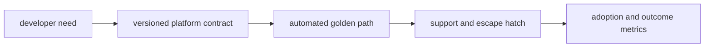

# Platform Engineering

## Question

**How do you decide what belongs on a golden path?**

## 30-Second Answer

**Question focus: How do you decide what belongs on a golden path?** Trace the exact mechanism from **developer need** through **versioned platform contract** and **automated golden path** to **support and escape hatch**. The important distinction is which component owns desired state versus runtime state. Verify the claimed behavior with **adoption and outcome metrics**, and state the capacity, security, and availability trade-off rather than treating the mechanism as automatic.

## Strong Senior Answer

**Question focus: How do you decide what belongs on a golden path?** Trace the mechanisms named in this question: developer need → versioned platform contract → automated golden path → support and escape hatch → adoption and outcome metrics. For each, name its API or state, identity, timeout, retry owner, capacity limit, and evidence. Separate acceptance from convergence and readiness from a correct user result. Preserve the exact revision and audit principal before mitigation; rollback or failover is safe only when state compatibility and traffic ownership are explicit.

**Question-specific test:** How do you decide what belongs on a golden path?

## Staff-Level Expansion

**Question focus: How do you decide what belongs on a golden path?** Name the exact state boundary and accountable owner **automated golden path**. Add a pre-production check for the failure you described, an SLO based on **adoption and outcome metrics**, and a recovery exercise that removes **versioned platform contract** or **support and escape hatch**. Discuss migration and cost: isolation changes the correlated-failure risk but creates more instances to patch, observe, and support.

**Question-specific test:** How do you decide what belongs on a golden path?

## Diagram or Decision Flow

**Question-specific test:** How do you decide what belongs on a golden path?

## Commands or Evidence

Use the commands and records named in the answer to establish timestamps, revisions, ownership, and the first failed boundary; retain the output with the incident or change record.

**Question-specific test:** How do you decide what belongs on a golden path?

## Likely Follow-ups

* Which observation at **automated golden path** would falsify your first hypothesis?
* What remains available when **versioned platform contract** fails?
* What exact metric at **adoption and outcome metrics** proves recovery?

**Question-specific test:** How do you decide what belongs on a golden path?

## Common Weak Answer

Jumping to a restart or product name without tracing developer need to adoption and outcome metrics, distinguishing state owners, or defining a safe rollback.

**Question-specific test:** How do you decide what belongs on a golden path?

## Experience Prompt

Use an incident or design decision involving the named mechanism: state the constraint, your decision, one timestamped signal, the measurable result, and the guardrail added.

**Question-specific test:** How do you decide what belongs on a golden path?
## Question

**How would you measure whether a platform reduces cognitive load?**

## 30-Second Answer

**Question focus: How would you measure whether a platform reduces cognitive load?** Trace the exact mechanism from **developer need** through **versioned platform contract** and **automated golden path** to **support and escape hatch**. The important distinction is which component owns desired state versus runtime state. Verify the claimed behavior with **adoption and outcome metrics**, and state the capacity, security, and availability trade-off rather than treating the mechanism as automatic.

## Strong Senior Answer

**Question focus: How would you measure whether a platform reduces cognitive load?** Trace the mechanisms named in this question: developer need → versioned platform contract → automated golden path → support and escape hatch → adoption and outcome metrics. For each, name its API or state, identity, timeout, retry owner, capacity limit, and evidence. Separate acceptance from convergence and readiness from a correct user result. Preserve the exact revision and audit principal before mitigation; rollback or failover is safe only when state compatibility and traffic ownership are explicit.

**Question-specific test:** How would you measure whether a platform reduces cognitive load?

## Staff-Level Expansion

**Question focus: How would you measure whether a platform reduces cognitive load?** Name the exact state boundary and accountable owner **automated golden path**. Add a pre-production check for the failure you described, an SLO based on **adoption and outcome metrics**, and a recovery exercise that removes **versioned platform contract** or **support and escape hatch**. Discuss migration and cost: isolation changes the correlated-failure risk but creates more instances to patch, observe, and support.

**Question-specific test:** How would you measure whether a platform reduces cognitive load?

## Diagram or Decision Flow

**Question-specific test:** How would you measure whether a platform reduces cognitive load?

## Commands or Evidence

Use the commands and records named in the answer to establish timestamps, revisions, ownership, and the first failed boundary; retain the output with the incident or change record.

**Question-specific test:** How would you measure whether a platform reduces cognitive load?

## Likely Follow-ups

* Which observation at **automated golden path** would falsify your first hypothesis?
* What remains available when **versioned platform contract** fails?
* What exact metric at **adoption and outcome metrics** proves recovery?

**Question-specific test:** How would you measure whether a platform reduces cognitive load?

## Common Weak Answer

Jumping to a restart or product name without tracing developer need to adoption and outcome metrics, distinguishing state owners, or defining a safe rollback.

**Question-specific test:** How would you measure whether a platform reduces cognitive load?

## Experience Prompt

Use an incident or design decision involving the named mechanism: state the constraint, your decision, one timestamped signal, the measurable result, and the guardrail added.

**Question-specific test:** How would you measure whether a platform reduces cognitive load?
## Question

**When should a platform API expose underlying cloud choices?**

## 30-Second Answer

**Question focus: When should a platform API expose underlying cloud choices?** Use the mechanism only when the constraint at **developer need** cannot be met more simply. Evaluate operational ownership of **automated golden path**, its blast radius and recovery behavior, then prove the decision using **adoption and outcome metrics**. Avoid it when its extra control surface is harder to operate than the risk it removes.

## Strong Senior Answer

**Question focus: When should a platform API expose underlying cloud choices?** Trace the mechanisms named in this question: developer need → versioned platform contract → automated golden path → support and escape hatch → adoption and outcome metrics. For each, name its API or state, identity, timeout, retry owner, capacity limit, and evidence. Separate acceptance from convergence and readiness from a correct user result. Preserve the exact revision and audit principal before mitigation; rollback or failover is safe only when state compatibility and traffic ownership are explicit.

**Question-specific test:** When should a platform API expose underlying cloud choices?

## Staff-Level Expansion

**Question focus: When should a platform API expose underlying cloud choices?** Name the exact state boundary and accountable owner **automated golden path**. Add a pre-production check for the failure you described, an SLO based on **adoption and outcome metrics**, and a recovery exercise that removes **versioned platform contract** or **support and escape hatch**. Discuss migration and cost: isolation changes the correlated-failure risk but creates more instances to patch, observe, and support.

**Question-specific test:** When should a platform API expose underlying cloud choices?

## Diagram or Decision Flow

**Question-specific test:** When should a platform API expose underlying cloud choices?

## Commands or Evidence

Use the commands and records named in the answer to establish timestamps, revisions, ownership, and the first failed boundary; retain the output with the incident or change record.

**Question-specific test:** When should a platform API expose underlying cloud choices?

## Likely Follow-ups

* Which observation at **automated golden path** would falsify your first hypothesis?
* What remains available when **versioned platform contract** fails?
* What exact metric at **adoption and outcome metrics** proves recovery?

**Question-specific test:** When should a platform API expose underlying cloud choices?

## Common Weak Answer

Jumping to a restart or product name without tracing developer need to adoption and outcome metrics, distinguishing state owners, or defining a safe rollback.

**Question-specific test:** When should a platform API expose underlying cloud choices?

## Experience Prompt

Use an incident or design decision involving the named mechanism: state the constraint, your decision, one timestamped signal, the measurable result, and the guardrail added.

**Question-specific test:** When should a platform API expose underlying cloud choices?
