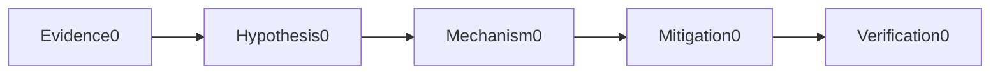
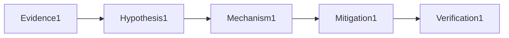

# Scripting Automation

## Question

**How do you write a safe retry loop?**

## 30-Second Answer

Retry only transient and preferably idempotent operations, with attempt/deadline bounds, exponential backoff, jitter, observability and cancellation.

## Strong Senior Answer

Start with a timestamped failing example and compare the mechanism named in the question against a healthy peer. Retry only transient and preferably idempotent operations, with attempt/deadline bounds, exponential backoff, jitter, observability and cancellation. Preserve evidence before mitigation and verify the user-visible outcome afterward.

**Question-specific test:** How do you write a safe retry loop?

## Staff-Level Expansion

Define ownership, a measurable failure threshold and a reversible response for this mechanism. Prevent recurrence by testing the exact failure rather than adding an unrelated capacity control.

**Question-specific test:** How do you write a safe retry loop?

## Diagram or Decision Flow

**Question-specific test:** How do you write a safe retry loop?

## Commands or Evidence

Capture native status, timestamps, configuration revision, saturation and the user-visible probe appropriate to **How do you write a safe retry loop?**

**Question-specific test:** How do you write a safe retry loop?

## Likely Follow-ups

* What evidence would falsify your first hypothesis?
* When would you stop and roll back?

**Question-specific test:** How do you write a safe retry loop?

## Common Weak Answer

Naming a tool without explaining the relevant state, failure boundary, safety constraint or proof of recovery.

**Question-specific test:** How do you write a safe retry loop?

## Experience Prompt

Give one example involving how do you write a safe retry loop? Include impact, evidence, decision and lasting improvement.

**Question-specific test:** How do you write a safe retry loop?
## Question

**How do you invoke subprocesses safely in Python?**

## 30-Second Answer

Pass an argv list without shell=True, set timeout, check exit status, bound/capture output and preserve stderr context while redacting secrets.

## Strong Senior Answer

Start with a timestamped failing example and compare the mechanism named in the question against a healthy peer. Pass an argv list without shell=True, set timeout, check exit status, bound/capture output and preserve stderr context while redacting secrets. Preserve evidence before mitigation and verify the user-visible outcome afterward.

**Question-specific test:** How do you invoke subprocesses safely in Python?

## Staff-Level Expansion

Define ownership, a measurable failure threshold and a reversible response for this mechanism. Prevent recurrence by testing the exact failure rather than adding an unrelated capacity control.

**Question-specific test:** How do you invoke subprocesses safely in Python?

## Diagram or Decision Flow

**Question-specific test:** How do you invoke subprocesses safely in Python?

## Commands or Evidence

Capture native status, timestamps, configuration revision, saturation and the user-visible probe appropriate to **How do you invoke subprocesses safely in Python?**

**Question-specific test:** How do you invoke subprocesses safely in Python?

## Likely Follow-ups

* What evidence would falsify your first hypothesis?
* When would you stop and roll back?

**Question-specific test:** How do you invoke subprocesses safely in Python?

## Common Weak Answer

Naming a tool without explaining the relevant state, failure boundary, safety constraint or proof of recovery.

**Question-specific test:** How do you invoke subprocesses safely in Python?

## Experience Prompt

Give one example involving how do you invoke subprocesses safely in python? Include impact, evidence, decision and lasting improvement.

**Question-specific test:** How do you invoke subprocesses safely in Python?
## Question

**What makes a Bash deployment script production-safe?**

## 30-Second Answer

Use set -euo pipefail, quoted expansions, arrays, explicit validation, traps for cleanup, atomic changes, idempotency and ShellCheck/Bats tests.

## Strong Senior Answer

Start with a timestamped failing example and compare the mechanism named in the question against a healthy peer. Use set -euo pipefail, quoted expansions, arrays, explicit validation, traps for cleanup, atomic changes, idempotency and ShellCheck/Bats tests. Preserve evidence before mitigation and verify the user-visible outcome afterward.

**Question-specific test:** What makes a Bash deployment script production-safe?

## Staff-Level Expansion

Define ownership, a measurable failure threshold and a reversible response for this mechanism. Prevent recurrence by testing the exact failure rather than adding an unrelated capacity control.

**Question-specific test:** What makes a Bash deployment script production-safe?

## Diagram or Decision Flow

**Question-specific test:** What makes a Bash deployment script production-safe?

## Commands or Evidence

Capture native status, timestamps, configuration revision, saturation and the user-visible probe appropriate to **What makes a Bash deployment script production-safe?**

**Question-specific test:** What makes a Bash deployment script production-safe?

## Likely Follow-ups

* What evidence would falsify your first hypothesis?
* When would you stop and roll back?

**Question-specific test:** What makes a Bash deployment script production-safe?

## Common Weak Answer

Naming a tool without explaining the relevant state, failure boundary, safety constraint or proof of recovery.

**Question-specific test:** What makes a Bash deployment script production-safe?

## Experience Prompt

Give one example involving what makes a bash deployment script production-safe? Include impact, evidence, decision and lasting improvement.

**Question-specific test:** What makes a Bash deployment script production-safe?
