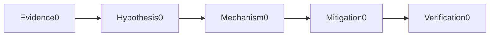
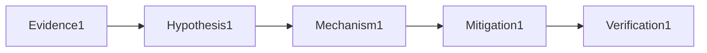

# Security

## Question

**How do you secure a container supply chain?**

## 30-Second Answer

Pin dependencies, isolate builds, scan source/image, emit SBOM and provenance, sign the digest and verify identity/policy at admission.

## Strong Senior Answer

Start with a timestamped failing example and compare the mechanism named in the question against a healthy peer. Pin dependencies, isolate builds, scan source/image, emit SBOM and provenance, sign the digest and verify identity/policy at admission. Preserve evidence before mitigation and verify the user-visible outcome afterward.

**Question-specific test:** How do you secure a container supply chain?

## Staff-Level Expansion

Define ownership, a measurable failure threshold and a reversible response for this mechanism. Prevent recurrence by testing the exact failure rather than adding an unrelated capacity control.

**Question-specific test:** How do you secure a container supply chain?

## Diagram or Decision Flow

**Question-specific test:** How do you secure a container supply chain?

## Commands or Evidence

Capture native status, timestamps, configuration revision, saturation and the user-visible probe appropriate to **How do you secure a container supply chain?**

**Question-specific test:** How do you secure a container supply chain?

## Likely Follow-ups

* What evidence would falsify your first hypothesis?
* When would you stop and roll back?

**Question-specific test:** How do you secure a container supply chain?

## Common Weak Answer

Naming a tool without explaining the relevant state, failure boundary, safety constraint or proof of recovery.

**Question-specific test:** How do you secure a container supply chain?

## Experience Prompt

Give one example involving how do you secure a container supply chain? Include impact, evidence, decision and lasting improvement.

**Question-specific test:** How do you secure a container supply chain?
## Question

**How do you design production break-glass access?**

## 30-Second Answer

Use declared criteria, short-lived approval-bound elevation, strong authentication, recording, alerts and mandatory review; test it without creating standing privilege.

## Strong Senior Answer

Start with a timestamped failing example and compare the mechanism named in the question against a healthy peer. Use declared criteria, short-lived approval-bound elevation, strong authentication, recording, alerts and mandatory review; test it without creating standing privilege. Preserve evidence before mitigation and verify the user-visible outcome afterward.

**Question-specific test:** How do you design production break-glass access?

## Staff-Level Expansion

Define ownership, a measurable failure threshold and a reversible response for this mechanism. Prevent recurrence by testing the exact failure rather than adding an unrelated capacity control.

**Question-specific test:** How do you design production break-glass access?

## Diagram or Decision Flow

**Question-specific test:** How do you design production break-glass access?

## Commands or Evidence

Capture native status, timestamps, configuration revision, saturation and the user-visible probe appropriate to **How do you design production break-glass access?**

**Question-specific test:** How do you design production break-glass access?

## Likely Follow-ups

* What evidence would falsify your first hypothesis?
* When would you stop and roll back?

**Question-specific test:** How do you design production break-glass access?

## Common Weak Answer

Naming a tool without explaining the relevant state, failure boundary, safety constraint or proof of recovery.

**Question-specific test:** How do you design production break-glass access?

## Experience Prompt

Give one example involving how do you design production break-glass access? Include impact, evidence, decision and lasting improvement.

**Question-specific test:** How do you design production break-glass access?
## Question

**How do seccomp and Linux capabilities differ?**

## 30-Second Answer

Capabilities split root privileges while seccomp filters syscalls; combine dropped capabilities, non-root, no-new-privileges and a workload-tested syscall profile.

## Strong Senior Answer

Start with a timestamped failing example and compare the mechanism named in the question against a healthy peer. Capabilities split root privileges while seccomp filters syscalls; combine dropped capabilities, non-root, no-new-privileges and a workload-tested syscall profile. Preserve evidence before mitigation and verify the user-visible outcome afterward.

**Question-specific test:** How do seccomp and Linux capabilities differ?

## Staff-Level Expansion

Define ownership, a measurable failure threshold and a reversible response for this mechanism. Prevent recurrence by testing the exact failure rather than adding an unrelated capacity control.

**Question-specific test:** How do seccomp and Linux capabilities differ?

## Diagram or Decision Flow

**Question-specific test:** How do seccomp and Linux capabilities differ?

## Commands or Evidence

Capture native status, timestamps, configuration revision, saturation and the user-visible probe appropriate to **How do seccomp and Linux capabilities differ?**

**Question-specific test:** How do seccomp and Linux capabilities differ?

## Likely Follow-ups

* What evidence would falsify your first hypothesis?
* When would you stop and roll back?

**Question-specific test:** How do seccomp and Linux capabilities differ?

## Common Weak Answer

Naming a tool without explaining the relevant state, failure boundary, safety constraint or proof of recovery.

**Question-specific test:** How do seccomp and Linux capabilities differ?

## Experience Prompt

Give one example involving how do seccomp and linux capabilities differ? Include impact, evidence, decision and lasting improvement.

**Question-specific test:** How do seccomp and Linux capabilities differ?
