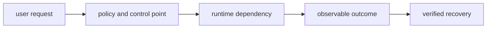
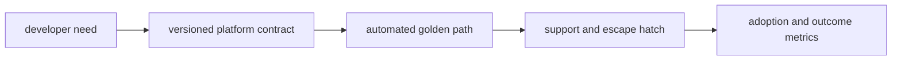
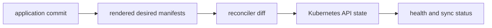
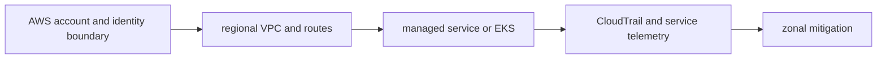
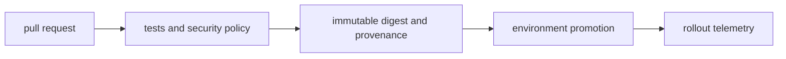

# System Design and Incident Scenarios

## Question

**Design a safe multi-region release strategy.**

## 30-Second Answer

**Question focus: Design a safe multi-region release strategy.** Start with availability, latency, security, tenancy, RPO/RTO, and ownership. Build explicit boundaries from **user request** to **policy and control point**, keep authoritative state at **runtime dependency**, isolate **observable outcome** by failure domain, and make **verified recovery** the promotion and recovery gate. Test dependency loss and rollback before onboarding tenants.

## Strong Senior Answer

**Question focus: Design a safe multi-region release strategy.** Trace the mechanisms named in this question: user request → policy and control point → runtime dependency → observable outcome → verified recovery. For each, name its API or state, identity, timeout, retry owner, capacity limit, and evidence. Separate acceptance from convergence and readiness from a correct user result. Preserve the exact revision and audit principal before mitigation; rollback or failover is safe only when state compatibility and traffic ownership are explicit.

**Question-specific test:** Design a safe multi-region release strategy.

## Staff-Level Expansion

**Question focus: Design a safe multi-region release strategy.** Name the exact state boundary and accountable owner **runtime dependency**. Add a pre-production check for the failure you described, an SLO based on **verified recovery**, and a recovery exercise that removes **policy and control point** or **observable outcome**. Discuss migration and cost: isolation changes the correlated-failure risk but creates more instances to patch, observe, and support.

**Question-specific test:** Design a safe multi-region release strategy.

## Diagram or Decision Flow

**Question-specific test:** Design a safe multi-region release strategy.

## Commands or Evidence

Use the commands and records named in the answer to establish timestamps, revisions, ownership, and the first failed boundary; retain the output with the incident or change record.

**Question-specific test:** Design a safe multi-region release strategy.

## Likely Follow-ups

* Which observation at **runtime dependency** would falsify your first hypothesis?
* What remains available when **policy and control point** fails?
* What exact metric at **verified recovery** proves recovery?

**Question-specific test:** Design a safe multi-region release strategy.

## Common Weak Answer

Jumping to a restart or product name without tracing user request to verified recovery, distinguishing state owners, or defining a safe rollback.

**Question-specific test:** Design a safe multi-region release strategy.

## Experience Prompt

Use an incident or design decision involving the named mechanism: state the constraint, your decision, one timestamped signal, the measurable result, and the guardrail added.

**Question-specific test:** Design a safe multi-region release strategy.
## Question

**Design a regulated code-to-production platform.**

## 30-Second Answer

**Question focus: Design a regulated code-to-production platform.** Start with availability, latency, security, tenancy, RPO/RTO, and ownership. Build explicit boundaries from **developer need** to **versioned platform contract**, keep authoritative state at **automated golden path**, isolate **support and escape hatch** by failure domain, and make **adoption and outcome metrics** the promotion and recovery gate. Test dependency loss and rollback before onboarding tenants.

## Strong Senior Answer

**Question focus: Design a regulated code-to-production platform.** Trace the mechanisms named in this question: developer need → versioned platform contract → automated golden path → support and escape hatch → adoption and outcome metrics. For each, name its API or state, identity, timeout, retry owner, capacity limit, and evidence. Separate acceptance from convergence and readiness from a correct user result. Preserve the exact revision and audit principal before mitigation; rollback or failover is safe only when state compatibility and traffic ownership are explicit.

**Question-specific test:** Design a regulated code-to-production platform.

## Staff-Level Expansion

**Question focus: Design a regulated code-to-production platform.** Name the exact state boundary and accountable owner **automated golden path**. Add a pre-production check for the failure you described, an SLO based on **adoption and outcome metrics**, and a recovery exercise that removes **versioned platform contract** or **support and escape hatch**. Discuss migration and cost: isolation changes the correlated-failure risk but creates more instances to patch, observe, and support.

**Question-specific test:** Design a regulated code-to-production platform.

## Diagram or Decision Flow

**Question-specific test:** Design a regulated code-to-production platform.

## Commands or Evidence

Use the commands and records named in the answer to establish timestamps, revisions, ownership, and the first failed boundary; retain the output with the incident or change record.

**Question-specific test:** Design a regulated code-to-production platform.

## Likely Follow-ups

* Which observation at **automated golden path** would falsify your first hypothesis?
* What remains available when **versioned platform contract** fails?
* What exact metric at **adoption and outcome metrics** proves recovery?

**Question-specific test:** Design a regulated code-to-production platform.

## Common Weak Answer

Jumping to a restart or product name without tracing developer need to adoption and outcome metrics, distinguishing state owners, or defining a safe rollback.

**Question-specific test:** Design a regulated code-to-production platform.

## Experience Prompt

Use an incident or design decision involving the named mechanism: state the constraint, your decision, one timestamped signal, the measurable result, and the guardrail added.

**Question-specific test:** Design a regulated code-to-production platform.
## Question

**Design a multi-tenant GitOps control plane.**

## 30-Second Answer

**Question focus: Design a multi-tenant GitOps control plane.** Start with availability, latency, security, tenancy, RPO/RTO, and ownership. Build explicit boundaries from **application commit** to **rendered desired manifests**, keep authoritative state at **reconciler diff**, isolate **Kubernetes API state** by failure domain, and make **health and sync status** the promotion and recovery gate. Test dependency loss and rollback before onboarding tenants.

## Strong Senior Answer

**Question focus: Design a multi-tenant GitOps control plane.** Trace the mechanisms named in this question: application commit → rendered desired manifests → reconciler diff → Kubernetes API state → health and sync status. For each, name its API or state, identity, timeout, retry owner, capacity limit, and evidence. Separate acceptance from convergence and readiness from a correct user result. Preserve the exact revision and audit principal before mitigation; rollback or failover is safe only when state compatibility and traffic ownership are explicit.

**Question-specific test:** Design a multi-tenant GitOps control plane.

## Staff-Level Expansion

**Question focus: Design a multi-tenant GitOps control plane.** Name the exact state boundary and accountable owner **reconciler diff**. Add a pre-production check for the failure you described, an SLO based on **health and sync status**, and a recovery exercise that removes **rendered desired manifests** or **Kubernetes API state**. Discuss migration and cost: isolation changes the correlated-failure risk but creates more instances to patch, observe, and support.

**Question-specific test:** Design a multi-tenant GitOps control plane.

## Diagram or Decision Flow

**Question-specific test:** Design a multi-tenant GitOps control plane.

## Commands or Evidence

Use the commands and records named in the answer to establish timestamps, revisions, ownership, and the first failed boundary; retain the output with the incident or change record.

**Question-specific test:** Design a multi-tenant GitOps control plane.

## Likely Follow-ups

* Which observation at **reconciler diff** would falsify your first hypothesis?
* What remains available when **rendered desired manifests** fails?
* What exact metric at **health and sync status** proves recovery?

**Question-specific test:** Design a multi-tenant GitOps control plane.

## Common Weak Answer

Jumping to a restart or product name without tracing application commit to health and sync status, distinguishing state owners, or defining a safe rollback.

**Question-specific test:** Design a multi-tenant GitOps control plane.

## Experience Prompt

Use an incident or design decision involving the named mechanism: state the constraint, your decision, one timestamped signal, the measurable result, and the guardrail added.

**Question-specific test:** Design a multi-tenant GitOps control plane.
## Question

**Pods are Pending only in one Availability Zone; lead the incident.**

## 30-Second Answer

**Question focus: Pods are Pending only in one Availability Zone; lead the incident.** Bound impact and compare the last healthy revision, zone, tenant, or node with the failing cohort. Follow evidence in order from **AWS account and identity boundary** through **regional VPC and routes**, **managed service or EKS**, and **CloudTrail and service telemetry**; stop at the first divergent handoff. Apply the smallest reversible mitigation, preserve events and timestamps, and confirm recovery with **zonal mitigation**.

## Strong Senior Answer

**Question focus: Pods are Pending only in one Availability Zone; lead the incident.** Trace the mechanisms named in this question: AWS account and identity boundary → regional VPC and routes → managed service or EKS → CloudTrail and service telemetry → zonal mitigation. For each, name its API or state, identity, timeout, retry owner, capacity limit, and evidence. Separate acceptance from convergence and readiness from a correct user result. Preserve the exact revision and audit principal before mitigation; rollback or failover is safe only when state compatibility and traffic ownership are explicit.

**Question-specific test:** Pods are Pending only in one Availability Zone; lead the incident.

## Staff-Level Expansion

**Question focus: Pods are Pending only in one Availability Zone; lead the incident.** Name the exact state boundary and accountable owner **managed service or EKS**. Add a pre-production check for the failure you described, an SLO based on **zonal mitigation**, and a recovery exercise that removes **regional VPC and routes** or **CloudTrail and service telemetry**. Discuss migration and cost: isolation changes the correlated-failure risk but creates more instances to patch, observe, and support.

**Question-specific test:** Pods are Pending only in one Availability Zone; lead the incident.

## Diagram or Decision Flow

**Question-specific test:** Pods are Pending only in one Availability Zone; lead the incident.

## Commands or Evidence

Use the commands and records named in the answer to establish timestamps, revisions, ownership, and the first failed boundary; retain the output with the incident or change record.

**Question-specific test:** Pods are Pending only in one Availability Zone; lead the incident.

## Likely Follow-ups

* Which observation at **managed service or EKS** would falsify your first hypothesis?
* What remains available when **regional VPC and routes** fails?
* What exact metric at **zonal mitigation** proves recovery?

**Question-specific test:** Pods are Pending only in one Availability Zone; lead the incident.

## Common Weak Answer

Jumping to a restart or product name without tracing aws account and identity boundary to zonal mitigation, distinguishing state owners, or defining a safe rollback.

**Question-specific test:** Pods are Pending only in one Availability Zone; lead the incident.

## Experience Prompt

Use an incident or design decision involving the named mechanism: state the constraint, your decision, one timestamped signal, the measurable result, and the guardrail added.

**Question-specific test:** Pods are Pending only in one Availability Zone; lead the incident.
## Question

**Argo CD repeatedly reverts a field mutated by another controller.**

## 30-Second Answer

**Question focus: Argo CD repeatedly reverts a field mutated by another controller.** Bound impact and compare the last healthy revision, zone, tenant, or node with the failing cohort. Follow evidence in order from **application commit** through **rendered desired manifests**, **reconciler diff**, and **Kubernetes API state**; stop at the first divergent handoff. Apply the smallest reversible mitigation, preserve events and timestamps, and confirm recovery with **health and sync status**.

## Strong Senior Answer

**Question focus: Argo CD repeatedly reverts a field mutated by another controller.** Trace the mechanisms named in this question: application commit → rendered desired manifests → reconciler diff → Kubernetes API state → health and sync status. For each, name its API or state, identity, timeout, retry owner, capacity limit, and evidence. Separate acceptance from convergence and readiness from a correct user result. Preserve the exact revision and audit principal before mitigation; rollback or failover is safe only when state compatibility and traffic ownership are explicit.

**Question-specific test:** Argo CD repeatedly reverts a field mutated by another controller.

## Staff-Level Expansion

**Question focus: Argo CD repeatedly reverts a field mutated by another controller.** Name the exact state boundary and accountable owner **reconciler diff**. Add a pre-production check for the failure you described, an SLO based on **health and sync status**, and a recovery exercise that removes **rendered desired manifests** or **Kubernetes API state**. Discuss migration and cost: isolation changes the correlated-failure risk but creates more instances to patch, observe, and support.

**Question-specific test:** Argo CD repeatedly reverts a field mutated by another controller.

## Diagram or Decision Flow

**Question-specific test:** Argo CD repeatedly reverts a field mutated by another controller.

## Commands or Evidence

Use the commands and records named in the answer to establish timestamps, revisions, ownership, and the first failed boundary; retain the output with the incident or change record.

**Question-specific test:** Argo CD repeatedly reverts a field mutated by another controller.

## Likely Follow-ups

* Which observation at **reconciler diff** would falsify your first hypothesis?
* What remains available when **rendered desired manifests** fails?
* What exact metric at **health and sync status** proves recovery?

**Question-specific test:** Argo CD repeatedly reverts a field mutated by another controller.

## Common Weak Answer

Jumping to a restart or product name without tracing application commit to health and sync status, distinguishing state owners, or defining a safe rollback.

**Question-specific test:** Argo CD repeatedly reverts a field mutated by another controller.

## Experience Prompt

Use an incident or design decision involving the named mechanism: state the constraint, your decision, one timestamped signal, the measurable result, and the guardrail added.

**Question-specific test:** Argo CD repeatedly reverts a field mutated by another controller.
## Question

**A signed but incompatible container image reached production.**

## 30-Second Answer

**Question focus: A signed but incompatible container image reached production.** Bound impact and compare the last healthy revision, zone, tenant, or node with the failing cohort. Follow evidence in order from **pull request** through **tests and security policy**, **immutable digest and provenance**, and **environment promotion**; stop at the first divergent handoff. Apply the smallest reversible mitigation, preserve events and timestamps, and confirm recovery with **rollout telemetry**.

## Strong Senior Answer

**Question focus: A signed but incompatible container image reached production.** Trace the mechanisms named in this question: pull request → tests and security policy → immutable digest and provenance → environment promotion → rollout telemetry. For each, name its API or state, identity, timeout, retry owner, capacity limit, and evidence. Separate acceptance from convergence and readiness from a correct user result. Preserve the exact revision and audit principal before mitigation; rollback or failover is safe only when state compatibility and traffic ownership are explicit.

**Question-specific test:** A signed but incompatible container image reached production.

## Staff-Level Expansion

**Question focus: A signed but incompatible container image reached production.** Name the exact state boundary and accountable owner **immutable digest and provenance**. Add a pre-production check for the failure you described, an SLO based on **rollout telemetry**, and a recovery exercise that removes **tests and security policy** or **environment promotion**. Discuss migration and cost: isolation changes the correlated-failure risk but creates more instances to patch, observe, and support.

**Question-specific test:** A signed but incompatible container image reached production.

## Diagram or Decision Flow

**Question-specific test:** A signed but incompatible container image reached production.

## Commands or Evidence

Use the commands and records named in the answer to establish timestamps, revisions, ownership, and the first failed boundary; retain the output with the incident or change record.

**Question-specific test:** A signed but incompatible container image reached production.

## Likely Follow-ups

* Which observation at **immutable digest and provenance** would falsify your first hypothesis?
* What remains available when **tests and security policy** fails?
* What exact metric at **rollout telemetry** proves recovery?

**Question-specific test:** A signed but incompatible container image reached production.

## Common Weak Answer

Jumping to a restart or product name without tracing pull request to rollout telemetry, distinguishing state owners, or defining a safe rollback.

**Question-specific test:** A signed but incompatible container image reached production.

## Experience Prompt

Use an incident or design decision involving the named mechanism: state the constraint, your decision, one timestamped signal, the measurable result, and the guardrail added.

**Question-specific test:** A signed but incompatible container image reached production.
