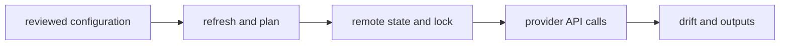
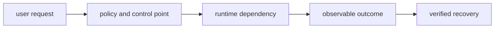

# Infrastructure as Code

## Question

**How would you design Terraform state for multiple teams and AWS accounts?**

## 30-Second Answer

**Question focus: How would you design Terraform state for multiple teams and AWS accounts?** Start with availability, latency, security, tenancy, RPO/RTO, and ownership. Build explicit boundaries from **reviewed configuration** to **refresh and plan**, keep authoritative state at **remote state and lock**, isolate **provider API calls** by failure domain, and make **drift and outputs** the promotion and recovery gate. Test dependency loss and rollback before onboarding tenants.

## Strong Senior Answer

**Question focus: How would you design Terraform state for multiple teams and AWS accounts?** Trace the mechanisms named in this question: reviewed configuration → refresh and plan → remote state and lock → provider API calls → drift and outputs. For each, name its API or state, identity, timeout, retry owner, capacity limit, and evidence. Separate acceptance from convergence and readiness from a correct user result. Preserve the exact revision and audit principal before mitigation; rollback or failover is safe only when state compatibility and traffic ownership are explicit.

**Question-specific test:** How would you design Terraform state for multiple teams and AWS accounts?

## Staff-Level Expansion

**Question focus: How would you design Terraform state for multiple teams and AWS accounts?** Name the exact state boundary and accountable owner **remote state and lock**. Add a pre-production check for the failure you described, an SLO based on **drift and outputs**, and a recovery exercise that removes **refresh and plan** or **provider API calls**. Discuss migration and cost: isolation changes the correlated-failure risk but creates more instances to patch, observe, and support.

**Question-specific test:** How would you design Terraform state for multiple teams and AWS accounts?

## Diagram or Decision Flow

**Question-specific test:** How would you design Terraform state for multiple teams and AWS accounts?

## Commands or Evidence

Use the commands and records named in the answer to establish timestamps, revisions, ownership, and the first failed boundary; retain the output with the incident or change record.

**Question-specific test:** How would you design Terraform state for multiple teams and AWS accounts?

## Likely Follow-ups

* Which observation at **remote state and lock** would falsify your first hypothesis?
* What remains available when **refresh and plan** fails?
* What exact metric at **drift and outputs** proves recovery?

**Question-specific test:** How would you design Terraform state for multiple teams and AWS accounts?

## Common Weak Answer

Jumping to a restart or product name without tracing reviewed configuration to drift and outputs, distinguishing state owners, or defining a safe rollback.

**Question-specific test:** How would you design Terraform state for multiple teams and AWS accounts?

## Experience Prompt

Use an incident or design decision involving the named mechanism: state the constraint, your decision, one timestamped signal, the measurable result, and the guardrail added.

**Question-specific test:** How would you design Terraform state for multiple teams and AWS accounts?
## Question

**A Terraform state lock is stale during an incident; what do you do?**

## 30-Second Answer

**Question focus: A Terraform state lock is stale during an incident; what do you do?** Bound impact and compare the last healthy revision, zone, tenant, or node with the failing cohort. Follow evidence in order from **reviewed configuration** through **refresh and plan**, **remote state and lock**, and **provider API calls**; stop at the first divergent handoff. Apply the smallest reversible mitigation, preserve events and timestamps, and confirm recovery with **drift and outputs**.

## Strong Senior Answer

**Question focus: A Terraform state lock is stale during an incident; what do you do?** Trace the mechanisms named in this question: reviewed configuration → refresh and plan → remote state and lock → provider API calls → drift and outputs. For each, name its API or state, identity, timeout, retry owner, capacity limit, and evidence. Separate acceptance from convergence and readiness from a correct user result. Preserve the exact revision and audit principal before mitigation; rollback or failover is safe only when state compatibility and traffic ownership are explicit.

**Question-specific test:** A Terraform state lock is stale during an incident; what do you do?

## Staff-Level Expansion

**Question focus: A Terraform state lock is stale during an incident; what do you do?** Name the exact state boundary and accountable owner **remote state and lock**. Add a pre-production check for the failure you described, an SLO based on **drift and outputs**, and a recovery exercise that removes **refresh and plan** or **provider API calls**. Discuss migration and cost: isolation changes the correlated-failure risk but creates more instances to patch, observe, and support.

**Question-specific test:** A Terraform state lock is stale during an incident; what do you do?

## Diagram or Decision Flow

**Question-specific test:** A Terraform state lock is stale during an incident; what do you do?

## Commands or Evidence

Use the commands and records named in the answer to establish timestamps, revisions, ownership, and the first failed boundary; retain the output with the incident or change record.

**Question-specific test:** A Terraform state lock is stale during an incident; what do you do?

## Likely Follow-ups

* Which observation at **remote state and lock** would falsify your first hypothesis?
* What remains available when **refresh and plan** fails?
* What exact metric at **drift and outputs** proves recovery?

**Question-specific test:** A Terraform state lock is stale during an incident; what do you do?

## Common Weak Answer

Jumping to a restart or product name without tracing reviewed configuration to drift and outputs, distinguishing state owners, or defining a safe rollback.

**Question-specific test:** A Terraform state lock is stale during an incident; what do you do?

## Experience Prompt

Use an incident or design decision involving the named mechanism: state the constraint, your decision, one timestamped signal, the measurable result, and the guardrail added.

**Question-specific test:** A Terraform state lock is stale during an incident; what do you do?
## Question

**How do plan, refresh, and apply relate to remote reality?**

## 30-Second Answer

**Question focus: How do plan, refresh, and apply relate to remote reality?** Trace the exact mechanism from **user request** through **policy and control point** and **runtime dependency** to **observable outcome**. The important distinction is which component owns desired state versus runtime state. Verify the claimed behavior with **verified recovery**, and state the capacity, security, and availability trade-off rather than treating the mechanism as automatic.

## Strong Senior Answer

**Question focus: How do plan, refresh, and apply relate to remote reality?** Trace the mechanisms named in this question: user request → policy and control point → runtime dependency → observable outcome → verified recovery. For each, name its API or state, identity, timeout, retry owner, capacity limit, and evidence. Separate acceptance from convergence and readiness from a correct user result. Preserve the exact revision and audit principal before mitigation; rollback or failover is safe only when state compatibility and traffic ownership are explicit.

**Question-specific test:** How do plan, refresh, and apply relate to remote reality?

## Staff-Level Expansion

**Question focus: How do plan, refresh, and apply relate to remote reality?** Name the exact state boundary and accountable owner **runtime dependency**. Add a pre-production check for the failure you described, an SLO based on **verified recovery**, and a recovery exercise that removes **policy and control point** or **observable outcome**. Discuss migration and cost: isolation changes the correlated-failure risk but creates more instances to patch, observe, and support.

**Question-specific test:** How do plan, refresh, and apply relate to remote reality?

## Diagram or Decision Flow

**Question-specific test:** How do plan, refresh, and apply relate to remote reality?

## Commands or Evidence

Use the commands and records named in the answer to establish timestamps, revisions, ownership, and the first failed boundary; retain the output with the incident or change record.

**Question-specific test:** How do plan, refresh, and apply relate to remote reality?

## Likely Follow-ups

* Which observation at **runtime dependency** would falsify your first hypothesis?
* What remains available when **policy and control point** fails?
* What exact metric at **verified recovery** proves recovery?

**Question-specific test:** How do plan, refresh, and apply relate to remote reality?

## Common Weak Answer

Jumping to a restart or product name without tracing user request to verified recovery, distinguishing state owners, or defining a safe rollback.

**Question-specific test:** How do plan, refresh, and apply relate to remote reality?

## Experience Prompt

Use an incident or design decision involving the named mechanism: state the constraint, your decision, one timestamped signal, the measurable result, and the guardrail added.

**Question-specific test:** How do plan, refresh, and apply relate to remote reality?
