# Engineering Journey: FinAI

FinAI is a fictional financial AI assistant that grows from prototype to multi-region platform.

## 1. Business Idea

FinAI evolves through business idea by replacing manual work with explicit contracts, automated verification, and observable runtime behavior.

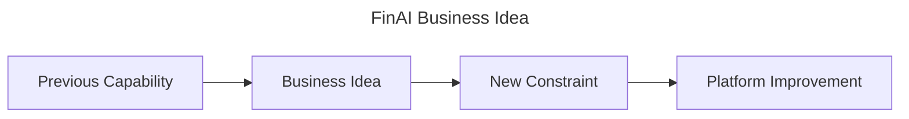

## 2. Developer Writes Code

FinAI evolves through developer writes code by replacing manual work with explicit contracts, automated verification, and observable runtime behavior.

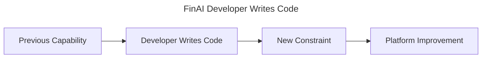

## 3. Git

FinAI evolves through git by replacing manual work with explicit contracts, automated verification, and observable runtime behavior.

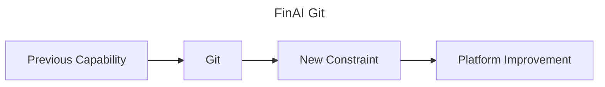

## 4. CI

FinAI evolves through ci by replacing manual work with explicit contracts, automated verification, and observable runtime behavior.

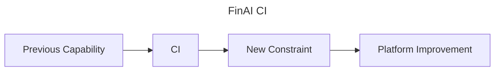

## 5. Compilation

FinAI evolves through compilation by replacing manual work with explicit contracts, automated verification, and observable runtime behavior.


## 6. Artifacts

FinAI evolves through artifacts by replacing manual work with explicit contracts, automated verification, and observable runtime behavior.

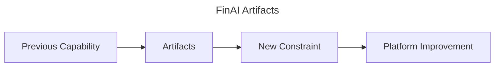

## 7. Docker Build

FinAI evolves through docker build by replacing manual work with explicit contracts, automated verification, and observable runtime behavior.

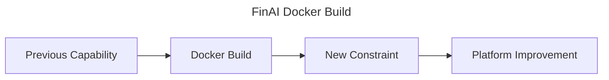

## 8. Registry

FinAI evolves through registry by replacing manual work with explicit contracts, automated verification, and observable runtime behavior.

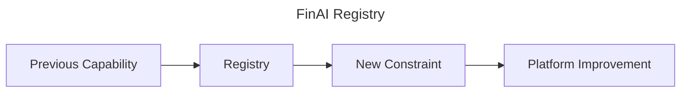

## 9. Helm

FinAI evolves through helm by replacing manual work with explicit contracts, automated verification, and observable runtime behavior.

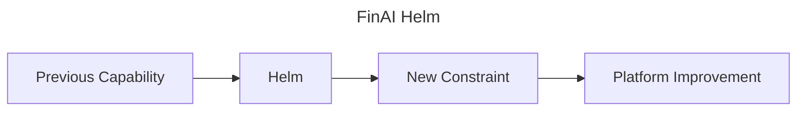

## 10. GitOps

FinAI evolves through gitops by replacing manual work with explicit contracts, automated verification, and observable runtime behavior.

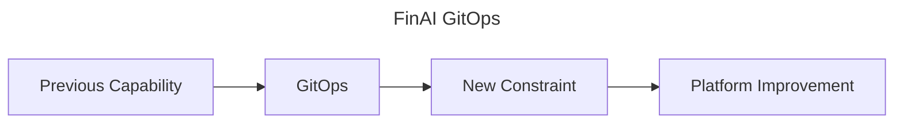

## 11. ArgoCD

FinAI evolves through argocd by replacing manual work with explicit contracts, automated verification, and observable runtime behavior.


## 12. Kubernetes

FinAI evolves through kubernetes by replacing manual work with explicit contracts, automated verification, and observable runtime behavior.

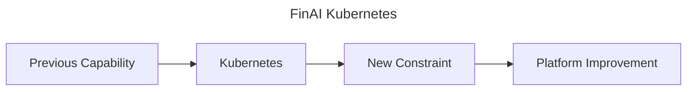

## 13. Controllers

FinAI evolves through controllers by replacing manual work with explicit contracts, automated verification, and observable runtime behavior.

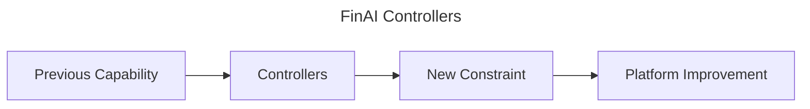

## 14. Ingress

FinAI evolves through ingress by replacing manual work with explicit contracts, automated verification, and observable runtime behavior.


## 15. Load Balancer

FinAI evolves through load balancer by replacing manual work with explicit contracts, automated verification, and observable runtime behavior.

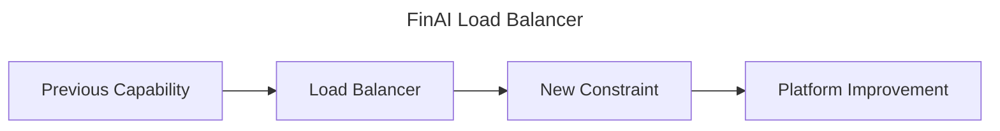

## 16. Users

FinAI evolves through users by replacing manual work with explicit contracts, automated verification, and observable runtime behavior.

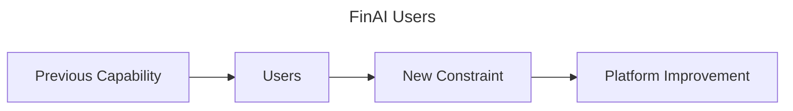

## 17. Scaling

FinAI evolves through scaling by replacing manual work with explicit contracts, automated verification, and observable runtime behavior.

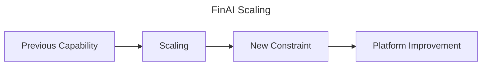

## 18. Monitoring

FinAI evolves through monitoring by replacing manual work with explicit contracts, automated verification, and observable runtime behavior.

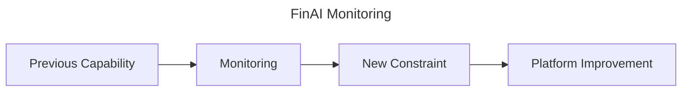

## 19. Incident

FinAI evolves through incident by replacing manual work with explicit contracts, automated verification, and observable runtime behavior.


## 20. Recovery

FinAI evolves through recovery by replacing manual work with explicit contracts, automated verification, and observable runtime behavior.

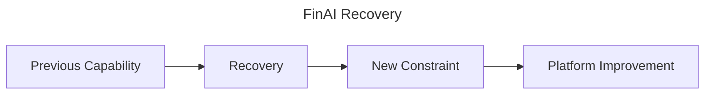

## 21. Multi Region

FinAI evolves through multi region by replacing manual work with explicit contracts, automated verification, and observable runtime behavior.

```mermaid
---
title: FinAI Multi Region
---
flowchart LR
  A[Previous Capability] --> B[Multi Region] --> C[New Constraint] --> D[Platform Improvement]
```

## 22. Platform Engineering

FinAI evolves through platform engineering by replacing manual work with explicit contracts, automated verification, and observable runtime behavior.

```mermaid
---
title: FinAI Platform Engineering
---
flowchart LR
  A[Previous Capability] --> B[Platform Engineering] --> C[New Constraint] --> D[Platform Improvement]
```

## 23. Staff Engineering

FinAI evolves through staff engineering by replacing manual work with explicit contracts, automated verification, and observable runtime behavior.

```mermaid
---
title: FinAI Staff Engineering
---
flowchart LR
  A[Previous Capability] --> B[Staff Engineering] --> C[New Constraint] --> D[Platform Improvement]
```

