# FinAI: From Python Prototype to Regulated AI Platform

FinAI is a **fictional** regulated fintech company used to connect technical decisions in one continuous fraud-detection story. Targets below are scenario requirements, not company claims.


## 1. Business requirements

**New requirement.** A regulated customer needs fraud decisions within 150 ms and an auditable model/version trail.

**Architecture change.** Define an availability/latency SLO, data classification, decision retention, and degraded manual-review path.

**Why now.** This stage is required because the previous architecture cannot satisfy the new requirement without manual risk or an unbounded failure mode.

**Trade-offs.** The change improves repeatability and evidence but adds an owned control surface, upgrade work, and a new failure path.

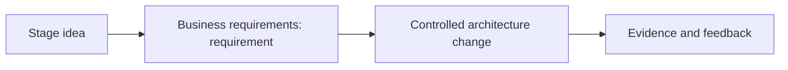

**Interview takeaway.** Explain the constraint first, then the change, failure boundary, measurable signal, and the reason a simpler predecessor stopped being sufficient.


## 2. Initial Python service

**New requirement.** Analysts need an API-backed rules and model prototype.

**Architecture change.** Build a typed Python HTTP service with `/score`, readiness, structured decision ID, and timeout budgets.

**Why now.** This stage is required because the previous architecture cannot satisfy the new requirement without manual risk or an unbounded failure mode.

**Trade-offs.** The change improves repeatability and evidence but adds an owned control surface, upgrade work, and a new failure path.

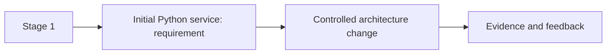

**Interview takeaway.** Explain the constraint first, then the change, failure boundary, measurable signal, and the reason a simpler predecessor stopped being sufficient.


## 3. Git workflow

**New requirement.** Multiple engineers must change rules without losing review evidence.

**Architecture change.** Protect main, require reviewed pull requests, signed CI status, and short-lived feature branches.

**Why now.** This stage is required because the previous architecture cannot satisfy the new requirement without manual risk or an unbounded failure mode.

**Trade-offs.** The change improves repeatability and evidence but adds an owned control surface, upgrade work, and a new failure path.

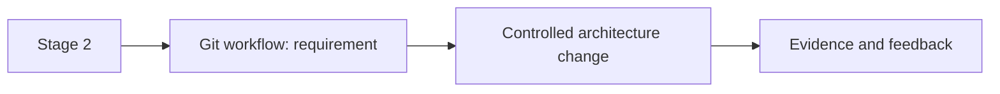

**Interview takeaway.** Explain the constraint first, then the change, failure boundary, measurable signal, and the reason a simpler predecessor stopped being sufficient.


## 4. Unit and integration tests

**New requirement.** A scoring change must not silently alter contractual behavior.

**Architecture change.** Separate pure scoring tests from PostgreSQL/Redis contract tests using disposable dependencies.

**Why now.** This stage is required because the previous architecture cannot satisfy the new requirement without manual risk or an unbounded failure mode.

**Trade-offs.** The change improves repeatability and evidence but adds an owned control surface, upgrade work, and a new failure path.

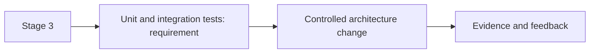

**Interview takeaway.** Explain the constraint first, then the change, failure boundary, measurable signal, and the reason a simpler predecessor stopped being sufficient.


## 5. Dependency resolution

**New requirement.** A transitive library update changed numerical behavior.

**Architecture change.** Lock dependencies with hashes, automate reviewed updates, and produce an SBOM.

**Why now.** This stage is required because the previous architecture cannot satisfy the new requirement without manual risk or an unbounded failure mode.

**Trade-offs.** The change improves repeatability and evidence but adds an owned control surface, upgrade work, and a new failure path.

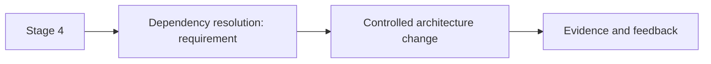

**Interview takeaway.** Explain the constraint first, then the change, failure boundary, measurable signal, and the reason a simpler predecessor stopped being sufficient.


## 6. Build and artifacts

**New requirement.** FinAI needs a single traceable release input.

**Architecture change.** Build once from a clean checkout and label the artifact with commit and provenance.

**Why now.** This stage is required because the previous architecture cannot satisfy the new requirement without manual risk or an unbounded failure mode.

**Trade-offs.** The change improves repeatability and evidence but adds an owned control surface, upgrade work, and a new failure path.

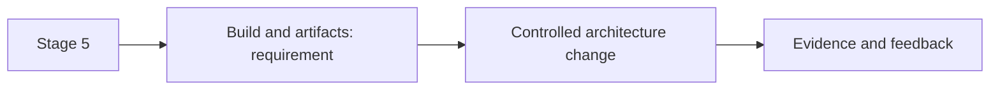

**Interview takeaway.** Explain the constraint first, then the change, failure boundary, measurable signal, and the reason a simpler predecessor stopped being sufficient.


## 7. OCI image

**New requirement.** Runtime differences between laptops and CI caused incidents.

**Architecture change.** Package a non-root, minimal OCI image with exec-form entrypoint and immutable digest.

**Why now.** This stage is required because the previous architecture cannot satisfy the new requirement without manual risk or an unbounded failure mode.

**Trade-offs.** The change improves repeatability and evidence but adds an owned control surface, upgrade work, and a new failure path.

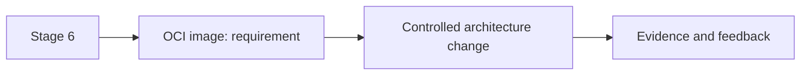

**Interview takeaway.** Explain the constraint first, then the change, failure boundary, measurable signal, and the reason a simpler predecessor stopped being sufficient.


## 8. ECR registry

**New requirement.** Production needs controlled artifact distribution.

**Architecture change.** Push signed images to ECR, scan them, restrict mutation, and expire only unreferenced tags.

**Why now.** This stage is required because the previous architecture cannot satisfy the new requirement without manual risk or an unbounded failure mode.

**Trade-offs.** The change improves repeatability and evidence but adds an owned control surface, upgrade work, and a new failure path.

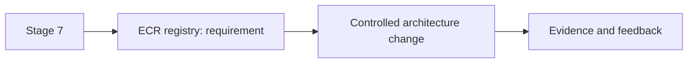

**Interview takeaway.** Explain the constraint first, then the change, failure boundary, measurable signal, and the reason a simpler predecessor stopped being sufficient.


## 9. Terraform AWS foundation

**New requirement.** Accounts and networking cannot remain click-operated.

**Architecture change.** Create isolated state and modules for accounts, VPC endpoints, KMS, logging, and budgets.

**Why now.** This stage is required because the previous architecture cannot satisfy the new requirement without manual risk or an unbounded failure mode.

**Trade-offs.** The change improves repeatability and evidence but adds an owned control surface, upgrade work, and a new failure path.

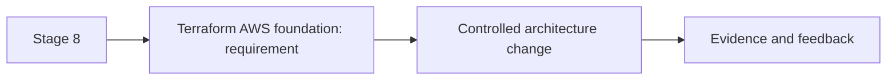

**Interview takeaway.** Explain the constraint first, then the change, failure boundary, measurable signal, and the reason a simpler predecessor stopped being sufficient.


## 10. EKS cluster

**New requirement.** The service needs standardized scheduling and rollout controls.

**Architecture change.** Provision a multi-AZ managed control plane and separate system/application node groups.

**Why now.** This stage is required because the previous architecture cannot satisfy the new requirement without manual risk or an unbounded failure mode.

**Trade-offs.** The change improves repeatability and evidence but adds an owned control surface, upgrade work, and a new failure path.

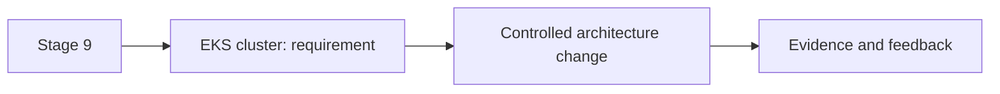

**Interview takeaway.** Explain the constraint first, then the change, failure boundary, measurable signal, and the reason a simpler predecessor stopped being sufficient.


## 11. Helm packaging

**New requirement.** Environment configuration has become copy-pasted YAML.

**Architecture change.** Package stable Kubernetes resources in a versioned Helm chart with a small values contract.

**Why now.** This stage is required because the previous architecture cannot satisfy the new requirement without manual risk or an unbounded failure mode.

**Trade-offs.** The change improves repeatability and evidence but adds an owned control surface, upgrade work, and a new failure path.

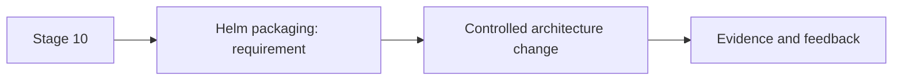

**Interview takeaway.** Explain the constraint first, then the change, failure boundary, measurable signal, and the reason a simpler predecessor stopped being sufficient.


## 12. GitOps repository

**New requirement.** Deployment intent needs review independent of application builds.

**Architecture change.** Record environment digest and chart values in a restricted Git repository.

**Why now.** This stage is required because the previous architecture cannot satisfy the new requirement without manual risk or an unbounded failure mode.

**Trade-offs.** The change improves repeatability and evidence but adds an owned control surface, upgrade work, and a new failure path.

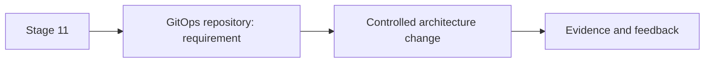

**Interview takeaway.** Explain the constraint first, then the change, failure boundary, measurable signal, and the reason a simpler predecessor stopped being sufficient.


## 13. Argo CD reconciliation

**New requirement.** Manual kubectl changes bypass the audit trail.

**Architecture change.** Argo CD compares desired and live state; auto-sync is scoped and pruning guarded.

**Why now.** This stage is required because the previous architecture cannot satisfy the new requirement without manual risk or an unbounded failure mode.

**Trade-offs.** The change improves repeatability and evidence but adds an owned control surface, upgrade work, and a new failure path.

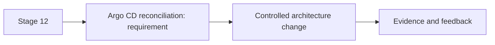

**Interview takeaway.** Explain the constraint first, then the change, failure boundary, measurable signal, and the reason a simpler predecessor stopped being sufficient.


## 14. Kubernetes request flow

**New requirement.** Teams mistake accepted Deployments for completed releases.

**Architecture change.** Expose admission, Deployment/ReplicaSet reconciliation, scheduling, readiness, and EndpointSlice status.

**Why now.** This stage is required because the previous architecture cannot satisfy the new requirement without manual risk or an unbounded failure mode.

**Trade-offs.** The change improves repeatability and evidence but adds an owned control surface, upgrade work, and a new failure path.

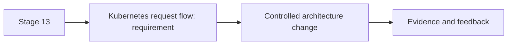

**Interview takeaway.** Explain the constraint first, then the change, failure boundary, measurable signal, and the reason a simpler predecessor stopped being sufficient.


## 15. Secrets

**New requirement.** Static AWS keys appeared in CI variables.

**Architecture change.** Use workload identity and External Secrets to project Secrets Manager values with rotation ownership.

**Why now.** This stage is required because the previous architecture cannot satisfy the new requirement without manual risk or an unbounded failure mode.

**Trade-offs.** The change improves repeatability and evidence but adds an owned control surface, upgrade work, and a new failure path.

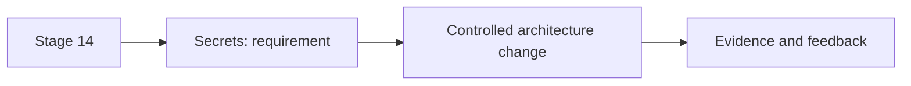

**Interview takeaway.** Explain the constraint first, then the change, failure boundary, measurable signal, and the reason a simpler predecessor stopped being sufficient.


## 16. TLS

**New requirement.** Manual certificate renewals threaten availability.

**Architecture change.** cert-manager reconciles Certificate resources through an approved issuer and alerts before expiry.

**Why now.** This stage is required because the previous architecture cannot satisfy the new requirement without manual risk or an unbounded failure mode.

**Trade-offs.** The change improves repeatability and evidence but adds an owned control surface, upgrade work, and a new failure path.

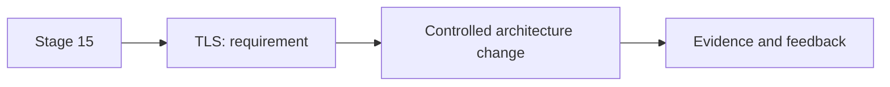

**Interview takeaway.** Explain the constraint first, then the change, failure boundary, measurable signal, and the reason a simpler predecessor stopped being sufficient.


## 17. Traffic

**New requirement.** Customers need a stable regional endpoint.

**Architecture change.** Route 53 targets an ALB managed from Ingress/Gateway configuration, with WAF and explicit health semantics.

**Why now.** This stage is required because the previous architecture cannot satisfy the new requirement without manual risk or an unbounded failure mode.

**Trade-offs.** The change improves repeatability and evidence but adds an owned control surface, upgrade work, and a new failure path.

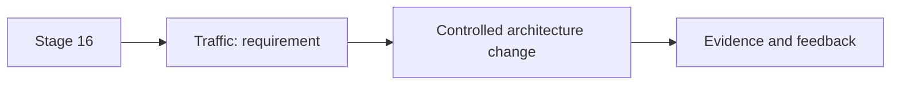

**Interview takeaway.** Explain the constraint first, then the change, failure boundary, measurable signal, and the reason a simpler predecessor stopped being sufficient.


## 18. PostgreSQL and Redis

**New requirement.** Decisions need durable audit data and low-latency feature caching.

**Architecture change.** Use Multi-AZ PostgreSQL for records and Redis for bounded-TTL derived features; neither is interchangeable.

**Why now.** This stage is required because the previous architecture cannot satisfy the new requirement without manual risk or an unbounded failure mode.

**Trade-offs.** The change improves repeatability and evidence but adds an owned control surface, upgrade work, and a new failure path.

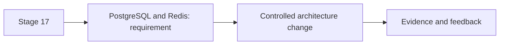

**Interview takeaway.** Explain the constraint first, then the change, failure boundary, measurable signal, and the reason a simpler predecessor stopped being sufficient.


## 19. Kafka events

**New requirement.** Synchronous scoring cannot absorb every transaction spike.

**Architecture change.** Publish keyed fraud events to Kafka, make consumers idempotent, and monitor lag and poison records.

**Why now.** This stage is required because the previous architecture cannot satisfy the new requirement without manual risk or an unbounded failure mode.

**Trade-offs.** The change improves repeatability and evidence but adds an owned control surface, upgrade work, and a new failure path.

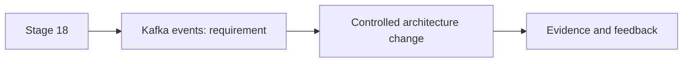

**Interview takeaway.** Explain the constraint first, then the change, failure boundary, measurable signal, and the reason a simpler predecessor stopped being sufficient.


## 20. Model serving

**New requirement.** Model downloads make API rollout slow and memory-heavy.

**Architecture change.** Separate inference behind a versioned service with model cache, bounded concurrency, and latency metrics.

**Why now.** This stage is required because the previous architecture cannot satisfy the new requirement without manual risk or an unbounded failure mode.

**Trade-offs.** The change improves repeatability and evidence but adds an owned control surface, upgrade work, and a new failure path.

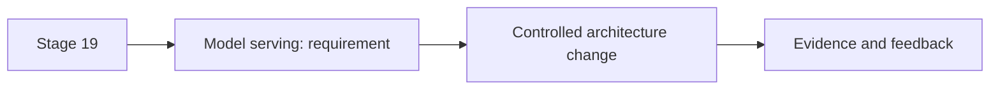

**Interview takeaway.** Explain the constraint first, then the change, failure boundary, measurable signal, and the reason a simpler predecessor stopped being sufficient.


## 21. ModelService controller

**New requirement.** Every model team hand-builds unsafe serving manifests.

**Architecture change.** Add a ModelService CRD/controller that owns serving, identity, autoscaling, status, and finalization.

**Why now.** This stage is required because the previous architecture cannot satisfy the new requirement without manual risk or an unbounded failure mode.

**Trade-offs.** The change improves repeatability and evidence but adds an owned control surface, upgrade work, and a new failure path.

```mermaid
flowchart LR
  S21[Stage 20] --> R21[ModelService controller: requirement]
  R21 --> C21[Controlled architecture change]
  C21 --> E21[Evidence and feedback]
```

**Interview takeaway.** Explain the constraint first, then the change, failure boundary, measurable signal, and the reason a simpler predecessor stopped being sufficient.


## 22. GPU node groups

**New requirement.** CPU inference misses the latency target.

**Architecture change.** Add tainted A10G nodes with device plugin/operator, topology constraints, quotas, and no static credentials.

**Why now.** This stage is required because the previous architecture cannot satisfy the new requirement without manual risk or an unbounded failure mode.

**Trade-offs.** The change improves repeatability and evidence but adds an owned control surface, upgrade work, and a new failure path.

```mermaid
flowchart LR
  S22[Stage 21] --> R22[GPU node groups: requirement]
  R22 --> C22[Controlled architecture change]
  C22 --> E22[Evidence and feedback]
```

**Interview takeaway.** Explain the constraint first, then the change, failure boundary, measurable signal, and the reason a simpler predecessor stopped being sufficient.


## 23. Autoscaling

**New requirement.** Burst traffic queues while GPUs remain expensive when idle.

**Architecture change.** Scale API on concurrency, inference on queue/tokens, and nodes on schedulable GPU demand with headroom.

**Why now.** This stage is required because the previous architecture cannot satisfy the new requirement without manual risk or an unbounded failure mode.

**Trade-offs.** The change improves repeatability and evidence but adds an owned control surface, upgrade work, and a new failure path.

```mermaid
flowchart LR
  S23[Stage 22] --> R23[Autoscaling: requirement]
  R23 --> C23[Controlled architecture change]
  C23 --> E23[Evidence and feedback]
```

**Interview takeaway.** Explain the constraint first, then the change, failure boundary, measurable signal, and the reason a simpler predecessor stopped being sufficient.


## 24. Observability

**New requirement.** Teams cannot join a decision to a model and dependency.

**Architecture change.** Instrument OpenTelemetry; Prometheus/Grafana hold metrics, Loki logs, and Tempo traces with decision IDs.

**Why now.** This stage is required because the previous architecture cannot satisfy the new requirement without manual risk or an unbounded failure mode.

**Trade-offs.** The change improves repeatability and evidence but adds an owned control surface, upgrade work, and a new failure path.

```mermaid
flowchart LR
  S24[Stage 23] --> R24[Observability: requirement]
  R24 --> C24[Controlled architecture change]
  C24 --> E24[Evidence and feedback]
```

**Interview takeaway.** Explain the constraint first, then the change, failure boundary, measurable signal, and the reason a simpler predecessor stopped being sufficient.


## 25. Canary deployment

**New requirement.** A model can be healthy yet degrade fraud quality.

**Architecture change.** Expose 5% traffic through a controlled rollout and analyze latency, errors, drift, and business guardrails.

**Why now.** This stage is required because the previous architecture cannot satisfy the new requirement without manual risk or an unbounded failure mode.

**Trade-offs.** The change improves repeatability and evidence but adds an owned control surface, upgrade work, and a new failure path.

```mermaid
flowchart LR
  S25[Stage 24] --> R25[Canary deployment: requirement]
  R25 --> C25[Controlled architecture change]
  C25 --> E25[Evidence and feedback]
```

**Interview takeaway.** Explain the constraint first, then the change, failure boundary, measurable signal, and the reason a simpler predecessor stopped being sufficient.


## 26. Production incident

**New requirement.** The canary raises latency without error-rate movement.

**Architecture change.** Declare an incident, freeze rollout, compare traces and GPU batching by revision, and preserve evidence.

**Why now.** This stage is required because the previous architecture cannot satisfy the new requirement without manual risk or an unbounded failure mode.

**Trade-offs.** The change improves repeatability and evidence but adds an owned control surface, upgrade work, and a new failure path.

```mermaid
flowchart LR
  S26[Stage 25] --> R26[Production incident: requirement]
  R26 --> C26[Controlled architecture change]
  C26 --> E26[Evidence and feedback]
```

**Interview takeaway.** Explain the constraint first, then the change, failure boundary, measurable signal, and the reason a simpler predecessor stopped being sufficient.


## 27. Rollback

**New requirement.** Customer latency is consuming the error budget.

**Architecture change.** Shift traffic to the verified digest and revert Git intent; do not expect Argo CD to infer rollback.

**Why now.** This stage is required because the previous architecture cannot satisfy the new requirement without manual risk or an unbounded failure mode.

**Trade-offs.** The change improves repeatability and evidence but adds an owned control surface, upgrade work, and a new failure path.

```mermaid
flowchart LR
  S27[Stage 26] --> R27[Rollback: requirement]
  R27 --> C27[Controlled architecture change]
  C27 --> E27[Evidence and feedback]
```

**Interview takeaway.** Explain the constraint first, then the change, failure boundary, measurable signal, and the reason a simpler predecessor stopped being sufficient.


## 28. Postmortem

**New requirement.** The same batching regression could recur.

**Architecture change.** Write a blameless timeline and add representative load gates, canary latency analysis, and ownership.

**Why now.** This stage is required because the previous architecture cannot satisfy the new requirement without manual risk or an unbounded failure mode.

**Trade-offs.** The change improves repeatability and evidence but adds an owned control surface, upgrade work, and a new failure path.

```mermaid
flowchart LR
  S28[Stage 27] --> R28[Postmortem: requirement]
  R28 --> C28[Controlled architecture change]
  C28 --> E28[Evidence and feedback]
```

**Interview takeaway.** Explain the constraint first, then the change, failure boundary, measurable signal, and the reason a simpler predecessor stopped being sufficient.


## 29. Multi-region expansion

**New requirement.** A regional outage exceeds the recovery objective.

**Architecture change.** Add a warm region, replicated immutable artifacts/config, explicit database authority, and tested DNS failover.

**Why now.** This stage is required because the previous architecture cannot satisfy the new requirement without manual risk or an unbounded failure mode.

**Trade-offs.** The change improves repeatability and evidence but adds an owned control surface, upgrade work, and a new failure path.

```mermaid
flowchart LR
  S29[Stage 28] --> R29[Multi-region expansion: requirement]
  R29 --> C29[Controlled architecture change]
  C29 --> E29[Evidence and feedback]
```

**Interview takeaway.** Explain the constraint first, then the change, failure boundary, measurable signal, and the reason a simpler predecessor stopped being sufficient.


## 30. Platform product

**New requirement.** Other FinAI teams repeat the same controls.

**Architecture change.** Publish a versioned golden path with scorecard, docs, support boundary, adoption and lead-time measures.

**Why now.** This stage is required because the previous architecture cannot satisfy the new requirement without manual risk or an unbounded failure mode.

**Trade-offs.** The change improves repeatability and evidence but adds an owned control surface, upgrade work, and a new failure path.

```mermaid
flowchart LR
  S30[Stage 29] --> R30[Platform product: requirement]
  R30 --> C30[Controlled architecture change]
  C30 --> E30[Evidence and feedback]
```

**Interview takeaway.** Explain the constraint first, then the change, failure boundary, measurable signal, and the reason a simpler predecessor stopped being sufficient.
